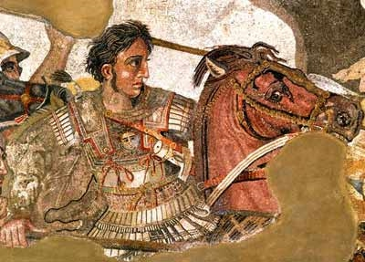

<!-- # ＜摇光＞生病的医生 -->

**中国确实就像一个生病的医生，既是医生，又是患者，对自己的病因一清二楚，却无法治愈自己；既是运动员，又是裁判员，对游戏规则一清二楚，却绝不按规矩来。**

# 生病的医生

## 文/陈识（暨南大学）

**杰弗逊有句话：我们不是被上帝统治，就是被暴政统治。我却觉得，真正决定怎样被统治的，可以是公民自己。——题记**

芥川龙之介的小说《河童》里有这么一个场景：每一个小河童出生之前，河童爸爸就隔着河童妈妈的肚皮问：小家伙，你愿不愿意来到这个世界啊？然后小河童自由选择，他/她要是觉得，这个世界太扯淡了不好玩儿，就能干脆不出生了。

罗尔斯把类似的场景加入到他的政治伦理学体系中。在《正义论》里，这叫无知之幕（veil of ignorance）。以怎样的原则为基础建造一个公平正义的世界呢？罗先生是这么想的，让每个人都在出生前选择一种他们将要生活的这个世界的社会制度，

所谓的无知之幕，就是说在选择的时候你不知道你爸爸将是李刚还是李二狗。好了，如果你选择世袭制，那你要是二狗哥的小崽子不就惨了？你想要绝对平均主义，

那要是当了李大公子岂不吃亏？这该肿么办？罗先生推导了一下，还是公平正义的社会最靠谱，这里衍生出的重要原则之一就是“最大的最小值”，即最弱势者应该

获得在一定程度基础上的最惠待遇，李二狗的儿子一出生就没有拼爹优势，一个正当（right，而未必是good）的社会应该提供给他一些可以和李刚儿子公

平竞争的机会。这构成一种“作为公平的正义”。

更明了的例子就是分蛋糕。现在李雷和韩梅梅分蛋糕，怎么最公平？很明显，如果李雷来切，那么应该由韩梅梅先拿。这种情况下，公平的游戏规则平衡了博弈双方的地位，可以使这种规则程序上的公平正义传导为目的结果上的公平正义。

听起来有点理想化？而桑塔费学派甚至证明了（至少在实验中）这种正义论的可能性。这帮可爱的经济学家搞了个好玩又简单的实验——最后通牒博弈

（Ultimatum Game）。现在有100块钱，李雷和韩梅梅分。李雷提出怎么分，然后由韩梅梅表决，如果梅梅同意，那就这么分，如果不同意，俩人都没钱拿。而且其中有个

重要条件，就是这是一个单次博弈，也就是说，不存在俩人为下次博弈讨价还价的可能（这也是“最后通牒”的由来）如果按照以利益最大化为目标的经济学理性人

假设，李雷应该拿走99块9毛9，留给韩梅梅1分钱，因为对作为“理性人”的韩梅梅来说，即使是1分钱也比没钱拿好。然而，实验结果是提方案者倾向于对半分或者四六分，而接受者倾向则是少于30％拒绝，多于30％接受。经济学家们开心死了，好不容易逮住了“理性人”这个根深蒂固假设的黑天鹅，人们追求公平正义的偏好往往（至少在某些情况下）强于利益最大化的偏好。从而进一步证明了人与人之间博弈的强互惠性和利他惩罚是一种具有正外部性的利他行为，甚至拉来

生物学家，发现人的利他行为还有神经性生理基础。

这么说来，既然人性都如此，实现一个公平正义的社会指日可待咯？Wait。那句话怎么说来着？理论是灰色的，而生命之树常青。

现实生活中，至少有俩条件与实验室不同。首先，博弈双方不是李雷和韩梅梅，而往往是李刚和李二狗。在实验中，李雷虽然貌似是主动方，实际上要为自己的决定

和韩梅梅共同承担风险，因为后者有表决否定权，所以其实二者的地位相对平等。而在残酷的现实中，李刚要是刑讯逼供李二狗，李二狗是木有办法的，李刚要是开车撞死李二狗，可以上CCAV哭诉的反而是李刚。博弈双方的地位、资源不对等。二，现实中不是最后通牒的单次博弈，而是一个多次博弈的过程。李二狗如果在

刑讯逼供下侥幸大难不死走出看守所，理论上他还是可以身披炸弹回到看守所复仇的。

所以，可以列个等式：现实中地位、资源的不对等+多次博弈+人对公平正义的偏好=？

等于郑民生，等于钱明奇，等于“时日曷丧，吾与汝皆亡”的集体暴动或者个人恐怖主义式的反抗，等于幸灾乐祸的“中国房地产崩盘时间表”，等于“钉子户大战拆迁队”游戏的意淫狂欢……等于一股暗地里蓄势等待着随时在沉默中爆发的怨气。

怎样遏制和疏导这股怨气？办法不少，媒体、司法、税收等等都行。媒体可以作为社会的出气筒和安全阀，司法可以用法律保护弱者利益，这些都毋庸赘言，而政府主动性更强的，跟我们生活更加密切相关的，还是税收。

有人说，人生在世，就俩事儿不能避免，一个是死亡，一个就是纳税。政府把税收上来，除了自己的开支，剩下的可以财政转移支付，补贴给公民福利，给你搞个养

老保险啊医疗保险啊，等于是取之于民，用之于民，多好。但是作为主动方占优势的政府往往并不那么守规矩，税收不公开透明，中饱私囊，乃至成为一个张牙舞爪

的利维坦的机会都大大的有。

说起税收，顺便啰嗦下最近关于个税改革的争议。我倒觉得现在的争论方向有点转移视线的意思。一方面，不是个税需不需要改的问题，是怎么改的问题，比如说有

人说起征点3000，有人说5000，大家都争这个了，其实不能一刀切，因为各地发展水平不同。另一方面也是更重要的，个税在我国的整体税收中只占7%左

右的份额，真正占大头的是那些隐藏在我们消费中的增值税、消费税、营业税……你去店里买东西，还得交城建税！娘的，都转嫁到消费者头上了。很多税你交了却

压根不知道，都是财政幻觉。

收税当然没错，自古以来的政府都这么走来的，关键是跟谁收，怎么用。按照托克维尔的描述，法国大革命前夕的扯淡局面是“富人免税，穷人交税”，可以纳得起税的贵族们有免税特权，纳不起税的农民却税负沉重。有一部叫做《九阴真经》的古典名著，一开头就教导我们：天之道，损有余而补不足。没天理了，社会病了，

革命就来了。而秦晖经常提到中国社会“负福利”的问题，比如房产税，本意是通过税收平抑房价，调控楼市，但是这比税收不用到真正需要用的地方，反而是连租房住的人都受害，因为房租随着房产税的附加而水涨船高转嫁到租房者身上，需要帮助的人反而付出更多了，不需要帮助的人得到了利益，是为“负福利”。而秦晖

和妻子金雁多年前所写的关于苏东问题研究的《经济转轨与社会公正》似乎就隐约给出了这种状况的原因。书中指出，当代俄罗斯的寡头垄断脱胎于之前的国家垄

断，寡头制度源于集权制度，而寡头阶层则由苏联时期的权贵阶层转变而来，而寡头资本的形成，实际上是在缺乏民主的情况下，国有资本被不公平地私有化的结

果。

绝对的权力导致绝对的腐败。没有通过合法选举，而且不被监督的政府，怎么有动力去保证包括税收在内的各项政策实施的公开公正公平？政府官员也是人啊。

所以现代国家多实行“无代表不纳税”的宪政原则，就是让公民来根据公开化的公共预算，讨论决定纳税事宜，比如交啥税，收多少，咋监督等等。写《瓦尔登湖》

的梭罗——就是那个跑到离家不远的森林里隐居的快乐假行僧，就曾经因为抗税被美国政府关进号子里了，后来亲戚朋友代他交税把他赎出来的时候他还很不开心，

只见此公义愤填膺地说：“我本可以疯狂地反对社会，但是我宁愿让社会疯狂地反对我，因为它才是那绝望的一群。”娘的，多有公民范儿啊！后来他还专门写了个

《论公民的不服从》（Civil Disobedience）的小册子，主张用非暴力不合作的合法手段对抗强权政府的不合理合法的行为，直接影响了后世的甘地和马丁路德金等人。

孙立平说现在中国社会因为内外部都无法约束的权力导致社会向心力的丧失，正在走向溃败。而中国确实就像一个生病的医生，既是医生，又是患者，对自己的病因

一清二楚，却无法治愈自己；既是运动员，又是裁判员，对游戏规则一清二楚，却绝不按规矩来。既然如此，只有靠公民自己，像梭罗先生一样有公民范儿的公民，

组成一个有效的免疫系统，争取独立行动的权利乃至上下联动，从机体细部切入，自下而上地去治愈这溃败。

这种公民自决需要组织制度的支撑，可以表现为自由结社的权利。而这个自由结社有神马好处呢？可以先从城邦说起。

大家都知道，古希腊的政治组织形式是城邦，因而那时的哲学家都对城邦制推崇至极，亚里士多德干脆上纲上线，说“人是趋向于城邦生活的动物”，而老子也说

过：“小国寡民，使有什伯之器而不用，使民重死而不远徙。”在我看来，中西的差别在于，老子的小国寡民偏向于消极的无政府主义层面，而希腊的城邦则偏向积

极的公民参与层面，并孕育出了民主制度。帕克在他的著作《城邦——从古希腊到当代》中，据我理解，其表达了这么一个意思：对比与庞大的民族国家作为意识形

态共同体追求国民利益的存在，城邦的存在是非意识形态的，其目的不是狭隘地追求物质利益，而是为了让公民生活得更好，这其中包括政治、经济等更方面的自由

权利及保障其实现的民主制度。从古希腊的雅典和斯巴达到文艺复兴的威尼斯，从汉萨同盟到现代的新加坡，城邦的形式光彩熠熠。但是有一个问题，“民强”和

“国富”之间似乎总有龃龉。威尼斯的商人都很有钱，但这座古老的自由城市还是轻而易举被拿破仑攻占，更极端的例子在古希腊，按照丹纳《艺术与哲学》里的描

述，希腊人的标准伙食是：一个洋葱，一个鱼头，三颗橄榄。想想也是，本来就人少地寡，而那些做陶罐的、打铁的、卖肉的自由民动不动就跑去广场参加公民大会

了，经济咋搞得起来。城邦形式对经济的推动（包括对资源、信仰的）不如凝聚力更强、规模更大的民族国家，甚至不如君主专制。在生产力不断扩大的情况下，人

类需要更大的市场空间，城邦制的衰落不可避免。

但这并不等于否认其价值。而且现代民族国家中“城邦”也仍然可以以另外的形式存在——相对于庞大国家的社会小集团。美国公共选择派经济学家奥尔森在《集体

行动的逻辑》中指出，在获得集体物品上，小集团往往比大集团更有优势。简单说来，大集团由于成员多，随追求的利益成本可以大于收益，因此很容易产生搭便车

心理，人人都想搭便车，结果产生类似公地悲剧的情况（编者注：公地悲剧，指在大集团中因为产

权不明，众多拥有者都有权使用资源，但没人有权阻止他人使用，以致公共资源使用成本低冒险成本高，导致资源过度使用或浪费）。比如说，李雷供职于某大集

团，他觉得工资（集体物品）太低，想向老板迷死高提议涨工资。这样李雷面对两种结果：一、成功。这样皆大欢喜，李雷涨工资了，他的同事韩梅梅林涛吉姆格林

也搭了涨工资的便车。二、失败。工资没涨就算了，迷死高可能会很生气，后果很严重，甚至炒了李雷——反正集团这么大，少你一个照样运作，而你的提议让我怀

疑你的忠诚度。这样一来，即使成功，李雷也得不到一个相对于同事的高收益，何况冒着被解雇的风险，收益小于成本的几率很大，还不如等着韩梅梅他们提出来，

我来搭个便车。相反，小集团正是因为小，和每个成员的切身利益更加休戚相关，成员获得集体物品的收益大于成本——本来一共就仨人，你就为个这解雇我？亏死

你。

从这个角度讲，很多情况下，“小”似乎更有效。英国经济学家舒马赫还出过一本书叫《小的是美好的》（Small is beautiful），从另一角度更系统地谈论这个问题。开篇就引用甘地的话：“地球上提供给我们的物质财富足以满足每个人的需求，但不足以满足每个人的

贪欲。”可以说是通过“小”提倡一种经济发展模式向人和自然的回归，达到一种真正的和谐。

我前一段时间接触到的“社区支持农业”模式其实就是这种指导思想的一种尝试形式。而我们可以进行更多的尝试，比如兴趣俱乐部，比如商业行会，比如新型工

会，比如NGO，比如多种形式的基层民主试验……这些在现代民族国家中的大大小小的自由结社自由组织小团体，就像以前散落在爱琴海边大大小小的城邦一样，

更容易在团体内形成一种相对于等级社会中“垂直型社会关系”的“水平型社会关系”，团体成员地位相对平等，获得集体产品更有效率，更有利于培养独立自决，

追求民主法治的公民精神，进而推动整个社会的可持续发展。去年熊培云写了本《重新发现社会》，说实话，有些缺陷，文笔也一般，但我还是很喜欢，卖的也很

火，我想正是因为他敏锐地发现了社会转型的这一思路，并且热心地实践（熊老师像我的一个同学沈双喜一样，积极推动乡村图书馆的建设）。

前一阵子温家宝老是在强调道德问题，说神马仰望星空啊神马道德血液粘稠度啊，其实都是扯淡，无论如何，再粘稠的道德血液，再悲催的眼泪，也不如一套刚

性稳定合理并坚定执行的体制更加可靠，“一种由天才设计，由蠢人都能执行的制度”。打造一个有限责任政府，实现“小政府，大社会”，除了政府本身的作为，

立法的独立，司法的公正，媒体的监督，公民的参与，一个都不能少。十二五规划中将“社会管理创新”独立成篇，最近事业单位的改制，其实都是在朝这个方向靠。

年初，美国人海勒斯（何伟）根据他近年来在中国的游历写成的《寻路中国》出版并畅销，这个敏感的纽约客发现一个问题，就是中国人十分清楚“事后道歉和补救

比事前预防要容易得多”。权责制度不完善的情况下的亡羊补牢当然方便，只不过丢的不是羊，而往往是人的生命和尊严。

说很多了，小结一下：我们现在需要思考的不是娜拉应不应该走、会不会走的问题，而是怎样让娜拉留下，或是一旦娜拉走了，之后应该怎样的问题，更远大一些，是怎样寻找一个社会共识，一个普遍信仰，一个真正可以作中流砥柱的价值观。

所以，当公民精神还在裸奔的时候，你无法指望公民社会穿上裤子。

（采编：黄理罡；责编：黄理罡）
