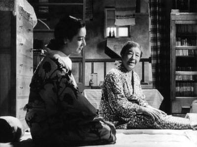

<!-- # ＜玉衡＞一种断裂——当代语境下重探《东京物语》 -->

**《东京物语》表达的是困惑，是一代人无法建立主体的疑问。在此之处，文化的分裂不可避免：许多人选择的是顺应以机器工业为代表的单向度社会，而小津们选择的是传统。在现实的打压下这种传统是趋弱的。于是，迷思的状态成了最后的挽留。那对老夫妇望着车水马龙的东京，感叹到"要是走失了这辈子恐怕都见不着了"。这无疑是他们对现代文明本能的拒斥与恐惧。在这之后他们只能以自我反思的状态身和心不和的逗留在社会中，这就是迷思的本质：对外界刺激的排斥和怀旧的个体反省。**

# 一种断裂——当代语境下重探《东京物语》

## 文/ undersound（合肥）

当代思想家如博得里亚、利奥塔等人提出了历史之断裂之极具后现代色彩的论说，意即随着启蒙和理性主义的幻灭以及其对主体的解构，历史不再是连续的，前因后果式的"大叙事"，而是片断的，具有相对独立意义的非纵深的叙事。后工业社会的迅速发展加速了这种裂变。但也正如"历史的终结"之类的不可靠性和其与垄断资本、保守主义之间千丝万缕的联系，历史感依然被继承着，并以其独特的视角审视当代社会之伦理和规范范式的变迁，这正构成了当代第三世界国家语境下的悖论：一方面人们试图突破原有社会的瓶颈作用，另一方面也在对在此过程中本我的迷失和他我的建构感到迷惑和失落。从这个维度来考察小津安二郎1953年的作品《东京物语》毫无疑问的是不仅具有其独特的东方审美，而且具有现代学上的普适意义。

上世纪五十年代是日本很重要的一段时期：战争的阴影逐渐散去，而朝鲜战争和反共的需要使得美国转向扶持日本，而日本本身也在向真正的民主代议制转轨，逐渐成为"东亚的美国"。体制的转变在文化上则着重表现为多种伦理价值的交流与冲撞，整个社会围绕着失范与重建展开激烈的话语权的竞争，形成了潜在的文化冲突。小津通过他这部最有影响力的作品用影像将这种矛盾外化，而其批判话语也值得我们在五十年后重新进行一番思考。

·隐喻· "物语"一词在日语中有故事的含义，而在实际中它还履行了寓言的语用学概念，通过事物的类比完成叙事。在这里小津借用了东方传统政治观念中的"家国天下 "，以家庭来透视和投射社会。如果想他自己所说，他是在"描写日本的家族制度如何崩解"，那我们也可以推论说他是在描述社会制度的解体。

这种解构实际表现为熟人社会向市民社会的剧变。在片头中老夫妇所居住的尾道，那种邻居们隔着窗户互相嘘寒问暖的亲切场面，在人流攒动的东京中以不复存在，即使亲情也代替不了社会激烈竞争给人带来的巨大压力。这更多的不是涉及到个体的道德观，而是熟人与市民社会之间的差别：从"爱你的邻人"到"怀疑他人"，从开放的小社群生活到大都市的阶层化、公寓化生活的变化见证了以共同生活为基础，通过道德约束机制维持自身稳定的熟人社会的瓦解，取而代之的则是西方化的建立在人性论之上的市民/宪政社会。

西化的影响并不止体现在社会构成上，还表现为外在物质的变迁。小津描写下的东京烟囱与高楼林立，工业化可见端倪。它充斥着喧闹，而那实际上正是商业通俗文化的入侵所带来的直接后果：它表现为意义的抽离，象征着工业节奏的重复和麻木的审美状态。这个东京已不再是安宁的、具有东方慢节奏审美观的东京，而是异化成几乎具有相同外表和实质的国际都市，与纽约伦敦等不再有所区别，东京只不过是个地理上的辨识符号而已。

值得注意的是在整个小津后期的电影中这一类似主题是反复出现的，即城市在现代化过程中构成的问题：公共空间的丧失（楼顶上的排球比赛），机器工业对日常生活的打断（穿行市区的火车）等等，都传达了在传统失范的社会下主体性的丧失。

可以说整个《东京物语》是个寓言性质的隐喻。它还原出具有典型东方伦理和结构的日本社会如何在后殖民/后现代语境中逐步瓦解的过程，及其在文化机制的变迁中所起的深层作用。而恪守传统伦理的小津，作为作者，不可避免的将其打上个人情感的烙印，一种面对"时代洪流"产生的悲剧感，却也是可以代表着一代民众及精英文化的失落。

·哀叹·

小津对社会激变时期的洞见可谓入木三分，而他的批判却是相当柔和的，体现在起影片中对戏剧矛盾的淡化处理和定景镜头以及人物相似形的构图安排上：他语境中力图表现的是一种秩序，一种他理想中的体制，而他所涵盖的信息却在尽一切力量试图解构这种秩序，这正构成了他作品内部深层的张力。这必然导致悲剧，因为这对影像中构建出的却也实际存在的矛盾是无法缓解的。所以《东京物语》实际上是悲凉的。老夫妇那对孤独的背影下存在着作者的哀叹，如同一个时代的终曲一般，不得不由人惋惜。

如果说对于文化冲突中一代人的失落而感叹的话还有着"落花无意，流水有情"的被动，而当这一代人试图重构其叙事结构与话语权的失败可能才是根源里这种文化抑郁情节之所在。在电影中，小津构筑了他的双重伦理范式：以尾道为代表的未被工业化所影响的边缘所在，以京子、纪子为代表的尊重传统价值的青年。结果呢？尾道被高速铁路所连接，"第二天就到东京了"，不正是其现代化/异化的征兆吗？而两个女性，更是要嫁人，要为生计所奔波，"总有一天会理解他们的"。这种处境可以说是身不由己的。所以小津试图用传统突围的方式实际是失败的，这只会徒增哀叹：因为他按照自身逻辑给出的答案是无解，是商业消费主义的无可阻挡。

就社会理论而言，无论是詹姆逊的新马克思主义还是哈贝马斯的社会批判学派，都无法以一种很清晰的方式建立起后现代语境下社会主体构成，或说按照启蒙和现代化的延续的思路对当代社会断层提供重建理性的理论支持，因此小津的失败和由此而生的哀叹是必然。因此，不管他曾在自己的作品里加入多少喜剧成分，他还是悲剧的。

·迷思·

当现实的历史被平展化，蜕变为微观社会的符号后，小津带有历史深度的批判更多得到的是尴尬的处境。而重构传统的努力的失败加剧了这种挫折感。无力的他，只好转向于一种迷思的状态。

《东京物语》表达的是困惑，是一代人无法建立主体的疑问。在此之处，文化的分裂不可避免：许多人选择的是顺应以机器工业为代表的单向度社会，而小津们选择的是传统。在现实的打压下这种传统是趋弱的。于是，迷思的状态成了最后的挽留。那对老夫妇望着车水马龙的东京，感叹到"要是走失了这辈子恐怕都见不着了"。这无疑是他们对现代文明本能的拒斥与恐惧。在这之后他们只能以自我反思的状态身和心不和的逗留在社会中，这就是迷思的本质：对外界刺激的排斥和怀旧的个体反省。

在小津后期的作品中，他更注重于对以有题材的不断重复，包括婚恋问题等。这恰恰告诉我们他对现实世界的失望，而进行了其乌托邦式的转向，沉浸在自我思考的快乐而无暇对社会体制做出更有力的见解与批判，或是对特定历史断层的剖析。同时其大量使用的深焦镜头，似乎是有意拉大观者与作者的距离，在审美上将自己与大众割离，这都可以证明了他在晚年的那种迷思。

一代人从外部世界的剧烈冲撞中体验着历史断裂的伤痕，有的人带着些微的伤感，在哀叹中告别，这就是《东京物语》带来的断裂的体验。而对于几乎与几十年前的日本处于同样剧变过程中且有着一脉相承传统文化背景的中国，就如何在全球化语境下应对这一种断裂的命题来说，《东京物语》有着极大的参考价值，即如何在一个失范的社会内部建立起新的社会话语体系，这值得我们深思。而无论是史诗/民族国家第五代导演，还是致力于解构主体的第六代，都没有对此重大命题做出很出色的回应，这的确是一个缺憾。

（采编：陈锴；责编：陈锴）
