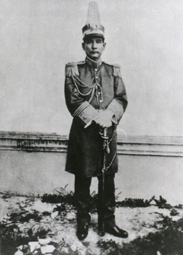
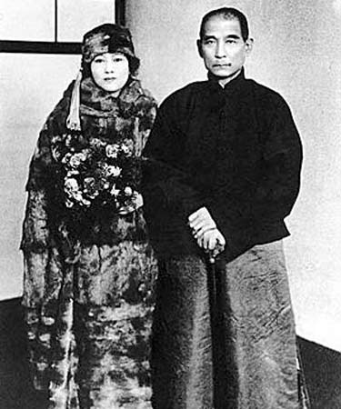

<!-- # ＜天玑＞辛亥革命反思专集（二）：孙中山一生另一面之研究（下） -->

**中国不需要神，中国每个人都是主人，我们并不愚昧，我们也不要那些革命党所谓“保姆”的照顾，我们有自己的民权。而那些打着民主行专制之实的人才最可耻，那些为了政治需要而去把某个平常的人捧为神才最卑鄙。在此评判孙中山并不是针对个人，而是民国初年中国可能走向民主的进程被中断而感到惋惜。而一个破坏民主的人还被当作神一样的对待，也是社会的悲哀。**

# 孙中山一生另一面之研究

## 文/荣欢（安庆师范）

（承接前文）

二次革命不仅开了民国第一次叛乱夺权的先例，民国刚出现的民主议会的苗头在二次革命后也被彻底打断了。袁世凯和孙中山分别都走向集权独裁的路子，袁世凯的集权大家都熟悉，被骂了快100年；说孙中山，他逃到日本后就组建中华革命党，要别人按手印效忠服从自己。把国民党这一个议会民主制度的政党改造成一个帮会制度的政党。1914年7月8日，孙中山宣誓就任中华革命党总理，并公布了亲手拟定的《党章》。明确表示一个国家必须只有一个政党，一个政党只有一个党总理。一党必须专制。党员必须宣誓，坚决听从党总理的安排。孙中山还宣布了一条不容商议的组织原则：“是以此次重组革命党，首以服从命令为唯一之要件，凡入党各员，必自问甘愿服从文（孙中山）一人，毫无疑义而后可。”《誓约》说：“愿牺牲一己之身命自由权利，附从孙先生，如有二心，甘受极刑。”这样的入党条例，简直就是邪教。孙中山就是个分裂分子，在民国初建国家正需安定建设的时候，他却在南方煽动南方军阀造反，公开勾结白朗匪军搞破坏。

虽然孙中山一开始说反袁，但袁世凯死后的1917年，他还到南方另立政府，公开分裂国家。当时国际社会都承认北京政府，而孙在广州另立政府，如果说孙大炮那叫武力统一，段祺瑞就不叫武力统一了？如果说段祺瑞是卖国政府（而且他出兵收复外蒙了），那孙中山不卖国吗？孙中山为了扳倒北洋联合日本，签定中日盟约，只要日本帮忙，“革命”成功后把满蒙让给日本。日本政府强迫袁世凯政府签定二十一条，其中一个威胁条件是，如果你不答应，日本将资助孙中山一伙搞分裂破坏。此处可参考刘忆江《袁世凯评传》，还有高崇民《上半生简述》，上载：“1915年孙中山为换取推翻袁世凯，一度主张把东三省让给日本。我在日本留学东京时，亲耳听到中山这种错误主张，表示坚决反对，黄兴当时也反对。”如果说北洋不民主——待论，舆论还是比较自由的——那么孙中山民主吗？

所以就来说护法运动的事情，当时国会共有议员870人，跟随孙中山南下护法的仅有91位议员，其中出席广州非常国会56人，非法选出了孙中山为大元帅。如果孙中山说此为护法运动，那么必将肯定北洋政府是违背了《临时约法》——这到底有没有违背呢？《临时约法》没有规定总统辞职的条款，黎元洪逃入日本使馆避难，应当属于《临时约法》规定的总统不能视事，依据《临时约法》副总统代理总统职权没有任何问题。而且有黎元洪的大总统令，后黎元洪又派人送去总统印玺。冯国璋代理大总统是完全合法的。第二届国会经过多数省份选举，符合1913年《国会组织法》超过14个省以上的选举的规定，选举徐世昌为总统也是合法的。第二届国会修改1913年《国会组织法》是合理的，第一届国会议员人数过多，美国国会现在不过500多人，而第一届国会就有800多人，而且程序复杂，缺乏效率，造成国会瘫痪，动摇国家根本。孙中山主张恢复第一届国会，但是第一届国会恢复时，因为不被他控制，孙中山又宣布反对。第二届国会期满，第三届国会选举失败，虽然包括孙中山在内大多数势力都主张过，依据1913年《国会组织法》选举第三届国会，但是孙中山最后还是破坏了国会选举。恢复第一届国会制定宪法，在法律和道义上都是有道理的，黎元洪的任期已经由冯国璋代理届满，顶多只能补足1916年12月袁世凯接受劝进，背叛民国到袁世凯死之间的仅半年时间。但是既然国会承认他是总统。而国会选举总统，至少可以认为黎元洪是临时总统。而且黎元洪也一再保证一旦宪法通过，就立即辞职，并不再参加下届总统选举。

1923年宪法不是贿选宪法。从法律上说国会有权决定国家财政预算，有权自行通过决议决定议员的津贴。议员已经有年费，每次出席会议再补贴200元，国家在危难之中，身为议员贪图小利，在道德上是应当谴责的。但在法律上却是合法，更不能成为否认1923年宪法的借口。曹琨贿选总统，有议员将支票照相，并向京师审判厅报案，应当是事实。

但只能说曹琨总统不合法，不能说宪法也是贿选，两者性质不同。第一届国会，任期早已届满，以制定宪法为理由，自行通过决议延长任期，在宪法通过后就应解散，依据宪法选举新国会，由新国会选举总统。

段祺瑞解散国会本身并不违法，因为第一届国会已经没有存在的理由，而且参加贿选议员应当被剥夺议员资格，因此不足法定人数。

同时选举新国会，当时国家已经完全陷入军阀混战，不能进行选举。段祺瑞以革命政府自居，放弃法统。

广州国民政府也同样宣布是革命政府。中华民国北京政府的法统中断。

孙中山对宪政的破坏仅次于袁世凯和张勋，在曹琨之上。

孙中山对国家的实际危害远在汪精卫之上，

汪精卫一生模仿孙中山，孙中山是民国第一位总统，汪精卫是国民政府第一任主席，都三次另立政府，都是西南军阀分裂国家的政治旗号。孙中山的理论都十分浅薄，东拼西凑，汪精卫和孙中山都没有固定的政治主张，只知道捣乱的政治苍蝇，汪精卫还是孙中山的遗嘱执笔人。后来为了夺取政权，汪精卫投靠日本，孙中山投靠苏俄。但是汪精卫在日本占领区内建立伪政权，对日本侵略实际上没有什么帮助。日本侵略也不是汪精卫领进来的，而孙中山却发动反对合法政府的叛乱，分裂国家，制造动乱。汪精卫投降后还说继承总理遗志，要求中小学挂孙中山象。

再说南方1921年南方选举孙中山为伪总统，依总统选举法，总统由两院联席选出，出席议员至少须全部的三分之二，即580人才能举行选举总统会，现在广州的旧国会议员才两百多人，还不够原众议院人数的一半，而且实行记名投票，就选举孙大炮当伪总统了。而南方的伪中华民国政府组织大纲，也没规定总统的任期，也是无限期连任，也没有规定政府的组织架构。一切政务、军务、内阁任免，均由大总统孙大炮“乾纲独断”。难道孙中山这种行为不叫破坏共和吗？再说1921年的北京北洋政府有个总统，你却在南方当总统，一个民国能有两个总统吗？这不是搞分裂吗？1921年广东军政府要成立前，不但西南各地势力反对，连国民党内的陈尚明、吴稚晖等也反对，但是孙中山利用华侨心腹假造民意，再以暴徒围殴以扑灭反对选举的议员，并以黑道、暴力来威胁反对者的生命。还有暗杀陶成章、黄远庸、程壁光，抹黑陈炯明。

学者张振鸿曾说：孙中山和陈炯明之间的关系也不算不深，翻脸起来真枪实弹，缺少袁世凯对段祺瑞的忍让。这如今说起来，似乎也是一种襟怀吧。革命者之间的残酷历来比反动派来得血腥，这也有案可例。陶成章和陈其美之间的怨恨肇起于陶与孙之间的久结的冲突，竟然搞到要暗杀，而且还真地暗杀于病榻，孙中山的责任无逃。正是孙中山不再相信议会政治，其实他也没有相信过议会政治，国民党枪杆子里面才出了政权，回到紫禁城的历史大门就这样打开了。

孙中山借“革命”、“军政”之名行专制集权之实。幸好黄兴、李烈钧、唐继尧、陈炯明他们最后看穿孙中山的伪面具了，不想再被孙大炮利用了。还有人说孙炮党理论先进，炮党提倡“节制资本”，反对保护私有财产，而北洋北京政府提出“保护私产”、“经营自由”。财产私有，表现在“土地私有”，旗人的土地，官地和公田转到私人手里。北洋时期办了那么多实业和教育难道就不先进了吗？孙中山这个革命狂暴力狂，天天煽动暴乱，甚至到死还说“革命尚未成功，同志仍需努力”。中国本来就够乱了，被他弄得更乱了，成事不足，败事有余。

孙中山在民国成立后从日本人哪里骗一些钱搞的几场小暴乱，也不是为了建立民主中华，而是要分裂中国，配合日本侵略扩张。内田良平在《日本之亚细亚》一书中提到孙中山1906年以来曾对日本朝野人士游说，以中国革命后在长城以南建国，满蒙让给日本，作为日本援助中国革命的报酬。孙中山为了拉赞助还勾结了日本黑龙会。黑龙会是什么组织？其目标是先击退我国东北三省的俄国势力，进而吞并东北三省、蒙古和俄国的西伯利亚。朝鲜之所以被日本所灭，就是因为黑龙会资助的“天佑侠”组织的功劳。史学家唐德刚在其《袁氏当国》中也说，日本资助孙中山革命一方面是为了推翻不与合作的北洋政府。另一方面是为了谋取满蒙利益。而孙中山本人的“中山樵”这个名字就是个日本名。俄国十月革命后，孙中山目光投向了俄国。老毛子也资助他武器资金以支持他北伐，作为回报，孙中山也扶持了中国共产党，这些都影响了中国历史发展的轨迹。梁启超就说孙文晚年已变成苏俄走狗（《梁启超文集》1927年与女儿信）。孙中山临死前还在神户发表《大亚洲主义》的演讲，把对中国侵略最严重的日本和苏俄，两个虎狼之国称为王道，简直是一种叛国宣传。

### 重新评价孙中山的历史意义

孙中山早期反清是有进步意义的。但民国建立后，他的不断革命论给中国民主带来了极大危害。孙中山的集权专制对中国危害极大，开创了新形式下集权专制、个人崇拜的先河。由于他是国共两党共同推崇的人，国共两党都受其影响。后来的蒋，毛的集权都是学的孙中山。孙中山可以说是中国党国、党军的创始人。比如1925年黄浦军校教导团在改编为国民革命军第一军就公开叫党军第一旅。从此中国进入了一个党政军不分的社会，中国离民主越来越远。而孙中山为了所谓的“革命”，联合日本，联合苏俄也给中国带来了极大的影响或危害。首先是他无形中充当了日本侵略的马前足，中国动荡不安，日本趁机侵略。而联合俄国则是最终导致了大陆政权被中共所得国民党败退大陆。孙中山所谓的革命并没有消灭军阀，旧军阀消灭了新军阀又来了，比如蒋桂战争，中原大战。而民国第一个迷信枪杆子的正是孙中山本人。有些人说孙中山是三步走战略，即“军政，训政，宪政”。我只知道历史上每个独裁者总给自己独裁找个理由。共产主义者还说自己是为了按需分配的建立共产主义社会呢！孙中山主张民族主义，因他自认为先知先觉，以教育后知后觉的愚民，始得避免产生愚劣议员而成为议会独裁。所以孙中山要当大元帅而非大总统。在孙中山的眼中，人民是无知的，故必须以党治国，也需要人治而非法治。笔者同时也为宋教仁、陈炯明感到惋惜。

孙中山革命理论就是恢复汉１８省，根本没有把东北算进去，三民主义第一条民族主义驱逐满蒙，而满蒙是日本的生命线，孙中山无形中配合日本的侵略扩张。如果把中华还给孙中山，那么，中国就分裂了，中国可能成了满州国和汉州国、回州国。而中山先生的五权宪法更是抄袭美利坚新教徒，背反商周以来之法。其中“考试”，继承自我国古代的科举。孙的意思是选拔官吏和人才这一节单列出来，就和科举一样。“监察”，继承自我国古代的监察御史。他的意思是专门弄一帮监察御史。孙将我国古代的制度和西洋制度随便拼凑拼凑，就成“五权宪法”了。

在此评判孙中山并不是针对个人，而是民国初年中国可能走向民主的进程被中断而感到惋惜。而一个破坏民主的人还被当作神一样的对待，也是社会的悲哀。一个天下为公的人竟然能把不学无术的儿子孙科扶上广州市长和中央执行委员的位置，孙中山是中国的国父本来就是个伪命题，中国又不是孙中山的私有财产，孙中山被称为国父完全是在1927年以后他的追随者封的。中国不需要神，中国每个人都是主人，我们并不愚昧，我们也不要那些革命党所谓“保姆”的照顾，我们有自己的民权。而那些打着民主行专制之实的人才最可耻，那些为了政治需要而去把某个平常的人捧为神才最卑鄙。对孙中山有好感20多年，然而随着阅读史料的增加，我必须要站出来，因为我是一个有良心的人，也许在有些人看来，这比较反动，但还要说，就用毛的一句话吧：知识越多越反动。历史车轮的前进也迫使我们思考中国所谓“民主”的轨迹。

至于孙的私生活，曾有个著名段子：19岁娶了18岁的女友，24岁时和只有18岁的秘书交往并结婚，28岁见到1岁的女婴，开始光源氏计划，在31岁到日本旅行认识一名15岁的女仆，隔年认识10岁的萝莉，在日本旅行期间就周旋于女仆和萝莉之间，38岁和萝莉结婚，39岁回到中国，49岁光源氏计划成功，把22岁的小妹妹带回家，后来活到59岁死亡。不过本文不评价童养媳、包二奶、玩女人这些现象，本文只讨论历史政治。

原文地址：

[http://blog.renren.com/blog/225318469/453798845](http://blog.renren.com/blog/225318469/453798845)

**有关史料：**

1，茅家琦《孙中山评传》

2，冯自由《革命逸史》

3，陈锡祺《孙中山年谱长编》

4，李敖《孙中山研究》

5，曾叔度《我所经历的“二十一条”内幕》

6，俞辛焞《孙中山与日本关系研究》

7，李吉奎《孙中山和日本》

8，段云章《历有争议的陈炯明

》

9，刘忆江《袁世凯评传》

10，唐德刚《袁氏当国》

11，丁中江《北洋军阀史话》

(采编责编：黄理罡)
