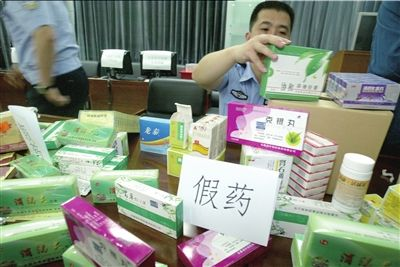

<!-- # ＜摇光＞研究问题，也要谈主义 -->

**自由主义者的使命是以现实为基础去维护自由，而一切个人的经济自由和人身自由归结于由公平一致的法律、规则所保障的市场竞争的自由。也许过去的中国确实不具备政治改革的条件，也许过去的改革者没有尽他们最大的努力；无论如何，过去的都过去了。**

# 研究问题 ，也要谈主义

## 文/夏鹤年（中国科大）

胡适曾经说过“多研究些问题，少谈些主义”，我曾经深以为然。对主义的讨论，难免会流于空洞，而且有想法的人自有自己的想法，不会被你的主义所影响，还不如谈些具体的问题客观。对于我这样的理工科学生，“多研究些问题，少谈些主义”更有另一样的诱惑力，因为我根本谈不了什么主义，所以干脆拿出胡适之先生的话作为挡箭牌。

可是，近来我却愈发的觉得主义之重要性。腐败、贫富差距、强拆、滥用公权这些社会的毒瘤，不同的主义给出的药方截然不同，引我们深思。我相信有一些

人，他们秉承着中国知识分子历来“治国平天下”的理想，真心地关怀祖国的未来，却向往着去跟随“嘉陵江边红一角”的某位人物（这位人物的最新口号：[http://news.sina.com.cn/c/2011-03-20/120322147983.shtml](http://news.sina.com.cn/c/2011-03-20/120322147983.shtml)），全然忘记了中国40年前发生的文化和人伦悲剧，不惜将那一切卷土重来，“把平时卖土地、炒房价、捞回扣、强拆乱建的贪官政客押上审判台”，“批倒批臭，再踏上一只脚，叫他永世不得翻身”（摘引自[http://hi.baidu.com/%C2%C0%B1%A6%C8%CA/blog/item/06689a08e98388bc2fddd436.html](http://hi.baidu.com/??????/blog/item/06689a08e98388bc2fddd436.html)）。

经济改革带来了巨大的财富，但是财富中却滴着血。尤其是上世纪90年代，大量国有资产被掠夺、官员们利用特权纷纷致富，造成了公平、正义极大地被伤害。而近年来，各种企业的假冒伪劣粗制滥造不负责任、官员的贪污腐败、国有垄断企业的内部人控制、政府与开发商利用土地对普通人的掠夺更是令许多人对经济

改革一片质疑。以此为背景，所谓的“嘉陵江边红一角”获得了舆论极大的认同，对经济改革的否定、对毛时代的怀念充斥了社会的各个角落（这样的观点不妨看一看这篇：[http://www.wyzxsx.com/Article/Class4/201008/171537.html](http://www.wyzxsx.com/Article/Class4/201008/171537.html)）。

他们认识到了问题，可是他们寄希望的药方却远比他们所看到的问题更危险。我不懂哲学，只是看过几本老掉牙的书。有人说共产主义和自由主义不过是两种

不同的思想潮流，不分孰优孰劣——抱有此想法的人应该大有人在吧。我想说，中国人如果总是不能意识到共产主义思想的危险性，我们也许真的会重蹈文革的覆

辙。下面摘引维基百科中关于《通往奴役之路》（一本老掉牙的书，但是它对于我有如圣经之对于基督徒）的一些介绍：

“哈耶克在书中阐述道，所有的集体主义社会，从希特勒的国家社会主义到斯大林的共产主义，都无可避免地会迈向专制极权。哈耶克主张，实行中央计划的

经济体制必须有一个小团体（统治阶级）决定资源和产品的分配和发放，由于没有市场机制和自由价格机制，这个小团体无从得知正确的情报，也因此根本无法做出

正确的决策来分配资源和产品。对于经济计划在实践上的不同意见、加上中央计划者在分配物资上的不断失败，最后将导致计划者开始运用高压的强迫力量以维持计

划的实行。哈耶克进一步主张，社会大众会感觉计划的失败是因为国家权力不够、无法有效推行目标所造成的，这样的感觉会使大众开始投票支持中央集权，并会支

持那些看似‘可以让计划付诸实现’的‘强人’攫取政治权力。哈耶克主张，在经过这一连串的恶化后，一个国家将会无可避免地转变为极权主义。对哈耶克而言，

‘通往奴役之路’代表了国家进行中央计划的开端，随着自由市场制度的瓦解，所有个人的经济自由和人身自由都将化为乌有。”

我始终相信，现在的问题是改革片面化导致的，即只有经济改革、而缺乏政治改革。有人说毛时代无贪污腐败，我不知道他们从何处得出的结论，我只知道小

至一个村干部，他们在三年饥荒时的生存率也要高于普通的农民；即使他们的结论有理，他们也须想想，那时的政治环境下，各种帽子干部们想给你戴你就戴上了，

他们要的也许不是你的钱，却是你的自由甚或你的命（对于那个年代的反思，现在实在是太少了，推荐大家多看看关于那个年代的书，比如杨小凯的《牛鬼蛇神录》）。

自由的市场经济需要宽松开放透明的政策环境，政府（不仅是行政单位，也包括立法和司法单位）对各种企业以同一种标准对待，哪个企业违反了法规哪个企业就需要接受司法制裁，而不是A企业向某局长塞了保护费，A企业的产品出了问题或者生产过程破坏了环境就可以得到豁免。各种圈内潜规则，代替了市场的统一

规则，这直接导致了市场的无序。在自由市场下，政府不是不重要，而是十分重要，它在法律明确规定的框架内承担起裁判者的角色，对任何可能妨碍自由竞争的行

为，如垄断等，加以制止。这个裁判者，评判须公平、规则须明确、执法须透明。我们有毒奶粉，我们有开发商强拆，我们有企业破坏环境不顾当地人的生存，这些

并非经济改革使道德沦丧，而是因为政治改革不曾到位，自由竞争缺少公平的保障。去年闹得沸沸扬扬的大连假狂犬病疫苗事件则是一例证，市场监管的缺失是假药

横行的原因，但是我们需要追问，监管者是否同样需要承担责任？据我所知，这件事故遭刑拘的分别是药厂的经理副经理和采购员（[http://news.sina.com.cn/c/sd/2009-03-19/105217439428.shtml](http://news.sina.com.cn/c/sd/2009-03-19/105217439428.shtml)），

而相关监管人员却连处分的消息也不曾报道。这如何能避免类似事件的再发生？药厂虽承担风险，但是他们通过制假可以一举节省一半的成本，如果被发现的几率很低（假设不存在官商勾结），他们又何乐而不为呢？假药通过低成本轻而易举的占领市场，最后的结果只能是逆向淘汰、假药横行。这反映了中国政治改革所亟需

的：政府不仅有公权，更有沉甸甸的责任，如果公职人员失职就必须接受惩罚——在公众舆论的监督下接受惩罚。

自由主义者的使命是以现实为基础去维护自由，而一切个人的经济自由和人身自由归结于由公平一致的法律、规则所保障的市场竞争的自由。也许过去的中国

确实不具备政治改革的条件，也许过去的改革者没有尽他们最大的努力；无论如何，过去的都过去了。我是一个愤青，但是我能模糊地觉察到我们社会的进步——这

种进步绝非施舍，而是来自于无数人的些许关心和少数人的执着坚持。这三年来不断在网络上暴露的丑行、恶行，不是反映我们的社会更肮脏了，而是说明我们的围

观更有力了。虽然很多的围观最终不了了之，还有更多的丑行、恶行不为人所知，但社会之进步终须是一个缓慢的过程，任何骤然有力的推进都有可能拔苗助长适得

其反。

不管是一党也好，多党也罢，中国需要的是改革——被围观所推动的、上下联动的、缓慢而坚定的改革——而非“嘉陵江边红一角”的倒退。

（采编：黄理罡；责编：黄理罡）
