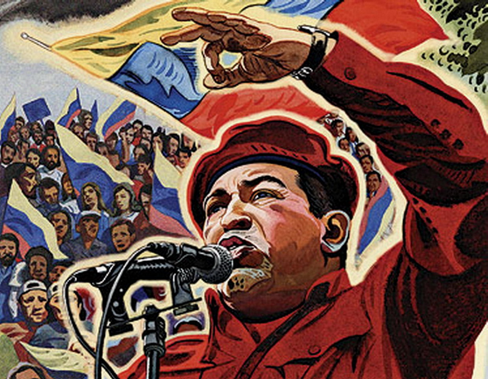

<!-- # ＜向左走、向右走特稿＞所谓意识形态 -->

**“在意识形态的自由市场上那些主流的、显性的意识形态们一直在进行着有硝烟和没有硝烟的战争，他们无时无刻不在争夺着对话语的控制权。这种争夺，是必须的。这种争夺，同时也是交流。真理，如果存在的话，是越辩越明的。没有开诚布公的、合法的辩论，我们就永远只能是固步自封、止步不前、横刀相向。只有在这种争夺和交流中我们才能同时看到对方和自己的不足。以此，双方才有坦然相互接受、相互补充的可能性。”**

# 所谓意识形态

## 文/王新强（上海大学）

**本期导读：左右双方的争论，甚至怒骂，是屡见不鲜的。作为意识形态的斗争，这种争论的存在是必然的。那么它们有什么意义呢？本篇文章的作者认为，我们看待问题，不论是左还是右的立场，都是从某个视角出发的。而这种视角性就带来了片面性。左与右作为看问题的出发点，两者也不是相互排斥而是补充的，从任何单一的视角出发都只能看到事情的一个方面，而不能较为全面的考察它。而当我们发现意识形态不仅仅只有左与右两种之后，我们同时也发现了无数个不同的看问题的视角，而这些视角，都是可以互补的，以利于我们更清楚地看问题。**

当我们日常谈到意识形态的时候往往总是局限于狭义的意识形态的讨论，比如中美矛盾的根源其实是意识形态的对立，比如只有“左”与“右”两种意识形态的存在和对立。其实呢，意识形态不仅仅是这么简单。至少它不仅仅只有左和右两种形式。我比较喜欢给它一种广义的定义：所谓意识形态即是指意识存在的形态。这个定义一出来，讨论的空间马上就开阔了。也许你会觉得这句话等于废话，但当我们说“意识存在的形态就是意识形态”时，**这就等于说普罗大众们的意识形态也进入了这个话语体系。**而不是仅仅的局限在左与右，虽然也会涉及到它们的关系。

在这里为什么我比较喜欢这样的定义呢。这还得从关于它的较狭义的定义说起。狭义的定义的讨论专门指的是左与右的划分。某种意义上，我们可以把左和右看成是社会上流行和存在的主流意识形态，它们都有比较明显的宣传，同时也都有自己的**既得利益者**。这些既得利益者们在所谓左和右的旗帜下过着很自在的生活。他们主导着主流的话语形态和话语权，但这双方又总没有消停的时候，总是对对方虎视眈眈、伺机而动。按照五毛们的话说，他们其实是所谓资产阶级们把政权从左手换到右手，本质上还是资产阶级既得利益者们的资产阶级专政，只有在我党一党民主集中专制体制下政权才会始终掌握在人民手中。但说归说，即使是我党内部也分左与右，而并不是铁板一块。当然，从包装上来看，铁板总还是一块的。

之所以要先提关于意识形态的狭义的说法，是想说，这些狭义的说法虽然从表面看来它们是正统的、主流的话语，但在这些所谓正统、主流话语之外其实还存在着广泛而众多的非主流话语。而在亚文化、小生境里面这些非主流其实才真正具有存在的合法性。而那些正统和主流它们某种意义上也同这些非主流一样，也只是文化的一种。**而在现今“上帝已死，诸神纷争”的年代里，并没有一种绝对的可以判断何者正当的标准。所谓主流，在另外一个时间空间中，也许就成了非主流了，它并不是绝对的。**

所以，这里将意识形态定义成“意识存在的形态”的意图其实很明显：就是想要打破所谓正统意识形态一统天下的局面，摆明那些非主流意识形态、亚文化的合法性。或许，有时候我们需要打破传统习惯的勇气，去尝试新的可能。这种新的可能的来源在于我们每个人的日常生活中。

意识存在的形态，当然是一个全称指涉，指涉的是任何有思想、会思想的人的意识、思考过程所呈现出来的形态。从逻辑上而言，任何一种个人的意识形态都会受到主体（意识者）在以往社会化过程中受到过去所经历过的独特的生身经历、不同生平情景的影响，比如一个人可能因为罹患癌症而在生命晚期倍加珍爱生命，或者一位二者纳粹分子的女儿因为其父亲不光彩的那段经历而一生受尽良心的折磨并因此而把一生都奉献给了人道主义事业，投身到非洲国际人道主义救援工作。任何个人的意识形态其实都是一种地方性的道德经验/意识经验，而这些道德经验/意识经验又是处于不断的流变之中，不断受到新的生命历程事件的塑造。在这个意义上，没有一种地方经验是能够宣称自己比其他的地方经验要高明的。但复杂的现实却并不遵循这里简单的逻辑。**现实的情形是往往某些意识形态总是因为掌握着话语权而宣称自己的正当性、合法性，而把其他意识形态宣布为非法，当然他们仅只是宣称而并不能证明，因为不能证明。所以就有了话语权的争夺，或者说意识形态的宣传。**

虽然所有意识形态从其发生学角度来看都是地方性的，但我们不能否认的是，由于所谓意识形态的宣传还是使有些意识形态获得了**广泛的合法性**，比如民主、自由、权利、义务，当然在有些国家一党专政也是具有合法性的。但我不得不说的是，尽管它们目前获得了较广的合法性，**这些合法性也仅只是暂时和流变的。它们永远在相互争夺着战场，永无宁日。**今天我占了上风，明天他又赢得了主动权。这些合法性的取得会有不同的渠道。比如卡利斯玛，一个人具有天生的领导才能和演讲、说服能力，他便能使其他人较容易信服于他，及他的观点；比如军事力量赋予其暴力合法性，你不服从我的统治我便让你从我的统治中消失；比如通过正当的公开的辩论让你信服我的观点，或者让我信服你的观点；比如通过社会化的过程言传身教，**让不同的观点碰撞、交流、比较，让不同的观点在同一个意识形态的市场上公平的争夺各自的话语市场。有一些意识形态，它们由于其本身包含的价值的普适性自产生之初就已经获得了大量的受众，在不断的文化传播的交流过程中不断向外传递，最终成为所有人类的共识。**

当我们在谈论一件事情的时候，总是会有一种片面之感。**有足够自觉意识的人都会看到自己的片面性和不足。**这种片面性的根源在于作为单个人的我们不可能完全关照一个事件。**我们看问题的方式方法总是视角性的，总是从某一个视角出发，视角性决定了片面性。**从一个视角出发只能关照事件的某一个或几个方面，但不可能全面关照。于是，我们发现，**这种情况下如果我们要获得对某件事的较为全面的理解，从不同视角出发去考察它就成为必须的了。**那么这就告诉我们，不同视角之间的关系其实不是相互排斥而是互补的，至少在情境性的考察某一单个事件的情况下是如此。同样，**左与右作为看问题的出发点，两者也不是相互排斥而是补充的，从任何单一的视角出发都只能看到事情的一个方面，而不能较为全面的考察它。**而当我们发现意识形态不仅仅只有左与右两种之后，我们同时也发现了无数个不同的看问题的视角，而这些视角，都是可以互补的，以利于我们更清楚的看问题。

如果说宣称“意识存在的形态，即是意识形态”也可以算是一种意识形态的传播的话，我承认我是在进行一种意识形态的宣传。同时也是基于这一点，我相信并且承认乃至捍卫任何一种意识形态的合法性，但也请所有意识形态尊重其他意识形态的存在的合法性。在“上帝已死”的今天，我们其实已经丧失了判断绝然的是非好坏的标准。但这并不是说我们今天在意识形态层面就已经分崩离析、天下大乱了。而是，**在意识形态的自由市场上那些主流的、显性的意识形态们一直在进行着有硝烟和没有硝烟的战争，他们无时无刻不在争夺着对话语的控制权。这种争夺，是必须的。这种争夺，同时也是交流。真理，如果存在的话，是越辩越明的。没有开诚布公的、合法的辩论，我们就永远只能是固步自封、止步不前、横刀相向。只有在这种争夺和交流中我们才能同时看到对方和自己的不足。以此，双方才有坦然相互接受、相互补充的可能性。**

真诚、公开的相互交流，才能达至更深的理解，和宽容，和少一点无谓的争吵。于此，我们才能少走一点弯路，才能“少谈些主义，多解决点问题”。

**作者简介：[王新强](http://www.renren.com/profile.do?id=236201830&from=opensearch)，上海大学社会学系本科毕业生，目前已被录取为上海大学人类学研究生。**

（责编：刘一舟）
