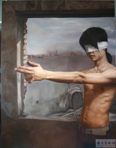

<!-- # ＜开阳＞退避者与乌托邦（下）：为了合意的改变 -->

**退避者们所发生的变化是，他们开始懂得在现代的意义上，认识即是行动，既然能够意识到社会所存在的问题，就不应该仅仅追求明哲保身，须知没有积极的行动，退避者的乌托邦便永远只能作为一种美妙的图景停留在他们的思想中，他们更懂得在这个大多数人无法享受自由的时代里，在他们的国家还有那么多让人痛心的事发生的时候，一个致力于给后人带来福祉的人无法只沉浸在思想的世界中而获得灵魂的平静。**

# 退避者与乌托邦（下）：

# 为了合意的改变

## 文/ 刘昌东（中国人民大学）

诚如上面所言，退避者们所面对的或许是他们所可能面对的最为险恶的时代，功利化的思考方式大行其道，退避者所依赖的独立而纯粹的思考被视作食之无味弃之可惜的鸡肋，在很多人眼中，它早已被当作历史的遗物，失去了在现代存活的生命力。可是事实果真如此吗？“存在即为合理。”一件事物要想在当下存在，它就必须具备在一个积极意义上改变现实的能力。毫无疑问，在文化价值观与生活方式日益受到大众媒体与流行文化影响力塑造的今天，退避者的思考对于深陷功利化与同质化泥沼中的世界而言，不啻是一剂解毒剂。他们的目标并非是一种新的社会秩序，而是要将人们从对经济和消费文明的痴迷中解放出来，他们孜孜以求的乃是自身内在的多样性，即思想的多元与包容性。相较于无力评估目的因而只能依赖于手段的功利主义者，退避者们更能摆脱思想领域中弥漫的市侩气息，也只有他们能时刻保持对于停滞不前和凝固不变的恐惧，始终坚持自己具有超越性的思考方式，获得普遍性的知识与智慧。

然而，即使如此，退避者的理想也还远没有实现，因为他们充其量只能保全他们自身。就像别林斯基发出的疑问那样：“当大多数人还受苦，普遍性对我有什么意义？”在绝大多数人丧失了独立思考能力的情况下，一两个退避者孤独的思索或许能够为未来保存思想的火种，但绝无法给现实带来合意的改变。“君子之道，贵乎有成，有济物之用，而未见乎物，犹无有也”，那种“我死之后，哪怕洪水滔天”的口吻不是退避者们应该持有的态度，因此，我想说的是：在现代的条件下，退避者们承担着更大的责任，他们不仅要用思考保持自己的自由，更要用自己思考的成果去影响与改变他们所身处的这个被现代文明成果的两面性深深折磨的时代。也唯有如此，他们所享有的宝贵的自由才不至于成为人类作为一个群体的自由的绝唱，他们让思想之光传于后世的理想才可能实现。

而对于我们的国家而言，改革正处在一个危险的转折点上，三十年单纯的经济增长耗尽了现行体制的生命力，政治与社会改革已是箭在弦上，不得不发，频繁发生的群体性事件只是社会乱象的一个侧面；没有了传统文化的庇护，我们的现代文化在欧美消费文明的冲击下显得无比空洞，宗教与法术趁机侵入了我们精神的空白；知识以惊人的速度贬值，教育则始终在通向自由的路口前畏葸不前，思考的代价变得越来越昂贵；怀抱精英梦想的人们惊恐地发现在这个官二代富二代军二代横行无忌的时代里，向上的道路正在被一点点堵死，社会阶层的渐渐固化与年轻人激情的冷却不可避免地让我们想到了深陷泥潭的近邻——日本。在这片古老的土地上，每个人都寄希望于变革，但时间表仍是一片空白；每个人都在眺望未来，但目之所及却只有灰暗的现实；每个人都在说将要改变些什么，但行动却显得那样无力。我们努力保持乐观，但现实并未因此对我们还以微笑，我们只能看到现实性却找不到可能性，思想早已被我们抛诸九霄云外，而这正是乌托邦在中国渐渐死去的标志。

可悲的是，人无法面对太多的现实，人也总是要靠希望来喂养的。当事实将我们的反思淹没，我们需要一次涅槃，经济上的发明和文化中的喧嚣使我们的神经钝化，只有理想与道德才能拯救我们。如果我们不去相信梦想，那么对所谓“清醒”的夸耀也就等同于抛弃了改良的一切希望。也就是在这时，退避者们才更显得弥足珍贵，但与上文所描述的那样，“大隐隐于市”对于现代的退避者们来说已是空谈，如果只是怀抱着自己的操守去追求那种“雪满山中高士卧，月明林下美人来”的个人境界，这样不是退避，而是逃避。须知个人境界固然值得歆羡与追慕，但时代毕竟已经不同，在各色思想理论多如牛毛的现代中国，我们需要登高一呼，振聋发聩的危言危行来涤荡尘埃，需要摧陷廓清，敢去陈言的勇者来挽狂澜于既倒，而非仅知埋首于故纸堆中皓首穷经，甚至是过于愤世嫉俗以至走向犬儒。“宁鸣而死，不默而生”，先贤们已经为我们提供了足够多的光辉典范，他们的教诲是现代中国的退避者们应该记取的。

可是，就像《理想国》中的哲学家们无法成为城邦的统治者一样，退避者们不愿意也不能够直接介入到政治经济这样具体的领域中去，一旦他们选择了冒险，等待他们的将很可能是被利用，就如同人们用广告牌来盖垃圾箱一样。进入体制虽然意味着具有了从内部改造体制的机会，但同时也会受到体制的极大束缚，思想的火花也随时有被掐灭的危险，两相权衡，这显然并不是个简单的选择题。而在文化精英主义日益受到敌视的当下，退避者们所面对的将不仅仅是物质强力，还有社会舆论并不友好的态度。特别是对中国来说，我们的文化中一直就有着精英淘汰的传统，正所谓“木秀于林，风必摧之，堆高于岸，流必湍之，行高于人，众必非之”，对于出奇拔萃之士，我们的文化传统并不宽容。因此我想，现代的退避者最能够发挥作用的，应当是在社会意识形态的改造领域，尽管其作用并不直接。但就像一位英国爵士所言：“教育能使一个民族易于领导，但难于驱策；易于统治，但难于奴役”，我想他所说的教育，就应该是指一种广义上的意识形态改造，即立足于实现自由民主的社会理想，对整个民族精神生活进行的改造。这种改造的重要性无需多言，如果整个社会没有共同拥有的和普遍树立起来的道德价值与责任，也就没有法律与民主政治，甚至市场经济也无法恰当地运转。对这个问题的考察虽然重要，但其牵涉甚广，也已经超出了这篇文章所要表达的范围，因此在这里就点到为止不再多说。

但另一个问题随之产生了，在这样的情形下，退避者这个称号是否还适用于这一群人呢？我想这其实并不那么重要，退避者所以区别于其他人的只在于既不轻易屈服又不以强力压制别人的气质和在一个喧嚣的时代独自深入思考的能力，而对于真正退避者而言，这些并不会因时代更易而轻易改变。退避者们所发生的变化是，他们开始懂得在现代的意义上，认识即是行动，既然能够意识到社会所存在的问题，就不应该仅仅追求明哲保身，须知没有积极的行动，退避者的乌托邦便永远只能作为一种美妙的图景停留在他们的思想中，他们更懂得在这个大多数人无法享受自由的时代里，在他们的国家还有那么多让人痛心的事发生的时候，一个致力于给后人带来福祉的人无法只沉浸在思想的世界中而获得灵魂的平静。当然，和所有其他时代一样，现代的退避者们仍然是脆弱的，他们没有任何强有力的手段可以保护自己，而他们的思考和表达对于任何一个现存的不完美社会来说都是潜在的威胁，因此退避者们往往也是最可能的殉道者。而这样的结果，无论对于退避者本身还是对于他们所处的时代而言，无疑都是悲剧性的。

这并不是一个属于退避者的好时代，关于这一点，我已经说得够多了，但我更关注的还在于在残酷的岁月里，这个梦幻的乌托邦代表着什么，现代意义上的退避者们又该如何使他们的乌托邦继续存在下去，而这在很大程度上也是我这样具有浓厚理想主义色彩的年轻人最关心的问题之一，对我个人而言，我并不希图这个乌托邦能给我带来什么财富与荣誉，但仅仅是它的存在对我来说就意味着一切，意味着我将能在这里为我的民族做我认为最有价值的事情。所以，乌托邦是我们必须要玩的一把火，也是我们能够将人性的曲木塑造成可用之材的唯一途径，即使要冒着为之殉道的危险。但退避者们究竟该怎样去保卫他们的乌托邦，就像开头所说的，对此我并没有明确的答案，它仍然是个找不出完美结果的谜题，这篇混乱而缺乏逻辑的文字也正是我目前对这一问题思索现状的最好写照。尽管如此，仍然有一些事是我现在可以确定的，那就是：仅仅有理想并不意味着什么，努力去践行自己的理想与承诺才是对理想负责的态度，我所追求的依然是属于自己的乌托邦，而非其拙劣的替代品。说到这里，又想起哈维尔在面对他的质疑者时所做的答复：“我以我认为适合的方式行动。我深信每个人都应该这样，即担负起自己的责任。有人会反对说这没有用。我的回答十分简单：‘有用’”。如果有人怀疑我的乌托邦是否还有意义，我愿以一个退避者的身份作出同样的回答。

（采编：陈锴；责编：陈锴）
