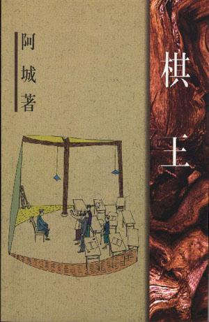

<!-- # ＜北斗荐书＞本期主题：对峙的意义——且说说象棋的书 -->

<!-- # **本期主题：对峙的意义****——****且说说象棋的书****** -->

## 荐书人/回形针（北斗撰稿人）

茨威格写道：“象棋，一种包含着各种矛盾的独一无二的混合物：这种游戏既是古老的，又永远是新颖的；其基础是机械的，但只有靠想像力才能使之发挥作用；它被呆板的几何空间所限制，而同时它的组合方式又是无限的；它是不断发展的，可又完全是没有成果的；它是没有结果的思想，没有答案的数学，没有作品的艺术，没有物质的建筑。但是，尽管如此，业已证明，这种游戏比人们的一切书本和作品更好地经受了时间的考验，它是惟一属于一切民族和一切时代的游戏，而且谁也不知道是哪一位神明把它带到世上来消愁解闷、砥砺心智、振奋人心的。”

奇怪的是在我要谈到文学世界中关于象棋的书时，脑中首先浮现的意象并非黑白交织的方格战场，也非泾渭分明的楚河汉界，而是金色透明的油脂——那像是象棋比赛进程的本体，凝滞与透明并存，饱含着没有滋味的热量，同时作为一种流动的记忆载体和难以掌握的智力游戏，傲慢而又矜持。书写象棋的书，当然不是一板一眼地记载棋谱，而多是书写一个人作为一个棋手的技艺精奇，以及与此同时，他作为命运的棋子，在人生那看不见的棋盘上如何履行茫然陡峭的轨迹。

今天要向大家介绍的有六个篇目：

**推荐书籍（点击蓝色字体书目可下载）：**

[**1、****《象棋的故事》**](http://ishare.iask.sina.com.cn/f/15412859.html)

****

****

**2、****《象棋少年》**

** **

[**3、****《防守》**](http://ishare.iask.sina.com.cn/f/15481584.html)

** **

****

**4、****《鸽子》**

** **

[**5、****《爱丽丝镜中奇遇记》**](http://ishare.iask.sina.com.cn/f/13277358.html)

** **

[**6****、《棋王》**](http://ishare.iask.sina.com.cn/f/5029095.html\)

其中的主角都不是超能力者，尽管他们之中有些人拥有高得令人咋舌的智商，低得令人泪奔的常识，惨得令人无语的经历，怪得令人眼花的梦境。不过在不下棋的时候，他们也只是普普通通的人，而无法将在棋盘上提前对手算出十几布甚至几十步的能耐移植到对自己人生的宏观考量之上。在文学的世界中，无论是珍珑棋局那自杀性质的破局之道，还是偶遇僵局时“翻转棋盘”的思考技巧，亦或是城市借由磨光的象牙标识物展现的无形秩序，命运与“好大一盘棋”的类比我们已经司空见惯。而在平淡的生活中，人们的视野总是不能宽广到预见每一步抉择将会延展出怎样的后果，当己身看似偶然地步入不可逆转的境地，又时时感觉到这是一种无法逃脱的必然。只是这种醒悟通常只在回顾时被发现，而在前进时被无视。在棋手的眼中，看到的仅是黑白二色的透视空间。马的跨角移动、象在出击时的斜线移动、皇帝和小卒步步为营的移动，是他们生存意义的来源。仿佛这才是真正的厮杀，棋盘之外，并不存在唯一而确定的世界。

象棋手本来集各种截然不同的智力特性于一身，兼有哲学家、数学家的精于计算、富于想像力等创造性的特质。仅仅有天分是不够的，激情和耐心才能浇筑出智力晶体自由生长的枝型结构。热情和苦涩是棋手生活唯二的佐料。因为一个人用来局限自己的范围愈狭小，他在一定意义上就愈接近于无限。正是这种表面上看来对世界上的一切都漠不关心的人，像白蚂蚁一样顽强地用他们特殊的材料建筑着自己稀奇古怪的，然而对他们来说却是独一无二的宇宙缩影似的小天地。但同时他也会由于不谙世事，失去与他人的联系从而与世隔绝。外行人站在高处俯视时，看不到棋手整个人的全貌，他那深邃的技艺也因为透视的关系缩成了一个点——尽管这个点本身可能深不可测。

而正因为起初对生活，对尘俗的逃避或割裂，棋手整个的身心都被逼到这些小方格里去。下棋的乐趣变成了下棋的热情，变成一种癖好，变成一种激烈的狂怒，它不仅在他醒着的时候纠缠着他，渐渐地，也侵入到他的睡梦之中。棋手变成了象棋本身的傀儡，人生的版图犹如反光材质的棋子拈来冰手。B博士为了对抗禁闭的压抑而几近疯狂地练习盲棋，少年罗德勒以象棋作为抵达终极真理的实验手段，大师卢仁无法摆脱象棋对他脆弱心灵的围歼而最终选择纵身一跃，年迈的吉恩委曲求全低声下气也无法避开令人作呕的胜利。伟大的棋手总是败给自身的孤独，因为他们在选择了非黑即白的世界之时，就注定看不见彩虹般斑斓，以及其中浑浊不明的灰度。棋盘上的胜利，终究只是一种娱乐。就像卡尔维诺在《看不见的城市》中所书：忽必烈把自己的胜利逐一肢解，直至它们还原成为最基本的状态，然后他进行了一次大手术：以帝国诸色奇珍异宝为虚幻外表的、最后的征服。然而归结下来，它只是一方刨平的木头：一无所有。

而爱做梦的小姑娘爱丽丝要比前面几位豁达得多，似乎欢乐也更多。爱丽丝在镜中奇妙的舞步似乎不如她在仙境的旅途那样广为人知，而其实这一次是更符合逻辑的——在镜像中颠倒之后的象棋逻辑。小姑娘身为一个蹦蹦跳跳的过河卒子，目击了白皇后变成绵羊，雏菊和玫瑰吐槽，红白骑士不作声的厮杀和金色小船一样的怪诗，直入对方底线升变成另一位白皇后，把红皇后摇晃成了一只脸颊软绵绵的小黑猫。爱丽丝的优点在于，可以一口气接受下成年人谓之不可能的事情，因而也就很难被规则限制，自困于理性的牢笼之中。

阿城的《棋王》写的是下起棋来跟吃饭一样精细而惨无人道的棋疯子王一生，对战县城象棋高手的故事。然而这篇故事让我记得最深的，不是王一生那“汇道禅于一炉，神机妙算，先声有势，后发制人，遣龙治水，气贯阴阳，古今儒将，不过如此。”的玄妙棋艺，而是他拾荒的母亲担心生计，屡劝他弃棋无果，最后用牙刷把儿给他磨了一副无字棋。“娘不识字，怕刻不对。你拿了去，自己刻吧，也算妈疼你好下棋。”王一生以一敌九，独坐高台，无人能助，无须人助。叙述者“我”感到了战场一般肃杀的气氛，仿佛看到了那些没有名字的士兵和樵夫，唱着悲怆的楚歌。“我”内心惊动，“不由伸手到王一生书包里去掏摸，捏到一个小布包儿，拽出来一看，是个旧蓝斜纹布的小口袋，上面绣了一只蝙蝠，布的四边儿都用线做了圈口，针脚很是细密。取出一个棋子，确实很小，在太阳底下竟是半透明的，像是一只眼睛，正柔和地瞧着。”

能称王者，所依傍的，不仅是才能，更是“人气”。这里的人气，一是指令众人叹服心折的风范，二是指源于人间烟火的世俗气，三是指作为“人”不依不饶登峰造极攀高望远的追求。阿城要讲的，不仅是乱世里苦中作乐的温情脉脉，更是缓缓流动，而从未止息的对精神生活的不投降。王一生说：“何以解忧？唯有下棋。”为了忘却接和不安，他在拥挤的火车上也要摆下棋盘杀将开来。而“我”也时常扪心自问，“可是我常常烦闷的是什么呢？为什么就那么想看看随便什么一本书呢？电影儿这种东西，灯一亮就全醒过来了，图个什么呢？可我隐隐有一种欲望在心里，说不清楚，但我大致觉出是关于活着的什么东西。”

我们为什么要读一本书，为什么要拉着别人下棋，为什么要絮絮叨叨地跟别人分享那些本该只属于个人的经验？这种动机，或许可以不用现代人常说的“沟通”“理解”“交流”诸如此类的词语来表达，而代之以阿城口中“很古的东西”。奇人雅士，心向往之，大千世界，见者乐至。

就用《棋王》结尾的一段话来作为这篇七零八碎荐书文的结尾吧。这样平实干净的语言，或可以传达我想说而说不出的，人间的乐趣。

“夜黑黑的，伸手不见五指。王一生已经睡死。我却还似乎耳边人声嚷动，眼前火把通明，山民们铁了脸，肩着柴禾林中走，咿咿呀呀地唱。

我笑起来，想：不做俗人，哪儿会知道这般乐趣？家破人亡，平了头每日荷锄，却自有真人生在里面，识到了，即是幸，即是福。

衣食是本，自有人类，就是每日在忙这个。可囿在其中，终于还不太像人。倦意渐渐上来，就拥了幕布，沉沉睡去。”

（采稿：徐毅磊；责编：徐毅磊）
