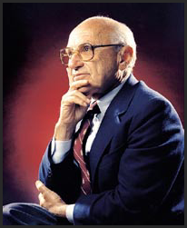
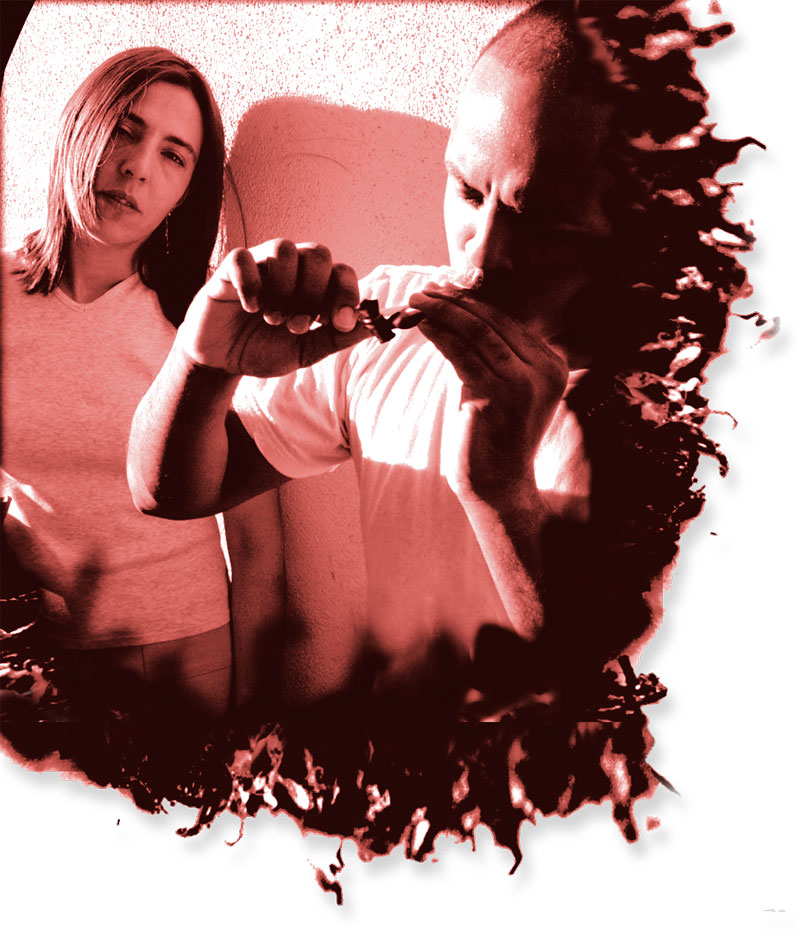

<!-- # ＜七星视点＞第十八期：当市场遭遇毒品 -->

<!-- # 七星视点****•****第十八期 -->

## 当市场遭遇毒品

### 本期热点

过去几个世纪里，自由市场给人类社会带来了前所未有的财富和繁荣；过去二十多年里，我们亲身经历了市场经济在日常生活中造成的巨大变化。然而，市场的力量真是无限的吗？其适用的范围究竟有多广？当市场遭遇毒品，是应该坚持自由放任，还是力行国家监管？各位意领文昆，对此各有何高见？唇枪舌剑，精彩不断，尽在本期七星视点。

### 事件回放

硕帝，又见硕帝！所谓意见领袖，就是你以为他已经不问政治，他却能突然用一条颠覆常识的状态吸引你的注意。

 2011年7月14日12时18分，人人网知名意见领袖[李硕](http://www.renren.com/profile.do?id=1684349076)（硕帝）发表了如下状态：

几乎一切带给人快感的东西都能导致上瘾，糖，肉，烟草，酒精，性，毒品，每个人对他们的喜好度和承受能力都不一样。有的人戒烟跟自杀一样，有的人说戒就戒。人人几乎都喝过酒，alcoholic却不常见，大部分人对大麻不上瘾，而有的人吸了最牛逼的冰毒都不上瘾。禁毒实际上跟禁酒禁色一样扯逼。

这条状态看起来是如此有违常识，以至于即刻招致了一箩筐的批评。但也有些人觉得，仔细琢磨，内中的逻辑倒也不无道理。于是，一场关于市场和毒品的争论就此展开。

论战甫始，众人纷纷向硕帝发难 [王涛](http://www.renren.com/profile.do?id=223908299&ref=minifeed)

毒品这个东西，危害是很大的，跟糖肉之类没法比，极个别的人不上瘾，但是大多数人不行。还是要禁的。 [张檀](http://www.renren.com/profile.do?id=251267453&ref=minifeed)

戒毒整体难度大，毒品自身成本低，对健康威胁大。有一定的管制是必要的，即便是本着对个体健康负责的态度政府和医疗机构也不应放任 [**周诗霞****-Amber.**](http://www.renren.com/profile.do?id=284101265)

毒品最大的危害并不在于成瘾性，而在于别人利用这种成瘾性盈利并且控制他人。其实禁毒禁的是那些自己不吸毒却诱使别人吸毒来给自己盈利的人。

硕帝眼见自己大有众叛亲离之势，连忙搬出救兵，召唤经济学昆仑前来助阵

 [**李硕**](http://www.renren.com/profile.do?id=1684349076)

其实吧，弗里德曼大湿生前曾经联名美帝500个经济学家上书提议毒品合法化。你为什么没听过烟草黑帮和酒精黑帮，为毛只有毒品黑帮？其实酒精黑帮也有过，美国禁酒的时候就有。

### 背景资料一：弗里德曼和毒品合法化的主张

提起经济学大师，弗里德曼是绕不过去的名字。有人说，他是二十世纪最伟大的经济学家。他几乎以一己之力，将经济学从凯恩斯主义的歧路拉回了古典自由主义的正轨。他创立了货币主义和永久收入假说，并有《美国货币史》《价格理论》《资本主义与自由》等多本著作问世。弗里德曼于1976年获得诺贝尔经济学奖。

弗里德曼是自由市场的坚定维护者，相信在大多数情况下，市场都能比政府做得更好，即使在毒品问题上也是一样。

他支持毒品合法化的理由主要有如下几点：

一、我们没有权力直接或间接地使用武力来阻止一位同胞自杀，更不用说阻止他喝酒或吸毒。

二、合法化之后，竞争会导致毒品的价格下降而质量上升，从而瘾君子不至于通过犯罪来获取毒资，也会有更小的死亡或患病的风险。社会的犯罪率也会因此降低。

三、正是对毒品的管制导致更强力毒品的问世，因为强力毒品体积更小，更不容易被查获。

四、许多人的毒瘾是由毒贩故意造成的，一旦毒品合法化，其价格将剧烈下降以致引诱人吸毒无利可图，因而瘾君子的数量未必会上升。

五、毒品合法化将减少警察和政府系统的腐败

六、打击毒品代价太大，成效甚微

但弗里德曼自己也承认，由于需求曲线是向下倾斜的，毒品价格的下降可能会导致对毒品更大的需求。

（以上内容根据弗里德曼论述毒品问题的一篇文章和他某次接受采访的文字稿整理，或有不确之处，还望读者见谅）

然而，经济学大师的理论似乎并未打消大家的怀疑，对毒品合法化的抨击仍在继续

 [张抗抗](http://www.renren.com/profile.do?id=79678&ref=minifeed)

如果政府不禁止毒品，毒品价值会下降25-100倍，没有了高额利润，那就与自种差异不大。支持毒品合法化的经济学家还是很多的，但考虑到政治上的风险与不确定性，其呼声并不被政府采纳。退一万步，即使真能自耕自食，政府依然会进行管制。因为毒品就像过度吃糖一样，是人的古老基因决定的一种非理性 [**王也**](http://www.renren.com/profile.do?id=239664813&ref=minifeed&sfet=502&fin=5&ff_id=239664813)

市场机制赖以发挥作用的前提之一，是人们在自由交易的过程中可以不断“试错”，从而逐渐逼近最优的选择。但对于毒品来说，一旦尝试之后，人可能就会失去理性和判断能力，因而市场机制在这个问题上或许并不适用。 [李坦Loser](http://www.renren.com/profile.do?id=309501855&ref=minifeed)

我说两句。。。“毒品”分很多种，有的毒品一沾上，真的就没有“幸福”了，而且吸毒的后果远不止”劳动力的丧失“。。。 [姚亮](http://www.renren.com/profile.do?id=238591188&ref=minifeed)

其实正因为存在自制力的问题，所以不能说这是无可厚非的，毕竟理性人只是经济学家创造出来的塑料模特。

当然，也有些人或多或少地对硕帝表示了支持

 [周诗霞-Amber.](http://www.renren.com/profile.do?id=284101265&ref=minifeed)

我赞同如果吸毒者选择自我耕种毒品的隐居生活。 [桂洲](http://www.renren.com/profile.do?id=229474965&ref=minifeed)

毒瘾只是药物依赖性，那么去痛片这种也同样具有药物依赖性，为什么不禁止呢,只要是作用于神经中枢的药品都会产生不同程度的损害，禁止？ [**王也**](http://www.renren.com/profile.do?id=239664813&ref=minifeed&sfet=502&fin=5&ff_id=239664813)

作为弗里德曼的仰慕者，我觉得毒品合法化是可以讨论实施的，当然仅限于大麻啊这种危害不大的东东，冰毒神马的还是算了

硕帝本人也复述了弗里德曼的观点来为自己辩护

 [李硕](http://www.renren.com/profile.do?id=1684349076)

实际上，毒品交易是一种黑市交易。正是政府禁止才导致毒品天价和一系列的暴力犯罪，黑帮犯罪等等的社会问题。美国的毒品消费跟他娘的GDP一直都是稳定增

长的，根本禁不住，从务实的功利的角度出发，禁毒防止犯罪的效果不如解禁好。从形而上的角度考虑，更看不出禁毒有什么合理性。

之后，著名文昆，中山大学政治哲学博士陈纯的乱入，把这场讨论引向了政治学领域

 [陈纯](http://www.renren.com/profile.do?id=253681438)

关于今天的毒品争论，我只说一句，政府无权在公民伤害自身时对其进行惩罚，但是政府也不应该为公民提供伤害其自身的条件，在我看来，毒品合法化就属于后者，当然，对于大麻是否伤身这点我存疑，但是海洛因、冰毒就肯定在这个范围内 [陈纯](http://www.renren.com/profile.do?id=253681438&ref=minifeed)

在毒品合法化这件事上，就是为毒品买卖提供一个自由合法的环境，而且，很多理由相信一旦它合法化，是很有可能比法律对此不做规定的时候要更能促进毒品买卖的，这种意义上说“提供条件”，我觉得很合理。 [江城](http://www.renren.com/profile.do?id=278157616&ref=minifeed)

对于合法化后是否会促进毒品买卖我并不那么肯定。这可类比到卖淫合法化后是否促进了色情交易。这差别在于吸毒是否是确定的对人有害对社会有害的东西，而这吸毒算不算消极自由的一部分。 [陈纯](http://www.renren.com/profile.do?id=253681438&ref=minifeed)

我觉得和卖淫合法化完全不一样。简单来说就是，每个人都有性需要，对于那些没有女朋友或老婆，或者女朋友老婆不在身边，不想天天打飞机，又玩不起ONS的人，嫖妓不是一个很合理的发泄渠道吗？ [陈纯](http://www.renren.com/profile.do?id=253681438&ref=minifeed)

但是吸毒却不属于这样的需要。而且，它的危害性明显比嫖妓要大得多。这点至少对于海洛因和冰毒是确切无疑。

在这之后，这场并不热闹的争论就算平息了，来得突然，结束得也快。但小编以为，关于毒品合法化，可以说的其实还有很多。在此附上几则材料，谨供对此问题有兴趣的读者参考。

### 背景材料之二：美国的禁酒法案

[美国禁酒令](http://baike.baidu.com/view/501246.htm)的法律依据是1919年1月16日批准的美国宪法第十八修正案和1919年10月28日通过的Volstead Act，在1920年1月16日第18宪法修正案生效日开始执行，由联邦禁酒探员（警察）负责执法。其限制只针对酒的制造、贩卖和运输，不包括酒的持有和饮用。

禁酒令提供了有组织犯罪的获利机会，他们接管酒的进口（私酒业）、制造和销售，最著名的私酒业者之一[艾尔·卡彭](http://baike.baidu.com/view/1610839.htm)（Al Capone），他的犯罪帝国主要就是利用由从非法贩酒得来的利润建立。因为酒的制造主要是在犯罪者和秘密家庭酿造者手中，因此品质差异很大，有些人在喝了从工业酒精和有毒化学品制造的家庭私酒后瞎掉或者是脑部受损。

很多1920年代的社会问题被归成禁酒时期问题，高利润、动辄使用暴力的酒品黑市的繁荣，敲诈勒索因为执法官员的腐败而盛行，烈酒的走私利润较高使得烈酒反而更为流行，执行禁酒令的花费很高，又失去了来自酒品的税收（约5亿美元一年），使得国库大受影响，1933年第21宪法修正案通过而撤消禁酒令，这使得有组织犯罪因来自合法卖酒商店的低价竞争，几乎失去他们所有来自酒品黑市的利润，但不久后这些有组织犯罪就改为贩卖非法毒品。有一种观点认为黑市会兴旺是因为有非法的产品存在，因此有人将现代“向毒品宣战”与禁酒令时期相比，但也有人认为这种比较不正确。（详见百度百科）

### 背景材料之三：各国对待毒品交易的态度

美国在对待吸毒行为方面有两个特点，一是变化比较大；二是各州有不同的一些法律规定。纽约州在1973年通过法律规定，凡被证明交易毒品或拥有毒品，将视情节而受到监禁，对于吸毒者可以处1万美元以下罚款，法官有权利剥夺吸毒者享有联邦政府提供的大多数福利待遇。1996年，加州成为美国第一个可以合法使用药用大麻的地区。到现在，共有11个州和地区陆续加入此列。

德国刑法规定，凡非法持有毒品，一律规定为犯罪，并处以刑罚，不问非法持有者的动机如何。凡吸食毒品者，酌情判处两年上下的徒刑；对吸毒成瘾人员则判处监狱服刑或者强制治疗中心强制治疗。2000年以后，德国对待吸毒行为的态度有所变化，对吸毒行为表现得更加宽容，在特定的地点吸毒可能被免于追究刑事责任。

法国对吸食不同毒品采取区别对待的方式。例如对吸食“硬性毒品”（如海洛因）的罪犯交专门机构戒毒；对吸食“软性毒品”（如大麻）的人员则主要借助公益机构通过心理疗法进行治疗。

荷兰从20世纪70年代起对“软毒品”大麻采取了较为宽松的政策，该国允许持有执照的咖啡馆向成年人售卖小剂量大麻，本国人可在咖啡馆或私人住所吸食大麻。

新加坡对吸毒行为的惩罚是世界上最严厉的，法律规定对吸毒人员要判处监禁及鞭刑。近年来有些规定有所变化，比如对滥用大麻和可卡因的人可以不直

接审判入狱，初犯者将被送去戒毒。

日本根据不同的历史时期吸食毒品种类的不同，制定了不同的单行禁毒法律，规定了不同罪名。总体上来说，日本是将吸毒规定为犯罪的，《刑法》规定

对吸鸦片者处3年以下惩役。

（资料来自网络）

### 背景资料之四：关于大麻

大麻是使用人数最多、范围最广的一种毒品，一方面是因为价格低廉，而另一原因在于其危害较其它毒品低。全球使用大麻比例最高的地区是大洋洲，北美紧随其后。到底吸食大麻对人体有无危害？答案是肯定的：

大麻会损害呼吸系统，尤其是肺部。大麻的致癌作用明显高于烟草，英国肺脏基金会（The British Lung Foundation）认为，每天抽3-4支大麻烟给人体带来的危害相当于20支普通烟草；

大麻会损害未成年人的脑部发育，诱发精神疾病。普通人患精神分裂症的概率为1/100，而在长期吸食大麻的群体中，这一概率是1/15；

大麻具有成瘾性，约有10%的吸食者会产生依赖性。

英国医学杂志《柳叶刀》2007年刊文数据显示，大麻（Cannabis）对身体的伤害（Physical Harm）和依赖性（Dependence）都不如烟草（Tobacco）和酒精（Alcohol）。

不过，据英国《柳叶刀》杂志的刊文数据显示，大麻的成瘾作用不仅大大低于海洛因、安非他命等“硬毒品”，甚至还略低于酒精和尼古丁。而大麻的使用群体主要集中在热衷聚会的未婚年轻人，在婚后尤其是有孩子以后，大多数人会戒掉大麻。另外，作为药品，大麻对癌症和艾滋病等晚期绝症患者有很好的帮助，能够起到止痛、止吐、缓解情绪和增进食欲等作用。

（资料来自网络）

小编曰：市场是个好东西，但再好的东西，超出其适用范围，也可能起到不好的作用。即使是支持自由放任的经济学家，也从来没有否认政府在经济活动中的作用。市场不是万能的，因为人类并不是绝对理性的生物。很多时候，我们并不能够准确地预计到自身行为的后果，并作出正确的反应。在多大程度上可以依靠市场，什么时候需要政府的干预，这其实是个需要实证研究的问题，因而这场争论注定不会有一个结局。但通过了解争论双方的观点，我们可以更加深入地认识市场的优势和不足，对于生活在市场经济时代的我们来说，这无疑是件很有裨益的事情。

（采编：王也

陈造极；责编：王也）
