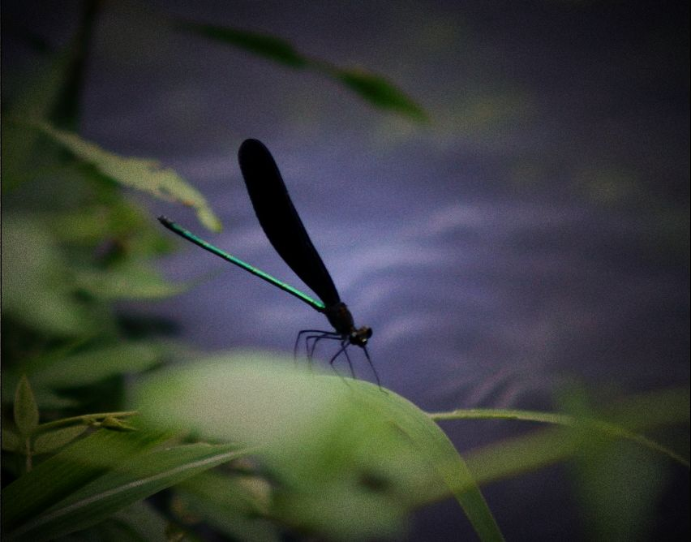
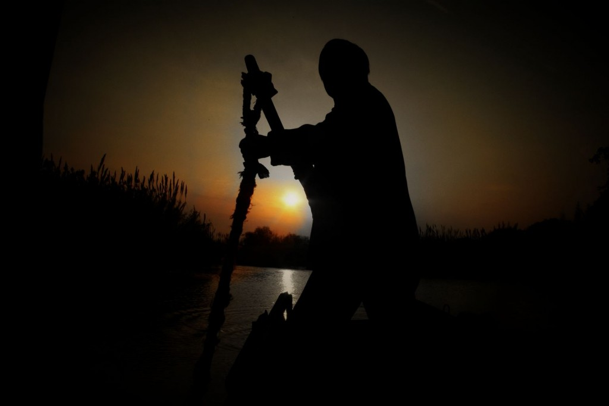
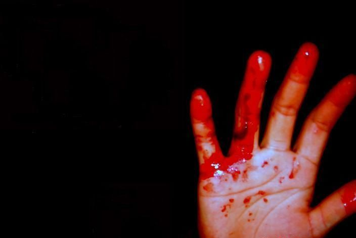

<!-- # ＜天权＞你往何处去 -->

**我不知道这条河是从什么时候横亘在这里的，大旱的北京城是一座漠漠燕原上的水城，历史在沟渠中奔流不息，你投身于那激流中的战火、杀戮、耻辱和仇恨，却没有

看到在那岸上的人们相亲相爱，安家筑巢，他们像蒲苇一样生长，像青鸟一样歌唱，直到那一一风荷举，直到那经冬复立春……他们是你永不抵的对岸。**

# 你往何处去

## 文 / 吴昕悦 （ Wellesley College）

就像千万年前冰川横生，在地面上留下沟壑与湖泊，消逝的人们像水流一样在这个城市留下刀削斧凿的伤痕，以生命的硬度。

──题记

当那个吹口琴的男孩子出现在岸上时，摆渡人就已经打定主意不理睬他了。男孩断断续续地在吹一首歌，尚不是很熟练，于是反反复复吹了好几遍但是到了同一个音节都会卡壳，然后他吸一口气再重新来。

摆渡人被他烦到不行，用桨去扫男孩被蚊子咬得坑坑洼洼的小腿，男孩轻巧地跳开，朝摆渡人咧嘴笑，带我过去吧，我给你吹一支歌听。

摆渡人摆摆手说，算了吧我已经听腻了。

男孩嘻嘻地笑，就一次，带我过去吧。

什么就一次，已经好几次了，你到不了的，到不了。

男孩子蹲了下来，眨眨黑色的眼睛，到不了？你又不知道我要去哪里，你也不知道我是谁。

我 第一次见到你的时候你早就不是男孩了，那时的你眼睛是蓝色的，腮上是密密的棕色胡须。你坐在教堂里，外面的硝烟已经弥漫进来。愤怒的人潮在撞击那扇摇摇欲

坠的门，彩绘玻璃砰地碎了一地，破窗而入的是托马斯修士的头颅，它一直滚到布道台的台阶下。你在胸口画了一个十字，你对着欲来的风雨张开双臂：我是信耶稣

基督的人，我主慈悲，今天是我的死期。

男孩笑了，这就是我当时最后做的事情？

摆渡人把桨插进水里，咚地一声。不，你看着对岸的灯火时最后提起的是你的故乡。可是就像遥远星球的光芒需要上百年才能抵达地球，几个月之后你故乡的孩子们用皮带扣抽着陀螺，他们刚刚听闻北平有战事，觉得格外新奇。

男 孩的琴声到了那一个小节又断了，他对摆渡人笑笑，然后从地上捡起一块石片，抛起来又接住：其实那也不是我第一次来，不过我记得我看着洋人的军队在硝烟中叩

开那厚重的城门，我在一辆油壁马车里恨恨地看着围观人群麻木不仁的怯懦面孔，身边的孩子吵嚷着要吃糖。我当时下定决心踏上这条船，我要到对岸去，我对着隔

岸的妇人们讲共和，我声嘶力竭，她们温驯地听着，微微地笑。我从黎明她们捣衣一直说到夕阳西下，然后她们站起身，我欣喜欲狂，但她们随即转身消失在那一片

河岸──她们离开是因为丈夫在家里等她们做饭。当时我就明白：魂化精卫填沧海，我必以我血荐轩辕。

别试图考验一个老头子的记忆力。你的血有没有荐成轩辕我不知道，但后来的你在写故事的时候倒是把这血拿去蘸馒头了。

我当时还年轻，以为能以笔为刀將那依附在民族肌体里顽固的肿瘤割去。但是当我在写字台上剖开这具病弱的躯体……老头儿，你可曾见过人体内的肿瘤是什么样的？

我可一直都只是个船夫。

我们总以为肿瘤是丑陋不堪的，但当我在仙台第一次看见它的时候，我震惊于它竟是如此美丽：它是鹅黄色的，被一层薄膜包覆着，轻轻颤动着，好像是藏在人体里一个自成一体的小宇宙，慢慢吞食着它周围的一切，那简直是像永恒开战……

但你还是一刀切了下去，摆渡人打断男孩的话。你衣衫带血，是那个可怜的病人的血。

那也是我自己的血。

我想起来了，本应举办国民大会的主席台上挂着你被刺伤的血衣呢。

不，不是那一次，是在铁狮子胡同的那一次，是在燕京大学的那一次，是每一次，是千千万万次。

好吧好吧，千千万万次。你的敌人换了很多个，他们用刺刀用绳索用毛瑟枪用二四式用小米加步枪杀死你。你每次都来让我带你去对岸，但是没有一次成功。

不不不，我成功过，你不记得我在清华的时候……

我 记得，我记得后来的你留了满脸胡子，因为抗战不成功你就绝不剃须。我还记得你的书生意气慷慨激昂，你对隐藏在人群中的杀手拍案高呼：你们将失去千百万的人

民！你们看着我们人少，没有力量？告诉你们，我们的力量大得很，强得很！看今天来的这些人，都是我们的人，都是我们的力量！此外还有广大的市民！我们有这

个信心：人民的力量是要胜利的，真理是永远存在的！

……可是他们开枪了。男孩垂下眼睛。

在你振臂高呼的时候你就知道你的人民

从来就不是一个褒义词──他们要求领袖始终如一，但自己变节得比谁都快。跪在地上高呼吾皇万岁万岁万万岁的是他们，拥护民主共和的是他们，涌向国民政府的

是他们，在广场上举着红宝书人头攒动的也是他们……别吹了别吹了，这支曲子我已经听烦了，你快走吧。

男孩把口琴从嘴边拿开，吹了个口哨。但我并不只是个书生，我也拿过枪──笔墨不能治愈的，就用出镗的子弹！

你确实不只是个书生，你的身份换了成百上千次。曾经的你英俊异常，躲在帷幕后面等着扣动扳机。但你却发现那帷幕里向日本人求荣的不过是个失业的小皇帝，而你自己则是个失业的恐怖分子。

就这最后一次。男孩在船边坐下，开始解缆绳。

摆渡人拍掉男孩子脏兮兮的细手指。不，不行。你求我也没用，逼迫我也不行。

男孩子在衣服上擦擦口琴，做了个鬼脸，老人家我还逼迫过你？

那时的你用枪顶住我的太阳穴，你叱问我是不是存心不开船是不是和无产阶级革命做对。我没有办法只好渡你过去。那一次你看着对岸红透的灯火燎原燃烧激动得落下眼泪，你以为你真的要到了，但那不过是海市蜃楼。

我总能打动你开船的。我没有钱，没有权，也没有甜言蜜语，我用我的失意、我的沮丧、我的落魄和破碎又重组的梦想来打动你。

你已经用过你的失败了。那次你来的时候什么也没说，你胸前的衬衫上满满都是血迹──你的喉管被割断了。你跌跌撞撞上了船，看着对岸不停地摇头，你像一条渴死的大鱼一样嘴唇一张一翕。于是我知道带你过去也没有什么意义了，你已经疯了。

男孩站起身，静静地盯住摆渡人说，你要看清楚，疯子会有这样的眼睛吗？说我疯了……你一定是记错了。

我这老头子的记性不好了，但是我看得清楚也记得清楚──这双墨玉般的杏仁眼即使在没有灯的夜晚也依然勾人魂魄……那个时候你是个二十岁的漂亮姑娘。你一路仓

皇地抽噎着跑来，你的白衬衫上有深色的血，你光赤洁白的脚趾上沾满了粪便和汽油，你的眼泪一直往下掉，你泣不成声地重复说你的同学还在后面怎么会这样怎么

会这样他们怎么会真的开枪！你不会知道，在你踏上这条船不久，你那些举着旗帜的同伴们拿着避难签证远渡重洋，很多年之后他们再想起你，一再举杯而那祝酒词

却是：为了忘却的纪念。

他们都不会想起在那个初夏无灯的夜晚，你哀哀地抓住船桨,骨节都发白指甲都折断，你瑟瑟发抖地说，我们都活在别人的记忆中，只要有人记得就不会死去──请你记住我，别让我就这么走了。

男孩用一个优雅的手势將他刚才拾起的那枚石片投了出去，它在水面上蹦跳了几个水漂，然后无声无息地沉了下去。水面上对岸灯火的倒影模糊了片刻又回复平静。男孩抬起眼睛，他的睫毛湿漉漉的。

他 说，我从昆明湖跳下，我自北新桥而生。我登上紫禁城，我炮轰金銮殿，我坐在老城墙头上击节长哭。我跪鸣民族之冤，我血溅六尺白绫。我写下血书，我舔去指尖

残余的糖浆。刽子手是我，殉难者也是我：我下达了命令，我通过了审判，我扣动扳机，我打碎了我的头颅……我终将达到城市的那一岸，因为我即我城。

摆渡人躲开男孩灼灼的目光，我可以让你上船。但是你还是到不了的──就像我们曾试过千百次的那样。说来我还真是个失职的摆渡人，而你是个失职的英雄……

男孩咬紧了嘴唇不说话。摆渡人没有看他，接着说下去。

我 不知道这条河是从什么时候横亘在这里的，大旱的北京城是一座漠漠燕原上的水城，历史在沟渠中奔流不息，你投身于那激流中的战火、杀戮、耻辱和仇恨，却没有

看到在那岸上的人们相亲相爱，安家筑巢，他们像蒲苇一样生长，像青鸟一样歌唱，直到那一一风荷举，直到那经冬复立春……他们是你永不抵的对岸。

他去找男孩的视线，但是男孩正若有所思地看着河里的倒影，没有在听他的絮叨。脉脉水波把摆渡人的倒影裂成碎片：他九十岁的头发好像一蓬柳絮，他中年的眼睛看着新生的女儿满是笑意，他年轻的手臂挽着恋人的腰肢，他童年的小小手指钩着母亲的拇指……

摆渡人叹了口气，上船吧。百年来你千百次地踏上这条船，它是你的第三条河岸。

男孩抬头看着摆渡人咧开嘴笑了，那么作为回报我给你吹一支歌吧。

不日北京暴雨，有人说在蓟门桥被浸泡的车流中看见了撑船的人，还有人说船上还有个吹口琴的少年，但那是在天安门，在马甸桥的救援人员说看见了个梳着清朝辫子的幻影，但是西坝河的居民反映说是一个穿着中山装的青年人……唯一确定的是，所有干涸的城渠都涨满了水，所

有的尘土泥沙和垃圾再一次浮上这座城市的表面。

第二天在这座被冲洗一新的城市里，有人在亮马河边的淤泥里发现了一具被河水冲洗得干干净净的小小骸骨，公安人员定案是失踪人口，居委会的中年妇女们为此心悸地叽叽喳喳了很久，但是这件事最终不了了之了，因为这座城市已经有太多走失的人了。

（采编：尹桑；责编：陈轩）
