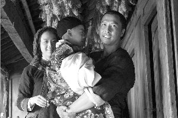

<!-- # ＜天权＞法律不是正义唯一的执行机构 -->

**世俗的幸福就是要让你明白，你不是一个人。平静重复的日常之中，沉淀着你遗传自祖先的，对安全和温暖的渴望。谁人愿意整日刀口谋生，而谁人又愿意天天提心吊胆处处提防以至于把自己练成个金钟罩铁布衫黄铜蛤蟆——没生儿子的我们暂不讨论。**

# 法律不是正义唯一的执行机构

## 文/回形针（苏州大学）

开始评论之前我想说一句，在影院连角色名字都记不住只看见帅哥美女万年不变的容颜，预置判断提前期待生怕不掉泪不引发人生思索就对不起电影票钱，以审查艺术片的眼光来要求商业片，这都不是专业影评人应有的态度。在此，我试图用评论文学作品的语言来剖析这样一部大制作的风景片。

如果你们把《武侠》当做武侠类型片来看待，那就拿衣服了。其实它是一部人类学的实地考察纪录片。并且它非常正经地体现出了传奇故事结构，将西方伦理学的思考融入了对世俗经典的讲述，集传统中医学和现代物理学于一身，是对父系社会现实一次大胆的演绎——并非不能归类的东西就是不好的。对四不像的看不惯，也许反而展现出深藏在诸路评论员心中神圣不可侵犯的藩篱。我们需要一种全新的视角，去打开我们习惯性偏颇的视野。

这个电影叫什么都好，就是不该叫《武侠》。据说原名叫《同谋者》，太过直露，包袱抖尽，不好。而且电影后半段明显没有把这个名字更深入地挖掘下去。秉承港片的风格，叫《独臂狂龙》或者《凤城来客》估计效果都好过现状。

不要因为刘金喜长了一张甄子丹的脸，就在开场五分钟之内认定了他身负绝世武功并且苦大仇深。一开始他只是个山野村夫，带头发展乡村经济，发展土法造纸产业。不过人怕出名村怕富，小康村引来了怪蜀黍。刘金喜见义勇为保卫家园，却没曾想被山寨福尔摩斯徐百九由抢匪一颗掉进药酒的槽牙看出了事有蹊跷。终于发现这位一口高露洁牙齿的活雷锋，竟是多年前惨无人道的灭门惨案凶手，而且逍遥法外，在山清水秀的穷乡僻壤过老婆孩子热炕头的舒坦日子。徐百九正义感大爆发，不惜贿赂高层誓要将刘金喜捉拿归案，然后，就有很多然后了。

有人说这片子中段以后急转直下让人不爽，我觉得是前半段太入戏了。其实此片通篇在说两件事情。一：任何行为都会留下蛛丝马迹，人必须为所做的事情付出代价。二：生命的价值来源于生活本身。

徐百九的刑侦技巧我就不多说了，推理阐释脑补功力一流，工作表现尽职尽责，一扫天朝公务员办事效率低下的刻板印象。不过他由于吃过一个正太的亏，一朝被蛇咬，导致积毒在心间看谁都像迷途难返，还分裂出了伏地魔宅男人格，理性过分发达坚持法不容情，一口气上不来就得往自己胸口扎两针。而且在正义感的驱使下，屡次做出揭人伤疤推人下水夜袭竹床当街砍人种种二百五的事情。我觉着刘金喜要是个纯爷们，早就拎起板砖跟他急了。然则金喜作为一个潜伏十年的内奸，深得人民群众欢心，就了业生了娃还入了族谱，俨然已经成为了壮族大家庭中不可或缺的一员。他对徐百九既往不咎谆谆教导的作为充分体现了他是多么的忍辱负重用心良苦。潜台词就是：当年我杀人实在是身不由己啊，杀手也要有职业道德啊，我自己也不想啊，一人犯错也就是众生犯错，我上面有人……劳资在这好不容易混出点清净来，你丫要搞破坏就给我滚蛋！

但是一个手上沾过鲜血的人真的有资格过上幸福而平凡的生活吗？那些冤魂不是本来也有幸福而平凡的生活吗？一个夺去他人生命的人，他的幸福不可能毫无代价便可保住。无证之罪亦为罪。要凶手伏法，就是要为逝者寻找无法被埋没，不能被忘却的价值。然而这种价值，亦是只能在体味了尘俗笑容之后，才能明白。唐龙是杀手，杀手无情冷血，连自己最心爱的马匹亦能下肚。而刘金喜是个人，会保存自己儿子的乳牙，会向长老下跪，会在饭桌上讲八卦，会心疼自己的女人。倘若没有这十年的人间烟火，这个人就不会常常记起死不瞑目的孩子的眼睛，也不会看着自己儿子的睡脸痛哭失声，更不会在那一双小手的抚摸下破涕为笑。私以为，将一个凶手绳之以法是应为的，而杀死一个爹，是不应为的。就连徐百九，也只能在岳父灵牌前烧一炷香。死人不会原谅，但活人能够宽恕。可是为了赎罪，一个人应该付出多少呢？又能够付出多少呢？多少才算够呢？

好景不长，报应不爽，村里的围观群众在本篇boss千里寻亲引发的群体性事件中无辜遭殃。被开刀，被烧房，被七十二地煞集体耍流氓。万般无奈之下，刘金喜不再憋着潜龙在渊，嗯嗯两声使出一招见龙在田，跟着一招飞龙在天，暴露了他就是绝迹江湖已久的唐龙。虽然他吃素十年，不过武功仍然不是吃素的，宝刀不老的红姨用生命证明了“你干娘已经不是你干娘了，但我干儿子还是我干儿子”之后，马上封建家长代表干爹就要登场。不投降如刘金喜，也得伙同徐百九运用中国古代传统医学“闭穴龟息功”，装死以求生。

从这一刻起我们可以审视此片贯穿始终的人类学意象。镜头不厌其烦地记录撒谷，收粮，卷席，对歌，编发，更衣礼，书家谱这种种早已被人遗忘的仪式，在山清水秀和刀光剑影的映衬之下，显出了田园牧歌农家短诗的气质。人类学是研究人何以成为人的学问。仪式和习俗在将一个人社会化的过程中起着重要的意义。每个人都不能脱离他身在其中的住所，人群乃至记忆。更重要的是，我们是人，我们的心灵天生会被群体整齐划一的行动所感染并心悦诚服。世俗的幸福就是要让你明白，你不是一个人。平静重复的日常之中，沉淀着你遗传自祖先的，对安全和温暖的渴望。谁人愿意整日刀口谋生，而谁人又愿意天天提心吊胆处处提防以至于把自己练成个金钟罩铁布衫黄铜蛤蟆——没生儿子的我们暂不讨论。

过去的经历构成了“自我”的核心，即使是少不更事时不能自主的无心之过，也不得不在成年后再次面对。然而审视过去的眼睛只能属于现在，死而复生的刘金喜宁可自断一臂，借由对肉体的改造与重建，以表达精神上与过去彻底决裂的决心，只是自残这种表现形式并不是很理智的。这一点我们可以在随后与boss的对战中看到。

在一幕暗潮涌动惊悚如闪灵的家庭伦理剧之后，刘金喜像杨过一样，耍着拉风的单刀，在暴雨中坑爹。然而老干爹的脸皮厚得很，没一个毛孔能钻空子，还不断地追忆昨天，在战斗力骤降的刘金喜伤口上狂妄地撒盐。此时徐百九再度闪亮登场。这位撑着油纸伞，骑着白马，充满禁欲气质，令人想起卡尔维诺笔下不存在的骑士的县城捕快，用两根针向我们演示了土产物理学如何克敌制胜独步天下。作为一个同情心过剩的人，他终于在本片最后见证了罪的清洗，见识到法律不是正义唯一的执行机构，为保全一个家庭的小却幸做出了一份贡献，从而满足地闭上了双眼。

结尾处，日子还在继续，一如开头重现。徐百九死了，可是刘金喜他老婆又怀上了。活着就是生生不息。无情者不会明白，情，才是使人活下去的原动力。有情者有家常便饭可吃，无情者没人给收尸，所谓人世间，就是这么一回事。

（采编：黄理罡；责编：黄理罡）
