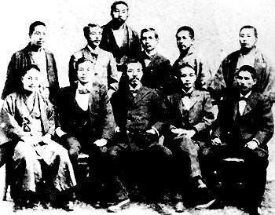

<!-- # ＜天玑＞辛亥革命反思专集（三）：满清的灭亡跟孙中山关系不大（上） -->

**满清的灭亡，根本原因是满清制度腐朽不堪，汉族官僚的独立崛起。直接原因是华中派革命军实行中心开花的革命政策。游离国外的孙中山有推翻满清的志向，但孙所坚持的边地路线不是推翻满清的决定因素。国共两党把推翻满清的功劳算成孙的一人功劳是对广大反清义士的亵渎。**

# 满清的灭亡跟孙中山关系不大

## 文/ 荣欢（安庆师范）

**清末汉族官僚崛起与满清倒台的关系探讨**

晚清政府在镇压太平天国运动中，汉族地方武装起了很大作用。太平天国后剿灭捻军中又用了大量汉族武装。太平天国之后，清朝的地方军权就已经落入到汉人的手里了。因为那时外患太大，欧洲列强都虎视耽耽，再加上慈禧是个有手段的角色，所以汉人也没有推翻满清政权。说实话，兵权已经被汉族掌握，开放国门几十年了。新事物大家见多了。共和深入人心。各省市的督军掌握兵权财权，从东南互保时期满州已经没有了号召力。保路运动是强制国有化。遭到反抗。满清少数管理多数本身就不稳定。最核心的问题，就是兵权已经被汉族掌握。满清已经腐败不堪，制度基本上土崩瓦解，清末满族搞了个皇族内阁，大大激怒了立宪派，倒台只是个时间问题。

自镇压太平军之后，当时中国的国际形势需要一个统一的中央政府作为团结的核心抵御列强。甲午战败之后满清大势一去，汉人被允许向汉本部之外的满清领土移民拓殖。汉人地方官僚积极引导并加紧了对满清领土的控制，建立东三省，为张作霖对东北的开发提供了合法性。筹建西南三省。建立青海省，预备建立西康省，分割藏区，断绝了其独立的条件。

晚清有几大派系：保留清皇室派系：良弼，康有为，梁启超（后转为立宪派）。北洋派系：袁世凯，徐世昌，段祺瑞，冯国璋。立宪派：张謇（民国初年支持袁），汤化龙，谭延闿。革命派：陶成章、黄兴、孙中山、宋教仁等等。地方实力派：张凤翙、阎锡山、刘秉章等等。各大派系力量角逐也动摇了清廷。后来的十五省都督独立，实际上就是不承认满清政府前提下的地方自治，都督就是地方最高行政和军事首脑。很多原来在各自省份里手握兵权的清政府官僚都宣布独立，说好听点是成立革命政府，实际成为了军阀。各省汉人官僚独立标志着满汉两大官绅集团合作三百年正式的决裂，也标志着清廷的正式瓦解。

**革命先行者杨衢云的革命努力**

孙中山也有推翻满清的志向，但所做的努力相比于千千万万革命者那仅仅是大海中的一滴水。孙中山也不是第一批革命者，最早的是兴中会的第一任会长杨衢云等，早就牺牲了。如今的世人大都只知道孙中山而不知道杨衢云，可谓说是一种悲哀。杨衢云是领导广州起义的主力。杨衢云和谢缵泰等才是兴中会的主要领导人。在兴中会组织的三次起义中，孙文只是参与了两次。第一次以杨衢云为首，第二次为孙文和杨衢云一起领导，但实际上日本人扮演很重要的角色，第三次为谢缵泰单独领导。

再说兴中会于1894年在檀香山成立，第一任领导人是刘祥、何宽，他们分别被举为正、副主席。孙仅仅是参与者——后来国共两党无耻的把兴中会的成立都算成孙中山的功劳，这和毛泽东参与了共产党一大，把共产党创立都算成毛泽东的功劳而忽略陈独秀等主导人物一样荒谬。杨衢云、谢缵泰等以“开通民智，讨论时事”为宗旨的辅仁文社，成立香港兴中会。杨衢云素有大志，精通武术，尤好行侠赴义，杨衢云即以颇高名望和思想激进而被举为第一任会长。此为中国革命事业由游说而至实行之起点，兴中会也才名符其实地开展工作。

会后，杨衢云积极准备广州起义，负责招募志士和筹集饷械，事败，漫游越南、新加坡、印度、南非洲各埠，所至之处建立了很多兴中会支部。经杨衢云热烈宣传，会务更形发达。孙中山以1895年广州起义失败为由找到杨衢云，“颇咎杨当日措置失当之非”，“责难备至”（孙中山《有志竟成》），将杨衢云指责了一通，说他作为会长应该对广州起义失败负责。杨衢云内心很自责，但仍是个明白的汉子，深知孙的潜意，所以也没说什么。“遂挈眷移居横滨，以教授英文为生活”而规避孙。 1899年，孙以一派不能有两位会长为理由，说服杨衢云辞去兴中会会长之职，孙文要自己的死党郑士良、毕永年召集10来个来自湖广会党和日本人开会，组织了新的团体兴汉会，孙文当选为该会会长。会后，孙文的骨干告诉了杨衢云，说现在有两个会了，又有了两个会长。杨衢云心里明白，1900年，在一次会议上杨衢云主动提出让孙文继任兴中会会长。这才让孙中山在兴中会里成功排挤了杨衢云。但孙中山兴汉会谋在广州、惠州继续发难，杨衢云仍“自告奋勇归香港大肆活动”。最终1901年杨衢云被暗杀，至于凶手是谁，在这里我就不说了，留给读者一个遐想。

**孙文的名声炒作**

再说孙中山的名声炒作。孙中山刚开始革命时还是一名不文的人。本来到了满清末造，各地豪杰穷极思变，国内开议会、修政治人言汹汹，海外康梁之党势力颇盛，改良声势浩大，要造反的也不乏其人。孙文在澳门无照行医被驱逐出境后，从广州出走海外混迹于海外黑社会中，本是无足轻重的小角色，1896年孙文到伦敦拜码头为清朝外交官绑架，孙文贿赂报童送信给洋人朋友，闹出一出英国政府要求清朝使馆放人的政治风波——这是清朝公然违反英国的法律，触犯英国主权，当然要遭到英政府抗议。此事登上报纸后，孙中山便因缘际会成为了“革命者”。

其实当时孙文哪有什么实力闹革命，兴中会已趋于解散，孙文自己也身无分文——此事被后来国民党当局称为“总理蒙难事件”，孙文通过此件事情出书炒作，有了一定名声。但此时孙文的知名度还不高。1897年，日本政客犬养毅（1932年曾任日本首相）派出的人找到了孙文，并决定资助他的生活及活动。日本政客及后来的日本黑龙会帮孙宣传，使孙中山的知名度进一步增大。孙先后先结识宫崎寅藏、平山周，二人后来成为孙中山的长期支持者；透过宫崎及平山，孙中山再结识日本军政、帮会中人，包括大隈重信、山田良政等人。孙中山心目中热情好客的日本政要主要目的不是要帮孙中山革命，日本拿孙中山当作以后可能卖得出大价钱的“废物”而已。“愿吾兄将彼等（孙中山等人）握住，以备他日之用，但目下不一定即时可用。彼等虽是一批无价值之物，但现在愿以重金购置之。”（《孙中山年谱长编》，156页，陈锡祺编）。孙文的名气这时由日本人宫崎寅藏编写的《三十三年之梦》宣扬后，被章士钊改编神化成大革命家。但殊不知这是日本的另一步棋，二战时期对中国人民犯下滔天暴行的几个臭名昭著的战犯：板垣征四郎、土肥原贤二、广田弘毅都是黑龙会会长头山满的学生，头山满又跟老孙关系好得不得了。就此打住，关于孙中山与日本关系我以后单独再写文章再续，这里不过多着墨。

（前排左起：安永东之助、杨衢云、平山周、末永节、内田良平；后排左起，可儿长一、小山雄太郎、宫崎寅藏、孙中山、清藤幸七郎、大原义刚）

**革命党派中光复会走前阵，抛弃边地政策走中心开花取得革命首胜******

孙中山后来被国共两党神化后，被说成是推翻满清的的英雄，这很荒谬。共产党甚至无耻地把孙中山推翻满清写入宪法。论排满革命意志，他没有光复会同志强。论起革命宣传，陈天华、邹容的《革命军》、《警世钟》更震撼人心。论筹资捐款，在美东与洪门、三合会合作，人美东华侨把血汗钱一股脑捐给他，结果被孙挥霍殆尽。在革命派内部反孙的比比皆是。与光复会合作，徐锡麟首先“不耻文之为人”，陶成章跟他干了不到两年就宣布退出同盟会，后来更被孙系人马一枪打死，至于黄兴、陈炯明等革命弟兄最后都跟孙闹翻了。黎元洪，在武昌起义的时候是镇压的，后来被拉出来做了个“都督”，于是全国各地就独立了，就“都督”了效仿黎元洪。武昌起义那个关键的一天，蒋翊武等人的文学会出力最大，潜入新军内部，从底层官兵起策反，起义后伤亡也最大，孙武、张振武的共进会次之。而武昌起义成功的理念乃是宋教仁注重在新军中坚持运作，中心开花的结果。而对比孙的同盟会除了会喊口号和搞点暗杀之类的，真搞不出像点样的起义。以下就把孙的革命理念回顾一下。

孙中山长期坚持边地政策，运用会党组织下层，搞一次失败一次。武昌起义之前，黄兴按孙的思想在广东省内领导了十次的起义，但回回失败，当时聚集南方的革命党人有些气馁，有些人想把起义转到长江流域，孙中山先生坚决反对，一意孤行要在广东省内进行起义。武昌起义之前，文学社，共进会曾事先咨询过同盟会的意见，想在湖北搞起义，想得到同盟会的支持。但当时同盟会的领导孙中山给出的意见是，在湖北起义的准备工作尚需五年！言外之意是当时的同盟会并不支持。后来武昌起义时的文学社之类和孙中山没有关系，就是所谓中部同盟会和他也没丝毫关系。而且前面说了辛亥革命说穿了其实最终是依靠士绅的政变获取成功的，孙系人马也只有在上海有所成功，其他地区都是华中系革命者和士绅集团共同操作的结果。当然又有朋友要说了，孙文搞得早啊，我前面说过了，最早搞的是杨衢云，其他地方也是各地搞各地的。就在孙系人马的小圈子内，黄兴的山头就比孙文大，只不过孙中山都运用自己的“谋略”（讲得难听点就是阴谋和手段），把人家山头并了而已。他又会吹又能造神，所以搞成了孙中心，但孙中山的政治能力和其过于狭窄的心胸其实是不配做一个政治领导人的，所以搞了不久，就造成两次反孙同盟，被迫逃离搞自己小山头去了。以前都归罪于张继和章太炎如何不好，如何分裂革命组织，事实是这样吗？有很多事情完全就是孙文自己措施不当领导无能造成的结果。同盟会两次倒孙运动后，同盟里面又有多个另立山头的派系，孙只好转战美国丹佛洗盘子。辛亥革命，主要是非同盟会力量发动和响应。南方主要有共进会、文学社、光复会、激进立宪派、反对官员等及其他会党。同盟会在任何一省都没有占主导、后经过杀戮等手段，获得上海、江西、安徽、广东四省市的基本控制权。辛亥革命和孙文有半毛钱的关系？文学社、共进社和孙文都没什么关系，武昌起义，其策划和领导人实际上是由刘揆一、刘道一等领导的原“日知会”成员組成的“文学社”和“共进会”，与孙的

“同盟会”並无直接关系（武昌起义原本订在10月16日，后武昌革命党人怀疑计划泄露，因此提前10月10日发动了起义，是一次偶然的擦枪走火事件引起的）。

武昌事发孙文还在美国打工刷盘子呢，举事完全出其预料之外，这也是随后孙武等人在武昌南京分流后迅速倒向黎元洪的原因。孙大炮在海外吹牛水平高，人们以为他能带来募集来军饷和外国承认而已，所以临时确立临时大总统之职，其实其除了吹牛什么都没有。临时募集的资金实在有限，无法为国内浴血的同志提供什么实际的帮助。各派系马上就把孙中山抛弃了，至于后来的所谓创建共和放弃总统之美名，都是党史御用文人给他加上去的。孙当年可完全不想让位，而是力主北伐统一，由他来做这个美式的大统领。北伐需要军队，军队需要资金，孙中山就联系了两条线，一条是日本，日本答应让革命军借道大连，并提供资金，要求事后以满洲做回礼。一条是德国，德国愿意与孙建交，并提供马克，要求是民国需加入反英同盟。大炮都答应了，但两条线都被宋教仁暗阻，破了大炮的北伐梦。宋系又在国会里暗潮汹涌，因此才有了大炮勉强让位。孙文，他是一向不甘心退出权力的，1912年，孙文表示：“今日革命已经成功，人民却未明革命真理，我辈不能退休”，继续为参与政治找理由。

前面说到辛亥革命也不是同盟会领导的，而是社会各界力量共同推动的。现在来着重说一下，同盟会反孙的派系——光复会的革命努力。同盟会是由三大派组成。即湖南华兴会（黄兴、宋教仁、陈天华等）、广东兴中会（孙中山、胡汉民、汪精卫等）、江浙光复会（陶成章、章炳麟、蔡元培、秋瑾等），同盟会内部思想并不同一，光复会认为孙的路线过于理想化。在推翻清朝统治上，光复会比孙中山更为激进。1910年2月，章太炎、陶成章便从孙大炮的同盟会里分裂出来，公开在东京成立光复会总部，章太炎为会长，陶成章为副会长，李燮和为南部执行员。还将南洋一些同盟会分会改组为光复会分会。1911年7月31日，谭人凤、宋教仁、陈其美等包括苏、浙、皖、闽、湘、川、滇留沪代表在内的29人（一说36人），于上海四川北路集会，正式打出同盟会中部总会的旗号，发表了成立宣言。“宣言明显地流露了对同盟会总部，特别是孙中山的不满情绪，体现了独树一帜的志向。这个中部总会舍弃了“三民主义”只取“二民主义”；改“平均地权”为“平均人权”；抛弃了孙中山的海外路线，脚踏实地坚持本土路线。正是这些中部总会的领军人物，艰苦细致地策划于长江流域，最终取得了辛亥首义以及附义的胜利，且恰是在批判了孙中山并排除其干扰后才取得成果的。 1911年，光复会派出黎天才所部，会同光复会的浙军、沪军、苏军，组成江浙联军，从东、南、北三面向南京清军守军发起进攻，于12月10日攻下南京。革命势力完全控制了长江下游地区。南京光复后，因清帝迟迟不肯退位，光复会决定挥师北伐，武力推翻清朝统治。光复会任命李燮和为北伐军总司令。正当光复军挥师北伐，这时传来南北和议告成的消息，北伐行动遂即中止。光复会应该在革名党内推翻满清中贡献甚大。

所以说辛亥革命的成功，孙是几乎没有功劳，孙自己曾说，“武昌之成功，乃成于意外”；“初不意一击而中也。此殆无心助汉而亡胡者欤？”（孙中山《有志竟成》）。孙自己没有领导，也不承认有别人在组织领导，比如黄兴，比如同盟会中部总会的谭人凤、宋教仁等等。当时立宪党人攻击孙中山是“远距离革命者”，这话有点偏颇，但也不无道理。孙中山在海外游说，也尽了一点力，但远远没有他和他的继承者吹嘘得那么大。那么，后来国民党所宣传的10次武装暴动很容易就能查出，很多是黄兴领导的。后人为了把功劳算在孙中山头上，楞要把其中5次以上统计在孙中山名下，仿佛这样就过半数了。导致满清覆灭的最后一根稻草，是武昌起义。武昌起义之所以能成功，与四川保路运动有关，这个不多说，前面已经提及。武昌起义是偶然的，孙中山事后才知道，所以直接功劳肯定不能算在他头上。汉族地方军官的独立和北洋系的倒戈，基本上宣告了满清的倒台。后来的国共两党枉顾事实，大肆吹捧孙中山。而在孙中山这个革命领袖的领导下，革命取得了什么成绩？就像秦始皇一样统一了中国，还是像刘邦一样开辟了汉朝？要说提出概念性质的民主，若（未来实现）民主就是他的功绩的话，那统一中国就不是秦始皇的功劳，而是第一个提出统一的人的功劳了？照这样说的话，推翻清朝怎么样也不可能是孙中山的功劳，洪秀全、天地会都排他前面。

孙不仅在推翻满清功劳甚小，甚至还起负面作用。宋教仁认为推翻满清的三策：上策京师起义；中策长江起义；下策边疆起义。孙一直搞的都是下策，如果不是宋教仁跑到上海搞中策，就不会有后来的武昌起义，但最终让满清下台的还是京师的袁世凯，推翻满清宋教仁和袁世凯功劳最大，孙排不上号，孙中山是起过义，每次起义每次失败，居然去勾结日本黑社会，还失败，流亡美国去洗碗，看报纸，国内没有孙中山策划的起义就立马成功。

**（未完待续）有关书籍史料：** 1，曹亚伯，《武昌革命真史》 2，陈锡祺，《孙中山年谱长编》 3，茅家琦等，《孙中山评传》 4，杨天石，《寻求历史的谜底》 5，郑曦原，《帝国的回忆：美国人眼中的晚清社会》 6，杨兴安，《杨衢云家传》 7, 谢一彪，《光复会史稿》 8，沈渭滨，《孙中山与辛亥革命》 9，石彦陶，《黄兴传》 10, 黃宇和，《孙逸仙伦敦蒙难真相》

（采编:黄理罡；责编：黄理罡）
