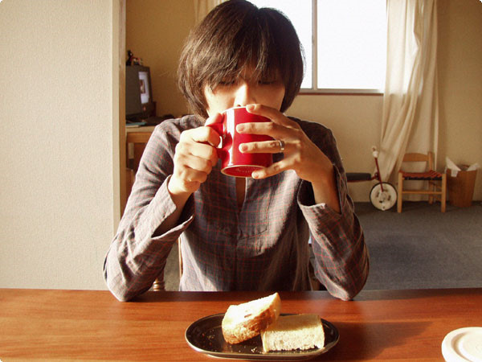
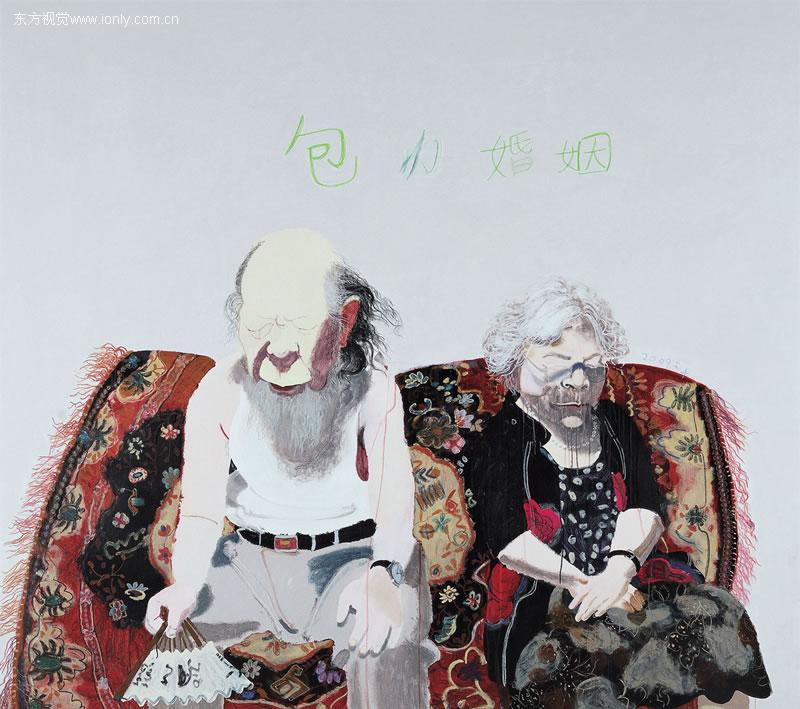
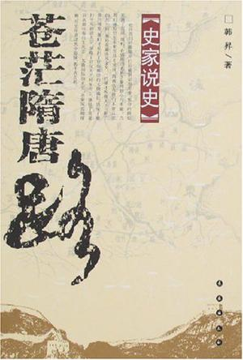

<!-- # ＜天璇＞直到摆脱包办婚姻时，我才开始怀念原配的韵味 -->

**以前跟一个朋友谈起当年找工作时遭遇专业不对口的尴尬与艰辛，她很认真地问到：“你后悔当初进入历史系吗？”我很严肃地回答：“历史学本来就不是我的自愿选择，因此谈不上后悔与否……不过，倘若再有一次重新选择专业的机会，我一定不会选择金融、管理学这种‘有用的’专业，而是选择哲学、历史学、经济学这些‘无用’的学科！**

# 直到摆脱包办婚姻时，我才开始怀念原配的韵味

## 文/ 苏清涛（复旦大学）

**——谨以此篇献给所有对历史学有偏见的人，献给所有刚进入或即将进入历史系的弟弟妹妹。**

从离开学校到现在，几乎每个刚认识我并了解我的教育背景的人都会以无比诧异的口气问道：“我想不通你当初怎么会报考历史系？！”也不知他的所谓“想不通”只是无话找话呢还是真的想不通？但有一点很明显，这些“想不通”的、没文化的外行们几乎总是对我这样一个不幸读了历史学的“倒霉蛋”充满了同情，他们嘴里的“想不通”三个字总是那么的居高临下。

尽管他们很“想不通”我为什么会“选择”历史系，但我却很理解他们为什么“想不通”了－无外乎是学历史工作难找，没钱途呗，倘若我选择了个能赚钱的专业譬如说金融学，那没有人会想不通的。

你想不想得通，那只是你智力水平的问题，而并非我选择的道路有了问题。我选择走什么路，没有必要事先考虑你能否想得通－譬如说我爱上了一个“平胸”的才女，你却要来说三道四认为我不该喜欢她，那我必然要对你灵魂的浅薄表示同情和蔑视了。

无论如何，是历史系的教育塑造了我这颗“自由而无用的灵魂”，我能具备“败絮其外，金玉其中”这种气质，真得感谢历史系的栽培。

不过，事实上，我当年根本就没有选择过历史系，我的高考第一志愿是金融学－不过我考分太低，与金融系门不当户不对，便被“发配到”冷门的历史系了。历史系的大部分同学都不是自己选择进来的，而是和我一样的“贼配军”。大一时，我是极端的没文化，我丝毫没有意识到历史学的价值在哪里，我们班有几个同学的第一志愿就是历史学，我常常偷偷地骂他们“脑子是不是进水了？”

大一时，我和好多同学都认为进入历史系是一种耻辱，面对经济学院、管理学院、法学院那些“高分院系”的同学我总有一种自卑感，惟有面对哲学系这样比我们更加冷门的专业的同学，我才能稍微感觉到一丝丝的尊严。在校外，几乎每个人在得知我是复旦的“高材生”时都会不由自主地竖起大拇指，但接着一问，“历史系的”，人家马上就摇头。

大一时，我班大部分同学的主要奋斗目标就是转专业，甚至有一位原本以第一志愿进入历史系的同学也转走了，理由竟是“为了避免被鄙视”！我们与历史系的关系就好比包办婚姻，转系的目标就好比离婚的愿望。但是，最终成功实现与历史系“离婚”目标的人毕竟是少数，像我这样没离掉的人呢，唯有去羡慕忌妒与祝福人家了。

与历史系“离婚”不成功的同学，又打起了另一主意－“外遇”，即兼修第二学位、第二专业……我连个外遇也没有搞到，但还是不死心，后来便跨专业考研。

大四上学期，也就是在复习备考法律硕士的那段时间里，我逐渐开始喜欢上了历史学。“包办婚姻”曾经给我带来很多痛苦，终于快要摆脱它了，我却突然间意识到原来原配竟是那么有韵味。

以前跟一个朋友谈起当年找工作时遭遇专业不对口的尴尬与艰辛，她很认真地问到：“你后悔当初进入历史系吗？”我很严肃地回答：“历史学本来就不是我的自愿选择，因此谈不上后悔与否……不过，倘若再有一次重新选择专业的机会，我一定不会选择金融、管理学这种‘有用的’专业，而是选择哲学、历史学、经济学这些‘无用’的学科！”她很是纳闷“这又是为什么？”我说：“有用的书－即帮助赚钱谋权的工具类书读起来总是枯燥无味，而‘无用的书’常常充满趣味。我喜欢读经济学，但并不是当做赚钱的工具来读，而是当作人文类书读。”

哲学、历史学这些专业当然无用，但是，这无用中有大用－历史学、哲学素养如何，基本上决定了一个人的精神境界的高低和灵魂的深浅。历史学的素养不能保证你过上富贵的生活，却能保证你过得富足；历史学的素养不能保证你活得有多“体面”，却能让你成为受人尊敬的人——旁人我不说，就说我自己吧，根本就不是赚钱的料，我穷得连电脑都买不起，但我用手机写的博文照样有很多人转载，那么多少女对我一个“落魄才子”（事实上，我只是穷困而已，却从来不曾潦倒）充满了仰慕之情……现在，终于有媒体约稿了，但我依然是用手机写。

有时候我会想，自己与哪个历史人物比较像，当然不是秦皇汉武了，而是苏格拉底和颜回，共同点就是清心寡欲安贫乐道，“可以居无竹，可以食无肉”。我很喜欢孔子评价颜回的话“一箪食，一飘饮，在陋巷。人不堪其忧，回也不改其乐”，这也正是我所追求的一种境界。苏格拉底这种人，能从思想本身获得极大的快乐和满足，这正是我所羡慕的。我觉得，人活得快乐与否，与物质条件关系并不大，最重要的还是精神方面，关键是要有好的心态。我就对车丝毫不感兴趣，你把各种品牌的车放在一起，把Logo拿去，我肯定分不清哪个是哪个了－相反，我很享受于在公交车上发呆的过程。当然，尽管我自己对车毫无兴趣，却还是得努力赚钱给老婆买车－你可以认为女人喜欢名车那是因为虚荣心，但一个男人若真爱一个女人，他就有义务为了满足这个女人的虚荣心而奋斗。

倘若我高考居然“不幸”多考了几分，如愿以偿进入金融系，那我就与历史学这一人文学科无缘了，可能也就没有今天这样的好心态了，也没有一个读者粉丝了。有时我会想象着自己从金融系毕业，进入证券公司或银行工作，尽管有很高的薪水，内在的精神生活却可能贫乏透顶，每天可能只知道哀叹炒股的亏损和房价太高，而灵魂的平庸对我来说简直是一场灾难……每每想到这些，我便为自己高考少考了几分而感到庆幸——这并不是吃不到葡萄才说葡萄酸，按照我的性格，酸葡萄，即便是我能吃到，它仍然是酸的……而只要葡萄是甜的，即使我吃不到，它仍然是甜的而不是酸的；即使大家都认为葡萄是酸的，但只要我认为它是甜的，那它的确就是甜的。

是的，短期来看，学历史对找工作确实没有多大作用。可是，难道大学就是个职业培训所吗？找个好工作就是上大学的唯一目标吗？大学教育、史学教育，带给我们的是一套思维方式，而不是直接有用的知识。

我认识的有些人在知道我是历史系毕业的后，显得很兴奋地说：“我就非常喜欢历史”，说得跟真的似的，但那话套近乎的色彩太明显，你仔细一问才知道，原来他感兴趣的不过是历史剧，尤其是宫厅里的政治斗争和争凤吃醋，充其量是喜欢历史书籍里面的故事而已……历史是由一系列故事构成的，但历史又不仅仅是故事。大学历史系的专业课程设置，除了那些“讲故事”的课，有大量是非故事性课程，如《中国史学史》、《西方史学史》、《史学原典导读》、《史学导论》等等。这些课程，更注重让学生认识到史学的价值，为什么要研究历史、怎样研究历史等等。外行的“历史爱好者”只读到了故事，而专业的历史学人则对故事做更深层次的解读，如果没有史学理论的支撑，那对故事本身的理解很难达到深度。

大学历史与中学历史教育有一个很大的区别，就是对文化艺术史、思想史的重视程度。我们读中学时，到了不同历史时期的文化、艺术、思想状况那些章节，老师通常都略过去了，因为那不是高考的内容——我们的高考主要还是停留在考故事的阶段；而在大学的历史学习中，文化史、思想史的重要性突然被拔高，故事只是骨架，而文化和思想则是灵魂，因此，大学里面好的历史老师都具备哲学家的气质。我自己也是这样，在历史系呆了多年，没有学到多少历史故事，却逐渐被熏陶出了哲学家的气质。

参加工作之后，我常常在周末抽空去光顾苏州图书馆、昆山图书馆，主要看3类书：经济学、哲学、历史学。有次在苏州图书馆读到韩昇老师的《苍茫隋唐路》，既有历史和哲学的深度，又具备文学家的华丽文采，很激动地向一位大学室友推荐—斯人当时正跟着韩老师读研究生呢，然后我们又深入交流了一阵子。在大学期间，我没读过多少历史书，没有认真同同学交流过专业的问题，现在觉得非常遗憾。

现在已经失去那个环境了，却非常怀念它。

我常常想起吴景平老师在指导我们写学年论文的座谈会上提到他自己当年写博士论文（关于宋子文研究的）的时候居然在晚上梦见宋子文了，那场面是多么感人啊------

钱文忠在百家讲坛上成名之后，不少校外的朋友常常问我有没有上过钱文忠的课，这些问题我简直不好意思回答，因为我不但没有听过钱文忠的课，而且根本就不知道钱文忠长什么样子，我是08年还是09年才在电视机荧幕上认识钱文忠的

（我是07年就从复旦历史系毕业的）------我在学校的时候，不但不认识钱文忠（其实钱文忠在复旦历史系并不算是特别牛的教授），而且也不认识历史系那些大名鼎鼎的教授朱维铮、周振鹤、樊树志等等——可见作为历史系的学生，我是多么的差劲啊。

我时常想着，如果重新有一次读大学的机会，我将怎样做？

自然是潜伏在历史系的图书馆中了。阿根廷国家图书馆馆长说：“如果有天堂，天堂一定是图书馆的样子”，我非常同意这句话，我甚至在想，倘若有朝一日我有钱了，即便是不再工作也能保证家人衣食无忧，那我一定会通过行贿的方式在某个图书馆谋一份差事（哪怕我放弃的工作月薪50000而图书馆管理员的月薪只有1500），借机补一补我在历史系欠的债。

（采编：郑慧瑾；责编：陈锴）
