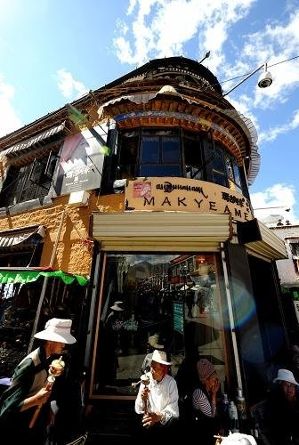
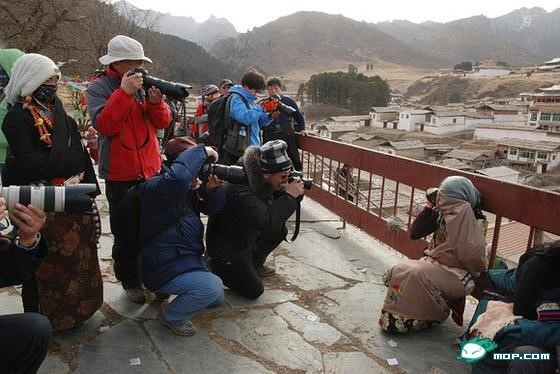

<!-- # 第六期：西藏在何处 -->

从西藏临走时，依依不舍，因为我很怕，下次来，西藏就没了。可是，这个地方永远都在啊，没的是哪里呢？我所害怕没的那个西藏，是西藏吗？其实我还没搞清楚，西藏到底在何处呢。

而我可以确定的是，西藏处在世界屋脊之上，也在历史和文化的建构中获得了一个特殊的位置。追问西藏的问题，就要触及很多更大的问题。从西藏管窥社会，不仅仅能瞥见一斑，还能意外地收获全豹。

### 品味中的西藏

品味，就是指是文化产品选择偏好。在现在这个社会，文化产业的发展实际上是由物质性的商品生产过剩导致的，工业产品的丰裕使生产者转而追求商品的符号意义和文化价值。人们消费商品的目的已经从占有使用价值转向占有符号意义。

去西藏旅行，一直被认为是小资情调和小清新情调的。所谓的小资和小清新，就是一种文化品味，或者说得干脆一点，消费品味。不论小资还是小清新，在刚出现的时候，还是比较“洋气”的一种品味，因为它是被中产阶级创造的。因为小资的虚伪性被不断指责，以及下层阶级开始模仿这一品味，很多中产阶级开始努力撇清与小资或者小清新的符号关系了。但小资和小清新这些符号就是中产阶级品味的典型和衍生，除非他们颠覆整个品味系统，否则任何中产阶级的品味都可以被惯上小资的名义调侃一番。所以当你去西藏旅行，别人调侃说好小资的时候，你没法反驳。

在我去西藏的时候，很为买不买单反而纠结了一番。我其实对摄影没有任何的热情，反而非常厌烦这个事，但是要买单反的原因很简单，去西藏么，总归要带个单反吧。但最终还是没买，因为还是深深厌恶于花几千块买个低端单反用自动档乱拍这种品味的虚伪性。我承认摄影发烧友是深深着迷于摄影乐趣和美的体验，但对很多人来说，只要脖子的带子写着大大的Nikon和Canon，胸前挂的是砖头还是相机，没什么区别。所以理想的西藏行，就是要背着包穿着冲锋衣拿着单反拍拍寺庙和雪山、藏民和牦牛，不要忘了故作认真地听导游错误百出地讲解的藏传佛教知识，在拉萨北京东路上的酒吧和餐馆里流连一番。当然如果是自驾SUV来的那就更完美了。等回去就在博客和校内上传传照片，写写“磕长头的人好虔诚啊”这种日志，实际上也忘了自己背后的寺庙叫什么名字，日喀则在拉萨的什么方向。

二十世纪四十年代美国社会心理学家理斯曼在《孤独的人群》中将占人口大多数的城市中产阶级归为“他人引导”的性格类型。此种性格类型的人对他人尤其是同龄人的观点和行为非常敏感，并以此作为自己行为的指导。他人引导型的人在消费行为中同样注重与自己同年龄、同阶级的人保持一致，消费偏好是为了和同侪团体更好地交流并获得他们的认同。理斯曼从社会心理学的角度为我们提供了理解城市中主流消费群体品味偏好的视角，城市中上阶级的消费品味受大众传媒影响颇深，并把消费当做与同年龄和同阶级的人的交往手段，以获取他人认同和赞赏，保持一致性是这一时期的主流基调。

理斯曼的研究在四十年代的美国还具有相当的前瞻性，他人引导型性格仅是城市中上阶级的特征，而在二十年后的法国，大众消费社会日趋成熟，鲍德里亚在这样的时代背景下认为人和人真实的差异逐渐消失不见了，取而代之的只是存在于商品符号中的区分逻辑和象征差异。人们消费商品目的相同，就是把商品“当做能够突出你的符号，或让你加入视为理想的团体，或参考一个地位更高的团体来摆脱本团体”。按鲍德里亚的看法，消费行为中存在着“区分”和“类同”两种趋势，而这两股力量的博弈最终导致了人和人的类同，也就是说虽然人们消费商品的目的是标榜自己的个性，或是通过商品符号来试图摆脱现有团体晋升更优越的团体，但这种努力起不到实质性的作用，最终还是导致了人们的“类同”。人们正是在同一种区分逻辑下寻求差异。无论人们如何在消费行动中追求差异，都是一种符号的“游戏”。可见鲍德里亚意义上的品味是人们在大众消费时代对个性和差异虚妄的追求。

所以，去西藏的愿望，也就是一种消费动机。这种动机就是人们通过去西藏来彰显自己的的品味，而表示自己与一个团体的类同或者另一个团体的差异。真实的西藏，在这里就被忽略了。虽然，很多人的去西藏的名义，就是看看一个真实的西藏。

鲍德里亚没处理的一个问题就是说明品味和阶级的关系。事实上生活方式和品味是由不同阶层的社会地位有等级地排列和决定的。人们最为平常的行为举止和对生活必需品的选择偏好中就能判断其品味高低和文化修养，继而判断他的阶级地位。也许你会认为一个人因为爱好摄影、户外运动、旅行，所以他才选择了去西藏这个摄影天堂，户外胜地。但实际上只是这些品味共同组成一个符号合集，归同一阶层所有罢了。上层的品味，是会被下层模仿的。所以现在有“穷驴游西藏”。但因为“穷驴游西藏”这种行为因其内涵的冒险性和探索性的特质又有中产阶级进取的精神相符号，反而不被认为是俗气和山寨的，这和穿假名牌又是不一样的。“穷驴游西藏”成了一种特殊的品味，这和青年旅社的品味是一样的。青年旅社虽然便宜，但是住的人不一定没钱。比如很多都是潜在成为中产阶级的学生。

西藏虽然站在世界之巅，但大概确实是被消费社会淹没了。现代社会信奉拜物教，商场就是我们的教堂，消费符号就是我们的十字架和菩萨像。西藏旅行，被很多人称作朝圣之旅，但他们朝的是消费品味这个圣。

但是西藏这个品味，是有其特殊性的。有人敢对去马尔代夫表示不屑，但未免敢对去西藏表示不屑。说明西藏这个符号的文化含义太有力，而这种含义也是其符号性强的原因。也许去西藏的确只是一种追求品味的消费行为吧，但西藏本身仍然是神圣的，这一点在很多人那里，还不容受到批判。这个神圣的西藏，是否就是真实的西藏呢？

### “东方”的西藏

西藏是神圣的，这也是一种符号的逻辑。“洋气”大概是中国人近代化以后最早的一种消费品味了，可以追溯到二十世纪三十年代的上海甚至更早，现在叫“时尚”。而“洋气”也非常直接地表明，中国人的品味，都是跟洋人学的。洋人的东西，就是洋气的，就是有品味的。西藏也是通过先成为了洋人喜欢的东西，才成了中国人觉得洋气的东西。在传统中国文化里，西藏这种地方不通礼教，不尊孔子，蛮夷之地，神圣个屁。可是西方人认为，香格里拉和香巴拉就是胜境，希特勒还曾经派人到西藏寻找雅利安人的起源从而为纳粹寻求支持。西藏，这样一个无论是在农耕时代还是工业社会都很落后的地区，却在西方获得了一个很特殊的地位，这是被西方创造的“东方主义”所建构的。

“萨义德曾以伊斯兰研究为中心分析过欧洲的东方学，他把这种学问视为一种根据东方在欧洲西方经验中的位置而处理、协调东方的方式，在这种方式中，东方成为了欧洲物质文明和文化的内在组成部分，是欧洲自我得以建立的它者。对于欧洲而言，东方既不是欧洲的纯粹虚构或奇想，也不是一种自然的存在，而是一种被人为创造出来的理论和实践体系，蕴含着漫长历史积累下来的物质层面的内容。藏学在东方学中一直占据重要地位，但至今没有得到认真清理。在西方，藏学研究从来不在中国研究的范畴之内，从东方学形成的时代至今都是如此。从这种知识体制本身，也可以看到在西方的想象中，中国与西藏关系的一些模式。这些模式，从根本上说，正像萨义德描述的那样，与其说是一种自然的存在，毋宁说是一种人为创造的体系。”（汪晖，2008）

对西藏的认识，就在东方学的这个框架下，被持续的建构着。最早通过新航路到达西藏的传教士，就认为藏传佛教跟天主教非常相似，并且把西藏描述为神秘但和平的。到了20世纪，反启蒙理性主义的新神秘主义神智论又与西藏结合到一起，把西藏描述成一片未受文明污染的、带着精神性的、神秘主义的、没有饥饿、犯罪和滥饮的、与世隔绝的国度。“现代西方的文化想象、社会心理和政治运动中始终有着神秘主义的极深根源，而西藏在当代西方精神世界中的位置正植根于同一神秘主义的脉络之中。”（汪晖，2008）而到了20世纪，欧洲学者试图从人种学、语言学和考古学等学科出发为西藏的这种神秘形象披上科学的外衣。《消失的地平线》这种大众文学作品，又为西方的民众创造了一个前所未见而又引人遐想的桃花源。到了战后，在工业化的背景下，香格里拉和香巴拉不断被民众记起，西藏正式成了西方人眼中的梦幻世界。

这其实是一种陈述的危机，是非常容易被解构的。西方本着现代性意识对传统社会和原始社会的认识都难免带着理想化和欧洲中心主义的影子。在社会学家假设了传统社会之时，人类学家希望发现一个原始社会，并以此来加深对现代社会的理解。当人类学家发现很难找到“纯粹”的“原始社会”的时候，所以就不得不建构一些概念，比如雷德菲尔德提出了“乡民社会”的概念，用以描述一个仍比较符合现代社会学家预想的传统社会状态。欧洲学者对这些前现代社会形态——很典型的就是宗教——的认识，也有很多虚构的成分。这些概念化的东西，已经成了现今我们很多根深蒂固观念的基础。现代和传统，东方和西方。

我们虽然确实是在东方，但我们的意识是从西方获取的，我们把包括思想观念和消费品味都继承了过来，就跟学着西方人涌到西藏去膜拜这份神圣一样。我们仍然是去把现实的西藏认证我们想象中的那个西藏。西藏是神秘的、是纯洁的，是美丽的，是与世无争的，这些话你就算没到过西藏也会说。而因此，我们又忽略了一个真实的西藏。

而为了迎合消费者的想象和品味，西藏也被塑造成了所谓的西藏的那个样子，但这个样子是不自然的。香格里拉是被创造的，它并没有自然存在过，这不禁令人想问，西藏是否存在过呢？如果存在又在何处呢？

找不到西藏，不是因为西藏不在那里，是因为我们都是路盲。

（责编：王也）
