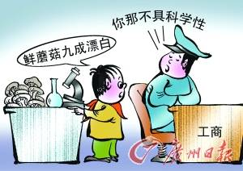
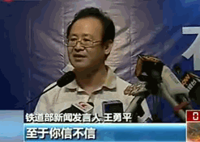

<!-- # ＜摇光＞人无信不立，国无信则衰 -->

**我们开始相信这样的真相：真相不在电视上，不在报纸上，也不在大庭广众之中。它在酒桌上，在双人床上，在窃窃私语之时。当某词被和谐，你知道，它背后就是真相。当某人庄重地肯定某件事，你知道，它的对立面就是真相。当他愤怒地驳斥某件事，你知道，他否认的就是真相。当某件事越挖越深，人们却忽然闭嘴，你知道，挖到的就是真相。**

# 人无信不立 国无信则衰

## 兰天（浙江大学）

08年我初入大学之时，曾十分热衷时政新闻，也曾写过不少文章来讨论政体、讨论公平、讨论自由、讨论民主，那是抱有一颗兼济天下的心去关心我们生活着的这片土地，也正是因为这颗“为了中国的民主与自由，做一份力所能及的贡献”的红心让我选择了现在的专业——法学，后来文章屡次被和谐，人人主页也曾无故被封好几次，所以慢慢不写政治了，转而写爱情、写风景、写文化、写足球、写人生，享受自己的小清新，因为看到的不公越来越多，我们这等屁民的只言片语也不能改变什么，还会给自己带来未知的危险，别人的事关我何事，我又不是矿工、小贩、农民工，作为一个浙大学生，好

好学习，努力奋斗，像大部分校友一样混个有车有房体面光鲜的中产阶级难度也不大，应该不至于成为弱势群体。

可是即使我有一天成为了中产阶级也不会安全，浙大毕业生也会被富二代飙车撞死在斑马线上，副市长的女儿也会被巨富强奸而无处声冤，名律师也会因为政治斗争而身陷囹圄。我们都乘坐在中国社会和谐号高铁列车上，我们都不是看客，我们都是乘客，今日这辆高铁列车正飞速的前进，它已等不及它的灵魂，等不及它的道

德，等不及它的良知，但倘若这列车追尾，13亿中国人无人能够幸免。

我对于这个国家越来越没有信心与信任，不信任这个政府，而且不只我不信，大部分人也不再相信了，动车相撞事件人人上、微博上，大家都在怀疑为什么死亡人数只有官方报道的那么一些？动车实名制了，为何不公开所有乘客信息，多少人无伤，多少人受伤，多少人确定死亡，多少人失踪不是一目了然吗？为何要就地掩埋车体，里面真的没有幸存者了吗？就算没有幸存者，那些乘客的尸体、财物就能被轻易抛弃吗？如今，怀疑和警惕已经成为中国人的生活方式，我们已经不再相信政府的话，老百姓，成了“老不信”，

可这能怪我们吗？权威的《新闻联播》称，我国自主研发的自动闭塞系统可防止动车追尾，可是今天证明动车就这么撞了。动车相撞之前，铁道部称我们拥有高铁的自主开发技术，可事故发生以后又称高铁是中日共同技术。早上官方称已无生命体征开始切割掩埋车体，可是下午却发现了幸存者。实在无法自圆其说之后来一句自欺欺人的“至于你信不信，反正我信”更是尽显无奈与无赖……

北京一名11岁的小学生去年在老师帮助下做了一个简单的食品安全测试，发现他随机选择的14种鲜蘑中有13种经过漂白处理。而北京市政府食品安全办公室进行的调查称，北京市场上销售的蘑菇97%未检出漂白剂，可以安全食用。一个是小学生的随机调查，一个是政府部门的“权威发布”，你该相信谁？对1100多人进行的网络调查显示，绝大部分人相信小学生的检测结果，只有8个人说他们对政府部门的检测有信心。

大家都知道狼来了这个故事吧，一个撒谎者一次的谎言可以骗过我们，两次的谎言可以骗过我们，但是第三次，即使是真相也难以让人信服。政府失去公信力，在民间的谣言与政府的谎言之间，我们更愿意去相信谣言。

浙江乐清村民钱云会被重型卡车压死一案，乐清警方第一时间发布微博澄清案情，但数万条跟帖绝大部分都抨击警方撒谎，人们不相信钱运会之死的背后没有打击报复。同样，在有媒体爆出八成火锅为“化学锅底”后，中国烹饪协会立即辟谣，但网民并不买账，并“人肉”出协会相关部门主要负责人乃某知名火锅企业老板的身份。郭美美炫富，中国红十字会澄清与其无关系，但网民开始全民大人肉，各种消息遍地，但没有人去相信红会，大部分都决定不再向红十字会捐助一分一厘，红十字会微博称向温州动车受害者拨款30万，而网友群体留言“亲，留给郭美美买LV。”

令人匪夷所思的事情每天都在发生。住，我们有楼倒倒楼脆脆楼歪歪楼薄薄；吃，我们得小心假烟、假酒、假鸡蛋、假牛奶、地沟油、人造脂肪、美容而成的大米、药水泡大的豆芽、避孕药喂肥的王八、洗衣粉炸出的油条；出门，我们要提防推销的碰瓷的钓鱼执法的；上医院，我们担心假药、无照行医、被过度治疗。此外，我们

还要面对假票、假证、假中奖、银行诈骗、假老虎、假新闻等等。鲁迅说过：“我们都不太有记性。这也难怪，人生苦痛的事太多了，尤其是在中国。记性好的，大概都被厚重的苦痛压死了；只有记性坏的，适者生存，还能欣然活着。”怪事多发，就见怪不怪了。我们是能屈能伸知足常乐的民族，吃饱肚子就一团和气。慢慢就忘了什么是真理、什么是道德、什么是诚信。

今天，这种“不相信”的情绪，已然渗透进多数中国人的生活方方面面：吃饭不相信食品的安全，出行不相信交通部门保持交通通畅的能力，上医院不相信医生有没有认真治疗，打官司不相信司法能够保持独立公正……

曾经电视、报纸这些传统媒体是权威消息的发布器，我们没有其他消息来源，只有相信官媒，政府说什么就是什么，党中央的话就是真理，政府下达命令封锁消息，我们就什么都不知道。而今日中国人大部分已不再相信官媒，而且我们80、90，这些年轻人还有几人看新闻联播、人民日报这些官媒，我们更多的是通过微博、人人这些人口相传的网络工具来获取消息，我们信任的是“无图无王道”，我们要独立的判断，而不是官媒化妆过的文字。我们憎恶黑暗却又无往不在黑暗中，我们渴望自由却无往不在枷锁中，但青年一代已经不像当年那样轻易被官媒轻易糊弄了。

我们活在两个世界。现实中，我们不相信一切陌生人。我们明哲保身，安安稳稳做沉默的大多数；家家都安防盗门，低层住户都装防盗网；我们不敢让小孩自己上下学，学校门口有警察维持治安；我们对陌生人充满警惕，人口普查遭遇入户难。虚拟世界里，网络是那件神奇的衣服，把大家全变成了蜘蛛侠。现实到了网络就完全

调了个儿：发言者陷入沉默，沉默者开始发言；权贵默默退后，草民成了主角。

面对如此世态炎凉只能茫然自问：我们究竟该相信谁？

于是我们开始相信这样的真相：真相不在电视上，不在报纸上，也不在大庭广众之中。它在酒桌上，在双人床上，在窃窃私语之时。当某词被和谐，你知道，它背后就是真相。当某人庄重地肯定某件事，你知道，它的对立面就是真相。当他愤怒地驳斥某件事，你知道，他否认的就是真相。当某件事越挖越深，人们却忽然闭嘴，你知道，挖到的就是真相。

所以，一些人说，现在的人很虚伪。这种虚伪甚至渗入我们的教育。百度百科有个词条“伪文章”，指的是不惜通过虚构事实表现真善美的小品文。其煽情和编造手段之虚假严重到令人发指的地步，代表作就是入选小学语文教材的《一面五星红旗》。给儿童爱国主义教育没问题，关键在于以什么方式进行这种教育。当“伪文章”充斥教科书，虚伪就不仅变得可以接受，而且成了准则。

从某种角度，许多人的虚伪不是虚伪，而是“务实”，是我们多少年来在理论与实际、语言与行动、书本与生活、理想与现状的巨大反差中总结出来的“智慧”和生存之道。比如，我们从小被教育拾金不昧，然而当我们把钱包还给失主，却以盗窃罪罪名被起诉。我们乐于助人，在路上搭上肚子痛的陌生人，却遭遇了钓鱼执法，被罚两万。后来我们学乖了，看到老人当街摔倒我们不扶，因为有“彭宇们”的前车之鉴。这不等于说满大街的老年人都准备讹人吗？相反，绝大多数人可能都是善良的。但疑虑是一种心魔，一旦迅速传播便很难治愈。

对陌生人的不信任只是当前“不信任文化”最末端的表现。新加坡国立大学教授郑永年在《不信任砌成中国墙》一文中说，中国没有“柏林墙”，但由高强度的“不信任”砌成的“柏林墙”却存在于社会各个阶层之间，在政府和人民之间，在穷人和富人之间……民法讲诚信是民事活动的基本原则，信任是人与人交往合作的基础。无论夫妻关系还是官民关系，没有信任就只剩下彼此哄骗，自欺欺人。像那个段子形容的：官员们哄百姓开心做做秀，下级哄上级开心做做假，丈夫哄老婆开心做做饭，自己哄自己开心做做梦……哄来哄去的结果就是鲁迅说的比真的做戏还要坏的“普遍的做戏”，也是严复所说的“华风之弊，八字尽之。始作于伪，终于无耻”。

周国平的一个演讲《中国人缺少什么》，认为中国人缺少的不是物质文明，而是精神文明，即真正的灵魂生活和广义的宗教精神，所以没有敬畏之心，没有自律。上帝、马克思、老天爷和十八层地狱都既不能让我们敬，也不能让我们怕。反右、大跃进和文革更是让许多人都学会了说谎，而且把谎言上升到“爱国”的高度。从那时起，中国的游戏规则就是不要规则，不懂这个道理的就是阿甘，或者唐吉诃德，只能等着被淘汰。

但历史告诉我们，判断事物的标准往往并不在当下。检验真理的标准是实践，更是时间。违背常识与规律的情况无论多么普遍多么强大都不可能长久。今天的什么都不信和几十年前的盲信是一枚硬币的正反面。信任不是单纯的道德问题，而关系到一个社会一个国家的生死存亡。

普遍的强大的疑虑、怀疑已经成为当今社会的“精神疾病”。假的我们不信，真的我们也不信。我们已分不清真假，我们陷入迷惘：除了自己，到底我们还能相信谁？史里斯·博克说，“信任是我们必须保护的东西，因为它就像空气和水源一样，一旦受损，我们所居住的社会就会土崩瓦解。”有人说，幸福感源自相信。而当怀疑一切成为整个人群的集体意识，中国人与幸福的距离又该有多远？孔子说，民无信则不立。当一个政府失去信用之时，离被百姓抛弃之日还有多远？

**（采编：安镜轩；责编：黄理罡）**
