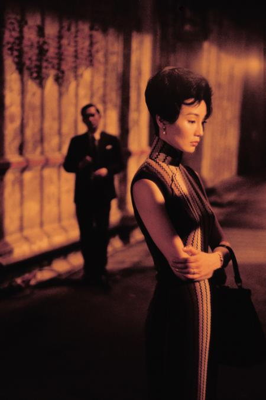

<!-- # ＜玉衡＞《花样年华》的古典爱情 -->

**我喜欢那个年代的那种美。的确每个年代都有每个年代的特色，我们这代人的特色就是奔放，所以春天满大街都是黑丝袜，夏天满大街都是大白腿，不是说这不是一种美，但就是缺少了古典的那种神韵，缺少了那种妩媚，缺少了东方特色……真希望哪天潮流能穿越回二三十年代那种女人都要穿上旗袍的时代。**

# 《花样年华》的古典爱情

## 文/ 雨欣（辽宁大学）

最近突然特别想看王家卫的电影。这个想法缘起于《花样年华》，好多年前就想看这部电影，这几天还是抽时间把它看完了，看的有些心酸。

我喜欢这里面的爱情，虽然主人公最终都没有走到一起，但是他们之间的爱情是一种含蓄的，富有责任感的，我尤其喜欢那种两个人虽然没能走到一起，但都在彼此内心最深处深埋那份感情的那一份深情。

虽然是2000年的电影，但演得是60年代的事情，那个年代的香港，虽然没有内地那么乱，但是也是有一种传统的价值观，传统的价值观，婚姻观，爱情观还是或多或少都有体现的。看起来无论在怎样一个年代，无论有怎样的主流价值观，出轨似乎都是一个永恒的话题。梁朝伟和张曼玉虽然是邻居，但是他们的相识是在他俩的爱人私奔之后。也因此，两个寂寞的邻居相识，相知，最后相爱，唯独遗憾的是他们最终也没能走到一起。虽然遗憾，但这是我最欣赏的地方，责任，理智战胜了爱情。

说到爱情，一多半的电影就一定要跟床戏挂钩，即使遮遮掩掩但是还总是能让人浮想联翩。而本片中至始至终都没有这种戏。不知道是导演刻意的回避，还是不愿意用床戏玷污了男女主人公的爱情。我宁愿理解为后一种。我认为归根结底他们心中还多少有一种责任，是身为人夫身为人妇的责任，不然张曼玉不会在梁朝伟第一次拉手时断然拒绝，不然梁朝伟不会看着性感优雅的张曼玉躺在他的床上还能在椅子上坐一夜，不然他们不会不去私奔……

我觉得要是这个戏码要是挪到现代，就不会有优雅的张曼玉和帅气的梁朝伟一次次的擦身而过，取而代之的就是搭讪，傍款,再光明正大的透露了各自爱人私奔的信息，把自己伪装成无辜受害者形象，再光明正大的e-mail一封离婚申请书，最后再平分房产，最终一起私奔到新加坡，或许再后来再重新上演喜新厌旧的戏码……或许小三，出轨纵然可耻，但是也不必将自己非得打扮成一个无辜受害者形象，骂街，哭打乱闹。

从小到大我一直喜欢张曼玉和梁朝伟这两位“老人”。之所以称他们为“老人”，因为他们出道时，我可能连受精卵都不是，或许那时我爸还不认识我妈。但90年代是香港电影最繁荣的时期，我也就是看着周润发，梁朝伟，张曼玉，刘德华，张国荣，梅艳芳等这一代老人的电影长大的。

我喜欢梁朝伟演绎出的那忧郁的眼神，内敛的性格，当你与电视里的他四目相对时，总有一种被电流电到的浑身酥麻感。我也喜欢张曼玉那迷人的眼睛，曼妙的身材，优雅的气质，甜美的笑容。我同样期待自己就算到四十岁依然可以那样迷人优雅。

喜欢影片中的那种六十年代老上海，老香港的感觉。喜欢张曼玉那一身身的古典旗袍。那是属于那个年代的一种美，那种美不是靠浓妆艳抹，不是涂了多厚的粉底，不是花了多少烟熏，而是属于女人本身的一种自然美。曼妙的身姿，配上红唇，剪裁得体的旗袍，那是属于东方女人特有的一种美。那也是一种气场，那种气场不用说话，只是一个缓慢的动作，一个忧伤的眼神，足以摄人心魂。

我喜欢那个年代的那种美。的确每个年代都有每个年代的特色，我们这代人的特色就是奔放，所以春天满大街都是黑丝袜，夏天满大街都是大白腿，不是说这不是一种美，但就是缺少了古典的那种神韵，缺少了那种妩媚，缺少了东方特色……真希望哪天潮流能穿越回二三十年代那种女人都要穿上旗袍的时代。

我也很喜欢电影中的音乐，虽然只有这么一个，而且一直在重复那一段，就是开头时每当张曼玉出场，总是那段四三拍的《花样年华》。我总对四三拍的音乐怀有特别的好感，四三拍才能带出那种妩媚，四三拍才是一种优雅。

总有人说我这个人活的比较旧，或许吧，我就喜欢二三十年代那种中式旗袍，如果再配上忧郁眼神哪怕再轻轻点动着一只烟，我都觉得那是一幅绝佳的图画。我就喜欢这样的妩媚，而花样年华有我喜欢的全部元素。

附：本文原名“花样年华”，经作者同意改为“《花样年华》的古典爱情”

（采编自投稿邮箱；责编：陈锴）
