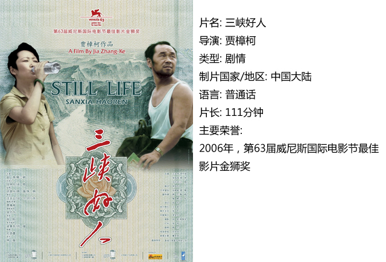
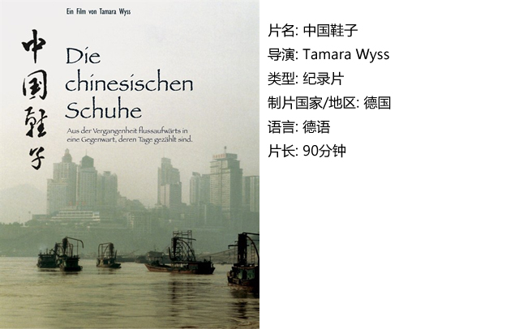
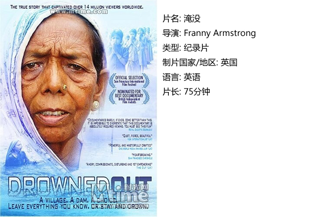

<!-- # ＜独立影像＞第七期：三峡，我们的家园 -->

**我们看到的移民脸谱是模糊的、麻木的、懦弱的、沉默的；相对的，我们的邻国印度，在这之前就遇到了和我们相同的境遇，他们团结，他们抗争，他们呐喊。在他们的脸上我看到了对家园、对土地、对自然的热爱。**

# <独立影像>第七期：三峡，我们的家园

## 影评人 / 堇芯（DNEY独立撰稿人）

三峡移民为非自愿性移民，回看过去，在一百多万的数字中，站立着的正是一个个活生生的人，一个个立场各异、素质参差、认识有别的人民。但是在中国，无论是移民自身，还是社会公民，都没有发出足够强的声音。我们看到的移民脸谱是模糊的、麻木的、懦弱的、沉默的；相对的，我们的邻国印度，在这之前就遇到了和我们相同的境遇，他们团结，他们抗争，他们呐喊。在他们的脸上我看到了对家园、对土地、对自然的热爱。或许在我们的印象中印度是一个落后于我们的国家，但我想这仅止于经济领域。在政治上，在精神的坚守上，他们是进步的，他们敢于发出声音，而且他们的声音不会被淹没。

美国总统杰斐逊曾说过：“使自由保持活力是冲突而不是绝对的一致。在一个自由的国家里总会有各种相冲突的思想，而这正是力量的源泉。”一个有自由、有冲突、有声音的国家，才能生根成长茁壮。

### 一、三峡好人

影片一开始，贾樟柯就以一个悠长而又富有动态与生命力的镜头娓娓将我们带进一个真实的“底层流民中国”。他们背井离乡，他们流离失所，他们命贱如草，他们自娱自乐，然后自生自灭。不得不说这是一部根植于生活的影片，片中两个山西人来到拆迁移民中的三峡寻找他们各自失去联系多年的伴，而导演则以一个旁观者的身份，用他的镜头客观地向我们陈述了在奉节这块土地上生长的人民，他们的住宅在被强制拆除，他们有的或蜷缩在“垃圾袋”里，有的或住在桥洞改造而成的房子里，更多的人则远离家乡。

其实我们都是“三峡好人”，谁说大学生就不是“三峡好人”，谁说白领就不是“三峡好人”，谁说精英就不是“三峡好人”？一个房改就可以把你的钱包掏空，一个教改就可以把你的父母逼疯，一个医改就可以提前给你送终。

影片中充斥着一种离奇荒诞的氛围。腾空而起的奇怪雕塑、轰然倒下的高大建筑、飞过天际的UFO、地上那些被动地接受着悲欢离合的男人女人老人孩子。这是一部兼具轻灵与厚重的美妙影片，每一处都是导演精心布的局，透着一股发人深省的味道。

### 二、沿江而上

这也是一部描绘三峡移民的纪录片，其实也不能算完整意义上的纪录片，因为整部影片充斥着大量的采访和导演自述，客观来讲是一部纪实片。

而与《三峡好人》的“小资”相比，这部影片又真实得可怕，它展现了文化的冲突，以及中国经济奇迹之中一段被故意抹去的历史。

本片用了接近四年的时间来记录两个家庭背景不同，却同样出生在长江上游的年轻人在三峡工程大背景下的生活变化。16岁的女孩余水，由于生活压力所迫来到游船上当一名服务员，19岁的男孩陈波宇则自尊自大，有着年轻人的锐气和个性，想要赚更多的钱。

整部影片都弥漫着一种无力感，对于底层生活的无力感，对于现状的无力感，对于未来的无力感，有谁注意到了经济腾飞背后的阴暗？有谁正视了这些普通老百姓？又是谁只是光喊口号而不付诸行动？片中那个哭着说出“做人难，做中国的老百姓更难，真的是太难了”的小老板给我们指明了现实，这就是我们必须直面却无法改变的现实。

### 三、中国鞋子

机缘，或是宿命，当导演带着祖母留下的“三寸金莲”，逆流而上，凭着百年前祖父母的日记和相册，寻找他们1911年时留下的足迹。一切，早已经物是人非，强制拆迁下的中国，就像新近耸起的钢筋水泥土，发展迅速，浮躁不安。

导演沿江而上，叙述着百年前的三峡，与现在正在搬迁的三峡移民和颓败的即将遗弃的城市交叉出现，似乎真实中透着虚幻。每个采访对象都在叙述着他们的过去，属于历史的一部分，城市改变了，不在了，但是生活着的人们不会忘记。

阶级，耄耋之年的老太太口齿不清，喃喃中“阶级”二字却分明。

改土归流，赵尔丰。赵尔丰即是那个被砍头的总督。

成都，人民广场，以前是皇宫的建筑，在文革当中变成了毛主席的塑像……

不过说到底，这也只是一个德国人寻根途中的所见所闻罢了，也只是让我们通过一个德国人所拍摄的照片，了解百年前的三峡风情。

### 四、淹没

这是关于印度的一条河流和大坝移民的故事，它和中国的长江与三峡移民是如此的相似。有时我甚至会觉得这是上天给予它们共同的苦难考验。但是三峡移民是麻木的，沉默的，模糊不清的。而印度移民每个人的脸都是清醒的，生动的，有表情的，他们敢于为自己的权益去抗争。其实每个移民要求的都不多，温饱而已，可是政府给了他们承诺，却没有实现。

这是一个敢于发出声音的民族，伊哈亚和几个农民鼓起勇气去找事务官，印度最受欢迎的作家领导人民走上街头，环保活动家阿兰达蒂•罗伊组织人民进行非暴力不合作斗争，都是如此清澈、明晰、有力的声音。而中国人却没有像印度人那样去问个为什么，也没有像印度人一样去争取更多的权利，这是何等的悲哀。

### 【如何下载】~@_@?~

**请加入独立影像流动分享群，在群共享中下载本期所推荐的独立电影！**

**流动群群号：94075202 ****入群请注意以下几点哦：**

1.流动群专供北斗读者下载本栏目所推荐的资源，验证身份时请注明“北斗读者”。

2.当期资源自发布后14天内可以下载，到期后工作人员将手动删除以上传后续资源，请注意时间。

3.此群采取流动制，群满员时，完成下载后请自动退群，以便他人入群下载。（但是请注意：只有当群满员时才需要各位流动，现在则无需退群，需要大家流动时会另行通知。）

**DNEY****新人群群号：152511792**

注：DNEY新人群为DNEY独立影像官方交流群，非流动制。DNEY同时为流动群和新人群提供资源，但新人群资源并不一定与本栏目同步。

关于**独立电影**和**DNEY**请参见[<独立影像>第一期：初识独立影像（上）](/?p=11506)，其中的**广告**也要记得看哦！

（采编：黄希敏；责编：黄希敏）
