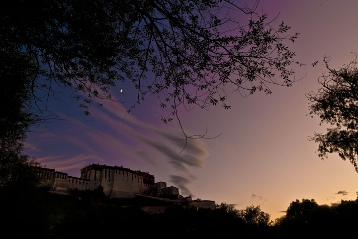
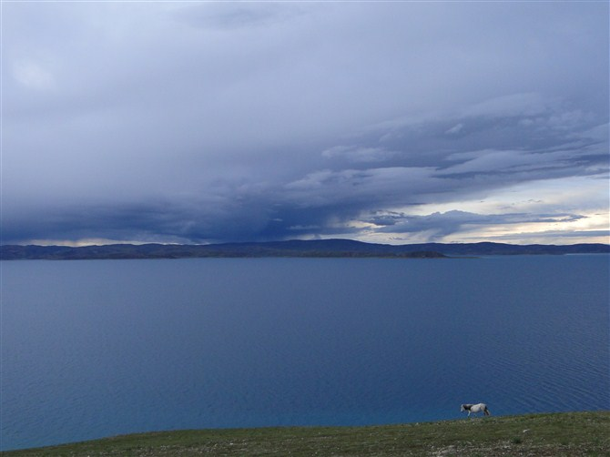
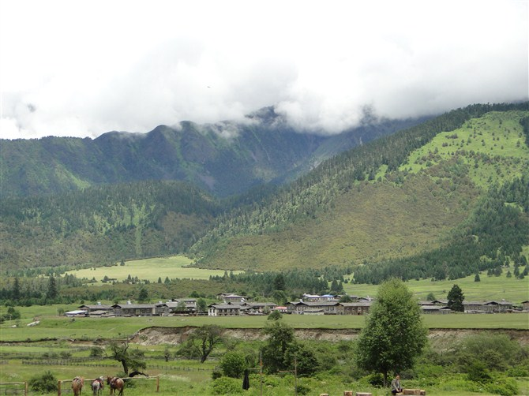

<!-- # ＜天权＞离开巴别塔 -->

**我了解这些人，他们进藏的背景也许比他们进藏的方式还要丰富。反抗、改变、寻找、迷惘、历练，究其本质，都是为了逃离。我看见年青人，这些天生的异见者，有一天，在荒诞腐烂的生活中清醒，为了理想和生命的真谛，起身离开，离开那离出生不远的也许还将在此死亡的地方。**

# 离开巴别塔

## 文/宋训青（上海电机学院）

1999年夏天的一个晚上，我独自骑着三轮车在北京某处四合院大门前的公路上行驶，在我骑上它之前，它已经在门口靠墙的角落下呆了一整天，大概是用来拉货的，虽然我从没有见过。蓝色的车皮已经凋落，露出褐色斑驳的内里，拉起车刹时还会发出刺耳的声音。闲暇的时候，我妈妈、或几个我并不熟识阿姨会带着我去买菜，如果兴致来了，还会去逛灯火繁闹的夜市。向西直行一会儿，会看到一条铁路，我把车停下放在路边，闭起眼睛面对着列车疾驰而过。脑海里一片空白。

多年以后，关于这个日渐被我熟识的世界，和深植于这个世界的荣誉、平庸和绝望，都有机地嵌在了我的脑海，像自然界排列的原子，这些都令我感到了腻烦。此时，我身处于十几节移动铁皮箱中的一节，和这庞然大物一样都下定决心，开向我不抱希望却渴望知道的另一个世界。

7月12日，19：30，我在拉萨。

事实是，就在几个小时前，我曾搭乘着这18节火车厢中的一节，蜿蜒进藏；也就在几分钟前，我和巴桑拉姆擦身而过却未曾道别。正如你饮一杯烈酒，这一系列的光影转换，在滑入愁肠之前，于喉咽处打个回旋，你瞪圆双眼，惊诧得叫不出声。我第一次见到巴桑拉姆的印象清晰，当时她斜坐座位上，大声和同伴开着玩笑。你一定会注意到她的笑，古灵精怪的表情，发出无所顾忌、放肆的声音，笑起来仿佛整个世界也没有忧愁。通过她的解释，我们知道“巴桑拉姆”在藏文中的意思是：星期五的女神，于是我们一行便请她取了藏名，有次仁，扎西，我叫罗布。这个快乐的女孩并没有陪我们走得更久，因为我们互相都没有留下联系方式。

从火车上下来，我因为感冒和困乏，已经感到一些晕眩，车站的地砖如风掠过水面起伏不平。等走出站外，看到乌云压得很低，笼在暗蓝色的莽山上，清风拂过带来的凉意令人清醒，而这种享受足以让人忘记大雨将至，而善后安排确实到位，我们在大雨倾泻之前坐上了车。半个小时后，车开到了一户藏民家里，给我们住的房有5个床铺，四人一行算是宽敞。这时我已太过疲乏，便找个床胡乱躺下，他们都出去吃晚饭，熄了灯，室内光线昏暗，只有天空映下的深蓝色的光，我斜躺在床上，紧蜷着被子，看着雨打在花草上，然后“啪嗒”“啪嗒”地滴落，忽然无比清醒又意识恍惚，我确乎去了另一个世界，这个世界还是伴晚。这个世界还是春天。这个世界叫做拉萨。

最初的几天，我们各自都有些不适，腹泻、头痛、发烧，这些不适的感觉似乎是识趣的，它们像拉萨的雨一样，每天定时发生，在闲下来休息的时候袭来，然而在疲倦的裹挟下，让关于这段难过时光的记忆又变得模糊不清。正如罗斯福所说的“我们唯一值得恐惧的就是恐惧本身。”难以度过的时光因为注意力的集中而变得愈发艰难，却在无意识的调侃下轻松滑过。除了以上那些糟糕的小事，剩下的便是欢乐和行走了。我们几乎每刻都在行走，从行居之所到布达拉宫，从北京路到八角街。行走也是快乐的，小城的风情只有用脚步细致观赏。

休整后的第一天我们转到了布宫的后山，这座庄严神圣的宫殿后面有像老北京市口一样热闹的藏式甜茶馆，也有如江南园林内一般恬静的池塘和树木，从桥上走过，看到前面亭子中藏民在跳舞，或者三三两两坐在长凳上聊天，有的什么也不干，双手合着搭在腿上，眼睛直直地看着虚空。行走的人，则大多会带着佛珠，不断地顺时针转着转经筒。绝大多数藏民一生只有一种信仰，与汉族人功利主义的信仰不同，这种信仰不是依赖不断膨胀的欲望而生，而是简单、纯粹、自然、虔诚的，所以正好相反，这种信仰带给他们相对简单的生活方式，对于佛家而言，“色”即世界的一切有形之物，当俗世间的繁文缛节和喧嚣在个人身上逐渐减少之时，也就是接近佛的开始。我观察到那些手持转经筒的藏民，那种俗世浅薄的快乐在他们身上早已隐匿不见，或者说很少存在，流露出的则是一种安宁和满足。

在春风盈盈的拉萨城内，步行几乎是最好的游览方式，如果走累了，出租车或人力车也很便宜。拉萨的出租车统一是金杯旗下的中华轿车，这在内陆持续亏损的一款轿车在拉萨居然如此盛行，大概也有其独特的原因。在政治敏感的区域，意识形态的植入变得容易理解。这样一来，包去林芝的车只能找到金杯商务也无可厚非，经过几天的休整和人文宗教气氛的熏陶，再去以自然风光著称的林芝就让人满心期待。在两旁连绵的山脉中间，318国道顺着雅鲁藏布江的流向向南蜿蜒延伸，绕过高山和村庄，平原上的山，像女人秀气的手臂，温柔地横放，这里的山则完全不同，它们如精壮男人拱起的手掌，手指插进大地，仿佛一没抓住便要掉下去似的，青筋暴出。在米拉山口上，有一队骑行车队正在修整，我们把车停在旁边，这里有两座巨大的铜牛，顺着它们视线看去是远山、河流、农庄和野牛。到处可见被固定在绳索上的经幡，这种在藏文中被称为“风马”的物事寄托着人的祈愿，在高山和峡谷中飘扬。骑行者们摘下了头盔，有意蓄起的胡须如今看起来卓有成效，他们大声筹划着到拉萨的事宜，然后大声地笑。E说，他们都是追逐理想的人。

树木直直地插进山体，树上的枝干相互间像永不交叉的平行线，斜斜地插在主干上，枝干相互依赖又相互逃离，冷漠如多年的恋人，凯鲁亚克说，“爱情真像一场决斗，让我们再彼此深深地看上一眼”，大概便是这样的景象。在林芝的第二天，我们出发去鲁朗林海，车围绕着山开了上去，在山腰的公路旁停车，从围栏内向下附望，郁郁葱葱的丛林映出绿光，茂盛生长的林木在另一座山的阳面投下了一大片阴影，在山影的边缘，山谷间露出几点红色，那是农民房屋的墙体的颜色，阳光从棉花般的云雾间照下来，照在农庄上更添祥和。山脚下，行过的公路像条觅食的大蛇，扭曲地向山中游走。车到达山顶的时候，天下起了小雨，在一片空地上，几个藏民蓬着头发，拎着白色的塑料袋走了过来，到跟前打开，里面是黑色细条状的物事，通过介绍，才知道是虫草，这些被泥土包裹着的虫草显然是刚才采下不久。据说，虫草要上海拔四千米的高山上采，通常一去大半个月，危险而艰苦，汉族没有人去做。我买了四根。

约翰·厄普代克在《兔子，跑吧》里有过这样一段描述：“临近半夜时，兔子感到一阵睡意，便把车停在一家路边咖啡馆旁，进去喝杯咖啡。他觉得自己似乎跟其他顾客有些不同，尽管他也说不清区别何在。那些人也有同感，都冷眼打量着他，那一双双眼睛就像钉在那些年轻人的白脸上的金属大头钉。”作为一个旅行者，我大部分逗留在拉萨的时间都是在一个叫风马飞扬的青年旅社里度过的。黄昏的时候，我会坐在靠墙的长椅上休息，听来往的人说说笑笑，或做着自己的事情，又或者在三楼的空地上打台球，这是我喜欢的。我住的房间是按床位计算，因而男女混寝。晚上，他们会从外面买来酒和西瓜，开起酒会来，这样的酒会在我所就读的学校也常能见到，却又很不一样。一个小个子留着短发的女生，她一手握着酒瓶，一手夹着香烟，热情地和所有人说着话，她告诉我们她出国考试考了不错的分数，足够上一所很好的大学。“我当时只想去美国，而美国又只想去哈佛、耶鲁、加州大学伯克利分校，后来上不了，然后就没上了。”这个自学哈佛天体物理的女生于是成为了人力资源部经理，当然后来辞了职，我毫不怀疑她所说的话并不无惋惜，这从其他人的脸部表情中也同样可以得出推断。他们都是曾意识到自己不同于其他人的人。

我了解这些人，他们进藏的背景也许比他们进藏的方式还要丰富。反抗、改变、寻找、迷惘、历练，究其本质，都是为了逃离。我看见年青人，这些天生的异见者，有一天，在荒诞腐烂的生活中清醒，为了理想和生命的真谛，起身离开，离开那离出生不远的也许还将在此死亡的地方。“Society，you're a crazy breed，I hope you're not lonely without me（碌碌俗世，光怪陆离。没有我的存在，希望你不会寂寞）。”那些优秀的年轻人，是生活的英勇的叛逃者。

在去往纳木错湖的路上，因为开车的是一位藏族师傅，于是我们拜访几位藏族人，他们灿烂的笑容令我印象深刻，没有勉强，也不流于肤浅，仿佛是从心灵深处唱出歌，折荡在草原上的回音。这令我想到了巴桑拉姆，想起了林芝回程途中那两个手戴木屐朝圣的人。比起那些反抗的年轻人，他们则幸运许多，不需要逃离和寻找，就住在蓝天下，白云中，绿草上，住在自己心里。没有崇高的名誉、万贯的金钱，人也可以这么容易满足，就像蝼蚁，像白云，像南美洲森林里一片叶子一样有自己的快乐。

我们爬到了纳木错湖旁边的一座小山上，由于拍摄落日的缘故，我延误了很长时间，等结束后，与我同行朋友已经在山脚下，山势陡峭，又是流沙碎石，光线渐渐暗下来，下山的路越来越险，山脚的人依然微小如蝼蚁，于是害怕和担心的心情渐渐升起，只觉得难不成要困在这里，我边走边探，就在一筹莫展之际，我看见了一排动物的脚印，原来这边的马常常上山吃草，早就找好了山脊，顺着它们的脚印，我得以安全走下山去。而另外两个在后山上拍摄的朋友一直不敢移动，直到晚上才被救下。

（采编：刘一舟；责编：黄理罡）
