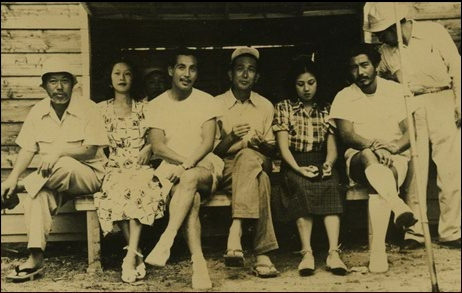

<!-- # ＜开阳＞后现代主义思潮下的“话语” -->

**语言与存在的偏离反映了人类的存在方式。人有追求自我确证的愿望，所以会使用自我的创造覆盖别人的创造，会把自我的意图强加给别人。其中，权力的诱惑，实际的利益就会使得人这样做。总结前文，且不说我们对于客观存在的认知不相同，即便相同，我们通过语言陈述出来时，语言本身都会受到某种力量的干扰而偏离存在本身。**

#  后现代主义思潮下的“话语”

## 文/ 平一（中国社会科学院研究生院）

“人这种东西，就像是天生能把对自己不太合适的真事忘记的东西，光把对自己合适的假话当作真的，因为这样办心里舒坦。”

——电影《罗生门》台词

日本著名导演黑泽明于二十世纪五十年代初执导的电影《罗生门》一经问世，在电影界引起了轩然大波，其影响更是在其后的时期里弥散到哲学、文学、心理学等领域，无可争议地成为电影史上的一座里程碑。但影片既没有俊男美女做主角，也没有吸引眼球的高科技场景，相反，情节简单，只有一个故事，人物也很少，只有七个。这样一部电影能影响至今，其魅力到底在何处呢，我们不妨探讨一番。

传统电影的“经典设计”是围绕着一个主人公，以时间为维度，以情节串联起来的故事，《罗生门》却打破了这种结构，采用了分段叙事的结构[1]。这种叙事手法在电影中被称为“多重式聚焦”手法，指的是让不同的人物从各自的角度讲述同一事件，其结果是，不同的人倾向于以不同的方式来感受或解释同样的事件。《罗生门》并不是这种手法的首创者，电影《公民凯恩》开创了“多重视角”的主观叙事格局的先河，打破了传统的“单视角”叙事方式[2]。不同的是，在《公民凯恩》中，每个叙事者的叙述都是真实可信的，互为补充，连接在一起则构成了完整、客观的真实，但《罗生门》中，四个叙事者（樵夫、大盗、女子、武士）的每一段叙事都彼此冲突，无法纳入到一个统一的整体，连貌似中立的樵夫的陈述也因为他拿了女子的短刀而受到质疑。影片最后也没有给出结局，这点也是与传统的“经典设计”不同的地方，它的结局不是闭合性的，而是开放性的，这恰巧引发了观众的思考和讨论，对结局也会有不同的看法。

从上文来看，《罗生门》似乎成了“各说各话的难解之谜”，每个角色的独白都是对自己的标榜、对事实的掩盖，各陈述之间是对立和互否的。何丽琼和王海东指出，言辞的立场往往是变幻不定的，因言辞者的欲望而变化。每个陈述者都为了维护自己的颜面而罗织了一套陈词，把自己塑造成一个无罪且完满的人[3]。而导演黑泽明想要表达的观点就是：每个人都带有强烈的主观色彩和自我的视角去看待外界的事物，其背后潜藏着自己内心的某种意愿和目的[4]。电影《十二怒汉》也表达出相似的关注，起初十二个人中有十一个人出于各自的私念或偏见而认定少年有罪，缺乏客观理性的思考和判断[5]。

《罗生门》将黑泽明的人性关怀展现无遗，最后也归因于人性这个古老的哲学维度。我们回顾影片诞生的社会背景：二战后日本战败，怀疑主义、利己主义盛行的时代。黑泽明借助每个人的主观重构和叙事中的矛盾对立，来表达他对社会和人性的质疑。电影描绘了人与生俱来的虚伪本质，展示了人的利己之心，勾勒出人性的阴暗角落，不能不引起人们的深刻反思。

认知心理学则从另一个角度论述了这一主题。我们以一个众所周知的成语开始这部分的讨论。成语“盲人摸象”指出了每个人在看待同一事物时存在着不同看法。每个盲人摸到的都是大象身体的某一部分，但都认为自己把握了大象的整体形象，意见抵牾，不肯妥协。与《罗生门》不同的是，在这里，每个盲人受的是自己认知能力的限制。每个人在看待客观世界时，都不可能穷尽事实的全部真实，所了解的也都是片面的、主观的“真实”。不存在全知全能的人，所以从某种意义上来讲，我们都是“盲人”。

认知差异指的是不同行为体对同一事物的不同认知，其出现的原因有以下几点：认知世界是有多种复杂的环境形成的；每个行为体有自己的知识结构、文化背景、实践经验和信息来源；每个行为体有自己的价值取向和利益关系等等[6]。人有认知需求（意指“一种理解经验世界，并将其合理化的需求”），这作为一种认知动机，影响了个体在信息加工时的倾向性[7]。贝克的自我图示理论认为个体具有一种独特的自我图示（self-schema），它作为一种认知结构参与到个人信息的加工中。希金斯的自我差异理论则认为个体具有独特的带有情绪意义的认知结构，情绪的存在会导致对某类信息的记忆和加工出现优势效应，而其他的信息容易被忽视或遗忘[8]。张厚粲等人认为认知差异还受到认知方式的影响，即个体在感知、记忆和思维过程中会经常受到偏爱的和习惯化了的态度和风格的影响[9]。

这样说来，人与人之间的认知差异在所难免，但认知差异如何表现为话语上的差异，这是一个值得思考的问题。如果仅仅将讨论停留在过于缥缈的人性层次，或个体化的心理学层次，我们只能说，这是远远不够的。环顾四周，后现代主义思潮为我们的讨论提供了一个很好的理论背景，其中福柯的话语理论更是让我们受益匪浅。

后现代哲学家们反对传统的西方哲学把一切事物和现象都普遍化、总体化，反对以追求“同一性”为唯一目的。他们认为，“人类思想的根系是多元化的、动态的、异质的；差异性是普遍的原则”。其中，福柯曾说过：“世界的意义不是单一的，而是具有不可计数的意义。人们解释世界的方式是无限的，我们面对现象，应当寻求多种多样的解释。”[10]库恩的科学范式理论也佐证了福柯的观点，他认为科学家的自由想象是受其思维模式的局限，科学领域的研究存在着多种方法论和研究范式[11]。真理都是片面的，相对的，在某种范围内成立的。我们可以这样说，如果真理尚且存活于世，则它必然苟活于自然科学的某个角落里，在社会科学中决然没有它的容身之处。

语言与存在之间有着裂缝和紧张（张力）的关系[12]，在社会生活中，任何陈述都具有强烈的主观性和利害性，这就是“主观的真实”。《罗生门》给大家展现的就是这样一个观念上的转变，对故事（存在）的关注转为了对陈述（语言）本身的关注，用符号学的术语来说，就是“从所指转向表义过程本身”[13]。西方语言学曾经信奉着“语言财富论”，把语言看成是集体财富，它不分贵贱，童叟无欺。布迪厄对此十分反感，认为这是骗人的把戏，其用心险恶，至今还大行其道[14]。批判语言学也认为，语言并不是一种客观透明的传播媒介，而是一种社会实践，从中可以看出各种社会力量的介入[15]。可以看出，语言正失去与存在和真理之间的联系，语言“中立”的神话被打破。

语言与存在的偏离反映了人类的存在方式。人有追求自我确证的愿望，所以会使用自我的创造覆盖别人的创造，会把自我的意图强加给别人。其中，权力的诱惑，实际的利益就会使得人这样做[16]。总结前文，且不说我们对于客观存在的认知不相同，即便相同，我们通过语言陈述出来时，语言本身都会受到某种力量的干扰而偏离存在本身。就像哈贝马斯曾说过：“语言交流方式受到权力的扭曲，便构成了意识形态的网络”[17]。所以，话语上的差异也是自古有之，并且无处不在的，但话语上的差异如何出现了高低之分，成为了话语权力，这值得我们探讨。

启蒙运动以来的理性主义和人性论主张，人类社会存在着一个终极的理性价值，人作为理性主体，可以积累知识，逐步达到终极价值。但有观点认为，理性的一切言语都是一种单方面的诉说，产生于特定的背景之下，为了实现统摄别人言语的目的，它必定隐去自身的背景和起源，而以真理、统一、人类团结，甚至是对上帝或科学的信仰作为外衣来推广其普适性，简直是在“拉大旗作虎皮”。罗蒂进一步认为，任何追求唯一的、普遍的、绝对有效的、永恒的真理的诉求，实际上都会造成残酷，因为这样是把原本属于某个或某类言语者的语言强加到所有的社会成员身上，压制了其他阶层的言语创造，强势阶层由此形成了话语权力，建立或巩固了自己的统治地位[18]。话语权力在布迪厄那里是象征权力，它是一种通过言语能构成既定现状的权力，一种使人承认并信任的权力，一种塑造对世界看法的权力。

福柯认为对权力的渴望乃人类的天性，人类在追求理性的统一愿望中导致语言的“失真”，归根结底是权力在作祟。反过来，一旦某种话语系统得以确立，权力关系就能借助它的力量得以建立或巩固。真理原则，是话语之权力运作的最重要的策略之一，因为它“激发了尊敬和恐惧，由于它支配了一切，故而一切必须服从它”，以真理形式出场的话语，才能将话语内在的权力发挥到极致[19]。

福柯认为西方的科学、哲学、宗教、法律等都是在权力冲突支配下形成的不同专业的话语系统，都难以避免地混杂了主观意志，留有权力干预的伤痕，因此，专业的知识并不神秘，也不具备真理优先权[20]。哈贝马斯在某种程度上呼应了福柯的观点，他指出“公共领域”的事务不再是公众讨论的主题，而成为了科层制组织里的专家们用各种技术手段来解决的技术问题。科技理性对生活世界的侵蚀，使得科学逐渐成为了经济、政治利益的工具，成为了一种意识形态[21]。

关于上述问题的解决办法，舒茨发展了韦伯的同情内省法，指出人们在不断的互动中才能逐渐达到共享同一世界的目标。哈贝马斯在此基础上更进一步，提出“沟通行动理论”。正因为不存在检验真理的客观性标准，所以我们需要依靠“未失真交往”达到的“主体间性”来检验真理，即“相互平等的言语者通过对话、质疑、诘难和反驳，以及辩护、论证、修正和发展来达到最终的一致，依靠自己和他人的共同判断来进行”，以“沟通理性”取代“科技理性”才是最终的解决办法。我们在电影《十二怒汉》中看到的讨论场景就是“未失真交往”，这也证明有效的沟通才是通向事实本身的唯一桥梁。但这种观点受到了福柯的强烈批评，这种“未失真交往”是一种“理想型”，在现实生活中根本不存在，并且并不存在所谓的真理，一切真理都不过是言语的游戏。

福柯的批评是不无道理的。话语活动的参与者由于在社会身份、地位的不同，对话语的控制程度也不同，换句话说，他们之间的话语权力是不平衡的[22]。发出话语的人凭借其在权力、经济、知识上的“优越性”掌握着话语活动，反过来又赋予或巩固了他们的优越地位。艾利亚斯的“内局—外局群体理论”也表达了类似观点，“内局群体”居于社会结构的内核，把握了文化表达，而“外局群体”处于边缘，接受并巩固文化表达，这种情形是由权力关系造成的。

强势阶层的话语权力逐渐演变成了一种话语霸权。章国锋认为社会的不平等首先并根本的表现于话语权的不平等。话语权是各阶层实现利益诉求的重要手段，但在中国，话语权失衡的情形相当普遍。强势阶层是既得利益者，掌握话语霸权。中产阶层的话语权在逐渐增长，但还无法与强势阶层的话语霸权相抗衡。弱势阶层的话语权基本处于“沉默”状态，无力对抗强势阶层对自身利益的侵害[23]。

说了这么多，只想说一句：“话语”绝非透明，更非中立。

注释： [1] 屈小顺，2011，《电影和的叙事结构比较分析》，《电影评介》第6期，49-53。 [2] 杜刚，梁玉敏，2004年，《多重视角的多重形态——与叙事结构之比较》，《四川理工学院学报（社会科学版）

》第4期第19卷，63-68。 [3] 何莉琼，王海东，2009，《言辞的立场：欲望还是正义——撩开人性光亮的面纱》，《大众文艺》第2期，43-44。 [4] 邱紫华，陈欣，2008，《对的哲学解读》，《外国文学研究》第5期，70-77。 [5] 倪梁康，2005，《VS或:政治哲学中的政治-哲学关系》，《云南大学学报（社会科学版）》第1期第4卷，26-30。 [6] 秦亚青，2010，《主体间认知差异与中国的外交决策》，《外交评论》第4期，3-7。 [7] 徐洁，周宁，2010，《认知需求对个体信息加工倾向性的影响》，《心理科学进展》第4期第18卷，685-690。 [8] 王垒，郑英烨，高凡，1994，《青年自我差异与情绪关系的实验研究——自我认知对情绪的启动效应》，《心理发展与教育》第1期，6-11。 [9] 张厚粲，孟庆茂，郑日昌，1981，《关于认知方式的实验研究——场依存性特征对学习和图形后效的影响》，《心理学报》第3期，299-304。 [10] 同4 [11] 乔纳森•特纳著，邱泽奇，张茂元译，2006，《社会学理论的结构》，北京：华夏出版社。 [12] 张莉莉，2007，《谎言与真理——谈保罗•利科对谎言的现象学解读》，华中科技大学，硕士论文。 [13] 李寒阳，2003，《价值世界的深刻危机与艰难重认——从叙事方式看电影的内涵意义》，《四川教育学院学报》第7期第19卷，15-18。 [14] 赵一凡，2010，《西方文论关键词——象征权力》，《外国文学》第1期，102-111。 [15] 辛斌，1996，《语言、权力与意识形态：批评语言学》，《现代外语》第1期（总第71期），21-27。 [16] 同14 [17] 同12 [18] 同12 [19] 刘魁，2005，《真理、文化权威与知识生产的时代性——兼评福柯对真理话语的微观权力分析》，《南京政治学院学报》第3期第21卷（总第121期），53-57。 [20] 同14 [21] 同11 [22] 田海龙，张迈曾，2006，《话语权力的不平等关系：语用学与社会学研究》，《外语学刊》第2期（总第129期），7-13。 [23] 汝绪华，2010，《阶层话语权失衡的权利制度分析》，知网，网络出版地址[http://www.cnki.net/kcms/detail/65.1210.c.20101224.0906.001.html](http://www.cnki.net/kcms/detail/65.1210.c.20101224.0906.001.html)

（采编自投稿邮箱；责编：陈锴）
