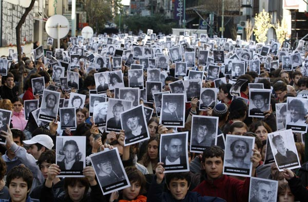

<!-- # ＜天枢＞那些青年 那个国度 -->

**而那些踏入了社会的大学生呢，随着时间的推移，梦想什么都变得遥不可及，踏踏实实去生存才是所追寻的道路。他们只会被命运安排走上他们所厌恶的老路，成为他们所厌恶的那群人。为生活打拼成了唯一的主题，对于他们，以前充裕的时间再也消耗不起。进入了社会，也许连睡懒觉都得吝啬，他们得一点点地去忙碌，一点点去在乎那些孔方兄，一点点向这个操蛋的社会投降。三座大山压着的年轻人，还有什么精力去关心时政呢？“国家大事，与我何干”曾经的满腔热血终会变成一声叹息，任何人都得臣服于生活。**

# 那些青年 那个国度

##  文/ joachimbene（上海海事大学）

（一）

与其闭上眼睛幻想光明，还不如睁开双眼正视这黑暗，毕竟，我知道这里没有什么蜡烛。

中国有希望吗？在我的脑海里一直徘徊着这个问题的两面，中国有希望，因为还有这些年轻人，中国没有希望，同样因为只有这些年轻人。

网络上的年轻人，往往表现出他们对偏激观点的爱好，对生命的漠视不宽容，对破坏事件的狂热追捧。在这个异托邦里，你会发现作为群体的中国人的道德水平实在是让人不敢恭维。破坏而多于建设，指望着他们来改变中国，还是指望着他们去破坏中国。以前网络上是国家之间的对立，后来是官与民的对立，而现在又加上了族群之间的对立，而这些割裂很大程度上都只是这些人的假想敌而已。而这里面骂得最凶的人，往往也是最容易被收买的人。当政府给他们的好处高于他们的心理价位时，他们很容易成为最忠实的五毛党人。其势也汹汹，其去必然也汹汹。指望这群以一根筋去思考的人改变，难。

中国人信教么，从前的儒学，现在的马克思，无不直指背后的两个字——权力。中国的年轻人都习惯的把成功和当官定义在一起，而不是“心随我在，自由自往”，从公务员考试成为全国第一大考你就发现中国青年漫射的对于权力欲望。即使现在的所谓右派青年，在未来也很难不保证寻求这份官方认可，在公务员考试中分取权力的一杯羹。在公务员的收益大于普通公众的收益，而风险又小于别的公司风险的，整个社会中只弥漫着对权力的畸形崇拜。如果这个系统的待遇不好，那他们为什么砸破头进入这个系统，进去之后再指望体制内的人去反对体制，不等于否定掉他们之前的努力么？指望他们做出改变，也难。

居庙堂之高者，坐收体制内的内部收益，处江湖之远者，又把每一次的动乱当成他们发迹的资本。指望着这群年轻人，还是把这个看成一个笑话吧。

（二）

在一个没有英雄的年代里，我只想做一个人。

如果你仔细去分类那些关心政治的人，要不就是混有一定社会地位，有足够影响力的人，要不就是满腔热血而又无所事事的大学生。混有一定社会地位可以无所畏惧，国家在处置这些人的时候好歹也要考虑社会影响。只有这两个群体，才可能抽出足够的时间来关心时政，一般人他玩不起。国家的狡猾之处在于他把对生活的追逐取代了对生活的满足。对于大多数人来说，他们只是想要过的上一个还算有尊严的生活，至于时政什么东西，他们很忙，他们也没有时间去理会。在具体的实在利益受到损害之前，他们不会想着去反抗。即使那盆火已经烧到了隔壁的大门，他也不会去管它一分。在这个国度上的生存哲学不是休戚与共，而只是“各家自扫门前雪，莫管他人瓦上霜”。

而那些踏入了社会的大学生呢，随着时间的推移，梦想什么都变得遥不可及，踏踏实实去生存才是所追寻的道路。他们只会被命运安排走上他们所厌恶的老路，成为他们所厌恶的那群人。为生活打拼成了唯一的主题，对于他们，以前充裕的时间再也消耗不起。进入了社会，也许连睡懒觉都得吝啬，他们得一点点地去忙碌，一点点去在乎那些孔方兄，一点点向这个操蛋的社会投降。三座大山压着的年轻人，还有什么精力去关心时政呢？“国家大事，与我何干”曾经的满腔热血终会变成一声叹息，任何人都得臣服于生活。

关心政治是需要时间的，关心政治还需要一些勇敢。即富且贵者自然安安心心地数着自己的钞票，只有那几个有良心的知识分子才会追寻着事情的真相。我从来都钦佩这些人的勇敢，当我们必须同时也得承认个体力量的卑微。我们并不是那种振臂高呼而应者云集的人，我们只是芸芸众生中毫不起眼的一只会思考的芦苇。对于生存，反抗是需要成本的，如果两手空空倒是无所畏惧。可我们背负的往往不只是我们自己，作为角色集的存在，我们还得扮演着子女，父母亦或是党员。而这些身份的角色，往往约束着我们过一个安安稳稳、平平淡淡的生活。要生存还是要信仰，我想很多人只会选择生存。

活着，在我看来就是最大的资本。我们可以默不作声，但并不代表会停止思考。可以不选择信仰，但并不代表放弃信仰。可以学会妥协，但也无碍在内心暗暗喝彩。我不会说“流血请从我开始”，在我看来，这不仅无损于问题之改变，反而首先自损自己一臂。我也不会鼓励别人去流血，我珍惜自己的生命，同样也珍惜别人的生命。妥协并不是弱者之姿，而是一种勇者之态。在水没有烧开之前，你永远不知道是那棵稻草使它沸腾。我们选择的只是一种顺其自然，历史大势，向来是顺之者昌，逆之者亡，向来没有改变的道理，只是等着最后的一度。

在一个没有英雄的年代里，我只想做一个人。我选择妥协，但并不代表我不会反抗，我也从来不承认我是懦夫。时间和勇气，对于大多数人来说都不具备。你可以践行你的理想，但请不要嘲笑我的道德。请你不要把国家的重任交给我，我们担不起。作为一个屁民的权力，我只会选择以一种不妥协的姿态去接受妥协。无论如何，我都不会停止思考，至少我知道我还是一个人。

（三）

不要告诉我你说了些什么，我想知道你究竟做了些什么。

中国缺少更多的是面向田野，面向社会勇于奉献的实践家，而多的是那些只会写写文章，说说话的隔靴搔痒的演说家。立言者其势也汹汹，其文也洒洒，洋洋千言多的是没有用的废话。该继续的还在继续，该发生的还在发生，昨日之中国依旧还见于今日之中国。言论之无用由此可见端倪，言论改变不了中国，只有行动起来才能改变中国。就如同城市收容条例，很多言者都意识到这个问题，也讨论过这个问题，但是如果没有許志永、俞江、滕彪的努力争取，这个恶法的废除也许还要等到猴年马月才能实现。

什么事情都要有人做才会成功，什么权利要有人去争取才会拥有。如果没有奉献精神，没有内心使命感的召唤，没有多少人会愿意走向生育我们的泥土。言者，我不否认他们的思考，但是他们的思考对实际问题的解决又有多少价值。我从来都觉得不在实践中去探寻，很难搞懂事物本来的模样，也许那样对他们的皮肤来说太苦，对他们的生活太累，言论同样能满足他们的正义感。但只有实干者才会把自己的双脚深深地插入这片土地，其辛也劳矣，他们的血液里流淌着才是底层民众的血脉，而这些举动执政者者往往望而生畏。

言论者言必称启蒙，中国的确是一个缺乏常识的时代。在他们看来，改变一个人的思想是一件值得每个人值得努力的事情，仿佛思想根源洗涤一清，中国就会大有希望。可是我想问一下，这种启蒙确确实实发挥了作用了么？思想本身就是一个不断否定的过程，主义什么的正确性本身就是一场无法验证的伪命题。今天选择这种思想，明天照样可以选择另外一种人生。被启蒙者踏入社会还是一如既往的要被各种社会化，生存始终他们注重的是第一要务，

而实干者们关注的是这些言论者忽视的兄弟姐妹们，这些人往往没有时间去看报，这些人也往往没有能力去诉说。他们拙于言辞，对于生活逆来顺受，每天总在最低的温饱线上讨要着生活。他们才是我们最应该去关注，去帮助的人，言说者的受众往往可以自我解救，而实干者的对象往往才更加是生活的弱势者。不帮助他们，他们只会慢慢走向衰亡。一个言说者的言辞，受众当时会感觉如醐醍灌顶，之后呢？则大部分都走向了不了了之。而实践家，我们可以看到明明白白一个恶法的废除，看到艾滋病群体的免于被歧视，看到多少孩子吃上免费的午餐，在我看来这才是实实在在的功绩。

我并不是说言说家有什么不好，只是对于中国来说，立言者太多，而实干者太少。立言者可能天下知之，而实干者则大部分默默无闻，再加上彼此的辛苦程度往往使更多的人往立言上面跑，实干者逐渐只是几个人在辛苦践行，我始终会向那些不做声的人致敬。告诉我你做了什么，然后再和别人讨论中国。

（四）

希望是本无所谓有，无所谓无的。

这正如地上的路，其实地上本没有路，走的人多了，也便成了路。

（采编自投稿邮箱；责编：陈锴）
