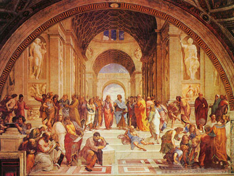

<!-- # ＜天玑＞四城记（一）：广州 -->

**

查尔斯•泰勒说，如果你不能叙述出你是如何变成现在这个样子，你就不知道自己是谁。对于个人是这样，对于一个民族也是如此。当上面两个人汇流成我的时候，我知道自己错过了很多东西，对于这个城市来说，我不是一个好的说梦者，也不是一个好的公民，我爱这个城市，但我的感性的爱被它一次次挫败，我的理性的爱却一直不被它承认，我受着施特劳斯问题的折磨，一刻也不能逃脱。**

# 广州

## 文/陈纯（中山大学）

从来到这个城市开始，就注定我和政治哲学结下不解之缘。那个动荡年份的新学期，我还捧着施特劳斯的著作，和左邻右里大谈现代性和自由主义，并对非施派的卢梭解读不屑一顾；那时我还在上着希腊语课，也不曾注意到那个扎着发髻，穿着背心的高个子姑娘，后来她问我怎么不去主动认识她，我很无辜地说我真没认真看，我对刘小枫过敏，每次上他的课就鼻涕直流；那时我和刘门主将在素未谋面的情况下携手合作舌战马哲诸人和派对鹰犬，网上网下几番久仰久仰客气客气；那时我还有身在曹营心在汉的感觉，我觉得理性的纠缠是没有出路的，但出路是不是在“隐微”，我仍然不清楚。

我该庆幸后来我的叙事不是单线发展的。一个正常人很容易发现，比起逻各斯的冷峻，“密说斯”（刘对mythos的翻译）的傲慢更让人无所适从，我听说室友挤破头想进去那个神秘的团体正在读《美诺篇》，并有人说：“如果福柯读过《美诺篇》，那他决然不会说出‘知识即权力’这样的话。”我就开始怀疑：以福柯的学养，怎么可能连《美诺篇》都没读过？这些人真以为柏拉图就包治百病了？与此同时，纠结的理性也在另一边展现出他抽丝剥茧的能力。翟门的论坛每两周一次，翟老师不出席，但周师兄和吴师姐的力量一点也不单薄，这两个脾气温和的老实人每回都因为一些论证的细节吵得不可开交，这种争吵甚至延伸到后来的网上专题讨论。在他们看来，任何跳跃和模糊在哲学里都是不能容忍的，遑论“隐微”？我甚至隐藏起我的施特劳斯和后现代阅读史，在他们看来，那真是一件不光彩的事。除此之外，邓老师的课也有着清澈见底的魅力，他用一个个一针见血的解释告诉我，哲学家的论述，绝不仅仅是“叙述”或“写作”，用一句粤语来说，“文采唔系大晒噶”：密尔的斐然文采，盖不住他心思缜密的逻辑，康德的生硬晦涩（何况我后来并不如此觉得），也不碍于他严谨精密的论证；亚里士多德的词章比不上柏拉图，但他的伦理学和政治哲学在他的老师面前一点无损于他作为一个哲学家的尊严；说起最喜爱的哲学家伯纳德•威廉斯，邓老师说这些英国哲学家经常“以辞害意”，为了心中那点典雅，害得读者读得云里雾里，但把威廉斯和简明易懂的迈克尔•史密斯相比较，他却坚定不移地站在深刻的威廉斯一边。

我的非单线叙事很快拓展出哲学领域，进入我的生活。那个元旦前夜我还没认识L同学，我又和高中一样一个人去倒数，在中华广场我混在那群奇装异服的高中生里面，感到十分自在，烟花过后（或许没有烟花）我跟着人流，广州的老城区走过了一丛丛廿一世纪的花草树木，便利店深深地凿进了民国的街道和房子里，路口仿佛飘过有轨电车的铃响，一个窗口示威般地挂着青天白日满地红，我突然想起我来这里读书的另外一个目的：这里是国父的地方啊。

于是我在这里又分岔了。其中一个我顺着珠江边往中大走，在海珠桥上拿出《庄子》的外篇，煞有介事地读起来，新年的风吹得我的西装猎猎作响，我站在桥上向外望，广州整个被浸透在夜色和水波里，只有岸边绿幽幽的光暗示着这个城市还有人和我一样夜未眠。我静悄悄地走回北门，在那个晚上的梦里，我摸清了广州城的脉络，我的脚步和它的根通过一种神秘的植物相连着。

这一个我实在活得太轻巧，他在晦暗的夜做着无数深不可测的梦，醒来只能捕捉一二。他和L同学的结识就在一个梦里，他用短信告诉她，反清复明的战士和小太监相识在一场葬礼之前，于是她打算和他一起探索，这种探索伴随着对笛卡尔问题和被害妄想症的沉思辗转在图书馆和西区操场之间，后来一度延伸到下着雨的岭院大楼门口。他每天醒来，花一两个小时去回忆和描述昨晚的梦，她一开始根本不信，但惊叹于他的想象力，她最喜欢的是那个会吃醉的青菜，而且他居然毫不掩饰地告诉她：这个人已经大胆得无可救药！但他用严密的论证向她表明那根本不可能是只靠想象，她乖乖承认，想象力加理性真是一剂凶猛的毒药。

他只和她坐过一次车，他又感到那棵神秘的植物牵扯着他的脚踝，从南湖到烈士陵园，车在城中划出了一条蜿蜒曲折的线路，在车上他和她说，他的背在过山车那里撞出了一个大包，为表歉意，她抬起了靠在他肩膀上的头，和他进行哲学谈话分散他的注意力，就这样有了那篇《梦旅人》，那棵植物还纠缠于广州与南京的对比，在那个暑假把他的小腿勒出累累伤痕。

在她渐渐远离他的生活以后，他还是很喜欢去珠江边逛，他知道自己的这个分身是从沿江西路那里走出来的。她出国的那个暑假，他和另一个姑娘试着沿海珠桥走到二沙岛，再从海印桥走回来，路上他的脚板痛得难以言语，那棵植物不太认可这种行为；今年电脑崩溃的有一天，他向人借了一辆单车，从北门一直骑到沙面，路过琳琅满目的沿江商店和年代久远的天字码头，再经二沙岛回来，植物居然一点反应也没有，它已经从他的脚下抽离，去找另一个和这个城市脉络相连的人了。经过那群流浪歌手的身边，他深深地感到一个时代已经远去了。在这两年里，他去过不靠谱的聚会，谈过不靠谱的恋爱，因为别人的一句戏言，在平安夜一个人坐车去白云山看发泡胶末喷薄出的人工雪，它差点就原谅他了，但他去年世界杯期间的举止让它彻底断绝这个念头。

与此同时，另一个从沿江西路走回来的人却一路亢进着，不打算放慢脚步。他和这个城市没什么神秘的联系，却理性地爱着它，在他看来，这里中国公民社会发展得最成熟的一个地方，广州的媒体是自由派的温床，广州市民的参政意识和维权意识让他着迷，广州市官员偶尔迫不得已的道歉也让它对现状不至于心灰意冷。在他旁边就有人身体力行：那个不靠谱聚会的某些成员是“保粤运动”的激进支持者，在网上发帖要为粤语力争到底，还上过街，游过行；他的几位师弟，为了抵制广州的“光亮工程”，剃了光头举着“Brain is brighter”的牌子立此存照。他还受邀参与过某公益组织的座谈会，亲自给那些慈善业的精英分析什么是“正义”。在别的地方大谈自上而下的改革和自下而上的革命时，他看到这个城市在努力践行自下而上的改革，并认为这是中国的希望所在。

当然，这种务实而坚定的风气在多大程度上容得下政治哲学也是一个问题。民主以后，施特劳斯的问题依然存在：哲人如何在城邦中生存？因为某位先行者的获奖，他阴差阳错地认识了中大的众多右派青年，他们里面有人自豪地自称“草泥马”。这些人对NGO保持着持续不减的热情，他们做过调研，写过报告，有的甚至时刻以公民的精神监督着学校的一举一动，要求校方对每一项收费列出细目，对不合理的政策解释缘由，和领导喝茶变成他们的家常便饭：这绝对不是一群纸上谈兵的人。在寒假和彩芬叙旧的时候，他依然从她嘴里听到中大公民中心的大名，而他们里面大部分人就是公民中心培养出来的。对于他突然谈到的施派、左派和自由派之争，这群实干者感到一头雾水。有一次一个师弟冲着他发火说，我不懂什么是施派，但不明白你为什么要诋毁人家，大家不都是知识分子吗？坐下来好好谈不可以吗？他没办法跟师弟解释说，现在的施派和自由派根本找不到任何共识，不是你死，就是我亡（概念意义而非肉体意义）。不一样的是，施派对这一点非常清楚，自由派还心存幻想。

在中大这个神奇的场所，对政治感兴趣的人对哲学不感兴趣，对哲学感兴趣的人对政治不感兴趣，对政治和哲学都感兴趣的人都变成施派了，他觉得他不应该这样孤独，他想的问题，什么是自由，什么是合法性，什么是正义的制度，都是很基本的问题。他不明白一般的右派青年为何在没思考这些问题之前就急于就实际问题发表意见，他也不明白为啥施派会认为古今中西之争要优先于这些问题。他承认古今中西之争是个真实存在的问题，但如孔子言未知生焉知死，未知今与西，焉知古与中，对于当下的中国而言，西方是一个离我们更近的存在。不了解西方，就不了解中国，更不知道以后的中国要往哪走。中国施派的错误在于，在不了解现代的西方之前，就已经抄近路要回到古典的西方，如果他们认为现代西方人对自己的了解是错的，那我们对他们的了解也不可能更好：在自我问题上，没有“旁观者清”这回事。

他知道自己该往哪里走吗？查尔斯•泰勒说，如果你不能叙述出你是如何变成现在这个样子，你就不知道自己是谁。对于个人是这样，对于一个民族也是如此。当上面两个人汇流成我的时候，我知道自己错过了很多东西，对于这个城市来说，我不是一个好的说梦者，也不是一个好的公民，我爱这个城市，但我的感性的爱被它一次次挫败，我的理性的爱却一直不被它承认，我受着施特劳斯问题的折磨，一刻也不能逃脱。就像刘宇翔评价哲人的时候说的，一个伟大的哲人，不管你爱他还是恨他，你都要落入他的预言之中。

我在广州呆下去，总有一天会被它送上断头台。

（采编：麦静；责编：黄理罡）
