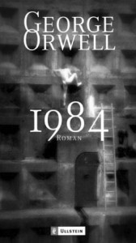
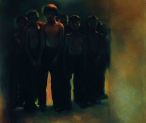

<!-- # ＜开阳＞读《美丽新世界》——浅谈乌托邦与反乌托邦 -->

**作为人类对美好事物的追求下的产物，乌托邦的设想和实践虽然有着重要意义，但每每由于其自身的矛盾，使得最初的美好愿望在事实上发生扭曲。这也正如荷尔德林的名言所指，“总使一个国家变成地狱的，恰恰是人们试图将其变成天堂”。**

# 读《美丽新世界》——浅谈乌托邦与反乌托邦

## 文/雷英迪（中国人民大学）

赫胥黎的《美丽新世界》，作为与乔治·奥威尔的《1984》、扎米亚金的《我们》齐名的“反乌托邦三部曲”之一，享有相当高的世界声誉。虽然就连高中英语课文都对其有过介绍，它却是我在这三部书中最晚读到的一本。比起《1984》曾在我个人的思想历程里扮演过极其重要的启蒙角色（当然，相信有无数青年都会有类似的感受），《美丽新世界》则让我看到了另一些可能。它描述的乌托邦场景，较之另外两本少了一些极权色彩，但却更加具有现实意义，某种程度上说也更加值得警醒。

#### *三种乌托邦的比较

尼尔·波兹曼在其名作《娱乐至死》中，一开始就提到赫胥黎的《美丽新世界》，并认为世界最终没有发展成乔治·奥威尔的预想，却越来越向赫胥黎所描绘的方向发展。《娱乐至死》的核心观点是“我们终将毁于我们热爱的东西”，这里的矛头明确指向电视节目等娱乐性现象。波兹曼认为一切公共话语日渐以娱乐的方式出现，政治、新闻、教育等方方面面都成为了娱乐的附庸，人们的思考能力受制于此，最终娱乐至死。

《美丽新世界》中描绘的社会与其确有共通之处。《美丽新世界》（《Brave New World》）得名于莎士比亚的《暴风雨》，牛津词典的解释是“本欲改善人们的生活，实则带来预料不到的问题”。这个新世界是一个设定好的机械化的盛世，尊奉汽车大王福特为救世主。科技与政策管理极度发达。精子卵子在试管中调制好，胎儿在孵化器中长大。人类虽被分为五个等级，但却从小就以“睡梦教育”的形式被灌输了幸福的概念，从而热爱自己的命运。他们被设计得厌恶书籍、厌恶艺术、厌恶独处，性滥交、消费主义和享乐主义横行。即使出现最糟的情况，也还有唆麻这一“完美的药物”使人们获得快感。可以说，“幸福”在这美丽新世界中似乎唾手可得。

诚然，幸福是人类始终追寻的一大终极目标，然而我们看到，这样的“被幸福”却不等于、甚至往往是有悖于我们真正的幸福的。就如同波兹曼描绘的“被娱乐”一样，新世界中的幸福成了人为的研究成果，而每个人独立的人格、自由的意志、对美好事物的感知则消失殆尽。在这里被扭曲的不只是幸福的概念，这些新人本身也不同于我们如今定位的自由、正常的人，他们失去了灵魂。

相比较《美丽新世界》中人被技术改造，《1984》则侧重于制度对人的挟制。如果说在前者中描绘的人们是热爱技术而被技术改造的场景，后者中塑造的人则是被制度改造得热爱制度。老大哥在看着你，无法关掉的电幕覆盖着生活每个角落，新话和双重思想则成为人们自身的枷锁。这里营造出的极权恐怖更为直接。然而从某种意义上讲，这种恐怖可能尚不如《美丽新世界》中来得可怕。举例来说，《1984》中还需要设立真理部来篡改历史进而控制人心，而《美丽新世界》中人已经从内心最深处拥抱现实而厌恶过去的一切。

《我们》的作者扎米亚金是俄国人，但《我们》约写于1923年，看来并不是对斯大林时代的影射。尽管如此，由于其在意识形态上不合时宜，它仍被禁止出版。书中的故事发生在约六百年后的世界，人们只以数字命名，住在玻璃房子里以便于极权监督。他们唯一可以放下窗帘的一小时被称为性小时，每个人都需要一种粉红色的票券来和性伴侣做爱。世界被“造福主”个人所统治，每年由全体人民重选却无一例外地连任。造福主的机器是断头台，处决的过程经常发生且公开进行。“这一国家的指导原则是幸福跟自由互不相容。在伊甸园里，人是幸福的，可他愚蠢地要求自由，就被驱逐到荒野中。现在大一统国通过剥夺他的自由，令他重新享受到幸福。”和《美丽新世界》一样，《我们》的故事也描写了朴素、纯粹的人性对一个理性、机械、整齐划一的世界所进行的反抗。只是赫胥黎的书在政治目的上少一些，而更加强调技术的作用。

《1984》和《我们》有更多相近之处。事实上奥威尔写过关于《我们》的书评，可以想见他是受到了扎米亚金的影响的。两个故事同样描述了恐怖的极权统治，而冲破高压的都是男女主角的爱情，最终的结局也都是出卖和人的被改造。比较而言奥威尔对极权社会的构想则更加完善和细致。

#### *乌托邦与反乌托邦

人类对于乌托邦的渴求和设想并不是从莫尔写就《乌托邦》一书才开始，一个古老而著名的乌托邦例子就是柏拉图的理想国，而哲学王的统治地位与美丽新世界中科学家与政治家的地位其实十分相似。正是因此，卡尔·波普尔在其《开放社会及其敌人》的第一卷就致力于对柏拉图理论的批驳，以求追根溯源。

作为完美世界构想的乌托邦，在人类历史中虽然从不乏大批的追寻者，但同样招致了足够多的批判。特别是在20世纪极权主义盛行的时候，人们越来越意识到它与乌托邦构想间密不可分的联系。反乌托邦三部曲以文学的形式对其进行了讽刺和预言，而诸如卡尔·波普尔、汉娜·阿伦特、卡尔·J·弗雷德里希乃至罗素等学者都对其进行过理论上的分析与批判。共产主义作为乌托邦构想的一种主要形式，与法西斯主义一样成为众矢之的，而这则更加值得我们进行思考。

我在这里想简单论述反乌托邦的理论中三个重要的方面：首先是平等和自由关系的处理、以及强制手段的应用。总体上讲，无论是反乌托邦三部曲中的描述，还是学者哲人对乌托邦的设想，抑或是现实中依凭乌托邦理念进行构建的社会，在事实上对于个体的自由都缺乏足够的重视和保护，甚至将自由主义视为大敌。它们在强调整体和谐的时候，往往忽视了个体是目的而非构成要素或者工具这一要点。另一方面，人们在乌托邦的构想中几乎少不了对于平等的呼唤，然而在对平等的渴求中却容易产生问题，其中最关键的就是威胁自由。波普尔对这一问题有过论述：“自由比平等更为重要，试图实现平等就危及自由，而如果失去了自由，那么在不自由的人中间也不会有平等”。学者熊培云在《自由在高处》中也说道：“自由是一切价值的出发点，而平等则是个人或社会不断实现的过程，其目的仍是捍卫自由”。当然，平等并非不重要，但它始终应该建立在自由的基础之上。然而无论是实行绝对意义还是相对意义的平等，在乌托邦改造过程中都难免染上强制色彩。“罪恶不在乌托邦，而在于它是否与强制合流”，秦晖的说法也不无道理。

乌托邦所缺乏的第二点在于广泛的选择和社会的多样化。罗素在写《西方哲学史》提到的莫尔一章时，对其乌托邦有着如下评语：“可是必须承认，莫尔的乌托邦里的生活也好像大部分其它乌托邦里的生活，会单调枯燥得受不了。参差多样，对幸福来讲是命脉，在乌托邦中几乎丝毫见不到。这点是一切计划性社会制度的缺陷，空想的制度如此，现实的也一样。”这其中“参差多样是幸福的命脉”的经典论述为无数人所引用，而它确实道出了关于幸福的真谛。无论对于个人还是整个社会，充满选择的可能和自由总是美好和必要的。在理想的情况下，人们能够按照自己的意愿经营自己，而社会也确实提供了各种机遇和选择。反之，参差多样的对立面整齐划一，则引向了改造、同一、极权和恐怖。多数乌托邦构想中都有着对人和等级严格的限制，生活机械单调，人也失去了人性中本有的光彩。像《美丽新世界》中的居民最终已然习惯了被设定的人生，“美丽”一词的意味就难免充满了讽刺。

第三个方面则在于乌托邦的实现中存在的弊病。这里必然要提及的便是哈耶克对于理性“致命的自负”的经典论述。哈耶克从经济学角度切入，分析了乌托邦设想的可行性。他所指的是那种“完全不顾使现存体系得以运行的因素，为排除它的不可取的后果而提出的设想”。乌托邦的设计者和建构者们从“有目的的社会制度肯定都是设计出来的”，在发展到人们可以具备“随心所欲改造它们的能力”这一危险的想法只有一步之遥。然而事实上，自发设计不该也从不会真正在社会发展中扮演绝对主导的角色。哈耶克认为，“相信有意识引导的过程必然优于任何自发的过程，是一种毫无根据的迷信”。乌托邦的设计者倡导者们“过度相信个人理性的力量，于是蔑视任何未经理性自觉设计或理性无法充分理解的东西”。事实上我们可以看到，社会科学的任务往往就在于解释自发的社会产物和社会现象，无论是市场、货币和分工的出现，抑或是政府与国家的诞生，并不是人们完全经过理性构建的。过分依赖于自觉设计和理性建构，难免有着自负的嫌疑，更重要的是它也很容易和强制改造相联系。

作为人类对美好事物的追求下的产物，乌托邦的设想和实践虽然有着重要意义，但每每由于其自身的矛盾，使得最初的美好愿望在事实上发生扭曲。这也正如荷尔德林的名言所指，“总使一个国家变成地狱的，恰恰是人们试图将其变成天堂”。清醒地认识到许多乌托邦构想的实质，规避其可能带来的极权主义色彩，无疑是我们在进行和谐社会建设中必须特别注意的问题。

（采编自投稿邮箱；责编：麦静）
