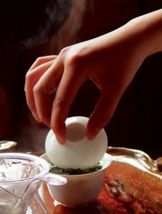
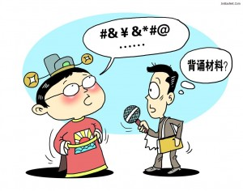
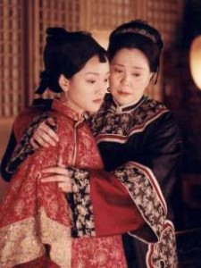

<!-- # ＜天玑＞：四城记（二）潮州 -->

**潮汕地区就是布鲁姆所说的，封闭的共同体，我真心觉得社群主义和施派都可以好好关注一下潮汕人，在潮汕人身上集结了古今中西之争的多种问题，这片土地没有任何一个别的族群拥有如此这般的复杂性。**

# 潮州

## 文/陈纯（中山大学）

和广州相比，潮州是个小小的城，小到开摩托车一两个小时就可以逛完，小到人力三轮车至今随处可见，如果夏日的夜晚想享受一番悠闲工夫，在韩江边坐着三轮吹着江风绝对要比在珠江边徒步行走要来得惬意。用陈椰兄的话说，我们潮汕人最会享受生活了。

是的，我们潮汕人最会享受生活。我才几岁大的时候，我爷爷就教我冲功夫茶，厝边头尾吃过饭就来我家串门，看我像模像样地烧水，洗杯，冲茶，敬客，一边抽着烟，和我爷爷谈论着乡间的大小事情。在潮汕人看来，吃茶是生活中必不可少的部分。我后来觉得比起喝功夫茶来，喝啤酒谈哲学的境界差得不只一两个档次。

我现在回头看潮州，觉得它是传统的代表，但在我小时候可是把它看作现代化的象征。每年暑假我都有一段时间住在城里的外公家，有一次假期结束回到沙溪，我想起城里的街道和落日，西湖的小山和亭子，外公家的卫视中文台，就止不住哭了起来。爷爷问起，我说我的蜡笔丢了，他从裤袋里掏出蜡笔说，这孩子，记性真差，刚才说托我保管呢。我当时大概模糊地觉得对城市的向往不是一件光彩的事。我也不想伤爷爷的心。

这种传统和现代的张力在很多潮汕人中都存在着。一方面，他们是最容易融入现代社会的族群，我不用列举华人世界那些豪商巨贾有哪些是潮汕人，大家都知道，潮汕人勤劳，团结，适应力强，有经商头脑，这些德性让“东方犹太人”在现代世界面前游刃有余遍地开花；另一方面，他们也真的像犹太人，去到哪里都顽固地保持着自己族群特征，拒绝与其他族群通婚（除非肯融入他们的文化）以保持血统和文化的纯净，我的小舅妈为了嫁到潮州，从零星的几个词语开始学潮州话，现在说得比我还流利，有一回和我争论，说我一点也不“通情达理”，真真把潮汕文化吸进骨髓里了。

出到外面的潮汕人急切切地适应环境赚钱致富回馈家乡，安于潮汕一隅的本地人却拼命想把外面的影响（除了商业）排挤出去，他们不想见到“外省仔”，不想听到外地媳妇操持着他们听不懂的普通话，不想看到自己的子女生病跑去打吊针而不是去中医那里拣中药。他们认为潮剧是世界上最美的音乐，没有之一。潮汕地区就是布鲁姆所说的，封闭的共同体，我真心觉得社群主义和施派都可以好好关注一下潮汕人，在潮汕人身上集结了古今中西之争的多种问题，这片土地没有任何一个别的族群拥有如此这般的复杂性。

作为一个在外长大的潮州人，我对潮州的认同感并不是很强。今年暑假回去，陪一个长辈和市领导吃饭，席间有个官员喝高，红着脸大声说：“我们潮州人最拥护共产党！”听得我狠皱眉头。我就突然想起表姐的老丈人和我说的，当年李嘉诚回来建设家乡，投了好几笔巨款，都被这些潮州官员贪得只剩一丁点，李嘉诚怒而转投汕头，潮州人在背地里说李嘉诚忘恩负义，在他们看来，家乡就是家乡，家乡再有不对，还是把你养大的地方，你的钱怎么能给别人呢？何况身在其位，捞点油水是再正常不过的事了，李嘉诚也是个不“通情达理”的人。

有时走在潮州的街上（在汕头也是这样的感觉），我真觉得潮汕是哈耶克所说的“自发秩序”和“演化理性”完全失效的地域：明明有红绿灯，但是大小车辆和行人老小没有一个遵守的，你除了盯着汽车，还得提防随时冲出来的摩托车和三轮车，虽然市区里开得慢危险不大，但那种蚂蚁乱行的感觉让熟悉现代规则的我十分抓狂。这是个再进化一万年也不可能进化到现代社会的地方！

当然，对于我这种冷漠的人来说，潮汕最让我难以理解的还是他们的“人情”文化，这个比中国整体上的“关系”文化还要复杂得多。我表哥这方面教养非常好。他从初中就开始在外面读书，每年寒暑假回家和回校，都会挨个打电话给亲戚报平安，逢年过节，对师长亲戚朋友的问候也是少不了，他也不图什么，家教就是这样。相比之下，除非事先知会过谁，否则我根本不会想起报平安或送祝福之类的事，我爸妈也不是没教过我，我经常被他们说“吊儿郎当”，而且我也没忘记我四年级和高一和老师发生冲突，家里不问青红皂白先狠抽了我一顿，理由是“对师长不敬”。潮汕文化一贯是先看人情，再问对错。

有一回我家里出了点事，急需钱周转，一个素来无交情的潮汕同学坚持要帮我，我当时也没多想就接受了，过了半年，他托人跟我说，让我给他写几篇论文，评职称用，帮帮忙。我当时就被恶心到了，急匆匆和家里凑够钱打到他户口里，并和他说明缘由：此事有风险，我也过不了自己那关。我妈还了钱还惶恐不安，说那人情怎么还，我说钱不都还了吗？她说，人情债，大过天。我冷冷地说，在我这里，除了公义和人命，没有什么大过天。我爸的朋友也很喜欢和我开玩笑说，你读哲学，要是将来当了大官，叔叔找你办事你怎么处理？我说我不会当官，就算将来有公权力在手，也是公事公办。他脸刷地就僵了。我爸就在一边骂我不通世故。

在他们看来，法律和正义，哪算什么“公义”，真要说到公义，“人情世故”才是公义，就像《倾城之恋》里白流苏她哥说的，法律一会这样，一会那样，我的三纲五常可是亘古不变的。这时候你再和他们说什么“道德直觉”的普遍有效性那就是鸡同鸭讲了。再说了，我是晚辈，读书再多也不可以和长辈顶嘴的。

虽然我对潮汕文化有许多不满，但不可否认我一直在某方面受惠于这种文化。我父亲这辈子，生意几番起伏，有好几次家里都到了青黄不接的地步，我远在潮州的亲戚一直倾囊相助毫无怨言。他们的概念里的家庭不是我们的原子家庭，而是大的宗族，宗族里的任何一个人的事，都是整个宗族的事，所以也难怪他们那么爱管我的事，不是因为他们觉得帮助过我所以有权发表意见，而是因为他们认为我是他们家庭的一部分。这种互助有时可以延伸到朋友那里，就像我小舅妈说的，谁身上没欠个几万块，谁没给人欠着个几万块？都拎不清了。要花钱时再去要。跟他们说现代的产权概念简直是白搭。这种原始的亲友互助是从几千年前延续至今的社会契约，就跟他们眼中的“人情”一样古老而正当。背叛这种契约的人，是要受到整个族群的唾弃的。

也正因为潮汕人对这种惩罚看得严重，潮汕的离婚率一直保持在很低的水平。但这对女人是不是好的？很难说。就像我在《错位的女权之争》里说的，因为现代生活的变迁，现在潮汕地区的男人女人都要出去工作，女人工作回来，还得洗衣煮饭带小孩和照顾老人，男人赚得不一定有女人多，回到家照样作威作福，有些还有酗酒、赌博和家暴的恶习。但这对她们来说不算什么，只要男人不在外面包二奶就是万幸。潮汕家庭是不会轻易离婚的，离婚者不仅难以再婚，而且还会遭到社会全体成员的歧视，在他们看来，家庭是第一位的价值，家庭都经营不好的，还能干什么呢？从某种意义来说，现在的潮汕女人（我们的上一辈）活得比传统中国的女人还要累。

所以我每次回潮州，都很喜欢和我大舅妈聊天，她是我们一般说的“开明”母亲，培养出了我表哥这个清华博士，但同时也很坚守一些传统价值，尤其是三从四德，这对于我们这一代在外长大的人来说简直不可思议。有一次我和她讲到我妈不让我恋爱，她笑着说她能理解，我现在还在读书，没法给姑娘一个稳定的生活，不恋爱是对的。我试探着问她，难道不能和姑娘说清楚再恋爱吗？事先说清楚我们不可能有结果，但是如果互相喜欢的话可以在一起。她没有粗暴地回答“一切不以结婚为目的的恋爱都是耍流氓”，只是温柔地告诉我说，对于姑娘家，所谓“说清楚”是不太可能的，谁能那么清楚自己的感情呢？一开始自以为说清楚了，到时候要分开却舍不得，这是人之常情，但也是确确实实的伤害。这时我就语塞了，再说什么“人要对自己负责”“人是独立的主体”都显得苍白了。

两年前回去的时候，我和除大舅妈和外婆以外的长辈都大吵了一场，因为他们让我放弃独身主义，让我不要读博，好好出去赚钱，我是最反感别人干涉我的人生抉择的。今年我回去，他们依然热情和气地招待我，好像什么事都没发生过一样。我想，我要是问起来，他们一定会觉得奇怪，我们不是一家人吗？一家人记着这些事干嘛？我现在读着博，依然说我不想结婚，他们也没把我扫地出门。不过，如果有一天，潮汕地区的传统和现代问题被克服了，我就真的相信施派没有存在的必要了。

（采编：麦静；责编：麦静）
