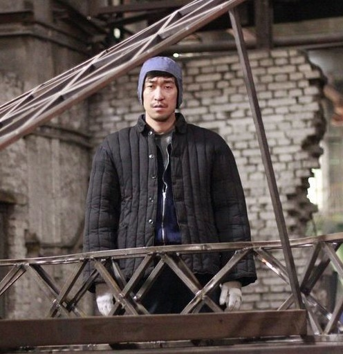
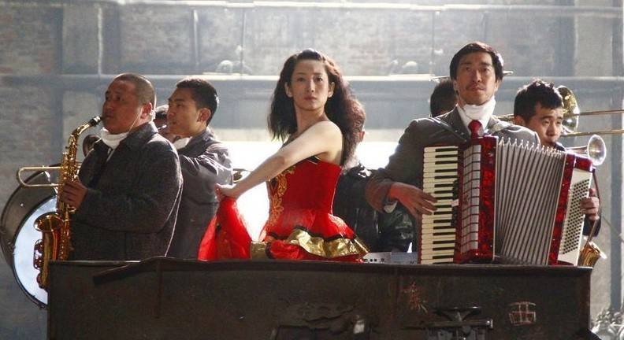

<!-- # ＜玉衡＞父亲的铁西区 -->

**《钢的琴》犹如一次美好的会议，一张记载着辉煌的照片，它从废弃的工厂机器中缓缓升起的瞬间，便有着让人肃穆致敬的仪式感。这种感受让人想起无数被历史碾过的群体，那些悲壮与伤感永远是人们愿意记下的故事，《最后的武士》讲的是这样，《再见列宁》同样如此，在大环境的变迁之下，个体带着近乎固执的尊严。**

# 父亲的铁西区

## 文/马特（北京师范大学珠海分校）

这是一部我看过的最好的国产电影，虽然故事情节本身不是很新颖，有点参考维托里奥��德��西卡的《偷自行车的人》和塔尔科夫斯基的《压路机和小提琴》，不过这却是让我内心最为触动的一部电影，因为这部电影太让我想起我的父亲年轻的时候。

影片一开头，浓厚的苏联工业化风格的建筑，还有那首悠扬的苏联民歌《三套车》，一下子把我们的思绪带回了那个属于工人的时代，也一下子把我带回了家乡沈阳，那个东北重工业城市。尽管影片在鞍钢拍摄，却始终让我把它当成沈阳铁西区，那个承载我父亲青春的地方。影片中浓郁的社会主义时代的东欧和苏联的风格，带着那个时代的烙印，轻快的手风琴伴奏和油画般带着诗意的工厂图景。如果说苏联带给中国最大的贡献，我觉得应该是带来了一种不同于传统的美学与艺术，一种可以被多数劳动者接受，不再属于极少数贵族的美的价值：来自俄罗斯大地那种漫长厚重承载着这个民族诗一般的艺术情结。整部影片以乐器为主题，把配乐当成语言，而有一个点就是无论是女儿想要的钢琴还是主人公擅长的手风琴，都不是中国传统乐器，都是来自于苏联的渲染与影响。

而这种对苏联文化的好奇与追捧恰恰是这个国家的民众一次集体启蒙。从来多数中下层民众都是保守的，难以去了解外来文化，而从前的启蒙也仅仅限于知识分子当中。但是新中国建立后对苏联的追捧确实使普通劳动者第一次真正去主动了解外来文化，主动去追求一种不同于以往的美感。虽然这种美的追求中断了一段时间，看过《天鹅湖》的中国人连野鸭子都吃得不剩，但这种美的感受却一直留下来，延续至今。

那个时期的工人是带着美感的，一种工业化的力量美学之外，还有一种特别的文艺范儿。在新中国初期的那三十年里，工人是一个带着优越感的群体。虽然不比知识分子，但大企业的生产方式内容决定了工人是需要一定文化水平的。而且公有制带来的是单位包办的高福利，无论是医疗还是教育都是有保障的（三年饥荒也没听说饿死过城市工人的），这就为青年工人中文艺范儿的形成奠定了经济基础。而且共产党长期以来的文艺宣传模式也潜移默化地渲染了对于美感的崇拜。前进帽、皮夹克、呢子大衣、手表、自行车、围巾、大背头这些属于那个时代工人阶级的美学元素，在这个影片中完美地表现出来。

即使是失业后贫穷潦倒，这种美感的影子仍然没有消失。女主角家里养的很多绿色植物、男主角组织表演时的西装革履，这都是一种固执的生命力。在另一部电影《人间狗镇》里，女主角无论受到其他居民如何的凌辱，都精心地收藏着一套瓷娃娃，这种审美就是一种生命的象征，只要还有对于美的追求，人就不会被打败。

整个故事带着一种小人物在时代变换下无可奈何的没落与艰难，但绝对不会像《七武士》那般悲壮，反而更像是《当幸福来敲门》里面一样，一种带着生命力的乐观。导演用一种话剧版的夸张与荒诞表现出了那个时代的真实感：工厂荒废，有的被拆除，有的被卖掉，成千上万的工人失业，曾经的国家名义上的主人不得不为了生存艰难奔波。然而现实与梦想，最大的区别是什么？和《钢的琴》相比，另一部备受好评的国产电影《让子弹飞》反而显得有些矫情，无非是新上任警长击败地方恶棍这种老套的美国西部片情节。梦想有时候是很苍白的，而现实却往往带着难以征服的活力和动人，即使在最苦难的时候，也会有感动和美，还有艺术、爱情与友谊。其实到了影片的最后，钢琴有没有做好已经不重要了，因为在这个过程中，我们已经看到了太多美好的东西。

《钢的琴》带着一种对工业时代辉煌的缅怀，故事只能发生在那个特定时期，无论是农民还是小市民，很难能联合起来做一件事情，只有工人才可以。与其说他们是为了完成主人公的心愿，不如说是弥补自己空缺已久的工人阶级的优越感。从汪工鼓动大家进行保卫烟囱的动员大会到最后所有人目送烟囱的最后一程，他们体验了自己在社会转型下最后的被消解和被遗忘。《钢的琴》犹如一次美好的会议，一张记载着辉煌的照片，它从废弃的工厂机器中缓缓升起的瞬间，便有着让人肃穆致敬的仪式感。这种感受让人想起无数被历史碾过的群体，那些悲壮与伤感永远是人们愿意记下的故事，《最后的武士》讲的是这样，《再见列宁》同样如此，在大环境的变迁之下，个体带着近乎固执的尊严。

如果说现实的崩塌是生活妥协与自我慰藉的悲歌，那么在我们时代前进的路上，一路歌声不断。那些我们一直传唱的苏联歌曲依旧不变的悠扬与悲伤，唯一变化的是到了今天，我们为之忧伤动容的原因潜移默化地转嫁到对时代的感怀上了，除了情感上的怀旧，更多的是对过往时代的一种凭吊和祭奠吧。然而怀旧或许也只是一种奢侈，这个时代没有给我们足够的时间怀古伤今，因为现实重重地压在我们身上，那些理想、激情早已被现实的巨轮碾得支离破碎，当我们拼凑起那些碎片，我们才会发现，那些我们以为坚固的东西是那么的脆弱，但是我们只能放下满手的碎片，微笑的告诉自己，生活还是要继续。

《钢的琴》不自觉地为我们还原了一段集体回忆，但是我想它更多的是剑指当下，导演的镜头没有选在发达的沿海，也没有指向萧索的西部，它选择了东北，这个饱含整整一代中国人报国之梦的重工业基地，它曾经是共和国的骄傲，而如今却略显破败颓废，除去虚假的繁华，更多的是那些倒闭的工厂、为生活挣扎的失业工人，还有那曾经的一腔激情和一片狼藉的现实残骸。感谢导演，感谢他把虚浮到令人作呕的中国电影镜头重新放到了我们普通百姓的身上，感谢他艰难的为我们呈现上了一幕我们自己的优秀新现实主义电影。

这部电影带我回到了小时候，那个我父亲还年轻的时候，他工作的铁西区工厂，尽管我一次也没去过，但那些感受却深深烙印在记忆里。那种父辈们的青春与欢乐，那种与金钱和地位无关的骄傲，那种活力与内心的宁静。如今工厂都倒闭了，父亲也老了，那个属于他的时代过去了，带着无可奈何与失落过去了。

（采编：麦静；责编：麦静）
