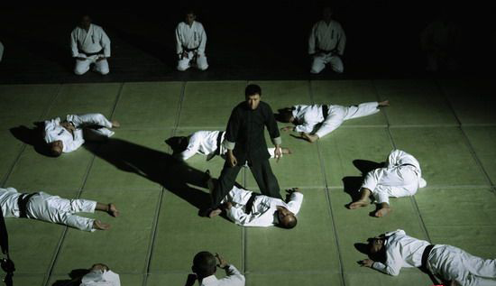

<!-- # ＜开阳＞关于擂台比武的意淫 -->

**擂台比武本身就是一种意淫。你就是再多赢几场比武，弱国还是弱国，弱国的心态还是弱国的心态。**

# 关于擂台比武的意淫

## 文/张许平（辽宁石油化工大学）

最近看了一部功夫电影《叶问2》，是甄子丹主演的。梁朝伟主演的《一代宗师》好像还没有出来吧。许多影评都说这部电影很精彩，情节丝毫不拖泥带水，打斗更是精彩绝伦。说实话，我觉得这部功夫片最失败的地方就是它的打斗——21世纪的功夫电影却丝毫没有超越上世纪70年代的李小龙功夫片的水平，而李小龙时代的拍摄水平如何，大家看看同时代的功夫片就知道了——武打动作跟唱京剧比划差不了多少。而且一部电影，哪怕是功夫片，如果只是炫耀打斗场面的话，这部电影就实在缺少看头，还不如去看专业的K-I或UFC的比赛。

就以《叶问2》为例，圆桌比武在宣传片里被渲染得神乎其神，但实际一看不过如此。如果拿来和李小龙的《猛龙过江》里面和罗礼士在斗兽场里的比武相比较，我们首先发现的是《叶问2》里面的比武缺少一种情绪的渲染。这个很重要，以前的比武和现在的散打比赛不一样，差不多都是生死决斗，小说里面的“点到为止”，高手之间很难做到，因为高手比武，都是拳拳皆可致命的，怎么可能是点到为止呢？这种场面渲染气氛几乎是必需的，而且，最好是要刻画人物在激烈比武的时候的心理状态。可惜在《叶问2》里这两个问题都被忽视了。我们看看《猛龙过江》里面斗兽场比武的气氛渲染，再回头看看《叶问2 》，感觉叶问去洪振南那里简直就是去做客顺便切磋了一下，儿戏一般。

功夫电影也是电影，当年功夫片的革新家李小龙就已经很明白这一点了，《猛龙过江》是1972年的电影，那时候功夫片还处于起步阶段，李小龙就已经懂得利用多种手段来渲染比武时的紧张、激烈的气氛了。还有就是李小龙在打斗时候的表情，紧张中又有极度的亢奋，看起来很近似于人真正到了拼命时候的心理状态。《叶问2》这一点做得真的很差劲，叶问站在圆桌上比武，简直就是闲庭信步，也太有大师风范了吧，这就是人物刻画的失败了。还有就是《叶问2》里面的一个很失败的尝试，也许导演真的有心在圆桌比武那一段拍出各个门派的不同风格的打法，可那帮演员实在太业余了。第一个上去的，先是摆了个拇指捏住食指的pose，这个好像是螳螂拳里面的手型，接着他又来了个好像是白鹤亮翅，我又怀疑他是白鹤门的，白鹤门在广东一带有些名气。但这位哥们的打斗好像既没有螳螂门里面的勾搂踩挂，也没看出这位演员打出了白鹤门的风格。

当然，也许我没什么见识，看不出人家是什么门派的。不过第二个上去的郑师傅，很明显是八卦门的，上去就走行步，还来了个回身穿掌。我不会八卦掌，不过我见过成都翁邦森老师的八卦掌。说实话，那位演郑师傅的演员的八卦掌，实在太业余了。趟泥步走得扣扣索索的，很明显是气没沉下去。八卦掌号称帝王拳，有种雍容沉稳的气度，这位郑师傅的水平，说实话，哪有有半分帝王拳的风范，就是一个初学者的水平。按理说这位郑师傅不是什么重要的演员，导演实在应该找个真正会八卦掌的来打出八卦掌的风格的。

顺便说一下，《猛龙过江》是李小龙自编自导自演的，那时候的李小龙，论演技他没甄子丹演电影的时间长，论导演他更比不上叶伟信经验丰富，要论特技，那时候的拍摄水平实在没法和现在比。而李小龙在拍《死亡游戏》的时候，就很成功地拍出来各个门派不同风格的打法。李小龙的做法是把他那些武术界的朋友请过来拍武打戏，这个做法值得拍功夫片的导演学学。

然后再说说民国时候的武术家。香港拍的功夫片几乎尝试过了各种种类，唯独有一个种类没有认真的尝试——那就是深入地刻画一下民国时期许多武术家的内心，以及他们所处在那个时代的诸多无奈。香港拍了很多武术家的传记电影，叶问也走的是这个路子。不过中国人拍传记电影有个毛病，尤其给一些大师们拍传记，光说好话，人物都是无比伟光正，使得这些大师们都和CCTV里面的国家领导人一个面孔了。这个瓶颈，好像从功夫片起步的时候就存在，到现在也没有突破。其实武术家也是人，他们也有着自己的无奈，并非如同关德兴李连杰演的黄飞鸿一般处处风光无比、德高望重。这方面好像一直没人注意过，大家都去看那些大师们的风光故事了。

我不知道现在还有没有人记得八十年代的时候有部很长的武打电视连续剧叫《康德第一保镖传奇》的，据说这部电视剧当时达到了万人空巷的收视水平。可惜当时我家还没有电视，等我家有电视的时候，这部电视剧又早就禁播了——原因是中宣部认为康德是伪满皇帝溥仪的年号，所以不能用来做电视剧，即使你宣传康德皇帝的保镖的故事也不行。不过这部电视剧也真的很肤浅，就是说当时逊位的溥仪皇帝，投靠日本人之后却对自己身边的日本保镖不太放心，就想找个中国保镖，结果就找到了当时的八极拳名家霍殿阁，于是霍殿阁就忠心耿耿地保着这位窝囊的皇帝。霍殿阁本来是个农民，功夫倒是很好，但是目不识丁，在村里混不下去了，就跑到天津这样的大城市去打工。这就是当年所谓的走江湖。当时霍殿阁的师傅是江湖上赫赫有名的神枪李书文。神枪李书文当年在天津混江湖的时候，他的职业曾经是一家银行的保安，晚上值夜班那种。当时的李书文已经被公认为是民国时期的第二高手了（第一高手是孙禄堂），号称“神枪李”（不是手枪步枪或者机关枪的枪，而是红缨枪的枪，李书文不是双枪老太婆，玩的是冷兵器），日子尚且过得这么惨，当时武术家的地位如何，就不难想象了。

当时在天津混江湖的还有现在八极名家吴连枝的父亲吴秀峰。吴秀峰功夫非常好，人也很清高，理论上可以说是典型的大师级的高风亮节的人。他清高到什么地步呢？50年代的时候，吴秀峰家里穷得一塌糊涂，这时候有几个徒弟，凑了2000块钱送给吴秀峰，算是学费，想学吴秀峰的“六大开”，六大开是八极拳里的六个动作，据说厉害无比。当时一个工人一个月的工资还不到30块钱，2000块钱可算是一份大礼了。可惜吴秀峰甩下一句“我的东西不卖”，然后就走人了。他的六大开，到他死也没几个人学会。但吴秀峰解放前在天津混江湖的时候，他的职业只是码头的苦力，还有份兼职，兼职就是在公园里教拳。八极拳朴实厚重，注重实战，缺少花招，总共也没几个动作，几天就教完了，教完了徒弟就不来了，徒弟不来了就没人孝敬吴秀峰了——吴秀峰虽然讨厌赤裸裸的花钱买艺，但徒弟的孝敬他还是要收的，不然他日子没法过啊。为了留住徒弟，让徒弟不断地孝敬他，吴秀峰就不断地编套路来教学生，光是小架就12路，学完这12路小架，还有四郎宽，伏虎拳，罗汉功，扶手对练，披挂掌……好几年也学不完。但吴秀峰的徒弟里面会打的可真没几个，光学套路了。为此吴秀峰没少招人诟病，天津的武术界曾送他一顶“高产作家”的帽子，自然不是表扬他了。

在那个时代，一个大师的清高和市侩，就这么奇怪地结合在一个人身上了。此外叶问也说过“我的东西不卖”这句话，当时是李小龙已经在美国混得很油了，还自创了截拳道，为此和永春门的师兄弟闹得很不愉快。但是叶问本人却还是很大度的，从来不说李小龙的不是。其实李小龙并没有学到多少咏春拳的东西。李小龙回香港后曾经向叶问提出，他用一套两层的小洋楼，来换取叶问的全套咏春拳的练功录像。当时叶问就甩下一句“我的东西不卖，你想学，过来我教你”。当时叶问虽然不富裕，但并没有穷到交不起孩子学费的地步，当然也更不会像电影里面甄子丹演的那样，一脸谄笑地伸手跟学生要学费了。要知道，这在当时的武术界里，是非常为人所不齿的行为，叶问好歹也是大师级别的人物，饿死也绝对不会这么作践自己的名声。这些电影里的硬伤，显然是对武术家的心理很不了解所导致的。

再接着说这个满脑袋高粱花的霍殿阁先生。他从一个土里土气的农民一下子被溥仪聘请为“皇帝武师”，顿时有一步登天的感觉。这哥们召集自己的族人和徒弟，给溥仪组织了一支“护军”，负责保卫溥仪的安全。这当然让溥仪的主子日本人看起来很不爽，尤其是看着霍殿阁整天教一帮人耍个大刀片，更是如鲠在喉（日本人比较忌讳这个大刀片，因为他们在和中国军队拼刺刀的时候老被中国士兵的大刀片顺着脖子根斜劈成两片，导致日本兵见了大刀片有心理恐惧效应。而负责训练中国军队士兵耍大刀片的，多半都是当时的武术名家。例如尚云祥和他的弟子们曾经训练29军的大刀队，只教一招缠头裹脑，士兵只需要练习一上午，下午就可以在战场上施展，很多士兵都把刀刃砍卷了。于是日本人就给每个士兵发铁围脖，拼刺刀的时候戴在脖子上）。于是日本人就想找个借口，例如霍殿阁功夫不好，不能胜任之类把这支护军解散。于是日本人从国内找来几个高手专程来和霍殿阁比武。可惜日本人的武师功夫太潮，比武好几次，一次也没赢。后来日本人还是找了个借口，把霍殿阁的护军解散了，当然原因比较激烈，两家打了一架。有兴趣的可以到网上搜“护军事件”，总之这事情让霍殿阁的忠君报国心愿彻底泡汤了。霍殿阁忧急交加，不久就气死了。霍殿阁的事迹在李国雄的回忆录《伴驾生涯》里有过提及，而在溥仪的回忆录里面，只提到了护军事件，连霍殿阁的名字都没有提。而霍殿阁这个大字不识一个的农民（后来官拜侍卫中将），却是对溥仪最忠心耿耿的奴才。我觉得这是很不公平的。霍殿阁虽然目不识丁，但是他身为武术大家，在“忠义”这方面，绝对胜过溥仪身边的任何一个大臣，可以说霍殿阁的护军是溥仪身边的最后一道防线，其实也是唯一的一道防线，不然日本鬼子会变着花样地找霍殿阁的麻烦吗？

后来溥仪被送到抚顺战犯管理所劳改，霍殿阁的一个徒弟毛洪恩，曾经是溥仪内务府的司机，50年代跑到抚顺落户了，就住在离溥仪劳改的战犯管理所不远的地方，忠心耿耿地伴随着他的皇上。后来霍殿阁传下的八极拳，在抚顺也就留下了一支。80年代播放《康德第一保镖传奇》的时候，毛洪恩还曾晚上看完电视，白天教拳的时候给徒弟们讲当时的轶事，颇有白发宫女谈天宝的味道。后来看一纪录片，说川岛芳子并没有死，而是化名芳姥姥在长春一直活到七十年代。至于毛洪恩有没有去找芳姥姥来个生死大比武，给他师父霍殿阁报血海深仇，那我就不知道了。总之霍殿阁的悲剧，就在于他的一腔热血换来的却是无限悲凉，被历史活生生的给耍了。

当时武术界人士有很多抱着报国心切的心情参与政治的，例如朱国福、薛颠、马英图、李萼堂等，但大多下场极其悲惨。朱国福年轻的时候在上海滩曾经在擂台上把一个货真价实的白俄拳手干趴下，也是苦战得胜。当时朱国福只是一个普通的农民工，却有胆子和黄金荣手下的流氓一年之内干了两百多场架，几乎天天打架，场场必胜，最后打得黄金荣的手下都不敢找他麻烦了。这是何等的气魄！比什么马永贞牛逼多了（历史上的马永贞原是回民，擅长弹腿，在上海滩打了几架后名声大振，成为上海滩的一霸。后来想霸占一个商人的几头牛，被人家石灰撒眼，乱刃分尸了。这就是马永贞的故事，后来被好事者编成评书演义，越演越玄乎）。后来这位农民工朱国福先生，凭一身功夫，干到了中央国术馆的教务处长，还在国民党的军队里面混到了少将军衔，在军队中大力推广大刀术和劈刺，为抗战实实在在地出了一大把力气。而且农民工出身的朱国福还极有眼光，和白俄拳手比完赛后也意识到了拳击的厉害之处，在国术馆中推广拳击，增强学员的实战能力，导致后来在杭州召开的全国武林大会，获胜者多半是他的学生。这位形意拳名家朱国福先生，抗战胜利后就基本淡出官场，定居成都了，建国后却一直过着提心吊胆的日子。据说原因是当年他弟弟朱国帧，是湖南省主席何健手下的教导队队长，曾经带人抓了一个叫杨开慧的女人，后来这个女人的老公，造反成功，当上了毛主席这么个大官，于是朱国福先生的日子，就很紧张了，紧张到什么程度呢？朱国福先生在建国后从来没敢收过任何徒弟，也不敢大张旗鼓地教拳，他的徒弟王树田敢收弟子，他却不敢，胆战心惊的，当年在上海滩大战流氓大亨黄金荣的气魄消失的无影无踪。文革期间朱国福先生被活活整死，极其惨烈。看来共产党在整人方面确实比黄金荣这样的流氓大亨要牛逼多了。

霍殿阁也算是个很典型的例证。他做了溥仪的武师也好，保镖也好，一心要和日本人争口气，甚至唆使徒弟找日本武士比武，给他的皇帝溥仪出气，也算是忠义可嘉了，结果依旧逃不出命运的圈套。可惜《康德第一保镖传奇》并没有正视他的悲剧根源，更没有刻画这位武术大家内心的诸多无奈，光是拍他怎么一次次风风光光地和日本人比武了。

况且擂台比武本身就是一种意淫。你就是再多赢几场比武，弱国还是弱国，弱国的心态还是弱国的心态。霍殿阁和他的护军弟子没有少和日本人比武，结果丝毫没有给溥仪挣来一份面子，反而惹得日本人对溥仪越来越猜忌，控制得越来越严。据霍殿阁的弟子毛洪恩讲，溥仪在伪满皇宫里面的日子，比电视剧里拍的要惨得多了，日本人变着法地羞辱他，霍殿阁的种种努力，正如同蚍蜉撼大树一般，武术大师在政治面前，脆弱得不堪一击。《叶问2》接着用擂台比武这种老掉牙的方式来意淫，实在是最大的败笔。

最后再说一下当年的擂台比武。我不知道大家有没有看过一部武打片，好像是叫《武林志》的，里面主人公叫东方旭，原型是韩幕侠，里面的女主人公是戈春燕演的，戈春燕八卦掌练得很好，80年代拍了几部武打片，几乎就是八十年代的杨紫琼。这部电影几乎就是韩幕侠的传记，韩幕侠的徒弟里面名气最大的一个叫周恩来，韩幕侠虽然不是皇帝武师，也算是丞相武师了。韩幕侠曾经打败过一个俄国拳师，当时在报纸上也吆喝了好一阵子，实在是给国人争了光。但实际情况是，那个俄国拳师康泰尔，只不过是个马戏团里面耍把戏的。韩幕侠也知道那个傻大个其实算不了什么角色，但还是大张旗鼓地去比武了。原因就是韩幕侠所在的中华武士会——当时的一个企图联络武术界人士反清的组织——在日本表演剑术的时候，被一个貌不惊人的日本剑客打败了，这让中华武士会很没面子，于是这个到处吹牛皮的康泰尔，就成了中华武士会挽回面子的最好机会。于是在派了韩幕侠这个顶尖高手去和康泰尔这个马戏团耍把戏的大战了若干个回合后，康泰尔被打得口吐鲜血，心服口服，然后在报纸上大肆吆喝，扬眉吐气。其实当时的很多场与外国人的比武，外国来的都是一般的拳师（人家有名气拳师的只打职业比赛，和今天的泰森霍利菲尔德一样），而中国最后搞定他们的都是选派的顶尖高手。这本身就很不对等。

对了，最后说一下韩幕侠的下场，电影里面没有拍出来。韩幕侠晚年回家教拳，日本人打进来了，有个日本军官，很仰慕中国的大刀片，三番五次地跑到韩幕侠家里要请韩幕侠教教日本兵怎么个耍大刀片，结果韩幕侠先生很不乐意，又嘴笨，不会说什么婉拒的话，当然也不敢像电影里面的共产党员一样被捕受刑后说一些宁死也不去或者宁死不当亡国奴之类的豪言壮语，于是就找来一把刀，自己把自己的一个膀子给卸掉了，成了残废人，然后告诉日本人，他是废人一个啦，教不了大日本皇军的士兵了，这事情才算完。一个武术大师的高风亮节，也只能通过这种无奈而懦弱的方式表现出来，而这又是现代的功夫电影最不愿意提及的。

当年金庸用红楼梦的笔法来写武侠小说，才使得新派武侠小说兴盛起来，功夫片该怎么拍，我觉得应该学学金庸的手笔了。

（采编：麦静；责编：麦静）
