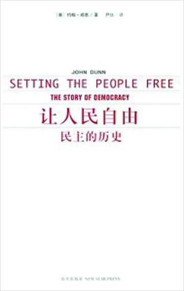

<!-- # ＜北斗荐书＞本期主题：《让人民自由：民主的历史》读书笔记 -->

**民主是一个众所周知的单词。在当代社会，民主这个词语被提及的频率远远高于这个词在过去数百年中的情形。而在当今经济社会高速发展并且面临一系列社会问题的时期，民主这个词语似乎被更多关注公共与社会问题的人们所提及。似乎更多的人希望通过民主来解决中国社会转型期的种种问题。然而，在我们谈论如何运用这个词语之前，我想我们首先应当回答如下问题，只有这样，我们才能更为细致和全面地讨论这个词语及其功效——民主这个词从哪里来？为什么我们会如此广泛地讨论到这个词？民主制度又是什么？它又会给我们的生活带来哪些影响？这些影响又是否在总体上符合我们对自身价值判断及利益实现的关切？**

# 本期主题：《让人民自由：民主的历史》读书笔记

## 荐书人 / 王泓崧（上海海事大学）

#### 推荐书籍（点击蓝色字体书目可下载）：

**[《让人民自由：民主的历史》](http://ishare.iask.sina.com.cn/f/18144571.html)**

#### 一、引言

民主是一个众所周知的单词。在当代社会，民主这个词语被提及的频率远远高于这个词在过去数百年中的情形。而在当今经济社会高速发展并且面临一系列社会问题的时期，民主这个词语似乎被更多关注公共与社会问题的人们所提及。似乎更多的人希望通过民主来解决中国社会转型期的种种问题。

然而，在我们谈论如何运用这个词语之前，我想我们首先应当回答如下问题，只有这样，我们才能更为细致和全面地讨论这个词语及其功效——民主这个词从哪里来？为什么我们会如此广泛地讨论到这个词？民主制度又是什么？它又会给我们的生活带来哪些影响？这些影响又是否在总体上符合我们对自身价值判断及利益实现的关切？

显然，以上这些问题我们必须弄清楚。现如今不少人往往仅仅停留在对“我们需要民主”、“民主是好的”这样简单概念的认同，甚至更进一步会提出“随地吐痰是缺乏民主素养表现”这样的观点，但又不能将什么是“需要民主”及“民主为什么是好的”做一个清晰而准确的回答，同样更无法用逻辑来论证“民主和随地吐痰之间的关系”。如果这种情况一直持续下去，我们是根本无从知道我们正在广泛谈论的这个词对我们社会带来的功效的。

而笔者选择此书，也是因为机缘巧合。今年年初一次在上海季风书店参加讲座活动时，偶然在新书推介中看到了美国政治学家、英国剑桥大学国王学院荣誉教授约翰·邓恩（John Dunn）先生的著作《让人民自由：民主的历史》（_Setting the people free: the history of democracy_），这本书的中译版由中国政法大学政治学讲师尹钛先生翻译。邓恩教授擅长通过对历史的研究，用“历史透视法”在历史语境中还原政治制度的变迁以及政治思想家的真实政治意图。而对笔者而言，选择此书也是非常适当的。因为如果要回答如上的问题，我们必须要将民主制度的历史来龙去脉有一个完整而系统的了解。而一部阐述民主变迁史的学术著作，无疑是我们进一步研讨民主制度变迁和意义最重要的基础。

当然，如果我们现在来看，民主和民主制度可以说是同一个概念，所以在接下来的行文的表述中，这两个词的表述会相互指代。

#### 二、书本大致线索脉络及其观点

本书分为四个部分，第一部分为前言《为何是民主？》，就民主为何在当今社会成为显赫的名词而出现提出设问。第二部分为第一章《民主首次光临》，介绍了起源于古希腊的民主及其在当时的历史变迁以及民主在当时的语境下和当今究竟有何不同。第三部分为第二章《民主再次光临》，介绍了民主在18世纪的法国大革命和美国独立革命这两次重大人类历史变革情况中重回人间的相关历史情况。第四部分为第三章《热月的长长阴影》，着重介绍了罗伯斯皮尔等法国大革命中的代表人物如何定义民主这个词，及美法等国对其的不同解读和影响。第五部分为第四章《为何是民主？》——这个标题和本文前沿一致，就人类当今社会为什么选择这个词作为一种普遍的社会制度进行思考与反思，现在的民主制度究竟与其理想状态相比，是变得更好了还是更坏了？而我本人也将在最后谈谈自己对这本书以及这本书所提出问题的一些看法。

#### 三、为何是民主？

在本书前言部分《为何是民主？》中，作者就整本书所要探讨的问题提出两大设问。第一个设问是：民主如何作为一个单一的普世标准和如何按照这个标准来表达进而存在人世间的？第二个设问是：究竟是什么赋予了民主这个古词以新的动力，使其重新被激活，并在当代的政治话语体系中取得了胜利？

关于以上两点，作者都将在正文部分通过讲述民主在古希腊第一次光临人间、民主在18世纪的法国和美国革命中第二次重返人类的政治舞台、法国大革命时期罗伯斯皮尔为代表的雅各宾派对民主的近代化定义以及热月党人对此的激烈互动这三个故事及最后的总结来进行回答和探讨。

#### 四、雅典民主：人类政治的初探索

这一部分即第一章《民主首次光临》，作者着重介绍了民主这个词语第一次来到人间的相关情况。这里我必须要插一句，本文所谈论的中文词汇民主对应英语的Democracy，并不涉及探讨中文的民主之词义的来源。

##### 1、古代民主起源的概况

民主这个词最早来源于古希腊的demokratia。最早见诸的文字来自于古希腊的著名历史学家修昔底德（Thucydides）的著作《伯罗奔尼撒战争史》。在这部著作中，修昔底德将古希腊著名政治领袖伯利克里（Pericles）在政治演讲中对于民主的描述第一次记载在了文献上。伯利克里的演讲并未赞扬那些在战争中取得杰出功勋的英雄们，而是将赞美送给了为雅典城邦这一共同体做出贡献的每一个人。按照我们现在对伯利克里演讲的理解，他所谓的民主政体，用邓恩教授的话说是“因其根据多数人而非少数人的利益来管理，就不仅仅是使得雅典城就其伟大；它也让其公民在面临私人争端时在法律面前人人平等”。

这一民主政体最基本的体现就是雅典的公民大会，它是雅典最高的权力机构。雅典人通过至少有6000位全体公民参加的公民大会行驶自己的民主权利：简而言之，公民大会通过抽签产生500人的议事会作为其常设机构主持雅典政治的常务工作。同时，另一权力机构民众法庭则由有意愿参与这项工作的雅典公民中再次用抽签的办法抽取6000名法庭成员。

然而，雅典的民主是否是完美和毫无争议的呢？答案当然是否定的，主要有以下几点。

##### 2、思想家对古希腊民主评议的概况：

第一、即使是古希腊的思想家们在评议其民主制度时也表现出了对于雅典民主的批评态度，这和我们现在主流的思想家们对民主的溢美之词大相径庭。那个第一个记录下民主的修昔底德就认为民主是“将权力赋予穷人，赋予令人憎恶和显然庸常的人，而且非常故意地以牺牲富人的、出身或者殊勋使然的高贵者之权力来这么干”。书中还列举了柏拉图、亚里士多德等人对民主的看法。总的来看，这些思想家们都将古希腊的民主看作是一种卑贱的、倾向穷人而葬送整体公民利益的、糟糕的政治制度。

第二，近代欧洲主要思想家对雅典民主制度也以批评意见为多。作者为我们列举17、18世纪时以霍布斯为代表的思想家们对于民主制度的看法，同样也以负面看法为主。一些想法，比如认为雅典民主是倾向穷人的制度，和古希腊时期的思想家们相同或相近。

##### 3、、作者对雅典民主评议的概况：

（1）邓恩教授总结了为何现代社会看待古希腊民主存在困难的三个原因：

一是政治学本身对于任何政治评判所具有的模糊性，这种评判难以做到十全十美。二是现代人对古希腊民主的相关史料太少。三是漫长的历史本身以及文献资料的转述可能会引起我们对当时状况的误判。

（2）作者认为对于雅典民主能够把握的是雅典民主对于雅典人自身而言也是极具争议的，我将其归纳为以下几点：

第一、对雅典民主制度爱与恨的站队就像对于任何制度一样是存在的。第二、雅典民主起源于富有的地产主和贫穷的家庭之间的斗争。第三、从现代社会我们通常将公民定义为一个国家拥有国籍及法律权利的人民所不同，雅典城邦中的奴隶、妇女、异邦人并未在完全的意义上成为公民，那就更不用谈他们的抽签和演讲的权利了。第四、由于雅典民主的缺陷，那些为雅典社会带来福利的政治领袖也有可能被民众法庭审判进而被流放。第五、邓恩教授再次列举雅典的公民大会同罗马的元老院的不同之处。罗马人并没有认为自己的政治体制是民主政治，罗马的领袖也并非由公民抽签产生。第六、1260年，“民主”（demokratia）这个词第一次进入了拉丁语系统，随后其的影响并非制度本身率先发挥作用，而是在于思想家们对它的争议。因此邓恩教授认为民主并非主动进入历史的意识形态史，而是“被拖进来的”。

#####  4、作者对第一章《民主首次光临》的总结：

以上大致就是作者就民主在古希腊起源在书所阐述的要点。然而，邓恩教教授并没有单纯的以描绘民主在古希腊的历史，而是有自己的归纳与总结。邓恩教授评价雅典民主生活方式的核心内容是以下两点。第一点是“个人对生于斯长于斯的共同体的忠贞依附”，第二点是“和那一共同体为了其自身的安全而非常清醒地依赖着的、不断实践着的、警醒的公众裁断”。而针对前述的内容，邓恩教授又提出了以下问题：

第一，为什么近现代人类思想史会对民主的评议从贬义到褒义？第二，我们选择民主制度来衡量一个国家政治合法性时其背后隐藏的意图是什么？第三，关于为什么选择“民主”这个词作为政治合法性来源？

对于这些问题，邓恩教授在以下几章陆续为我们揭晓答案，他也随着叙述的深入对问题进行了新的补充。

#### 五、近代民主：民主再次光临人间的斑驳岁月

直到17世纪，民主这个词在欧洲依然是一个被广泛鄙视并且不认同的词汇。然而，这一切在18世纪的中后期出现了戏剧性的变化。这也就是本书的第二章——《民主制再次光临》所要展现给我们的故事。此时，民主的故事分别在北美和欧洲大陆的三个地方如火如荼的展开：北美、荷兰与比利时、法国，而民主重回人间重大的政治前提，则是在这三个地方所产生的重要的政治危机。

#####  1、北美大陆对民主的初探索：

在北美大陆，英国当局将债务负担转嫁给殖民地居民成为了政治危机最主要也是最直接的原因。然而，邓恩教授也提醒我们，民主这个词在债务危机产生的时候并没有起到什么作用，它的作用是在北美独立战争之后一系列错综复杂的政治磋商中所逐渐开始产生的。

邓恩教授在书中为我们列举两本能够详尽解读当时美国政治制度民主化的名著。一本是法国学者亚历克西·托克维尔于1830年代在美国游历期间之经历所写下的《论美国的民主》，另一本则是18世纪后期亚历山大·汉密尔顿、约翰·杰伊和詹姆斯·麦迪逊合著的《联邦党人文集》。根据这两本著作的描绘，当时北美殖民地民众意识到沉重的债务负担是对他们正常生活自由的严重威胁，而北美殖民地民众已经享受这种自由有数百年时间了，他们并不想失去这种自由，在他们看来“不受限制的权利永远都是个人自由的威胁”【1】。因而针对英国殖民当局的这一威胁转而采用革命做出反应。

最终，北美赢得了独立战争，紧接着，便是紧张而充满激辩的制宪工作。在1987年5月——1789年9月，北美大陆先后通过了《美利坚合众国宪法》以及保障公民自由权的《权利法案》——而这一切，便标志着美国代议制民主最初的形成。

随后，邓恩教授通过列举《联邦党人文集》等重要史实为我们展现美国形成代议制民主的若干过程及其拥护者的理由。其中以《联邦党人文集》的合著者詹姆斯·麦迪逊的最为精辟和系统。麦迪逊认为，美国需要一个强大的中央政府征收税赋、控制军队、对外缔约，但同时要保证这个中央政府的强大不会像前英国当局那样压榨民众的自由。

然而，要使得这种政体得以存在似乎绕不开政党就政事展开协商。但是麦迪逊也认为，党争会出现政府陷入腐败，社会陷入动乱的可能，他认为这是“播种在人性之中”【2】的。而这种党政会存在于那种类似于雅典直接民主的政体之中，并产生多数人的暴政。针对这种困境，麦迪逊提出了极为精辟的观点，党争这种人性使然的困境不会被祛除，唯一的办法就是控制其后果。麦迪逊由此提出通过代议制民主的方式来解决党争问题。

虽然当时麦迪逊认为这种代议制政体属于共和政体，而不是雅典式的民主政体，但这种代议制政体最终还是被我们称为民主制度了。他所认为的代议制政体和传统雅典民主不同之处基于以下两点：第一，代议制政体的“政府委托给由其余公民选举出来的少数公民”

【3】，这点和雅典公民直接行使政府权力有所区别；第二，代议制政体所能管辖的公民人数相较雅典政体人生更多、国土范围也更大。

邓恩教授在书中还为我们列举了麦迪逊对于雅典民主同代议制政体的其他一些不同意见。首先，麦迪逊将美国的代议制民主同雅典民主在形式上做出了对比。雅典民主更多的是公民直接行使政府权力，只有小部分的官职是通过代议选举进行授权；而美国的政制完全是代议制。第二，麦迪逊认为美国代议制政体相对雅典直接民主具有政制运转上的优势。美国代议制政体可以避免直接民主制度下缺乏理性的决策以及难以统一的意见，可以使得政体运转的足够的冷静和长久，这尤其适合美国这样幅员辽阔、人口庞大的大国。第三，麦迪逊认为雅典直接民主在理论和现实上存在本质性的悖论。雅典直接民主设想通过由人民的“集体智能”【4】进行统治，以求政策完全符合民意，而实际的最终决策并非由全体公民意志组成，而是由公民过半的多数组成，事实并非“集体智能”。第四，针对如上直接民主的缺陷，麦迪逊提出了代议制政体和直接民主在制度机制效果上的区别，这一区别使得代议制政体优于直接民主。代议制政体制度机制的效果不仅通过法律文件得以贯彻执行，更是通过代议政体下政治力量之间的实际协商来解决，这避免了直接民主下公民大会难以前后一致作出不“精分”决策的窘境。而这种代议制所可能出现所谓“多数人暴政”的可能性，则随着美国宪法和法律及其三权分立政体的动态制衡不复存在。

书中也介绍了对于限制选举权危害的认识。他认为，这种情况会使得被剥夺选举权的人陷入和公权力不断斗争的内耗之中。而为防止选举平等权利的落实可能导致那些没有财产的多数对于有钱的少数人产生的威胁，麦迪逊同样提出了两个观点。一是如上所述的分权政体的相互制衡，二是通过教育来提高民众素质，防止暴政的出现。

无疑，这种政体也会存在种种弊端，但是邓恩教授引用了一句话对此予以精辟总结：（这种代议制政体）“可能是任何国家曾想有过的幸福的最大总和”【5】。值得一提的是，麦迪逊并未使用过“代议制民主”这样的词汇。虽然这个政体在我们现在确实被这样称呼，但其本人即使在“余生里也极少流露出对这个词的热心”【6】。

#####  2、民主在尼德兰及比利时：

接下来，邓恩教授将我们的视角引入欧洲。在这里我们首先看到的是18世纪末在尼德兰和比利进行的革命。虽然这两场革命提出了公民自由的口号，虽然民主这个词汇也在这两场革命中被提及，但正如我们现在所见，主导民主这个词成为随后各国政治体制主流的，并非他们，而是美国和法国。然而，邓恩教授在书中认为美国代议制民主政体对一战之前各国政体的影响有限，影响更为深远和榜样作用的，则是1789年开始的法国大革命。

#####  3、法国大革命对民主的贡献：

书中为我们列举了法国大革命前后以雷内-路易斯·达金森（Rene - louis de Voyer Paul-my D' Argenson）、伊曼纽尔·西耶士（Emmanuel-Joseph Sieyès）、托马斯·潘恩（Tom Paine）为代表各派别人物对于代议制或者民主政体的看法。然而，正如邓恩教授所评议的那样，但只有马克西米连·罗伯斯皮尔对于民主制度的论述，是“现代历史上第一次，民主不再仅仅是一种政治是好的转瞬即逝的表现，而成了一整套整治方案的有条理的观念”【7】。作为一个“对人权的强烈的平等主义和激进主义的理解”【8】，罗伯斯皮尔不仅批评对公民选举权进行限制的法国国民议会，更提出了如上所述对民主的那整套系统的观念。当我阅读到这里时，也不禁为其雄辩而深深折服，让我们来看一下他对民主所作的完全不同于雅典民主的全新而通俗定义：

民主国家乃是这样的国家：在那里，作为最高主宰的人民受自己制定的法律所规束，自己去作力所能及的一切事情，而通过自己的代表去做力所不及的一切事情。【9】

这一理由和我们现在在为代议制民主寻找合法性时有多么的相似！是的，我们完全可以说，这一理由的源头正是来自罗伯斯皮尔。由于篇幅限制我不能在此一一列举，我相信通过阅读邓恩先生的著作本身以及相关评议，我们一定能更好地理解罗伯斯皮尔对于代议制民主那一系统性论述的伟大的创新。

然而，罗伯斯皮尔的故事并没有终结。他将恐怖手段视为保证平等、自由和民主的手段，而这种恐怖，则是我们所熟悉的“雅各宾派专政”时期的白色恐怖了。

#### 六、现代民主：利己主义制度的压倒性胜利

由于本书未划具体分节，为方便阅读，我便对其进行梳理。在接下来的第三章《热月的长长阴影》中，我将本章划为两小节。在第一节中，邓恩教授为我们评议了法国和美国对于民主的两种不同解读。第二节则是就民主为何获得胜利进行了评议，邓恩教授同时也详细说明了为何在一战前法国的民主思想影响更为深远，而为何到了现在，美国的利己主义代议制民主“暂时”取得了全面胜利的原因。

#####  1、美法两国对民主的不同解读：

**

（1）法国：**

我们首先紧接之前对于罗伯斯皮尔对民主定义的评议，他将民主和共和视为了一个同义词。即使罗伯斯皮尔只给民主下了定义而对为何这样定义的正当性缺少系统的解释，但是，他的这种定义毕竟对我们现在对民主制度是什么以及什么样的政权具有政治合法性产生的观念了巨大的影响。而邓恩教授认为罗伯斯皮尔当时采用民主这个词语的原因，则是为了避免法国公民共同体对于贵族制和君主制的臣服。也就是说，罗伯斯皮尔将民主制（在他心目中等于共和制）、贵族制和君主制做出了区分。而邓恩教授认为，之所以罗比斯皮尔当时提出采取的民主制是后来被称为的代议制民主，按照麦迪逊的观点就是因为法国是一个幅员辽阔、人口量大的国家，它不得不这么做。

然而，即使罗伯斯皮尔对民主有着如此独到的见解，但是他那种对于平等的渴望所导致的雅各宾派专政及经济运行本身出现困难这两者间相互作用所导致的社会混乱，使得他政府最终在1794年被热月党人被推翻了。

虽然雅各宾派丧失了政权，然而，那些追随着罗伯斯皮尔式平等的人们并没有从法国历史舞台消失，以格拉古·巴贝夫（Gracchus Babeuf）等人依然在热情的“为平等而密谋”（Conspiracy of Equals）【10】着。他们不仅在其核心观点中继续坚持认为平等是最终极的改革目标（看到这里其实我也大致能想到为什么《民主四讲》作者王绍光教授也会把平等作为终极目标了）——这个平等的改革目标当然包括政治权利全面平等的那种民主了，而且，他们还为自己建立了一个敌人，这个敌人就是利己主义制度及其拥护者。而有关这部分，则又回到了美国的故事。

**（2）美国：**

与法国不同，美国的代议制民主的出发点并非平等，而是利己主义。对此，邓恩教授的评述极为精辟：“（美国）对明显的特权的每一现存残余都感到不安，而面对最令人晕眩的经济上的鸿沟又默不关心，对最明显的财富之类的特权全面妥协”【11】。美国人认同政治身份的平等，但对于经济平等在政治上处理的方案则表现出强烈反感。重要的原因就是美国这种自由的经济制度能够让其民众通过自我奋斗及竞争获得利益。

当然，美国拒绝全面平等的制度并非仅仅因为利己主义制度的好处，同样也有平等派们在政治选举过程中的失败以及古典的平等民主的自身缺陷。一个正如之前麦迪逊所言，那种民主难以适应美国这个庞大的国家规模。另一个如邓恩教授认为，就是在历史上所表现出来的，“平等的目标一旦实现，它就会得寸进尺地憎恶那些仇视它情感和观点”【12】。虽然在人类历史上有关全面平等带来的害处诸如“多数人的暴政”在当今社会并不存在，但是，那种类似的，包括雅典时期所存在情况则是事实。我个人认为这种担忧当然有现实和历史背景的道理。

而在随后，那种基于利己主义制度的民主就在全世界开始慢慢地铺开其认同人群了。

**（3）总结：**

在介绍了法国和美国对于民主的两种不同解读之后，作者当然要开始对以上种种情况进行总结。邓恩教授首先认为，民主不仅是一个单词，也是一种政治价值。而这种政治价值甚至连伊朗的伊斯兰政教合一政权都要拿过来用用，这种种说明了大部分情况下那些即使不认同民主的人也不敢公然反对。

那么，为何会导致这种情况呢？邓恩教授为我们列出了他的两个追寻这个问题的线索。

第一是越来越多的国家愿意将自己说成是民主国家，民主似乎成了一种普遍的政治制度。该线索的原因可以认为民主本身就是一种需要说服被统治者，以此使得统治者获得权威的制度。而说服并非强制更能让人认同。并且说服本身不仅从雅典时期的政治状况到现在一直存在，而且说服民众本身就难以做到像阴谋论那样弄个弥天大谎而不被如此广大的人群所识破。

第二是民主作为一个词汇，其给民众带来的实际好处很大。这一好处主要基于现代民主在经济层面的概念从要求全面财权平等被替换成了保障政治身份平等，但不主张经济平等，而在经济上则主张利己主义的态度。而这种利己主义态度的后果已经被证明在经济上让人们获利了。但同时，邓恩教授并不认为这种经济上的好处是类似马克思观点中“客观性的规律”，他指出，“经济体制永远都处在统治者的摆布之下”【13】。

而邓恩教授并没有止于这点，他继续往下给我们推导。民主的胜利不单是词汇的胜利。他的胜利不仅在于这个词汇概念被替换后民众从市场经济中的获利，也在于“他主张最终一定要有人民来决定该做什么”【14】。

邓恩教授继续往下深入分析，他将民主胜利的原因和民主在漫长历史中被重新激活的原因作了区分。前者如上所述，后者他认为从历史复杂的因素角度很难去把握，但他也提出四点能够把握的东西。第一，为何雅典时期和在当代，民主这个词的含义发生了如此大的变化。第二，为何现代民主的原则和其政府形式和古希腊以及罗比斯皮尔他们的概念有如此大的区别。第三，为何冠以各种形式和称呼的所谓民主政体在全世界铺天盖地的扩展出来。第四，为何获胜的政体挑中了民主这个希腊词。邓恩教授认为这个问题的回答相对复杂，而他则在第四章《为何是民主？》中进行了详细的评议。

#####  2、民主为何获胜的简单评议：

邓恩教授在本章最后为我们就民主胜利的历史做出了评价。

他首先认为这是一部政治选择的历史，这个也是符合之前所述的种种情况。

其次，他认为民主的胜利削弱了那些对民主有话语权的国家对其的定义，他举例了古希腊、法国、美国等国的定义权已被其他国家削弱。更进一步以美国在伊拉克推动民主遭遇到的挫折作为依据。当然，由于本书在2005年出的英文首版，所以当时作者有此疑虑纯属正常。但是随着伊拉克现在社会治安大为好转、经济发展逐步恢复、代议协商日渐成熟，这些看空也逐渐变得不那么符合事实了，当然这有点题外话了。

第三，他认为民主胜利这个故事本身需要站在“置身事外”【15】角度才能较为完整的评议。因为民主这个词的概念和标准本身就在变化，同一个标准和概念想当然的套用到其他概念上无法准确理解其真实内涵。

第四，他认为民主的胜利是一个词语的胜利，以及其所带来的制度安排及该制度安排所宣称的政府合法性的胜利。代议制的合法性被认为执政者权力由人民授权，人民和统治者在政治权利基本面是一致的。然而邓恩教授也一针见血的支出，在逻辑上、心理学上、政治学上，人民和统治者之间实际权力的区别乃和差距是现实存在的。因此，我们的任务无疑就是要尽可能缩小这种差距。（而与此同时我也提出两个暂时无法解答的问题，是否这种差距的缩小真正就会有利于所谓的民众的理由？以及缩小这种差距是走自由主义路线还是福利主义路线？）

第五，邓恩教授也指出，民主作为一个词是胜利了，但是这个词的理解并没有共识，而且要获得共识不仅困难也存在争议。在这里他以朝鲜（DPRK）作为举例。

第六，民主的胜利某种程度上是被替换概念后利己主义式民主的胜利，而并非全面平等主张的那种民主的胜利。这一点也在书中之前部分有叙述。平等也并未完全消失，相反它也被保留下来，更多存在于政治身份的平等。而该词被保留的原因邓恩教授也列举了三点。一是平等这个词被部分承认，这使得无论是支持利己主义还是完全平等的人在政治上达成了一定妥协，避免了认知的激化与纷争。而邓恩教授进一步指出为什么利己主义获胜而并非全面平等获胜，最重要的是利己主义制度所带来的好处更符合人性，人们更愿意享受利己主义制度带来的种种利益，而并非在全面平等的环境下丧失进行选择的权利。被保留的第二个原因是保留下的平等这一被部分承认的词可以被重新定义和诠释，以此符合各种利益团体自己的政治诉求。第三个原因则是这种承认使得平等派能够妥协，这种妥协有利于利己主义制度的运转。

#### 七、民主迷思：什么样的民主才是最好的？

最后这一章《为何是民主？》自然而然要解答本书说到现在的这个终极问题了。邓恩教授首先列举了两个人们对于民主为何在现在取得胜利的错误看法。第一个错误的看法是许多人认为民主取得胜利的原因是它是唯一被清楚证明具有政治正当性，并且人们愿意接受的制度。民主的定义和其政治制度的定义本身就毫不清晰、众说纷纭，因此要说会有一个满意的属于政治正当性的民主存在，这个不太可能。第二个错误的看法是许多人相信民主获胜的原因是这一制度能够保证现代资本主义经济的顺利运转。一个简单反驳这个的理由则是民主所带来的那种权利的平等与资本主义经济竞争之间存在的冲突。关于这个问题，即使抛开邓恩教授的著作不说，也有大量学者通过各种方法详细而系统的论证过“民主和经济发展不一定呈现正向关系”这一论点。

#####  1、对民主胜利的详细评议：

也就是说，一般人们对于民主为何胜利的理解是有认知疏漏的，而为了对民主有一个审慎的答案，邓恩教授再次提出了在之前已经提出的那四个问题：第一，为何从雅典时期、巴贝夫时代到当代，民主这个词的含义发生了如此大的变化？第二，为何现代民主的原则和其支配政府的形式和古希腊以及罗比斯皮尔他们的概念有如此大的区别？第三，为何差异如此大的被冠之以民主的政府形式在全世界短暂的时间里取得了如此非凡的权力？第四，为何获胜的政体挑中了民主这个希腊词？

前三个问题显然在之前的叙述中邓恩教授已对此进行了评述，而在其看来最为艰难的，就是就为何选择了民主这个词进行探索。邓恩教授再次为我们梳理了这个词从大致北美独立战争时期开始登场，到第一次世界大战击溃协约国、第二次世界大战击溃法西斯盟国、冷战结束击溃前苏联帝国及其盟友，在这个过程中，民主击溃了其一系列制度的对手。而在此期间，拥护民主以及给民主下的定义又是千差万别，苏联人可以自称民主，希特勒的第三帝国可以这样，美国亦是如此。民主的最新定义则是美国共和党政治家乔治·沃克·布什所提出的“民主在全球的扩展是迫使恐怖主义和暴政退却的终极力量”【16】。而邓恩教授的对此的评议则是，这并不能看出胜利的那种民主就是正确的，而只能说明如前苏联那种失败的民主本身的“荒诞离奇”【17】。

所以到这里依然无法明确说一定是什么因素导致民主获得了胜利。而邓恩教授则认为这一无法回答的情况留下了一个问题，民主到底是一种政府形式还是一种政治价值？

从政府形式角度来看，可以用熊彼特（J. A. Joseph Alois Schumpeter）的观点来形容是“政治家的统治”【18】。也就是选民通过代议制方式选出政治人物来为其服务。然而这种服务有时候政治人物做得并不好，有时候他们甚至会反过来滥用权力为自己谋取私利。这一弊端使得选民在有时候刚到茫然，要么选择一个不太糟糕的候选人，要么就干脆不去选了。

但不管如何这种代议制民主最终胜利了，并且代议制民主和利己主义制度通过相互协调还是兼容了下来。而接下来本文则很容易从民主作为政府形式的讨论自然过渡到了民主作为政治价值的讨论。民主的政治价值也就是古典的平等民主和利己主义制度民主。然而在这里邓恩教授深刻但也含着遗憾的语气告诉我们，不是一些追求平等民主的学者在没有可比性的前提之下谈论平等民主的好处而贬损代议制民主，就是学术界根本缺乏对这两种价值同时深入而并非浅薄的思考。我认为这个判断是很有意义的，这至少可以为政治学在民主价值领域进一步深入探究打开一扇门。

#####  2、什么样的民主才是最好的？

接下来邓恩教授开始评议这两种民主价值对现代社会的一些影响。从倾向利己主义制度的代议制民主来看，虽然民众在法律上被宣称拥有各种民主权利，但是他们的一些权利，比如对着大部分民众发表演说，自己直接行使立法权等，都不可能被落实类似雅典时期公民那种直接的参政权。邓恩教授认为虽然现代新闻媒体的监督和观点一定程度能够起到类似雅典公民大会那种百家争鸣的状况，但是现代的新闻媒体本身也并不完全独立。他举了意大利总理希尔沃·贝卢斯科尼的例子，他掌握着该国大部分的媒体资源，而这样又如何起到监督执政者、传递民众诉求呢？邓恩教授认为这种状况出现已经偏离了民主的含义，即使是现代的代议制民主所以希望的含义。但是，由于现存制度的复杂性，使得这一状况难以改变。这些某种程度上就是代议制民主存在的重要弊端。

第二种民主价值即主张全面平等的民主价值虽然无法有全面实现的机会，但是其影响却早已超越了政治权利平等领域，并且进入了经济社会的方方面面。这一点从欧洲数量如此之大的福利国家便可以看出。而就其在政治领域，这种全面平等的民主价值也在扩展。邓恩教授为我们举出了一中一个典型的例子，公民复决投票权。通过政府抛出某个议题后公民对公共议题投票权的行使，他们来直接判断自己需不需要某个政策。这似乎绕过了政治人物的操弄。然而，邓恩教授再次用台湾领导人陈水扁通过公民复决投票操弄两岸问题的不幸的案例证明公民复决投票并不完全能让公民更有效执行民主权利。而即使公民可以绕过政府而自己设立公投议题，他们也不可能全方位的就各种议题进行公投，这一情况出现的理由某个程度基于职业的分化分工，而不得不使得公民把这个权利交给职业政治人物来打理。

为解决这个问题，邓恩教授和其他许多政治学领域学者都注意到了通过一个叫做“审议民主”或者“协商民主”的方法来尝试解决，通过民众或其代表就某一话题进行政治协商而非单纯投票的方式予以解决。这的确是一种创新，但是邓恩教授也认识到，这种方式的目标是追求公共利益的最大化，和利己主义制度的那种思维和原则有着一定冲突。所以这个能不能做好，还是有待观察的。

代议制民主的弊端还不止以上那些。邓恩教授也为我们举了些例子，其中一个就是媒体资讯的广泛使得政治人物的受民众信任程度下降，这当然降低了民众对代议制民主运转的信心。而代议制民主所暴露的种种弊端，目前尚无良方得以解决。这也是邓恩教授在本书最后所希望的，那就是人类能够找到代议制民主制度缺陷的补救措施。

#### 八、尾声：

这本书充斥着大量的长句，而且除了大的章节外并没有小节分类，这对于笔者来说也是一次阅读能力的挑战。随着多次的泛读和精读，我边作读书笔记边思考。就从书的本身来说，我认为邓恩教授确实是非常仔细而且重点刻画了从古希腊到美法革命再到当代民主这一系列的变化。并从这些现象背后提出有关民主史的四个基本问题：为何民主的词义在历史上前后变化如此之大？为何古今民主的原则和其所支配的政府形式差别如此之大？为何差异如此大的政府形式在短时间里占据了如此大的地位和权力？第四，为何获胜的政体挑中了民主这个希腊词？而邓恩教授又通过大量历史事实作为基本线索进行思考和对比。在他的描绘下我也仿佛浸入书中穿越时光经历了那一幕幕的民主故事。

是的，我们确实需要仔细的通过回顾历史来思考民主这个已经被不断炒作的词汇的来由。这一次的民主史之旅至少让我不再在面对民主时继续拥有那种肤浅的彷徨和想当然的拍手叫好。如果我们真的想要通过这个制度来改变一个国家，或者我们真的想要了解这个制度的好处在哪里，就要去对这个词汇追根溯源，反复思考。而对邓恩教授的这本书的品读仅仅是一个开始。

我也看到资料说当邓恩教授得知中文版出版后，十分高兴的说中国需要这本书。的确如此，我们确实需要这样的一本书，它能够为我们详述民主史的重点，同时也能提出从宏观到微观多角度冷静视角下的层层递进而缜密的设为与思考。我本人不仅从这本书收获了对民主的新认识，同时也增加了对思考这类问题时候的思维严密度，只有这样才能使得我们所获得答案更为科学，更有意义。也只有这样，我在引言部分所提出的那些思考所需要的论据，才会更有说服力。

**九、参考注释：**

【1】《让人民自由：民主的历史》（2010年中译版），约翰·邓恩著，P80；

【2】《让人民自由：民主的历史》（2010年中译版），约翰·邓恩著，P82；

【3】《让人民自由：民主的历史》（2010年中译版），约翰·邓恩著，P83；

【4】《让人民自由：民主的历史》（2010年中译版），约翰·邓恩著，P85；

【5】Wood, _Radicalism of the Americn Revolution_, P296；

【6】《让人民自由：民主的历史》（2010年中译版），约翰·邓恩著，P89；

【7】《让人民自由：民主的历史》（2010年中译版），约翰·邓恩著，P126；

【8】《让人民自由：民主的历史》（2010年中译版），约翰·邓恩著，P126；

【9】Robespierre, _Discours_, P214；

【10】《让人民自由：民主的历史》（2010年中译版），约翰·邓恩著，P138；

【11】《让人民自由：民主的历史》（2010年中译版），约翰·邓恩著，P142；

【12】《让人民自由：民主的历史》（2010年中译版），约翰·邓恩著，P144；

【13】《让人民自由：民主的历史》（2010年中译版），约翰·邓恩著，P150；

【14】《让人民自由：民主的历史》（2010年中译版），约翰·邓恩著，P151；

【15】《让人民自由：民主的历史》（2010年中译版），约翰·邓恩著，P157；

【16】《让人民自由：民主的历史》（2010年中译版），约翰·邓恩著，P177；

【17】《让人民自由：民主的历史》（2010年中译版），约翰·邓恩著，P175；

【18】Schumpeter, _Capitalism_, p285；

【19】本文第四部分的引述为标注出处记号，但均在原书第一章中。

（来自北斗投稿邮箱；责编：徐毅磊）
