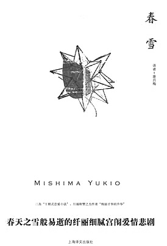
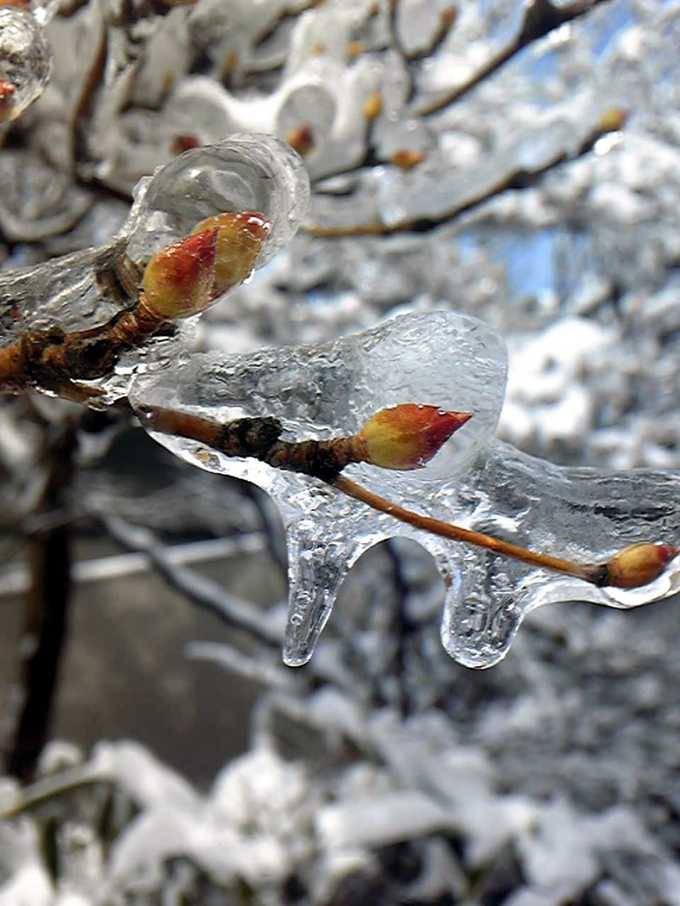
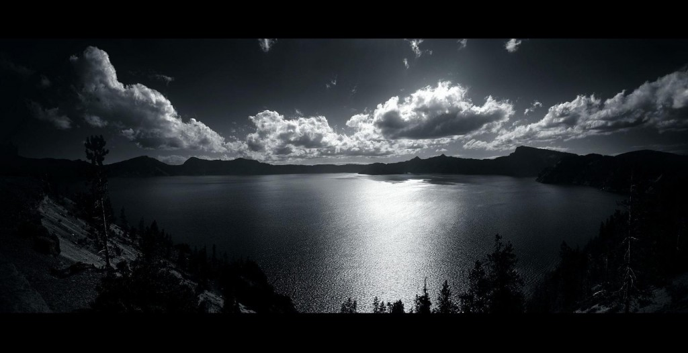

<!-- # ＜天权＞破碎的龙胆花——三岛由纪夫、《春雪》以及其他 -->

**他深知聪子爱着他，也深知只要自己表态两家便可成婚，却偏偏要等到聪子与皇子订了婚，他才疯狂地向聪子表白。清显开始频繁地与聪子私会，甚至连夜把她用汽车从东京接到镰仓的别墅里，两人在皓月的长空下，大海的潮声里，远处松林的絮语中，“彼此间的感情曾达到了多么可怕的、令人眩晕的高度”，因为，“包围着他们的一切……一切的一切，都预示着灭亡”。爱情只在最绝望之时才美丽不可方物，让人执迷不悟。**

# 破碎的龙胆花

# ——三岛由纪夫、《春雪》以及其他

## 文/ 麦静（中山大学）

关于《春雪》这本书，后来我往往想起来的都是最无关紧要的一幕：为了祭奠在瀑布里死去的黑狗，聪子去摘一枝迟开的龙胆花，她转过身来很快地问了一句，“清少爷，如果我不在了，您会怎样呢？”

不知为何，我始终觉得龙胆花应当是郁悒的蓝紫色，美丽得教人不安，如同这初冬的一幕，如同聪子的话一般，散发出一种浸透着优雅的死亡气息。后来我看见了龙胆花的照片，它确实是蓝紫色的，却像是梵高的鸢尾花被冲淡了数十遍，已收敛至淡雅的颜色却无可避免地透露着对死亡的迷恋，清冷且孤独。这是龙胆花，亦是《春雪》。

在最新的《春雪》译本的封面上有一句很显眼的宣传语，“哀艳纤雅的宫闺爱情”，因为这句话，我没有翻过这本书。它不是《春雪》。与其说它关乎爱情，还不如说它关乎优雅与死亡。

我常常想，如果那时在清显那透明而孤独的脑海里，并不是“浮起了一片微浊的涟漪，从而感到厌恶”，而是意识到自己正在竭力否认着对聪子的爱慕，也许这最终将成为一个“哀艳纤雅的宫闺爱情”故事：大正时代，两个门当户对的贵族男女，年轻俊美，青梅竹马并深深相爱，婚后清显却像所有的贵族丈夫一样四处寻欢，而聪子也像所有的贵族妻子一样佯作不知，曾经的爱情犹如贵族的仪式、地位与精神一般，破败不堪，只残留下华美的躯壳。

这不是渴望复兴贵族传统与“日本精神”的三岛由纪夫会做的事。满足只能带来空虚与无聊，而最美丽的事物只存在于不可能之中，只存在于走向深渊的路上。

正如清显的挚友本多所言，“你一开始就去跟权利和金钱都奈何不了的对手去较量，正因为这是不可能的，你才被迷住了，对吗？倘若是可能的，就视之如瓦砾了。”这种对于不可能的热望始于清显的童年，那时他为春日宫皇妃提裙裾，瞥见了皇妃的后颈项，“在清显看来，那面扇形扩展开来的馥郁洁白的颜色，随着音乐的旋律，恰似春日的山巅残雪被飘忽不定的云翳掩映着，忽隐忽现一般，此刻，他发现自己有生以来头一次从中感受到女性美那种令人眩目的优雅的核心”。后来，他亲手将聪子变成了“不可能得到的人”。他深知聪子爱着他，也深知只要自己表态两家便可成婚，却偏偏要等到聪子与皇子订了婚，他才疯狂地向聪子表白。清显开始频繁地与聪子私会，甚至连夜把她用汽车从东京接到镰仓的别墅里，两人在皓月的长空下，大海的潮声里，远处松林的絮语中，“彼此间的感情曾达到了多么可怕的、令人眩晕的高度”，因为，“包围着他们的一切……一切的一切，都预示着灭亡”。爱情只在最绝望之时才美丽不可方物，让人执迷不悟。

“爱一个不爱你的人，一个对你不感兴趣的人，一个登徒子，一个衰老到无力满足你的人，这样你可以更加清晰地感受爱情的重创，没有虚荣心的愉悦，没有安全感的满足，只有爱情，令人身心疼痛的爱情”。这是我最喜欢的话剧里的台词，但我想，生活里的一切概莫如是。

清显与聪子的结局注定不可能圆满，聪子怀孕，打掉孩子后遁入空门，清显在多次求见被拒后，在二十岁的年华上溘然早逝。这段怀着对深渊的热望的感情，最终以美而暴烈的方式去接近不朽——这是三岛由纪夫所推崇备至的“优雅”，也是他所选择的道路。

单看三岛的照片，很难想象他会为自己选择一个那样的结局。他总是神情严肃，衣着像个银行家，称得上风度翩翩。同时，他已经获得两次诺贝尔奖提名，富裕，有名望，还有个美丽的太太。1970年，他试图通过煽动自卫队哗变，以达到其复兴““日本精神”的理想，失败后按照传统当众切腹自杀，时年仅45岁。

后来的人总是简单地给他贴上“鼓吹复兴军国主义传统的极端民族主义分子”的标签，但这不是解读一个文人的理想方式。他并不是政治家或者实干家，他所希望的是“使日本恢复其本来的面目，然后死去”，与其说这是极端的民族主义，还不如说是极端的理想主义。他所真正希望复兴的贵族传统与精神，早已湮灭在滚滚逝去的时代里，在新的机械化时代里成为一种不可能的事物。三岛由纪夫为自己找寻了一个优美的深渊，而像所有最骄傲的人一样，像他笔下的清显一样，他被不可能之物迷住了。

《春雪》是三岛生前最后出版的一套书《丰饶之海》里的第一部，而在四部曲的末尾，本多去找已出家六十年的聪子，聪子却说从来也没有听说过清显。“本多寻思，自己来到一个既没有记忆，也没有任何东西的所在”。尤瑟纳尔对此的解释是：“丰饶之海”即月球中那片广漠的平原，是既没有生命也没有水和空气的一片沙漠，题名指出，一切到头来都是一场空，也就是虚无。

丰饶之海的最终指向是荒芜的沙漠，而或浮或沉的生命最终或指向虚无——要相信生命本身有意义是很难的，而三岛由纪夫选择了以优雅与死亡来对抗最终的虚无。如同他自己写的那样，“唯一的真实，就是每逢想到无意义和无穷尽的死就得到苏生，看到行将衰落就炽烈地燃烧起来，光是为着既无方向又无归结的‘感情’而生存下去。”而《春雪》及他的生命，则犹如破碎的龙胆花，呈现出一种毁灭之美。

我想大概每个人都应当怀有对不可能的热望，怀有走向优美的深渊的勇气，因为惟有这样，我们才能超越虚无的生命本身，抵达灵魂深处的丰饶之地。

（采编：陈锴；责编：陈锴）
