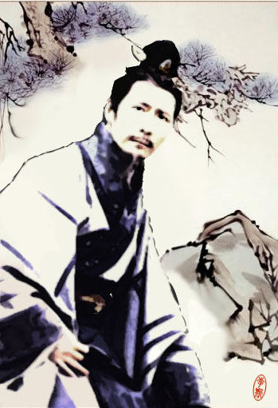
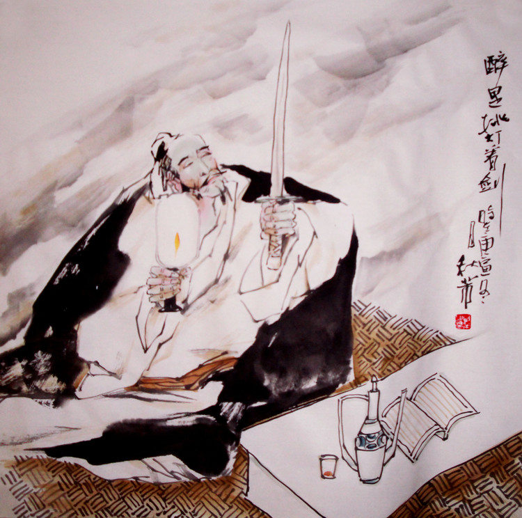

<!-- # ＜摇光＞浮生四记（上） -->

**死生亦大矣。若重于泰山，或轻于鸿毛，若万姓缟素，或遗让千年。死后不可驭，惟生时之努力。或曰：“人生实短，无异蜉蝣。若子之死，如妻子何，如故交何，而如生人何？其悲欤？惜欤？幸欤？子其揣之。”愀然有感，而无以应。良久乃曰：“鸟之将死，其鸣也哀，人之将死，其言也善。当死之言如何，生前之事大概如何耳。”曰：“然则古之先人，遗言如何？”予乃述其四事。夜中辗转难眠，起而录其事，以为鉴。**

# 浮生四记（上）

## 文/终南俗人（清华大学）

惟闻故友抱恙，新识病笃，乃觉死生之数不可喻。读王右军“一死生为虚诞，齐彭殇为妄作”，嗟叹不已。复见日本遣唐使井真成墓志铭，更添悲苍之感，曰：“素车晓引，丹旐行哀；嗟远人兮颓暮日，指穷郊兮悲夜台。寿乃天常，哀兹远方，形既埋于异土，魂庶归于故乡。”

死生亦大矣。若重于泰山，或轻于鸿毛，若万姓缟素，或遗让千年。死后不可驭，惟生时之努力。或曰：“人生实短，无异蜉蝣。若子之死，如妻子何，如故交何，而如生人何？其悲欤？惜欤？幸欤？子其揣之。”愀然有感，而无以应。良久乃曰：“鸟之将死，其鸣也哀，人之将死，其言也善。当死之言如何，生前之事大概如何耳。”曰：“然则古之先人，遗言如何？”予乃述其四事。夜中辗转难眠，起而录其事，以为鉴。

#### 李斯：“吾欲与若复牵黄犬，俱出上蔡东门逐狡兔，岂可得乎！”

李斯是让我十分矛盾的人物。战国嚣嚣，公侯卿士列于庙朝，吏的出身似乎隔绝了李斯跻身上层的可能，然而他积极进取，师荀卿，学王道，客吕相，谏逐客，相秦王。最终，随着始皇并天下，书同文，车同轨，统一度量衡，统一货币，明法度，定律令，周遍天下，外攘四夷，“斯皆有力焉，诸男皆尚秦公主，女悉嫁秦公子”，李斯位极人臣，生命到达巅峰。这似乎是一个通过努力获取成功的正面典型了。

然而李斯又是令我不以为然的，他天生是一个实用主义者，地位、财富是他唯一追求的目标，伦理、道德则付之一哂。“诟莫大於卑贱，而悲莫甚於穷困。久处卑贱之位，困苦之地，非世而恶利，自讬於无为，此非士之情也。”很好地诠释了他一生的价值观。这也能解释始皇死后，他为何以丞相之尊，屈就阉遗之令，侨诏遗命，逼死扶苏而立胡亥：扶苏刚毅而勇武，信人而奋士，亲近蒙恬。立扶苏，则李斯“终不怀通侯之印归于乡里”，立胡亥，李斯仍能以护立之功继续仕途。所以，李斯毅然放弃做一个“忠臣”、“孝子”、“人臣”，而选择了一条大逆不道的荣华路。《史记》中李斯与赵高在废立问题上七百余字的辩论，与其说是李斯利益与良心的斗争，毋宁说是李斯让赵高解释清楚侨诏的好处，坚定他篡逆的决心。其“独遭乱世，既以不能死，安讬命哉”的感慨倒近于掩耳盗铃的可笑自慰了。

胡亥二世继位，让李斯登上了人生又一个高峰。早在初为丞相时，李斯说，“物禁大盛，物极则衰”，一语成谶。随着二世地位渐稳，二世、赵高与李斯之间的利害冲突越发明显，赵高、李斯是沙丘之变的仅有知情人，即是二世之位非法的知情人，而在二世看来，赵高不全之人，生死俯仰于己之一念，绝不会坏事，李斯是最大的威胁。只是不想数年后二世竟死于赵高之手。欲加之罪，何患无辞，二世二年初，李斯以其子三川守李由剿贼不利且与贼文书往来故，“拘执束缚，居囹圄中”。赵高上蒙下罔，二世乐观其死，三月，判李斯死罪，夷三族。

二世二年七月，李斯身具五刑，腰斩咸阳。

从狱中走出的李斯，抬头看了看火红的夕阳，贪婪地呼吸了一口空气，他执着二儿子的手说：“我想和你再牵着黄狗，出老家上蔡城东门，追那狡猾的兔子，还可以吗？”刑场躺下，李斯想起的，不是当小吏赶老鼠的岁月，不是和韩非一起求学荀子的岁月，也不是挥笔而就《谏逐客书》时的豪迈和篡改遗诏时的惶恐，更不是若市的门庭和无限的荣华，他想起的，大概真是当年和儿子们骑着白马，牵着黄狗，意气洋洋地出了东门，在秋日衰草中，尽情追逐野兔的时光罢。斧钺落下那一刻，不知他有没有闻到上蔡的落叶和衰草的味道？有没有听到小儿子兴奋的叫喊：“爹爹，兔在这里！”

#### 辛弃疾：“杀贼！杀贼！”

“千古江山，英雄无觅，孙仲谋处。舞榭歌台，风流总被，雨打风吹去。斜阳草树，寻常巷陌，人道寄奴曾住。想当年，金戈铁马，气吞万里如虎。元嘉草草，封狼居胥，赢得仓皇北顾。四十三年，望中犹记，烽火扬州路。可堪回首，佛狸祠下，一片神鸦社鼓。凭谁问：廉颇老矣，尚能饭否？”这是自小读烂了的稼轩词，也是我最喜欢的宋词之一。

苏辛乃是我最喜欢的词人，二人词风略近，皆气象开阔，飞扬豪迈，所不同者，苏词多清朗豁达，辛词多苍郁浑厚。其中差别从《江城子》（老夫聊发少年狂）和《永遇乐》（千古江山英雄无觅）可见一斑，东坡亦多婉转新鲜之词，稼轩则较为少见，多以吊古伤今、英雄不遇之叹为佳。且稼轩掉书袋的文绉十分合我这个蠢人的胃口。

然而如果仅将辛弃疾看成词人，那可太侮辱他了。辛弃疾自己说：“却得少年耽酒力，读书学剑两无成。”“少年横槊，气凭陵，酒圣诗豪余事。”在他眼里，作诗作词非但比不上打仗，甚至比不上喝酒。综其一生，辛弃疾也是如此做的。

辛弃疾，父亲早亡，惟祖父是怙。北宋既亡，祖父擢金山东某知州。幼闻圣人之言，受忠义之训，出身夷狄之域，心向父母之邦，常思投衅而起以报故国。再应科举，刺女真山川、物产、军民之情，以待后事。

绍兴三十一年，辛弃疾爰举义旗，誓扫蛮夷，战无不胜，气势如虹。后南入临安上表天子，不料后方生变，匪叛作乱，袭杀辛军大将而降女真。辛弃疾将五十骑，于金人百万阵中，缚取叛首，束马衔枚，昼夜不食以归南宋。

这是何等英雄气概，何等英雄胆魄！壮士读此，能不热血沸腾乎？

然而终其一生，这也是辛弃疾最具传奇色彩的经历了。归国之后，辛弃疾始终以北伐为己任，献谋献策，殚精竭虑。我读《十论》《九议》，论策合理与否今已难辨，但其拳拳之心报国之志跃然纸上。“天下未尝战也，彼之说大胜矣，使天下而果战、战而又少负焉，则天下之事将一归乎彼之说，谋者逐，勇者废，天下又将以兵为讳矣，则夫用兵者讳兵之始也”，这种明知前路艰险却毅然长驱不顾的勇气，更尤为难得。

南宋朝廷主战主和的力量反复交锋，此消彼长，辛弃疾的仕途也随波沉浮。加之其为人豪爽不拘小节，更是备受卫道士所诘。几十年间，他历任江阴签判，建康通判，司农寺主簿，滁州知州，江西提点刑狱，湖北转运副使，湖南转运副使，江西安抚使，福建安抚使，浙东安抚使等职，足迹遍布南宋统治下的东方所有国土，然而始终担任不大不小的官职，眼睁睁地看着当年同僚奔赴前线，浴血沙场，而自己胸中空有甲兵十万，六韬百卷，不得上报君王，下安黔首，怎能不郁愤悲苦，仰天长啸！

辛弃疾是那个时代士子的一个缩影。兵燹隳京，神州沉陆，南宋小朝廷沉醉与东南一隅残山剩水，不图恢复旧土。面对华夏千年来的第一次沦陷，涌现了无数仁人志士，陆游、刘过、赵方……都和辛弃疾一样，努力为驱除鞑虏努力着。其中，还有陈亮。

我是浙江永康人，而陈亮大概是几千年来永康惟一拿得出手的人物。陈亮和辛弃疾之间一个个令我这个后生小子向往不已的故事：斩马盟誓，鹅湖论事，瓢泉相会，鸬鹚挽友……他们意气相投，惺惺相惜，肝胆相照，爱国安民，舍身抗金，实乃南宋第一佳话。而我最喜欢辛弃疾的几首作品，竟然都是与陈亮的唱和之作！

“醉里挑灯看剑，梦回吹角连营。八百里分麾下炙，五十弦翻塞外声。沙场秋点兵。马作的卢飞快，弓如霹雳弦惊。了却君王天下事，赢得生前身后名。可怜白发生！”《破阵子��为陈同甫赋壮词以寄之》

“老大那堪说。似而今，元龙臭味，孟公瓜葛。我病君来高歌饮，惊散楼头飞雪。笑富贵千钧如发。硬语盘空谁来听？记当时，只有西窗月。重进酒，换鸣瑟。事无两样人心别。问渠侬：神州毕竟，几番离合？汗血盐车无人顾，千里空收骏骨。正目断，关河路绝。我最怜君中宵舞，道男儿到死心如铁。看试手，补天裂。”《贺新郎��同甫见和再用韵答之》

好一个“了却君王天下事，赢得生前身后名”！

好一个“男儿到死心如铁”！

沈腰潘鬓，空余报国之情。“杀贼杀贼”，岂效穷途之哭？

这是一个“北归人”在南宋的悲剧，这是一个才华横溢的爱国者在南宋的悲剧，这是一个性情耿直不屈权贵的强项令在南宋的悲剧，这是一个坚定的主战派在亦战亦和的南宋的悲剧。

开禧三年，一代侠士辛弃疾在铅山的草屋中逝世，死前挂念的，仍是淮泗前线的军情。我相信，稼轩死时，没有悲伤。

春风侠骨死犹香！

（未完待续）

（采编：麦静；责编：麦静）
