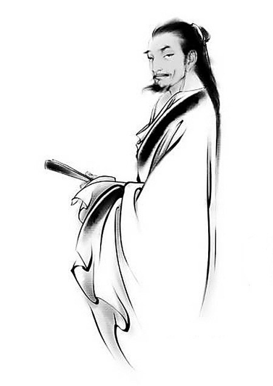

<!-- # ＜摇光＞浮生四记（下） -->

**死是所有人的归宿，我们不能决定生死，但是大概能决定如何去死。中国人是讲究阖棺定论的，极为看重死时他人的评价。所以，我写了四个古人的故事，记录下他们临死遗言，简叙他们波澜壮阔的人生，来警醒自己：“你要如何死法？是要像辛弃疾一样壮志难酬空怀恨，还是如金圣叹一般游戏人间不顾他，是要像李斯一样追求功名悔莫急，还是如王阳明一般我心光明了无牵？”**

# 浮生四记（下）

## 文 / 终南俗人（清华大学）

#### 王阳明：“此心光明，亦复何言！”

幼时随父母游绍兴，过王守仁墓，门庭冷落，母亲欲走，但父亲抱了我进去。对着墓冢恭敬三拜，我问：“爸爸，王守仁是谁啊？”父亲说：“那是五百年前的一个大哲学家，他告诉我们，要知行合一，他告诉我们，内心的修养，就是道德。”我听不懂，转向了母亲：“姆妈，我要吃糖。”父亲的话语已然模糊，但是到现在我还清楚记得那个清晨，墓道尽头庄严的墓冢，和墓冢后面的绿树，树叶遗有晨露，摇曳生姿。

王阳明是中国历史上罕见、甚至唯一的全能大儒。理论上，他发展、完善了陆九渊的心学，强调“心性”作为认知与实践主体的本源性，强调修身对于人格养成的重要性，反对极度强调天理而否定人欲，提出“天理即是人欲”，可看作中国自我意识的觉醒的开端。我最赞同他对自身思考的重视，我看《春秋》便是《春秋》，而没有看过《公羊》《谷梁》，看《诗经》便是《诗经》，而不喜欢翻《毛传》《郑笺》。看一本书，自己的理解只是最佳，何必拘泥与古代“圣人”的解读呢？我还是不喜欢二手货。

陆王的心学，与其说是儒家，我个人倒觉得更近于道家佛家。心学自是以“心即为理”批判朱子的理源论起家，它强调人性本善，只是善良的本心受欲望所害，蒙受污垢，恢复先天本心的方法是以良知克制欲望。然而此处的克制欲望不同于理学家“存天理灭人欲”，前者强调的是克制过度的物欲诱惑，而后者，近似于极端克制人性基本需求欲望。此种修身方法，让我想起《老子》的“见素抱朴，少私寡欲”，“不见可欲，使民心不乱”，“知足不辱，知止不殆”；甚至《金刚经》一段：“诸菩萨摩诃萨应如是降服其心！所有一切众生之类：若胎生，若卵生，若湿生，若化生，若有色，若无色，若有想，若无想，若非有想非无想，我皆令入无余涅槃而灭度之。”有的是清心寡欲，抱元守一，超然物外，这分明是道家豁达的出世情怀，佛家参透的淡然风骨，哪里是儒家悲天悯人的士子心肠呢？

扯远了，还是说王阳明。实践中，王阳明为官清正，关心百姓疾苦。在贵州山区，他教当地的少数民族耕种、读书、习礼，经年，蛮夷归顺，心悦诚服。在江西剿灭农民起义，他除了军事行动，更通过更汰贪吏、减轻赋税、问生吊死等手段安化百姓。更神奇的是，宁王朱宸濠举十万之众叛乱，顺江而下连克坚城，而王阳明以汀赣巡抚、佥都御使之职，初将数十之众，以政治、反间、谍战、军事等手段，三十五天平定叛乱，不啻为军事神话。

尽管仕途并不平坦，屡遭小人妒忌，也没有达到最高权位，但我主观地认为，王阳明的一生，是充满欢乐与趣味的。这大概是因为阳明子的积极乐观吧，从几个小故事就能看出来。

幼时王阳明私塾读书，一日问老师：“何为第一等事？”老师说：“为读书登第耳。”王阳明旋即回答：“或读书学圣贤耳。”好一个读书学圣贤！我心昭昭，我言朗朗，心平气和，理直气壮。每听此言，毫无虚伪做作之感，反而看到天朗气清，白云出岫。

年轻时王阳明极好象棋，为此耽误不少功课。王父屡教无果，某日愤而将王阳明的象棋掷入河中。王阳明顿时感悟，写下一首诗：“象棋终日乐悠悠，苦被严亲一旦丢。兵卒坠河皆不救，将军溺水一齐休。马行千里随波去，象入三川逐浪游。炮响一声天地震，忽然惊起卧龙愁。”这首好诗！不愤，不悔，每读此诗，我只看到满纸生趣盎然与昂扬向上。

弘治十二年，王阳明以进士授兵部主事，监军太监瞧不起文人习武，屡次取笑王阳明。一日于校场中又受激，王阳明不忿，起身弯弓，刷刷三箭，皆中红心。全场军士大声叫好，太监满脸通红，从此和王阳明合作融洽。王阳明受欺，没有消沉放弃，没有越级上告，也没有直接对抗，而是选择了一个公众场合让大家明白了自己的实力，让上司心服口服。这个方法何等聪明，这个时机何等顽皮！每看此事，我都不禁虎须一震，捋之一笑。

王阳明是聪慧，机智，正直，强干的。而他的功绩与学说也光耀千古，徐阶、刘宗周、黄宗羲、李贽等人都受到王阳明的影响，蒋中正等人影响了中国近代走势，而中江藤树、佐久间象山、东乡平八郎等人更是将心学带向了日本。

嘉靖七年，两广总督王阳明病逝于归途的南安舟中。临终，学生问其遗言，随浪摇摆的小床上，老者不语，他回顾自己不平凡的一生：五岁学语，随父进京，登第为官，浮沉宦海，龙场悟道，江西破贼，总督两广……他觉得了无牵挂，今生无悔：“此心光明，亦复何言！”也只有如王阳明此等知行合一、历经风雨、人生无悔的大儒，才有如此遗言，或者说，无需遗言。

我总觉得，五百年前的那个晚上，瘴气丛生、人迹罕至的贵州龙场驿中，那一声清啸，是中国五千年来最漂亮的声音。

#### 金圣叹：“豆腐干与花生米同嚼，有火腿味。”

“读书种子，多情种子”，这是我能想到的对金圣叹最恰当的评价。

有人说金圣叹是中国白话文的先驱，这个观点我不敢苟同，因为他死后吴中地区的文化风格并没有影响到整个中国。所以客观地说，金圣叹对中国历史的影响远不如其名气那么大。

但是我就是喜欢金圣叹，有时候，我也不知道这是为什么，就如我不知道为什么我喜欢八大山人、喜欢张旭一样。

直到我十八岁那年高中毕业，去浙江博物馆，在三楼的展厅面对彩凤鸣岐几欲下跪膜拜的那一刻，我突然想到了金圣叹，这个对于文字会“焚香拜服于地，不敢起立”的少年，我突然明白了无端亲近的来由。金圣叹和我，大概都是对于自己所爱之事忘乎所以、诚惶诚恐的人吧。我也钦羡他的八斗之才，放荡的性格，喜欢那种向往功名又自命清高的可爱可怜的人生观，喜欢他不落窠臼的随性而为，尽管偶尔是刻意地将自己和大众区别开来。这不是坏事，不是吗？我也喜欢他极力维护儒家思想却又反对封建礼教的矛盾思想。

金圣叹总是刻意求新的，每次看到他定义的写作手法的名字：“獭尾法”，“弄引法”，“草蛇灰线法”，“绵针泥刺法”，我总是禁不住笑出声。我相信，他第一次在纸上写下这些名字的时候，一定是得意洋洋微笑的。

金圣叹总是恣意妄为的，他敢于赞扬崔莺莺张生追求爱情的行为，在当时，尽管身处思想较开放的吴中地区，亦不啻一颗重磅炸弹。面对世俗的职责，金圣叹竟是毫不在意，这样的勇气，这样的任性，即使放在现代，也是非常难得。

金圣叹总是多愁善感的，据他自己说，他七岁的时候，扔瓦片玩耍，想把瓦片投入一口井中，他知道瓦片被投入井中后就永无出井的希望，但又感到瓦片的命运无法挽回，踌躇良久，他还是将瓦片投入了深井。之后，他“循环摩挲，久之久之，归而大哭，至今思之，尚为惘然。”关于这件事，我总觉得他在吹牛，七岁还幼稚到玩瓦片的孩童，如何能有人生无常无奈的感慨！但是金圣叹的感伤，确是伴随他的一生的。

金圣叹总是游戏人生的，临终砍头前，他心中所想的竟然是尚未对出的对子。临终砍头前，他竟然用两个儿子的小名开玩笑，“莲子心中苦，梨儿腹内酸”。临终砍头前，他竟然对刽子手说：“豆腐干与花生米同嚼，有火腿味。”看到这里的后人，是该哭还是该笑呢？

十八岁那年在浙江博物馆，面对青翠的西湖，我想，我有没有些许刻意地模仿金圣叹呢，我欣赏的仅仅是“才”、“怪”二字么？对岸，是夕阳下修葺一新的雷峰塔。

### 【后记】

这篇文章最初源于和猪头的一番谈话，原想简单地记录一下谈话内容，但是临下笔才发现要说的话太多。随着不断地翻阅四个人物的生平，感慨越来越多，也将自己的感悟同谈话内容一并凑在一起。文章并非一日写成，中间文风似然有变，看官多担待了。

死亡这个概念，最早的感受是小时候稚嫩地临摹颜真卿的《祭侄文稿》。有一句话给我最深的震撼：“天不悔祸，谁为荼毒，念尔遘残，百身何赎！”竟然有人要用百身赎其一命，那是多么痛苦！当时还不知道，此句之源《诗经·秦风·黄鸟》“彼苍者天，歼我良人。如可赎兮，人百其身”其实更加令人动容。后来，听着父亲给我讲颜真卿和他的兄、侄在安史之乱中的故事，对着字帖上简直不成章法的粘滞，横斜，起伏，顿挫，涂改，鲁公当时心中的极度悲愤和痛心满纸皆是，我甚至还能看到宣纸上洒下的，几百年前的虎泪滂沱。

死是所有人的归宿，我们不能决定生死，但是大概能决定如何去死。中国人是讲究阖棺定论的，极为看重死时他人的评价。所以，我写了四个古人的故事，记录下他们临死遗言，简叙他们波澜壮阔的人生，来警醒自己：“你要如何死法？是要像辛弃疾一样壮志难酬空怀恨，还是如金圣叹一般游戏人间不顾他，是要像李斯一样追求功名悔莫急，还是如王阳明一般我心光明了无牵？”现在我自不知今后我的人生会是如何，但总要仰不愧于天，俯不愧于地，在祖宗神灵前能心安地祭拜，在夜深人静时能平和地自省。临终时，总不要在孩子面前忏悔，不要惧怕那如电神目才好。

（采编：麦静；责编：麦静）
