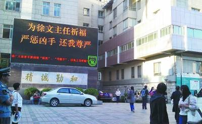
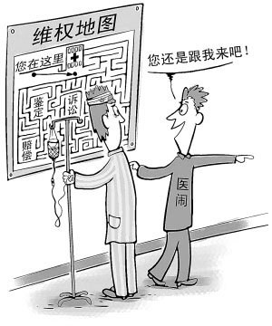

<!-- # ＜七星说法＞左手法院，右手刀店，医疗纠纷何去何从？ -->

**3年，跌跌撞撞的司法程序还未进入正式开庭阶段。21刀，刀起刀落间迸出的鲜血形象了日益激化的医患矛盾。医疗保障不到位、患者利益诉求渠道不畅、法律法规不健全…满身伤痕的医疗体制需要怎样的手术刀？这把手术刀不是我等能玩转的而又切实需要我等的把握。作者在文中就现行法律法规中关于医疗纠纷的具体规定及如何通过法律途径应对进行了分析并提出自己的认识，对于我们了解医疗纠纷有很好的帮助。**

# 左手法院，右手刀店，医疗纠纷何去何从？

## 文/张蒙

在这起血腥暴力事件之前，艺术家王宝洺曾经寻求通过同仁医院协商以及向卫生行政部门投诉来解决这起医疗纠纷，遗憾的是，王宝洺都没有得到满意的答复。2008年王宝洺向法院起诉，他也曾对司法途径寄予了很高的期望。并且，前后已经坚持超过三年的时间。时间最终磨蚀了他的法律信仰，一场医疗纠纷演变成了这样的血腥刑事案件。

更可怕的是继徐文主任之后，同仁眼科又有一大夫和一个护士被打，病人甚至威胁：我他妈让你和徐文一样..... 真担心这会演变成像屠童事件一样的群发性事件。

医患双方本应是共同合作、相互信任对抗病魔的关系，何以演变成如今的相互敌视，原因肯定不止医疗技术、医德所能解释的。这里，笔者也无意纠缠于那些深层次的不宜阐述的因果，仅就现行法律法规中关于医疗纠纷的一些规定及如何通过法律途径应对进行有重点的分析。

一般来说，医疗纠纷是指医患双方对医疗后果及其原因在认识上发生分歧而引起的纠纷。医疗纠纷因其专业性而导致解决时间长、难度大，加上我国相关纠纷解决机制的不完善使很多患者不相信诉讼索赔而选择与医生、医院直接对峙导致暴力冲突层出不穷。更有人总结道：胆大的闹医院，胆中的闹法院，胆小的闹信访，无胆的闹家人，回去睡觉。这形象的表明了法律的无力，但是，纠纷的解决理应也必须回到法律的轨道上来。

在医疗纠纷案中，法律关系可以分为两类：1.医疗服务合同关系。在此种关系中，医院违反了服务合同而应当承担违约责任，这种纠纷相对易于解决，患方证明存在医疗服务合同、医方违约事实以及因违约而给患方造成了损失，在此种违约责任中是不包括精神损害赔偿的。2. 医疗侵权损害赔偿纠纷。《侵权责任法》已不再区分医疗事故与非医疗事故，统一适用《侵权责任法》关于赔偿的范围和标准的规定。理清了法律关系后才能在起诉时选择正确的案由。

**关于举证责任。**在正常的诉讼中，打官司就是打证据，弄清楚举证责任至关重要。《证据规定》中规定：因医疗行为引起的侵权诉讼，由医疗机构就医疗行为与损害结果之间不存在因果关系及不存在医疗过错承担举证责任。反过来说，患方需证明医疗行为和损害结果的存在。这种举证责任的倒置实质上对诉讼实体并没有很大的效果，因为不管何方举证，诉讼结果都取决于鉴定机构的鉴定结论。当然，我们不能抹杀举证责任倒置给患方减轻的负担。

**关于病历资料的保管。**“医疗机构及其医务人员应当按照规定填写并妥善保管住院志、医嘱单、检验报告、手术及麻醉记录、病理资料、护理记录、医疗费用等病历资料。

患者要求查阅、复制前款规定的病历资料的，医疗机构应当提供。”医疗资料对于医疗责任的构成有着极其重要的意义。当医方“隐匿或者拒绝提供与纠纷有关的病历资料或者伪造、篡改或者销毁病历资料。”时，法院可以推定医方有过错，而“患者在诊疗活动中受到损害，医疗机构及其医务人员有过错的，由医疗机构承担赔偿责任。”发生医疗纠纷时，封存病历是首要的，在实践中经常遇到这样的情况，当律师要求封存病历资料时，医院百般刁难拒绝封存，这其实容易导致本无过错的医方激化矛盾影响司法进程，甚至败诉。

**关于医方的说明告知义务。**“医务人员在诊疗活动中应当向患者说明病情和医疗措施。需要实施手术、特殊检查、特殊治疗的，医务人员应当及时向患者说明医疗风险、替代医疗方案等情况，并取得其书面同意；不宜向患者说明的，应当向患者的近亲属说明，并取得其书面同意。”

这里的告知包括风险以及费用。医患沟通极重要，

有些医生自恃专业技能而不向患方说明医疗行为，事实上，告知本身就属于医疗行为的一种，如果司法鉴定确认医方未履行此义务造成患者损害的，医方应当承担赔偿责任。当然，这也有例外，“因抢救生命垂危的患者等紧急情况，不能取得患者或者其近亲属意见的，经医疗机构负责人或者授权的负责人批准，可以立即实施相应的医疗措施。”在这里，医方应当证明紧急情况的存在。

**关于医疗技术水平。**在理解患方痛失亲人等悲伤的同时，患方应正确对待疾病及医疗行为的效果。患者站着进来横着出去也不一定是因为医院的过错，经鉴定医方尽到了与当时医疗水平相应的诊疗义务造成患者损害的不负赔偿责任。这里，我们不得不承认有些患方无理取闹讹诈医院。

**关于缺陷医疗用品。**“因药品、消毒药剂、医疗器械的缺陷，或者输入不合格的血液造成患者损害的，患者可以向生产者或者血液提供机构请求赔偿，也可以向医疗机构请求赔偿。患者向医疗机构请求赔偿的，医疗机构赔偿后，有权向负有责任的生产者或者血液提供机构追偿。”

即，无论医方有无过错及过失，患方都可以向医方请求损害赔偿。当医方明知有缺陷而购买使用的，为医疗故意损害，这时不受医疗事故赔偿项目、标准与上限的限制。

**关于法院。**目前来看，医疗纠纷诉讼主要集中在大城市，而一些中小城市甚至数年也无一起医疗纠纷诉讼。同时，即便在大城市，法院几乎没有具有相当医学知识的法官。这时，医疗鉴定就显得弥足重要，而医方通过鉴定影响判决的例子也不鲜见，所以说，培养具有医学背景的法官对于作出合乎事实的判决有直接的意义。

**关于鉴定。**绝大多数的医疗案件都要进入医学鉴定程序，只有经过鉴定才能认定实体事实，正常的情况下，打医疗官司就是打鉴定。《侵权责任法》颁布后并未对医疗损害鉴定作出程序性规定，导致司法实践中出现一些混乱，笔者仅就所知做简单说明，欢迎补充。目前来看，根据各地高级人民法院的通知，医疗鉴定仍采用双轨制，即各地医学会与医学会之外的司法鉴定机构并行。对机构选择，多采用协商原则，协商不成法院指定鉴定机构仍是医学会。总体看，鉴定认为不构成医疗事故或医疗损害的案例更多。从专业律师口中得知，医学鉴定前专家很少研究法院提交的病历，多在鉴定现场临时报佛脚翻阅翻阅，而患方陈述时间不过20分钟左右，要在有限时间说服专家殊非易事。如患方陈述不到位，专家多半赞同医方条理清晰的更加专业的陈述。因此患方申请合适的学科医生参加、找准医疗过错、用专业术语、从专业角度准确陈述医方过错非常重要，这是医疗胜诉的关键。

**几点建议。**面对医疗纠纷，患方首先要复印能够复印的病历并封存所有病历原件（病历并不归医生管，而是由医务科或档案科保管，患者有权复印及复制病历等资料，医疗机构应当提供复印或者复制服务，并在复印的病历资料上加盖证明印记，复印的过程应当有患者在场）。必要时对检验单、处方及药品、输血输液剩余液、手术切除组织等予以封存待检。同时，对死因有异议的应当及时申请尸检（无冷冻48小时，有冷冻7天）。还有就是不妨找卫监所核实医生资格，有时能有意想不到的收获。为赔偿便宜还要完整保留交通费、误工费、营养费、残疾用具费等相关证明。

以上几点是笔者所能够提供的应对医疗纠纷的简单分析。

在正常的社会中，医疗纠纷的存在很正常，而且能够通过法律途径满意的解决。在同仁的血案中，王宝洺的手起刀落与其说是报复倒不如说是对现实的烦愤发泄，他不是被逼急的第一个，也不会是最后一个。其中，医患双方都是受害者，利益集团垄断优势资源的医疗体制下患者受了伤害，医生背了黑锅。我们都不希望这样的悲剧发生，可它就是发生了，今天是徐文，明天可能就是胡文...

左手法院，右手刀店，面对畸形的医疗纠纷笔者当然希望双方走进法院，希望放下屠刀。可是，唯有“政通”方能“人和”，“放下屠刀”，这句话真不知道该说给谁听……

非常欢迎建议和投稿。请[@瓢虫君](http://www.renren.com/profile.do?id=362359989&from=opensearch)。
