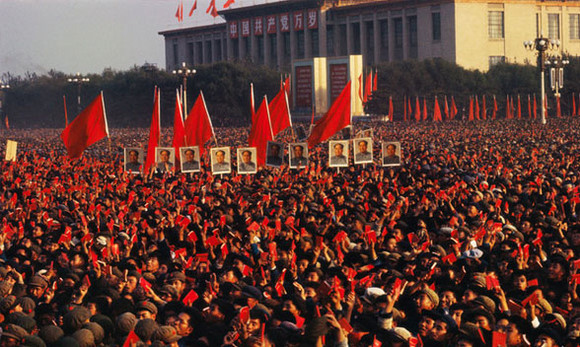
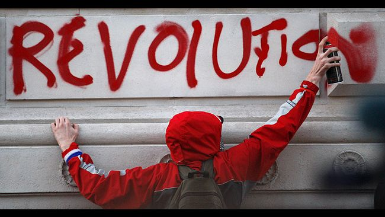

<!-- # ＜摇光＞玫瑰与红旗 -->

**无论是中国，还是西方的学生，都是在一种极度自由的状态下进行着理想主义式的革命，都是一场无关面包（贫困）的运动。他们的共同点在于反对他们所反对的，认同他们所认同的；并且跟着反对而反对，跟着认同而认同。但是，他们的不同点在于西欧的学生是自发的运动，而中国的学生是在权威诱导下的运动；西欧学生运动的口号覆盖了包括性生活、政治生活的所有方面，是一场“关于玫瑰无关面包”的运动；中国学生运动的口号则集中体现在政治层面，是一场“关于红旗而无关面包”的运动。**

# 玫瑰与红旗——20世纪60年代中西学生运动的对比

## 文/张凯阳（华中科大）

如果从太空中遥望1968年的地球，会发现半壁的地球都被红色的革命热情所席卷。无论是资本主义世界的美国、法国、德国、英国，还是社会主义世界的中国、波兰、捷克斯洛伐克、南斯拉夫，到处都是人头攒动的青年，高举着旗子、挥洒着汗水与热血、表达着愤怒和反叛，在中西的大地上嘶喊着。

当红卫兵在古老的中华大地上恣意地破坏时，远在大洋彼岸的欧美学生也开始了如火如荼的抗议运动。在相同时间段所展开的这两场运动看似相同，其实却有着极其悬殊的背景和极具反差性的结果。前者以“文化大革命”为旗帜，从政治资格上宣布对资产阶级走资派、红五类的审判，结果却是以知青“上山下乡”运动为代表的学生的被放逐；后者以“文化革命”为口号，从文化上宣布对资产阶级社会和消费社会的斗争，结果是以教育改革、福利改革为代表的全社会的变革的产生。

在西欧，学校对男女交往的限制（如限制男生进入女生宿舍）一度成为法国“五月风暴”的导火索。学生占领学校，驱逐教育官员，反对僵化的教育体制对学生自由发展的束缚，在校园中、街道上以大集会、演讲会或辩论会的形式进行讨论。学生的口号也是千奇百出，“要做爱，不爱作战”、“禁止使用禁止”等都出现在大学的围墙上，3M（毛泽东、马克思、马尔库塞）一度成为他们的思想领袖，格瓦拉、胡志明、毛泽东一度成为他们的精神偶像。

在中国，主流媒体出现的大字报开始对当权派的批判，“八九点钟的太阳”也不甘寂寞地挥舞着红色大旗执行伟大领袖的任务，即打到一切牛鬼蛇神，推翻一切反动文化。学生占领校园，起初同心所向，共同批判臭老九，后来发展到各占高楼各自为战，直到被工宣队接管才肯罢休。学生的口号具有强烈的一致性，“伟大的领袖、伟大的统帅、伟大的导师、伟大的舵手”与“打倒党内最大的走资本主义道路的当权派”形成鲜明的对比。

无论是中国，还是西方的学生，都是在一种极度自由的状态下进行着理想主义式的革命，都是一场无关面包（贫困）的运动。他们的共同点在于反对他们所反对的，认同他们所认同的；并且跟着反对而反对，跟着认同而认同。但是，他们的不同点在于西欧的学生是自发的运动，而中国的学生是在权威诱导下的运动；西欧学生运动的口号覆盖了包括性生活、政治生活的所有方面，是一场“关于玫瑰无关面包”的运动；中国学生运动的口号则集中体现在政治层面，是一场“关于红旗而无关面包”的运动。

如果将时间向前推溯，回到二战之后的西欧和大跃进之际的中国。不难看出，一边是战后资本主义复苏所带来的经济的高速增长，一边是落后工业国家现代化的蹒跚学步。前者所带来的后果是足够发达的经济侵入到社会生活的每一个层面，工具理性主导的社会严重制约着人的发展，人被经济制度化，精神空间被极度压缩；后者所带来的后果是足够发达的政治无孔不入地刺入人们生活的每一个方面，意识形态所主导的社会将人束缚在革命思维的框架中，人被政治制度化，但吊诡的是，虽然思想空间被极度压缩，但信仰热情依旧高涨。前者具有相对自由的表达环境，但享受着优裕生活的人们却缺乏批判的动力；后者虽然存在许多表达的禁忌，但“大鸣”、“大放”、“跑步进入共产主义”的豪言壮语却层出不穷。

对于当时的学生来说，西方国家严密的教育制度和就业的压力让学生束缚在书本中，中国严格的意识形态教育和计划体制下的包分配政策，不但缓解学生的工作压力，而且共产主义的伟大目标还给学生提供精神的动力。西方看似活力四射的社会实际上死气沉沉，而在中国看似死气沉沉的社会却到处都涌动着激情。

60年代的越战让美国学生苦于资本主义所宣传的自由与暴力之间的矛盾，“人生而自由”的平等观念与黑人所处的不平等地位的极端对立也让美国学生感觉形式与实质的差别，于是社会抗议运动此起彼伏地展开。在法国，极其偶然的事件，将社会长期积累的苦闷在一刻爆发出来，革命之火从大学点燃到社会，从学生扩散到工人。另一端，经历过“引蛇出洞”之后的中国的知识分子小心翼翼噤若寒蝉，但党内的冲突却日益表面化，不了解实情的学生完全跟随者领袖的衣袖，挥舞手中的笔杆。

在法国，上万的学生围聚在巴黎街头，甚至在夜晚堆起法国大革命时期所采用的“街垒”，这一极富革命意义的标志让不少的群众热血澎湃，极富革命精神传统的法国民众从四面八方围聚而来，一场学生与政府的对抗，由此变成社会与政府的对抗。学生与军警之间只存在对立，却不存在漫天飞舞的子弹和四处流淌的鲜血。街头政治变成行为艺术，因为对于法国民众来说，参与便代表着一种力量：“我们不询问，我们不要求，我们把它拿下，接着就占领”。

在中国，无数的红卫兵围聚在天安门城楼前，挥舞着手中的红皮书，一边声嘶力竭地唱着“从来没有救世主”，一边兴高采烈的高呼着“他是我们的大救星”，同时向城楼上的伟岸身躯高呼着“万岁”。而在校园中，从起初的砸毁文物、破坏古迹、焚烧字画，到对教授批斗抄家，直至红卫兵组织之间的文争变成武斗，械斗事件此起彼伏的发生。

法国学生重拾法国大革命的传统反对现代工业社会对人的钳制，抛弃所有的形式，寻找人的回归，他们对民主自由有着普遍的认同，他们利用自由所表达的并非是对民主的反叛，而是对集权的反叛。中国学生用中国特色的革命斗争思维对传统文化进行“拳打脚踢”，只有主义，没有人的存在，他们对共产主义有着普遍的认同，但他们的行为却将统治集团分立成不同的阵营，置共产主义于不利的境地。所以法国五月暴乱可以在一夜之间恢复平静，而文化大革命却以众多学生的青春作为代价。

60年代西方的社会运动是“一场改变了一切的虚假革命”，因为这场革命不是政治性的，而是文化的，它的意义是遍及整个社会的。文化大革命初期的中国学生运动是用文化大革命的口号，进行政治性的斗争，它不但给那代青年人，而且给整个民族留下巨大的创伤。

今天，玫瑰依然香艳，而红旗却不知飘往何方。

（采编：佛冉；责编：黄理罡）
