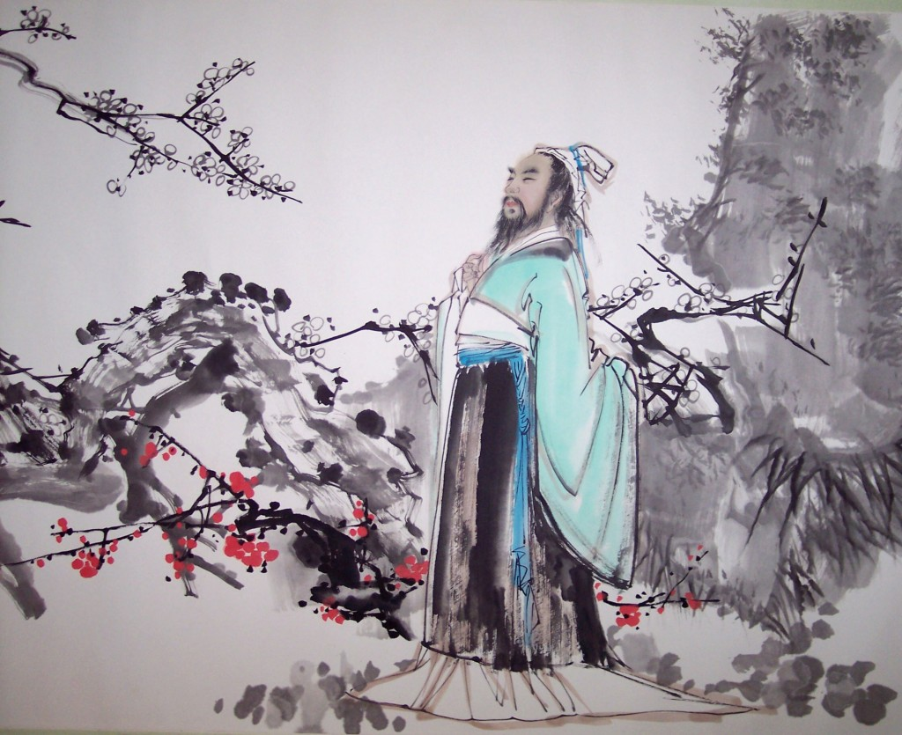

<!-- # ＜天枢＞誰的國，慶什麽 -->

**此時此刻，我就在前朝。在這兒，除了極少數的哥們兒還渴望躍馬揚鞭馳騁大中華之外，基本上就是綠的搞獨立，藍的搞偏安。雖然還在防著赤色，基本上也都是處於恐懼。義正詞嚴北定中原早成了歷史辭藻。連當年義正詞嚴的那些明星們，現在一個個的都爭先恐後的零片酬求在淪陷區露個臉兒。至於王師們，在紀念堂里站站崗耍耍帥還行，至於北定中原，早不再奢求，天天求神拜佛只求中原別扔飛彈就好。**

# 誰的國，慶什麽

## 文/ 馬軍（國立台北大學）

三千里河東入海，五千仞嶽上摩天

遺民淚盡胡塵裡，南望王師又一年

知道這首詩，絕不是因為涉獵廣泛博覽群書。而是因為這首詩是2007年四川省的高考語文詩歌鑒賞題。今天國慶日，又看到了一些朋友在校內上發了這首詩，意思很明白，你懂得。

也許大家對這首詩並不太熟，但是肯定會對這首詩的作者的另外一首詩很熟：

死去元知萬事空，但悲不見九州同

王師北定中原日，家祭無忘告乃翁

這兩首詩都是陸遊寫的，看詩便知道這兩首詩誰前誰后。陸遊是個苦逼的詩人——詩人大概都苦逼，不苦逼都不好意思為詩人——家園讓金人佔領了，南宋王朝偏安于東南一角。於是想念前朝的陸遊，就寫了第一首詩，誰知道一年又一年，南宋王朝也沒回來，結果就寫了後一首詩當遺囑，希望他兒子能夠看見王師北定中原的那一天，但是他兒子也沒看到那一天，因為王師根本也終究沒有被定中原，反倒是讓蒙古人給南定了。陸遊樸素的愛國主義理想沒能得到實現，而當時的社會現實，反倒給後來的歷史不少的啟示，至於後人是不是還會重蹈覆轍，那是後人的事情了。

而我只想說兩點：

一、只寄希望于王師北定中原的遺民，是沒有出息的。

王師如果真的能北定中原的話，當年就不會被從中原趕到東南了。王師的內心，恐怕恐懼是大於北定中原的渴望的。只有傻瓜，才會相信北定中原是真能實現的。所以，不滿異族統治而希望王師北定中原而得解放的遺民，只有兩種：一種是天真愛國者，一種是只寄希望于別人不指望自己力量的隱形“帶路黨”。

二、只希望與偏安東南一角的朝廷，是沒出息的。

中國到現在，貌似沒有那個偏安的朝廷是得善終的，小朝廷的皇帝基本上不是自刎就是跳海。混得好了歷史上能得個忠烈的稱號，弄不好身敗名裂貽笑大方。

此時此刻，我就在前朝。在這兒，除了極少數的哥們兒還渴望躍馬揚鞭馳騁大中華之外，基本上就是綠的搞獨立，藍的搞偏安。雖然還在防著赤色，基本上也都是處於恐懼。義正詞嚴北定中原早成了歷史辭藻。連當年義正詞嚴的那些明星們，現在一個個的都爭先恐後的零片酬求在淪陷區露個臉兒（邱老闆說的）。至於王師們，在紀念堂里站站崗耍耍帥還行，至於北定中原，早不再奢求，天天求神拜佛只求中原別扔飛彈就好。

所以，王師是指望不上的，東南朝廷也早就不認你這個遺民了，等著慶雙十的，還是乖乖慶十一，比較靠譜。

采编责编：黄理罡
