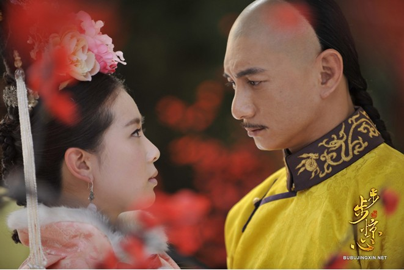

<!-- # ＜ 玉衡＞预言家与怀乡病 -->

**她并不是去改变什么世界拯救什么人民，她是去想找那一个或者若干个在现实世界不可能存在的男人而已。她患上无可救药的怀乡病，觉得在眼前得不到的东西，在一个美化的故土中可以寻觅。在怀乡之中，就像皮普一样，她拒绝意识到她的X爷让多少姑娘怀了孕（种马！），手染多少鲜血。**

# 预言家与怀乡病

## 文/ E姑娘（中国人民大学）

**Cassandra's Homesickness**

#### 预言家与宿命论

穿越的唯一最特殊的意义在于知道未来。没错，她很美，但每个女主角都很美，她也很聪明，但大多数女主角也都很聪明。也许她凭借她的未来人的技能能做出一些更好吃的食物，绣出一些更独特的花纹，但是大长今和黄蓉一定也都能做到。

她的唯一最特殊之处在于，她其实是特洛伊的卡桑德拉（Cassandra of Troy）。她预言，而且预言悲剧－－如果你愿意相信的话，一切预言终必预言悲剧。在古典神话中，卡桑德拉是特洛伊城主普里阿摩斯的女儿，赫克托尔和帕里斯的妹妹，美人海伦名不正言不顺的小姑子。一说是因为卡桑德拉美貌出众，阿波罗赐予了她预言未来的能力，一说是因为她夜宿阿波罗的神庙，神庙的蛇舔干净了她的耳朵，从而使她能够预言未来。然而由于她拒绝了阿波罗的求爱，阿波罗一怒之下诅咒卡桑德拉，使她的预言不会被任何人相信。果然卡桑德拉预测了特洛伊的战败、奥德修斯的木马、阿伽门农和她自己的下场，不过没有一个人相信。

卡桑德拉成为一个浪漫主义和富于悲剧色彩的文化标签，是因为，维基百科如是说，“她了解一切却无力改变，这正是人生之讽刺性所在”。

这其实指出了卡桑德拉的神话以预言家为变式叙述了宿命论的主题，而流行穿越小说与之并无二致。一个穿越到过去而不能改变历史事件的主角，将宿命论及其无可避免的悲剧性推向极致。如果小说的作者将时间的发展描述为固定不可改变的，那么穿越者只能做一个无法改变历史的先知。于是，就像以先天性疾病和错抱婴儿为桥段的电视剧一样，这种宿命论母题很自然会引发罗曼蒂克的无奈感，正是言情故事的温床。

#### 时间旅行小说纵览

和古希腊神话相比，以时间旅行为题材的文学作品并不那么古老。马克·吐温（Mark Twain）的《康涅狄格州的美国佬在亚瑟王朝》（A Connecticut Yankee in King Arthur’s Court，下略为《康州》），是世界文学史上最早的时间旅行小说之一。在这部被中国读者遗忘的美国文豪代表作中，男主角从近代美国穿越到亚瑟王朝以后，凭借自身的科学文化知识，从阶下囚一步步爬上国家首相的高位，并将萎靡不振的君权神授的国家变成现代化强国。吐温一来有意挖苦讽刺当时流行的缅怀冷兵器时代的文学作品，二来，尤其从马克思主义文论看来，吐温或许是一个资本主义的理想主义者，试图描述科技文明的强大力量。

《康州》一书将历史描述可以改变的“平行空间”，并未进入宿命论的范式。时间旅行小说的一种主要分类方法，即根据历史是否能够由穿越者认为改变，分为改变历史走向的小说和不能改变历史走向的小说。这也关系到小说内容的选材：前者往往有悲剧倾向，而后者适合描写主角如何“建功立业”。

与马克·吐温同时代的英国科幻作家威尔斯（H. G. Wells）也出版了著名的时间旅行小说《时间机器》（Time Machine）。值得注意的是，这两部作品反映出时间旅行小说之间另一种分类方法。在《康州》一书中，男主角脑袋被打，一睁眼就发现回到了从前，而全文到底也没有给出他穿越的原因。因为此书并非科幻题材，吐温醉翁之意不在穿越，只希望获得穿越的结果。而威尔斯详细地描写如何制造物理上可能的时间机器进行时间旅行。这成为欧美时间旅行小说的主流模式，此后的时间旅行小说大多是科幻小说，都试图为穿越提供科学解释，浪漫传奇式的穿越小说未成气候。

汉语文学，在当代之前，并不把时间旅行视为一种主题。值得一提的穿越小说可能只有黄易的《寻秦记》，与《康州》一样这也属于一部建功立业型的作品，不过黄易更为巧妙地用焚书坑儒解释了为什么项少龙不在历史上闻名。

#### 流行穿越作品及其代入-愉悦机理

但是在网络时代引发通俗文学群众性创作的高潮之时，在那个神奇的绿色的网站上，穿越小说迎来了空前的繁荣。这些作品大多属于通俗言情题材，以女主角第一人称叙事，就连穿越回到的历史时期也呈集聚性分布。康乾盛世是一个主要的题材，九子夺嫡更是屡见不鲜。它们也具有网络文学的通病，例如成为作者的门槛很低，导致作者的平均水平下降，作品的淘汰率极高。一个经典的笑话是，水平不高的作者很容易写出自恋的第一人称主角，诸如“我看着镜子里我倾国倾城的容貌”。这类作者就像是低龄儿童未能区分“自己”与“他人”一样，想不明白男主角对女主角说“你倾国倾城”可能是赞美，而女主角自己说“我倾国倾城”就是神经病了。

然而，大众作者所写出的浪漫传奇式的穿越小说在短期内很难得到文学批评界的认可，因为其最大的弊病在于，事实上，一切网络穿越文都是“我倾国倾城”的文章。哪怕女主角不会自称自己倾国倾城，穿越文的默认设计就是其主角惊才绝艳、鹤立鸡群，被许多男性追求。这样的小说主角，由作者的代入感而始，并满足了读者的代入欲望，可谓皆大欢喜。

我们不得不承认，文学的代入意义，哪怕再不堪一提，也是促使文学繁荣并历久弥新的力量之一。就连高雅文学中也不乏具有代入感的作品，我们有一切理由相信托尔斯泰把自己的很多方面投射到《战争与和平》的彼尔和安德烈之中。

同人文学，即以既有作品进行衍生创作的文学，最早在日本和欧美国家产生，近年来在我国也很流行。同人文学理论（如果同人文学也能有文学理论的话）中有一个经典的概念“玛丽·苏”（Mary Sue），即指作者创造出一个原著没有的角色，而这一角色集万千宠爱于一身，被认为是作者在创作时进行了自我代入。玛丽·苏体现了一个小说作者的不客观和自恋情绪，因而遭到评论的强烈反感。

世界上各种语言的同人创作层出不穷，但是最“登堂入室”者恐怕要数英国ITV在2008年播映的电视剧《迷失奥斯丁》（Lost in Austen）,它描述了一个当代英国的年轻女性穿越到了《傲慢与偏见》的世界中去，最后——显然必须如此——与达西先生喜结连理。本来，简·奥斯丁小说受到女性读者广泛喜爱的机理之一就在于它提供了代入感，而穿越题材更强化了这一可能性，让每一个当今时代的诸事不顺的姑娘都能轻易把自己想象为贝内特家的不速之客。

从某种程度来说，穿越小说都可以视为历史事的同人小说，其中都有一个玛丽·苏女主角，而且受众产生愉悦感的机理也类似，都与代入感相关。一个批判性的读者应该意识到，代入感作为愉悦感的来源，终究是短视的。通俗文学必然要在一定意义上满足大众读者的愉悦感诉求，但是文学不仅在于愉悦感——它还有许多其他历史使命。这也是为什么这一类顾影自怜般穿越作品很难受到文学批评的认可。

#### 当代女性的怀乡病

尽管涉及许多历史背景，就像大多数通俗言情小说一样，我国当代的流行穿越小说更关注两性关系，专注于政治历史题材者并非没有但也乏善可陈。一些作者情愿犯下很多历史错误，譬如在康熙晚年，他的儿子怎么可能还未娶妻？哪怕不犯历史错误，穿越小说关于历史人物的叙述也都呈虚构姿态。在小说作者和读者的想象中，彼时王公贵族的男性一律一副温文尔雅文武兼修的模样，日理万机却也风花雪月，妻妾成群却愿意对你山盟海誓。

在此，我们最需要注意的是这些作品所折射出的历史虚构与现实生活的强烈反差。今非昔比，你想找个富二代却恨他是个扶不起的阿斗，找个凤凰男还不情愿进他家的门。现实无奈，房子车子婆媳小三逼出一群大龄剩女。就像清朝时文字狱盛行，逼出一群人搞小学——他不是不想搞“大学”，你也不是不想嫁刘易阳。只是他怕写两首诗就没了脑袋，你怕遇到一个假刘易阳真陈世美结果赔上大半辈子。

可是想象只是一种自我意淫的世界而已。以前上英国小说课的时候，讲到狄更斯《远大前程》，我们打趣说在皮普在离开家乡之前，村里尽是些泼妇（他姐）恶棍（Orlick），而在他离去之后，家乡似乎变好了，变得只剩下最和蔼的兄长和最懂事的妹子。教授笑了笑说那就是因为他离开了。皮普的村子也许并没有变好，只是他从恨不得离开变成留恋童年。怀乡病是偏颇的，是罗曼蒂克的，是非现实的。他家铁铺的恶棍死了，隔壁肉摊的恶棍说不定还在。一个泼妇死了，还有千千万万个泼妇站起来了。

在那些罗曼蒂克的想象中，古代大抵是美好的。穿越文的作者不会写那时候贫富差距有多大，路边冻死骨如何形状；也不会写冷兵器时代的战争如何血腥，人民如何生灵涂炭。她不会让她的主角穿越到茹毛饮血的蛮夷部落或者落后挨打的晚清，更不会让她跟那陈胜、吴广、洪秀全之流，而偏偏只选择像康雍乾这样的盛世，九子夺嫡这样传奇事件。

她并不是去改变什么世界拯救什么人民，她是去想找那一个或者若干个在现实世界不可能存在的男人而已。她患上无可救药的怀乡病，觉得在眼前得不到的东西，在一个美化的故土中可以寻觅。在怀乡之中，就像皮普一样，她拒绝意识到她的X爷让多少姑娘怀了孕（种马！），手染多少鲜血。

其实这又是一种典型的伪女权而已。你受不了公婆为难，却受得了豪门算计？受不了小三，却又受得了皇后贵妃答应宫女嫡福晋侧福晋庶福晋还有从小青梅竹马的风尘才女？你老公是皇帝，所以他爱怎么三妻四妾草菅人命也无所谓。他要只是一个小职员，他敢多看路上的姑娘两眼？敢不把薪水通通交来？你其实不是受不了小三和公婆为难，你只是觉得，从古到今都这么忍来了，我不是不能忍，只是，嘘——现在我要价高了，你多给点什么好处伐？

有评论把斯坦利·库布里克（Stanley Kubrick）《大开眼戒》（Eyes Wide Shut）称为一部社会学意义的电影，因为影片试图将两性关系描述为一种以物易物的交换关系。一方提供美色提供家庭服务，另一方提供经济保障。妓女就是妻子，妻子就是妓女。或许在封建年代，在清朝，大多男女关系真可以描述为这样的交换。

说到底，似乎在这个可怕的世界，两性关系为一种物物交换关系从未根本改变。在怀乡病的那个世界里，这种交换是名正言顺的。如今我们试图解放，试图推倒男权的广厦，但却发现这座楼太高太坚固，弄得你精疲力竭，于是你退缩了，你想倒不如回到旧世界里。就算实然不是应然，物物交换也真是一种很稳定的形式。女性主义是一种让女性更累的事情。然而累，并非因为旧世界比新世界更好，而是因为我们所有人的懒惰和路径依赖。

噢，我犯了个巨大的写作错误。这片文章里的所有“你”，都不是“你”，应该改成“她”。

不过话说回来，你和我和她又有什么区别？

（采编：陈锴；责编：陈锴）
