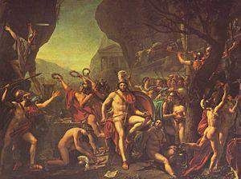

<!-- # ＜摇光＞北大与清华，雅典与斯巴达 -->

**据说敬爱的胡CORE曾经借用一个说法，北大像雅典，清华则像斯巴达。这个说法，我在北大《理想国》的课堂上，也听老师讲起，应该有些道理。雅典的空气是自由奔放的，斯巴达的空气是秩序井然的，雅典出哲人、诗人、辩论家、政治家，当然也出战士，而斯巴达唯一存在的理由，就是战斗，一个整体的战斗**。

# 北大与清华，雅典与斯巴达

## 文/ 张亮（北京大学）

从前我认识一个北大的女生，无意中聊起她对于清华男生的观感。“脑子直来直去的工科男，有什么意思。

我当然无意指摘这样的门户之见，毕竟在工科男中也有一些心思如发，颇有文艺鉴赏力的异类。但是当我们提及清华这样的学校，似乎第一时间联想到，确实是整齐划一，缺乏个性。一个吊诡的事实是，清华数量有限的女生，却往往引起我们更大的关注。网络上盛传的“枪在手，跟我走，砸清华，抢奶茶”，似乎恰有一种“万绿丛中一点红”。若是在北大，也许并不看重一两个可爱女生引发的群体事件。据说最近奶茶妹被清华男追到手，似乎北大的一些同学大肆调侃，我也只是淡淡一笑：“蒋方舟想要柳智宇还未遂呢，人家直接出家了。”

柳智宇，一个国际数学奥数金奖获得者，旁人眼中的神童，已经拿到了人人艳羡的麻省理工的OFFER，似乎应该笑傲江湖，环游世界，怪不得粗壮而可爱的蒋方舟即便藏身万绿丛中的清华，也要娇嗔道：“偶就喜欢柳智宇。”

但在这些光环之外，柳智宇却不仅仅是一个理科学生，更是北大耕读社的成员。据说该社好几任前任社长都已在龙泉寺出家，柳智宇的出家，似乎也是顺理成章。柳智宇有过几篇文字散落在网络上，从中可见他所受到的系统人文的熏陶，他认为人应当有自己独立思考的精神，就应该系统的研读古典文化的典籍，应该冷静的旁观这个世界，或许出家是另一种方式的救世。甚至是对爱情，他也有一种通透的理解。

一时舆论哗然中，我们却看到另一层意涵，若是柳智宇不是在北大，而是在清华，自然没有机会去参加什么耕读社，也不会有前辈学长出家的表率，他的人生道路，也许正和大部分理工科学生一样，也许未必没心没肺，对人生问题漠不关心，然而思考本身，对他也不过是味精鸡精似地调味，不会彻底抛弃红尘，做一种出世的救世。

我想，这就是北大学生与清华学生的根本不同处，也是北大虽然理工科也很强大，却依然被人们视为文科学校的根本所在。

“独立之精神，自由之思想”。绝对不被世俗的物议，被大多数人的价值观所左右。

鲁迅先生说，北大是常为新的，这个新，首先体现在北大学生对人生问题，社会问题宗教虔敬似地关注与思考，这一点，确实是清华学生少有的。有一位先在北大，后又去清华念书的同学告诉我，当她在清华食堂吃饭，和同学们聊起对社会问题的看法，旁边的清华学生立刻惊讶的问起：“你们一定是北大的吧。”

因是之故，北大有许多怪人，也就不足为奇。他们的人生道路也都千奇百怪。初到清华，所有的建筑物都是苏式的坚硬整齐，道路东西南北，秩序井然，走进北大，却往往幽径通幽，有一种找不到北之感。北大学生的人生道路，与北大校园的风格竟也有某种相互印证。有的为了追求宗教信仰，好好的中央国家机关公务员不做，千里迢迢跑到美国去读神学，做神父，希望造福于世人，有的不断转换专业，从理到工从工到文，目的无非是找到内心真正的所爱，真正的自由，甚至有的放弃在大城市工作的机会，回到乡里，种地养花，吟风弄月，过一阵恬淡的生活。北大学生彰显个性自由，敢为天下先，似乎与清华学生南辕北辙。但是这种被人文学科浸染的品质，在49年以后的中国却日渐沉沦。一个很有意思的现象，北大在1949年以前的校长，都是文科学者，1949年以后，除了一个被千万人踏上一只脚，永世不得翻身的马寅初，其余全是理工科出身。这当然与中国目前“工程师治国”的现状密切相关，而与世界潮流迥然相反，但也似乎反映了中国社会的暮气深沉。

一个明显的例子，中国近代以来，几乎所有代表新思潮的学生运动，都是北大学生领头，而清华的学生，似乎总是面目晦暗，不会做这样的出头鸟。上个世纪20年代，那个著名的北大旁听生喊出的口号：“国家是我们的国家，人民是我们的人民”，似乎也只有在北大，才能找到共鸣。或许，这正是此种原因，让他若干年后，仍然不忘记评价一句：“北大，就是池子浅，王八多。”表露出一种爱之深，恨之切的纠结。

说了这许多，似乎都是北大的某种优势，毕竟“红楼飞雪，一时英杰”正代表了一代一代北大学生的心结，或多或少有些历史的遗存在。或许，这也是一个文科学校历史传统的浸染。无论怎么扩大专业，增加院系，过去的小宇宙依然能在今天星火留存，待机而动。

但在一个个单个杰出的校友之外，北大学生却往往表现出过于矜高的特点。阮籍的《咏怀》诗“夜中不能寐，起坐弹鸣琴，薄帷鉴明月，清风吹我襟”未必准确，却恰能反映出每一个自视甚高的北大学生的内心情怀。一个通常的情况是，北大学生出校门之后，工作往往不如清华的好，又喜欢物议时事，但并非每个人都能做落落寡欢的苏格拉底。诚然，黑格尔说过，人类的未来需要一群仰望星空，而并非只是看着脚下的人，但如果一群人都只顾仰望星空，则脚下的路便显得凌波微步，有凌空虚蹈的危险。

据说敬爱的胡CORE曾经借用一个说法，北大像雅典，清华则像斯巴达。这个说法，我在北大《理想国》的课堂上，也听老师讲起，应该有些道理。雅典的空气是自由奔放的，斯巴达的空气是秩序井然的，雅典出哲人、诗人、辩论家、政治家，当然也出战士，而斯巴达唯一存在的理由，就是战斗，一个整体的战斗。

古罗马学者普鲁塔克在《希腊罗马名人传》中，描绘过这样一群伟大的人物。在他的笔下，斯巴达最伟大的英雄，无论开国元勋莱克格斯，还是武功赫赫的亚杰西劳斯，任何一个单个的斯巴达人，在群星璀璨的雅典人面前，无不黯然失色。但当全希腊陷入火并之，爆发伯罗奔尼撒战争时，人杰辈出的雅典却毁于保守稳健的斯巴达人。

修昔底德在《伯罗奔尼撒战争史》中，明显对斯巴达抱有一种偏爱，古典时代的人们，更偏向于稳定秩序，历史本身也往往是胜利者书写的，我们当然可以弃之不管。但北大学生的过于强调自我，强调个性，却未必全是好事。普鲁塔克在《离邦去国者》一文中，记述了全希腊最杰出完美的人，也是亚里士多德的高徒，雅典人亚西拜阿德的故事。他先是因为行为乖张，被雅典的政敌诬陷为“亵渎圣像”，被缺席判处死刑。当时，他在远征西西里的军中，闻听此事，连夜逃走。雅典人最强大的远征军失去了最英明睿智的统帅，而代以老迈的尼西阿斯。亚西拜阿德为报复他的政敌，转而帮助伯罗奔尼撒联军，斯巴达人尽知雅典虚实。

此役，雅典人大败，全军覆没。从此，斯巴达人开始成为全希腊的主人。

这是一个转折点，雅典的转折点，斯巴达的转折点，全希腊的转折点。

这个转折点起源于一个全雅典，也可以说是全希腊最杰出的全才：雅典人亚西拜阿德。亚西拜阿德，你是全希腊最出色的人。你在广场上雄辩滔滔，你是苏格拉底最得意的门生，你的外号是“变色龙”，能随时根据时势的需要改变颜色，自我保护，你在斯巴达比斯巴达人还要斯巴达人，勇敢、无畏，高贵，剔平了长发，喝最难喝的黑肉汤，你在波斯比波斯人还要奢华，淫乱，侍从如云，让波斯国王也瞠目结舌。

你是如此让人不可思议，亦正亦邪，自身甚高，但也正是你，以为自己就掌握了真理的方向，理念的权柄，每到社会动荡巨变之时，你一个人跳出来，企图扭转乾坤，你对抗全雅典，甚至全希腊，甚至强大的波斯皇帝，最终，却让雅典陷入失去杰出统帅的混乱之局。

个体的杰出完美，对世事的把握，往往会让人产生“半人半神”的错觉，中国近代历史上，每遇关键的历史时刻，北大学生中总不乏自认为掌握了真理，敢为天下先的仁人志士。但其结局，往往并不如人意。五四运动总指挥傅斯年、罗家伦对学运的理念无法赞同，中途退出，49年以后的种种政治事件，往往都是北大学生首先煽风点火，甚至损失惨重，却往往得不偿失。或许，他们确实掌握了一部分真理，但当他们喊出高蹈的口号，做出激烈的举动，却往往发现理想与现实的巨大差距，甚至行动本身都难以为继。

历史就是这样喜欢跟人开玩笑。从来喜欢引领潮流的北大，渐渐的退居其次，毛主席说，文科学校有什么好办的，自学就行了。就办理工科办。这样的说法，自然偏狭，却也是时代巨变后，一个后发现代化集权国家的必然之局。我们不需要不同的声音，我们只需要一个声音，一面旗帜，一个方向，奋勇向前。

北大落寞了，当然学生们依然可以在BBS上尽情嘲笑隔壁清华的种种轶事，但我们不得不承认，正是一个个性张扬的北大，老是出现许多负面的典型，正是一个面目模糊，没有什么个性可言的清华，却给人一种踏实稳重可靠的形象。从政界到科技界，清华的声音似乎压过了北大，以一种更加稳健的姿态引领着潮流，尽管未必，这就是正确的方向。

但我对未来依然抱有一丝信心，或者说一点信念，因为一个国家不可能老是像老牛拉破车似地，沿着一个方向，听着一个声音奋勇向前，他当然需要反思，需要思想的潮流，新兴的力量，否则就会像龚自珍所言“万马齐喑究可哀”，但是在此沉闷的时势里，北大是真的更加沉闷了。

雅典最终陷落于斯巴达人之手。但是斯巴达最后也毁于蛮族之手。当雅典与斯巴达忙于内战之时，新兴的马其顿人征服了他们。史家往往认为，尽管斯巴达最终艰难的战胜了雅典，但他始终没有勇气改变自己的体制，习惯于保守与服从的斯巴达人，仅仅满足在雅典建立与自己相仿的僭主体制，满足于守成之局，却未能征服雅典人的心。他们从未真正扩展自己的权柄，像无所畏惧的雅典人那样，建立一支庞大的舰队，企图征服整个希腊，进入他们未知的领域，统合全希腊的力量，建立一种崭新的体制，给已经不合时宜的希腊城邦国家带来新的空气。从历史上看，这群伟大的斯巴达战士，也许比雅典人更团结一致，坚韧不拔，所向无敌，但它过于谨慎，缺乏进取的激情与改变现状的勇气。

当我们反观历史，不仅感叹，要是有一个强大的民族，既有雅典人的高瞻远瞩，勇于进取，人杰辈出，又有斯巴达人的团结一致，坚韧不拔，那将是一个不可战胜的民族。

但也许，这一切都是意淫。也许正如重庆谈判时毛泽东对傅斯年罗家伦的揶揄：“坑灰未冷山东乱，刘项原来不读书。”所谓北大也罢清华也罢，雅典也罢斯巴达也罢，统统不过是历史的浮云，只待他人来说。

（采编：林静；责编：陈锴）
