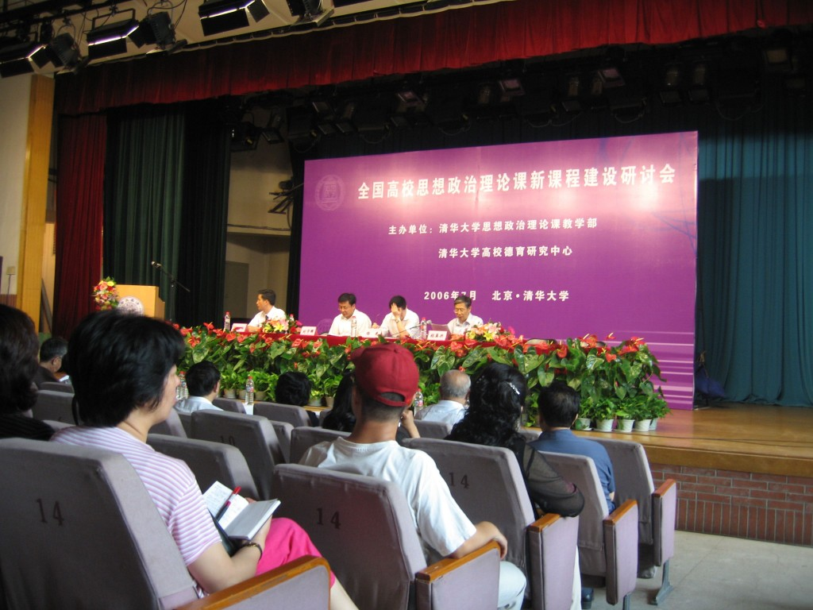
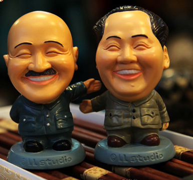

<!-- # ＜开阳＞政治课进大学 -->

**严格来说，中国从上三代以来的数千年历史里，在实现全国的有效统治之后主动进行分权的政权迄今为止还未曾出现过。到30年代，国民政府延续了清末以来“中央主办大学、各省主办中学、各县主办小学”的教育方略，再加上国家统一和财税体制的完善，大学才摆脱了经费不足的问题，“教育经费独立”运动旋即退潮；但随之而来的则是国民党“党化教育”的正式提出和开始，北洋时期的自由开放的风气在三四十年代为之一变，转入国家主义的轨道上。**

# 政治课进大学

## 文/梁哲浩（华中科技大学）

正如“反革命”一词、一罪是由武汉国民政府1927年公布的《反革命罪条例》所首次定义和规定一样，今日教育中以“两课”为代表的政治课和各种政治化的人文学科课程，也是由国民党的“党化教育”延续而来。

#### 清末及北洋时代的教育境况

政治对近代教育的冲击源自清末。原本湖北作为“新政”的活跃基地，也是新办教育的“示范省”。在甲午一役之后学习日本教育的浪潮中，湖北在派遣留学生、聘请日本教习、翻译书报、官办学堂等诸方面均是佼佼者，其时更以打出“兴学育才”旗号的“湖北全省学务处”为统办新学的行政机构，班底包括了陈寅恪的祖父陈宝箴、杨守敬、辜鸿铭等鸿儒巨擘。可惜，由于湖广的“新学”进步对官办的力量依赖太重，随着武昌首义后清廷势力的迅速瓦解，与之相伴的则是湖广教育现代化的大退潮，中国新教育的重心由世纪初的湖南、湖北，逐渐转向了沿海的江浙地区。这一境况直到抗战大迁徙发生后才慢慢恢复，最终依靠中共建政后将武汉立为中南局中心才调整回清末水平，并一直延续至今。

在北洋时期，由于北京政权内有派系之争、外有南北对峙，政府财政的绝大多数被用于军费开支；而在学校方面新文化运动下的学潮此起彼伏，以郭秉文、蔡元培为代表的一批学者也高举“教育独立”、“教育救国”的旗号，再加上杜威此时恰好来华讲学三年、力推“民主主义与教育”和“进步主义教育论”（小插曲：杜威在长沙讲学之时，毛泽东应《大公报》之约为其记录）。1912年至1926年教育总长更动50次、共38人，政治之动荡、政府之无效可见一斑。教育部不仅少有统辖教育事务的能力，甚至于自身难保，拖欠工薪严重；以至于因为过于无能被李石岑提出主张废教育部，教育界也往往越过教育部直接向国务院提出抗议。

在这种情况下，民间组织、社会力量的蓬勃发展，国内文化教育界涌现出大批民间自发组织的学术团体和机构，大都以议论国内教育事宜、抨击时弊、介绍国外新知、进行教育改革为宗旨。据不完全统计，1911年至1927年，新成立的民间性质的教育社团有85个，而官方性质的教育团体仅为16个。当时著名的教育家都发起和参加过多个教育社团。如蔡元培曾参加中华教育改进社、中华职业教育社、中国科学社等，胡适曾参加北京教育会、中华教育改进社、中华教育文化基金董事会等，为他们推动教育改革提供了舞台。以1917年黄炎培创办的中华职业教育社为例，成立之时有会员786名，1920年达3085名，1927年达6582，十年之内增加了8倍【1】。其中，由各省教育会及特别行政区教育会推派代表组成的全国性民间教育组织“全国省教育会联合会”尤为重要，其力量在“1922年学制”的制定和颁布中无可替代。可以说，北洋政府时期是代表工商业的市民社会制衡国家力量的高峰，国家掌控能力空前低落，大学正享受着历史上从未有过、也再未有过的自由和朝气。

但是，这种蓬勃发展却犹如建在流沙之上的房屋一样极不稳定。综观德美日大学的勃兴，均是在普法战争结束后、南北战争结束后、西南战争结束后，国家走向统一与稳定之时成长起来。而反观此时中国大学的兴起，则似乎注定是昙花一现：中央教育经费仅为财政预算的1.8%【2】，一名养兵之费可供140名学生之资，而军政府则因学运不断常常以国库空虚为由拒拨经费，以至于1920、1921两年北大、北师大等国立八校教职员发起“教育界同盟罢工运动”、“讨薪运动”和“教育经费独立运动”【3】（小插曲，1921年一次流血请愿被称为“六三事件”）；教员流失更是难以遏制，蔡元培常有“人才至为难得，若求全责备，则学校殆难成立”、“求曾在大学毕业之人来任大学教员，已苦於不易得”之叹；而彼时的大学校长为稻米计不得不同军阀结交，以至于引发学潮和政治危机而被迫辞职者如东南大学校长郭秉文【4】；教会大学虽然大多经费无忧，但是在民族主义高涨的社会中饱受责难【5】——连蔡元培那时都力推“收回教育主权运动”、“教育独立议”【6】，更毋言陈独秀等激进分子，而校长与教会之间的冲突也导致了大批师生出走，比如复旦的建立，像燕大那样校园平静的实属孤案。

#### 党义教育的提出

严格来说，中国从上三代以来的数千年历史里，在实现全国的有效统治之后主动进行分权的政权迄今为止还未曾出现过。到30年代，国民政府延续了清末以来“中央主办大学、各省主办中学、各县主办小学”的教育方略，再加上国家统一和财税体制的完善，大学才摆脱了经费不足的问题，“教育经费独立”运动旋即退潮；但随之而来的则是国民党“党化教育”的正式提出和开始，北洋时期的自由开放的风气在三四十年代为之一变，转入国家主义的轨道上。

1923年，黄炎培在中华教育改进社的董事会上，呼吁教育界团结不为政党所利用。由于教育会拒绝响应国共两党的路线，被指责为“乡愿教育”、“教育界的学阀”。1925年，东南大学发生学潮，国民党人假北京政府之手，将校长郭秉文及教育厅长蒋维乔等官员与校董会免职，这被认为是政党力量打击民间团体和个人的开端。【7】

最早在1926年，广东教育厅长许崇清将日本维新与苏俄革命的成功归于中央集权，强调中国的特殊国情，不适合无政府主义或自由主义，并提出了《党化教育——教育方针草案》，以国家主义和民族主义为纲。【8】

1927年，在形式上实现国家统一之后，国民党开始了重建国家权威的努力。当年5月，蒋介石在南京纪念五四大会上重新宣明“党化教育”，提出“以党治国’，“以党义治国”。7月，国民政府教育行政委员会发布《学校实施党化教育办法草案》，提出“我们所谓党化教育就是在国民党指导之下，把教育变成革命化和民众化，换句话说，我们的教育方针是要建立在国民党的根本政策之...这是党化教育的具体意义。”【9】以具体的《浙江实施党化教育大纲》为例：（1）以本党训练党员之方法训练学生；（2）以本党的纪律为学校的规约；（3）根据《孙文学说》“行易知难”及《民族主义》第六讲，建设新道德应从求新知人手；（4）依训政时期国家的组织为学生自治的组织；（5）以三民主义之中心思想确定学生的人生观【10】。10月，胡汉民又撰文批判五四以来“思想自由、兼容并包”的教育主张，认为“教育不可无上义，主义只能宗于一。我们现在既以惟一的三民主义救国、建国、治国，教育是不能跳到国家范围以外去的。当然也只能宗于惟一的三民上义而不能兼容其他主义，否则还是等于无主义；”我们必不能让所谓‘包罗万象’动摇了我们已定的教育宗旨。”【11】

不过“党义教育”无论是外在名称和实际内容都实在是过于露骨，一经发布便引来学界强烈反弹，不得不很快改头换面。1928年5月，在大学院召开的第一次全国教育会议上，决议废止“党化教育”，代之以“三民主义教育”。次年3月中旬，国民党第三次全国代表大会第十一次会议颁布“三民主义教育宗旨”：以充实人民生话，扶植社会生存，“中华民国之教育，根据三民主义，发展国计民生，延续民族生命力为目的；务期民族独立，民权普遍，民生发展，以促进世界大同。”【12】要求“矫正从前教育上放任主义之失”，以使三民主义教育的功能得以发挥。【13】1932年国民党第四届中执委第三次全体会议决议：党在教育发展上具有主导权【8】。

在务实方面，“党义教育”的具体手段包括：1928年成立中央政治学校（中央党校飘过），变更学校课程，设党义课取代公民课，1932年后改为“三民主义公民课”（两课泪目）；1928年，教育部公布《教科图书审查规程》、《审查教科图书共同标准》，建立了严格的教科书审查制，规定教材内容必须“适合党义，适合国情，适合时代性”，强调“以三民主义为教科书的中心思想”，“以管、教、养、卫的真义为教科书的一贯系统”；鉴定党义教师资格，排除共产主义课程，并将党义列为大学乃至留学考试的必修科目。【14】

#### 国家主义教育政策的实践

蒋介石在第三次全国教育会议上称，“今天我们再不能附和过去误会了许久的教育独立的口号，…应该使教育和军事、政治、社会、经济一切事业相贯通”，要求教育界“齐一趋向，集中目标，确确实实为实现三民主义而努力。此前的十年时间里，号召“整一性”、“严格训练主义”的民国政府，已经通过新颁布的一系列教育立法，将北洋时代确立的美国式管理体制和教学模式大幅改变，建立起中央集权的教育体制和严格训练的教学模式。

1929年5月，国民政府以“整伤学风”、“办理不善”、“不合规程”、“违背法令”为由，封闭了上海大学、华南大学、大陆大学。9月，胡适因指责党义教材为“党八股”而遭国民党中训部传唤训诫，“近年以来，凡发言论，每多荒谬，请予严惩”，并通报大学校长“切实督率教职员，详细精研本党主义，以免再有与此类似之谬误发生。”【15】1930年南京晓庄师范被封闭，陶行知遭通缉被迫流亡日本，引发杜威、罗素、爱因斯坦等人联名致电抗议。1930年4月，第二届全国教育会议召开，106位与会代表中教育专家学者仅24人，胡适、陶行知等异议分子被排除在外，其余均由官员和各校长担任。1934年的国民政府公布修正后的《大学组织法》，事实上改变了1912年蔡元培《大学令》所确立的教授治校的制度。大学的“评议会”、“教授会”，改为“校务会议”和“院务会议”，延聘的专家只算“列席”，且“人数不得超过全体人数的五分之一”。

30年代初，训育制度颁行全国。根据《各级学校党义教师及训育主任工作大纲》、《三民主义教育实施原则》等文件规定，中小学校长和训育主任需由国民党党员充任；党义教师及训育主任除辅助学校行政、教学外，应与学生接近，以匡正其思想、议论、行动、在中等以上学校应随时调查学生平时所阅读刊物及发表之言论，调查学生交友种类及其行动。1930年国民党中央公布的《学生团体组织原则》和《学生自治会组织大纲》，规定学生团体“以在学校以内组织为限”，“以不侵犯学校行政为限”，成立学生团体“必须呈请当地高级党部批准”，从而将学生社团置于国民党管辖之下。

虽然抗战期间国民党选择了“平时即战时、战时即平时”的原则“坚持正规教育”；但是1938年新上台的教育部长陈立夫上台，随即颁布《青年训练大纲》，要求青年学生训练树立“为主义、民族国家而牺牲”的人生观，“国家高于一切”的国家观，信仰训练的目标是“信仰三民主义”、，“信仰并服从领袖”，通过讲述领袖言行，“使青年耳听心唯，时时刻刻心领袖之心，行领袖之行。”【16】

当年4月，教育部又发布《战时各级教育实施方案纲要》，力推“九大方针、十七要点”，其中“九大方针”之一的就是“教育目的与政治目的的一贯”，实施“政教合一”。【17】其中规定，中等以上学校一律采用军事管理办法，对于管理应采取严格主义、采用德国学校严格的训育制度，设训导处、导师制，加强对大学生思想控制，“信仰或服从领袖”。所谓“导师制”，是在中等以上学校每五至一十五人为一组，设导师一人，“导师对于学生之思想、行为、学业及身心摄卫，均应体察个性，施以严密之教导，”“应依照格式详密记载，每月报告学校及学生家长一次”，等等。在大学设立“国民党直属支部”、“三青团直属分团部”，明令高等学校院长以下人员均须加入国民党，以“加强学校与党务之联系”。对异见的教授和学生监视、控制、打击、迫害，乃至暗杀的事件不断发生，许多教授被列入“黑名单”被迫离校；如马寅初被宪兵绑架，北京大学教授马叙伦、许德珩等，清华大学张申府、北平大学教授李达等均遭解聘。

留学政策亦受到政治和意识形态的严重影响。1938年教育部制定《限制留学暂行办法》，严格规定公费、自费留学生的研究科目一律以军、工、理、医药及与军事有关的学科为限【18】；后又规定自费停办，留学生数锐减：从1936年的1002人骤降至366人，以后均为两位数，直到1942年太平洋战争爆发后，中国战场的地位陡然上升，才回升至三位数，228人。1943年国民政府试办留学考试，要求录取者必须接受国民党中央训练团培训后方可出国，后因遭到强烈抨击，次年底取消【19】。

综合来看，当今教育中政治入侵导致的每一“怪现象”均可以在国民党时代找到先例；而当年的“党化教育”的每一项行动也可以在今天找到继承者；从规定的文字角度来说，其内容比我们现在经历的政治对大学的控制更为严苛。只不过值得庆幸的是，国民党在民国的“军、政、党”统治序列中处于末尾，其组织动员能力、政治同化能力、理论创新能力自“四一二”之后长期保持于一塌糊涂的水平上，同共产党相比简直不可同日而语。虽然它在校园内设党部、团部，广为拉人和宣传主义【20】，但是滥征收党员的行为也引起强烈不满【21】，以至于“一般青年...甚至对做一个党员或团员为可耻”【22】，或者羞于在群众面前公开自己的身份【23】。其“中小学的党义教课，怎样的学生不感兴趣；大学的党义教员，怎样的被学生轰了又轰、赶了又赶”【24】，实际能力同自身期望严重不匹配，这使得“党化教育”实在尴尬至极。党权低落，民国实为“军治”而非“党治”，党集团无法通过对政治信念的阐释团聚社会精英、特别是学术界人士，也就不可能产生“三民主义教育思想”以及配套的学术权威为政党干预教育寻求合理性支撑；而党外强大的学术团体中又弥漫着对国民党的鄙视；在政治上党团员的身份与入仕亦无甚联系【25】；因此，这样的党虽然勉为其难地把政治课塞进了整个教育体系，但根本无力维持其地位和效果。

#### 结语

总之，当年国民党对教育自由理想的认识，在下实在不敢恭维，北洋后各大学尚能维持独立自主，更多是他家有贼心无实力的结果。反观共产党，49年建政时，普通民众的狂热支持、全国胜利的巨大威望、知识分子的同盟相助、以俄为师的发展模板、光荣而有力的党机器——可以说国民党没有的他有、国民党有的他更好——以这样的态势推动教育为政治服务，焉有不成之理？国民党的国家主义教育策略，最终在共产党手上开花结果，不得不说这对兄弟实在是默契之至。

到今日，“党义课不感兴趣”、“学术界人士不认同党集团”、“党团员身份与入仕无甚联系”至少这三点又发生在了共产党身上，不得不让人觉得乃兄正站在历史教科书上嘲讽着、同病相怜着；而彼时国民党之后来种种，难道不应该让当下之共产党引以为戒吗？

### 【参考文献】

【1】田正平、周志毅，黄炎培教育思想研究，页67 【2】商丽浩，论中央政府在教育近代化中的角色——以财政为中心，教育与经济，第二期，2000，57 【3】苏云峰，中国新教育的萌芽与成长（1860-1928），页195；舒新城，中国教育建设方针，页46-47,87-90。

【4】黄书光，郭廷以先生访问记录，页361 【5】舒新城，中国之高等教育，页112. 【6】蔡元培，教育独立议，《新教育》第四卷第3期，1922年3月

【7】黄炎培，在中华教育改进社董事会的演说词，《新教育》，第7卷，页36-38 【8】任时先，中国教育思想史，页364-370 【9】《教育杂志》第19卷第8号，1927年

【10】郑登云，中国高等教育史(下册），页344 【11】胡汉民，建设与教育，《革命文献》第五十四集

【12】李华兴主编，民国教育史，页317 【13】朱经农，近代教育思潮七讲，页146 【14】何炳松，三十五年来中国之大学教育，页119；喻本伐、熊贤君，中国教育发展史，页485 【15】金以林，近代中国大学研究，页205 【16】第二次中国教育年鉴，页360，商务印书馆

【17】秦孝仪主编，战时教育方针，页250，175-216 【18】卫道治，中外教育交流史，页169，第172-174页

【19】曲士培，中国大学教育发展史，页540-543 【20】潘光旦，政治信仰与教学自由，政学罪言，观察社，1948年4月初版

【21】王奇生，党员、党权与党争，页304 【22】《本刊座谈会记录：党团统一组织问题》，《三民主义半月刊》第十卷第12期，1947年9月；

【23】殷海光，中国国民党的危机，1946年2月

【24】任鸿隽，党化教育是可能的吗？，《独立评论》第三号，1932年6月

【25】王奇生，党员、党权与党争，页204-212

（采编自投稿邮箱；责编：麦静）
