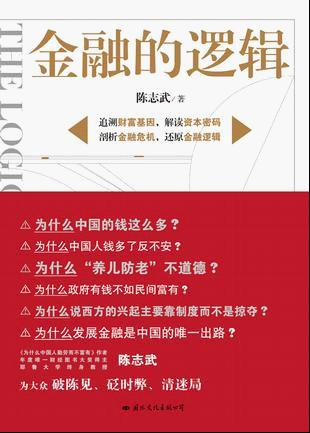

<!-- # ＜北斗荐书＞本期主题：《金融的逻辑》的一些TIPS -->

**我们常说中国的年轻人更依赖家庭西方的年轻人更独立并非文化差异而使经济水平的差异造成。一个市场经济发达、人口流动不受限制、机会更加平等的社会显然更有利于年轻人生存并且脱离家庭的束缚。同时，私人保险、债券基金的发展也为居民养老提供了更为安全的担保，客观上也不需要通过束缚子嗣养老。因此今天儒家文化离我们逐渐远去并不是世风日下人心不古，而使经济发展的必然。**

# 本期主题：《金融的逻辑》的一些TIPS

## 荐书人 / 彭鹏（徐州师范大学）

### 推荐书籍（点击蓝色字体书目可下载）

**[《金融的逻辑》](http://ishare.iask.sina.com.cn/f/7882101.html)**

1. 研究中国历史无非规避的一个问题便是为什么中国每四五十年经历一次的农民起义、每二三百年都要经历王朝更迭。结合陈志武的书得出一个很有意思的解释：古代中国金融体系的落后和缺乏创新直接造成规避风险和对未来收入透支能力的低下，虽然历代王朝均讲究休养生息、王室要勤俭节约并最大程度地往国库存银子。然而对王权缺乏监督和制约必然滋生腐败和寻租并不断加大政府运作的成本，一旦碰上连续的社会动乱或者异族入侵必然带来财政吃紧国库空虚，面对庞大的开支政府往往只有加税一种办法，这无疑更加剧了社会矛盾并最终使王朝走上覆灭。权力失控和腐败贪污肯定是改朝换代规律的制度性原因，除此以外还有国家财政政策和金融技术上的差别。

2. 古代王朝也有过通过类似国债的形式向商人筹款的记录，然而缺乏信用体系和对权力的制约使得王朝一旦渡过危机往往给商人赠官甚至以送匾了事而告终。当然，不排除某些商人将借款视作进入体制的跳板或者日后寻求政府庇护的担保，但这不仅造成更大的寻租也透支着政府的信用，为日后覆灭埋下伏笔。

3. 证券固然能优化市场资源配置、提高国力和国民消费能力，但它们对契约机制和权益保护机制的要求极高，一个缺乏对宪政和信用尊重、缺乏外力与自身博弈和抗衡的政府显然无法满足。此为古代金融体系落后原因之一。

4.古代金融体系落后的另一个原因便是“国富民穷”，在普通百姓身上并没有多余的空间发展金融体系。民间缺乏与政府抗衡的机制，无法做到“无代表不纳税”，政府作为强势的一方可以巧立名目肆意征税乃至发动恶意通胀（当然走到这步也离灭亡不远了）。与此同时，落后的金融体系造成官府必须最大下度存银子一种方式规避风险，客观上又加剧了“国富民穷”的局面。

5. 黄仁宇曾经将中国未能走向资本主义归结为没有实行数字化管理，此为表因。一个没有健全金融体系的国家当然无法做到数字化管理。事实上即使在今天，政府依旧掌握着一切政治经济的优势资源，管制丛生寻租遍地，对上游资源和一级市场的垄断以及在大多经济领域的准入限制，迫使商人只能在低端市场血拼，并且在多数情况下处于弱势地位从而主动行贿寻求政府庇护。与此同时对公共工程的国家垄断或者半垄断致使民间一直未能建立有效的融资方案对民间财富进行升值，同时，这些project一经官僚系统的暗箱操作会造成更大的腐败和租值耗散。过去历史教科书广为诟病的古代富人阶级买房置地的行为，今天看来不过是他们规避通胀危险为财产保值无奈手段而已。

6. 儒家文明之所以强调“家文化”实乃经济水平滞后的结果。古代中国没有金融债券、没有私人保险，普通百姓收入大多依靠纯劳动力的农业人收入，因此“孝道”的背后是只有“养儿防老”来规避风险的无奈。同时，传统文化对血缘关系的强调也是因为金融业的落后造成拥有血缘关系的家族内部互助关系。造成这一切的根源在于政府对私人经济的抑制和对高利贷管制以及缺乏稳定的信贷机制，生产要素无法自由流动，私人借贷的成本极高。普通百姓脱离了宗族很难在外生存。可以说，儒家文明并非中华名族内生，而是被动选择。

7. 我们常说中国的年轻人更依赖家庭西方的年轻人更独立并非文化差异而使经济水平的差异造成。一个市场经济发达、人口流动不受限制、机会更加平等的社会显然更有利于年轻人生存并且脱离家庭的束缚。同时，私人保险、债券基金的发展也为居民养老提供了更为安全的担保，客观上也不需要通过束缚子嗣养老。因此今天儒家文化离我们逐渐远去并不是世风日下人心不古，而使经济发展的必然。

（采稿：黄霄；责编：徐毅磊）
