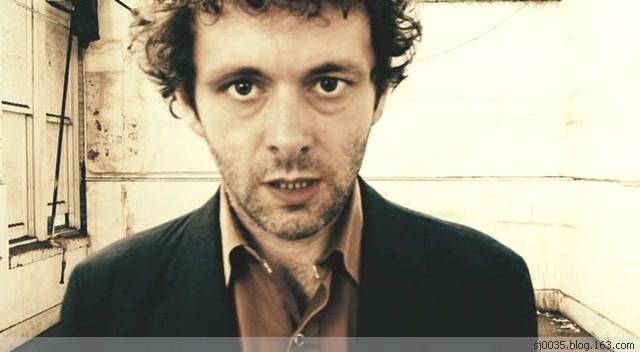

<!-- # ＜摇光＞从《战略特请组》看“沉默权” -->

**我并不否认“沉默权”对于公民的重要意义，行之有效的“沉默权”的确能够保证弱小的公民在与强大的国家机器对抗时保护自己，实现公平正义。但是在当今中国，在现行社会环境，舆论环境，司法环境之下，“沉默权”不仅无法发挥保障人权的作用，甚至会画虎类犬，反噬人权。“沉默权”显然只是手段，而不是目的。**

# 从《战略特勤组》看“沉默权”

## 文/奥布莱恩（中国人民公安大学）

美国小成本电影《战略特勤组》表达了多数人的正义是否超过少数人的正义这样一个深刻的主题，宗教极端主义者扬格制造了数个原子弹分别放置在洛杉矶、芝加哥等几个大城市里，企图用恐怖主义手段来威胁美国当局改变其中东政策，FBI的女警官布洛迪和神秘的审讯专家H负责讯问扬格，找出原子弹的具体位置，解决一场史无前例的恐怖危机，挽救成百上千万人的性命。神秘的H是一个十足的法西斯形象，采取逐步升级的血腥残酷的肉刑方式进行审讯，对扬格威逼利诱严刑拷打，无所不用其极。而女警官布罗迪作为一个坚守人道精神的高尚道德者则旗帜鲜明地反对H的审讯方式，她坚持认为这种残酷的刑讯方式成效甚微，作为执法者，必须遵循法律程序获取供述，并试图以道德感化的方式来劝说扬格交待出藏匿原子弹的地点。在事关城市存毁的重大压力下，H从针对杨格个人的刑讯过渡到杨格无辜的家人身上，他将杨格的妻子和一对儿女强制带到刑讯现场，当着扬格的面切开了他妻子的喉咙，并用他的子女做胁迫逼他说出地点。影片就是用如此残酷的情节暗讽了那些站在道德高点的君子们。女警官布罗迪循规蹈矩，采取了政治正确、道德高尚的审讯措施，保护扬格的权利，却无力阻止一场危机的爆发，最后也正因为布罗迪的优柔，使一个隐藏的原子弹未能被发现而造成了人间惨剧。而审讯专家H则为人残忍暴虐，手段肮脏卑劣，甚至对嫌疑人无辜的家人也不惜施以极刑，为达目的不择手段，令人唏嘘的是，H这些卑劣不堪的、为我们日常道德观念所不容的手段却是建立在一个崇高的目的之上，而且正是因为H的刑讯，使扬格交待出了其中数个地点，才成功地保住了数百万美国人的生命，使他们免受灭顶之灾。看完影片，联系到最近大家热议的“沉默权”问题，我思考许久，到底“沉默权”是手段还是目的？

刑诉法修正案草案公布后立即引起了全社会的广泛关注，上至法学宿儒，下至普通群众，均对刑诉法的修改发表了自己的看法和见解。公众如此热心刑诉法的修改，实在是一个让我们欣慰的现象，这表明了全社会法律意识的增强，都认识到刑诉法这个关系到自己切身利益的基本法律的重要性，这是我国普法事业的骄傲。草案公布后，一大批法学理论界的学者，司法实务界的律师对刑诉法修正案中未明确规定“沉默权”表示失望，他们认为在刑诉法中明确赋予犯罪嫌疑人“沉默权”已经刻不容缓，作为基本人权之一的“沉默权”理应得到尊重和保障。

他们在报刊上、网络上摇唇鼓舌，奔走相告，阐述“沉默权”的意义，论证“沉默权”的必要性，界定“沉默权”的内容，希望通过舆论来影响立法。他们言之凿凿地提出了他们的理由，如明确赋予嫌疑人“沉默权”可以有效地防止刑讯逼供现象发生，从而保证无辜的人不受冤枉和司法公平正义。这些完美无瑕的理由看似无可辩驳，实则经不起推敲，犯了教条主义的老毛病。我并不否认“沉默权”对于公民的重要意义，行之有效的“沉默权”的确能够保证弱小的公民在与强大的国家机器对抗时保护自己，实现公平正义。但是在当今中国，在现行社会环境，舆论环境，司法环境之下，“沉默权”不仅无法发挥保障人权的作用，甚至会画虎类犬，反噬人权。“沉默权”显然只是手段，而不是目的。总而言之，在现阶段，为更好的保障公平正义，实现人权，我们不能赋予犯罪嫌疑人“沉默权”。

支持“沉默权”写进草案的学者和律师，从当今发达国家特别是美国对“沉默权”的现实保障出发，结合现阶段我国司法界爆出数件骇人听闻的冤假错案，论述“沉默权”对犯罪嫌疑人的极端重要性。众所周知，美国司法界有“米兰达法则”，即我们经常在港剧中看到的场景，警官好不容易终将犯罪嫌疑人按倒在地后立马气喘吁吁地向犯罪嫌疑人告知，“你有权保持沉默，但你所说的一切都可能成为呈堂证供。”如果警官和检察官在讯问嫌疑人之前未告知其有权保持沉默的权利，那么嫌疑人的供述和依供述所取得的一切证据都将视作无效，不得作为定罪的证据。这条规则充分地保证了人权的实现，处于不利地位的被告人可以通过行使“沉默权”来免受国家机关无穷无尽的诘问，以免由于自己对法律不熟悉而说出对自己不利的供述。但我们也应该认识到，投下一片阳光的同时，也必然会留下阴影。“米兰达法则”使国家机关在打击犯罪时必须提出能够超越合理怀疑的证据，增加了控方调查取证的难度，导致了司法成本激增，使本身就十分有限的司法资源更加捉襟见肘，更为关键的是，全社会必须承担保障“沉默权”的代价，部分实体正义诸如被害人的权益等等将得不到恢复和实现。在最极端的情况下，甚至会牺牲大多数人的正义来保证“沉默权”。显然这是违背我们保障“沉默权”的初衷的。

我国有无供不录案的司法传统，我们的刑事诉讼从古至今长期以来形成了以犯罪嫌疑人的口供为中心的特点，审讯犯罪嫌疑人是刑事诉讼中的一个重要环节，并建立了与此相适应的一整套刑事诉讼制度以保证刑事诉讼的顺利进行。学者和律师们都列举出近期我国司法界爆出的几件冤假错案如湖北佘祥林案，河南赵作海案，河北聂树彬案来猛烈抨击个别办案机关存在的刑讯逼供现象，呼吁取消犯罪嫌疑人如实回答的义务，来避免此类案件的发生。诚然，上诉案件确实由于办案机关刑讯逼供，甚至公然造假，造成了影响极为恶劣的后果，使得轻如佘祥林，赵作海蒙冤身陷囹圄十数年，重如聂树彬被错误地执行了死刑，失去了宝贵的生命。然而，对于我们这样一个人口众多、发展不平衡的大国，每年政法机关要办理上百万起刑事案件（据2011年最高检工作报告，2010年检察机关仅提起公诉的就有1148409人），在这样的背景下，出现若干起错案、冤案也是符合客观规律的。何以大家只见那两棵枯萎的病树，而对满目苍郁的森林视而不见呢？相比美国更注重让无辜的人免受追诉的司法理念，我国司法更在意使有罪的人得到应有的惩罚，但两者是殊途同归的，中外司法的终极目的都是为了更好地保护人权。

经济基础决定上层建筑，上层建筑要与经济基础相适应而不能超越当前阶段。这是一条亘古不变的真理。作为上层建筑范畴的“沉默权”要想真正发挥其保护人权的重要作用，必须同时符合两个条件即：一、社会物质文明发展到一定阶段，能够提供充分的司法资源保障司法的顺利运转；二、社会精神文明发展到一定阶段，能够承受“沉默权”所带来的心理成本，接受由“沉默权”而可能导致部分犯罪分子逍遥法外不受惩罚的事实。

显然，我国还不具备上述两个条件中的任何一个。首先，就当前我国经济发展情况来说，作为一个发展中国家，我们还不具备保障“沉默权”的物质基础。因为我国公安干警员额已接近200万，平均每四个国家公务员中就有一个是人民警察，全国上下几乎所有民警都处于超负荷工作状态，即使这样，社会治安形势依然严峻，警力仍然严重不足。如果每个犯罪嫌疑人都行使“沉默权”，那势必会造成侦查机关获取破案线索和犯罪证据的难度加大，一个刑事案件就要消耗大量的人力、物力、财力，整个侦查机关组织机构，人员编制，技术装备都需要成几何倍数的扩大。而这些都需要国家财政来支持，要在社会财富没有大量增长的情况下扩大国家财政，就只有提高税收一条途径，这样就会加重人民群众的经济负担，最终得不偿失。其次，在法治进程上，我国还远落后与欧美诸国，我们向来有重实体、轻程序的传统，只要实体正义，程序是否正义不是我们在我们所关注的范围内。我们非常在意法律对正义的保护和伸张作用。法网恢恢，疏而不漏，是人民群众对法制完善的期望。是故社会普通公众对打击犯罪不遗余力，而对保护嫌疑人权利意兴阑珊。在我国，如果因为程序正义而放弃实体正义是不可想象的。如果有犯罪分子因为“沉默权”而逃脱了法律的制裁，那势必会导致人民群众对法律的失望和不信任，进而动摇法律的权威，甚至使历经曲折的法治进程前功尽弃。

综上所述，我认为在刑诉法修改的“沉默权”问题上，我们一定要坚持实事求是，认真审慎的态度，立足国情，有所为，有所不为，更好地推动法治现代化。

(采编自投稿邮箱；责编：麦静)
