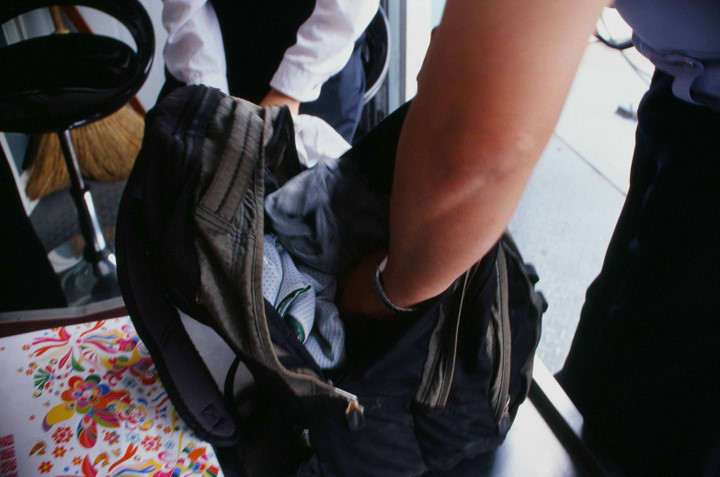
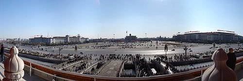

<!-- # ＜天璇＞携书离港时被扣留——记一次不愉快的入关经历 -->

**我脑中又浮现起那几张以此为生并乐在其中的嘴脸，这些究竟是什么样的人呢？在执行命令，查封书籍时，他们抱着何样的理念？他们是真正厌恶这些所谓反党反国家反宪法的内容，奉时下的政权为真理，还是仅仅为了混这碗饭吃？若是后者，那他们不会感到好奇，不会去想了解一些不一样的东西吗？我知道，人为了生存，可以扔掉那些人之所以为人的特质。可我也知道，平庸的人为了能轻易地活着，常常滥用这个借口，争先恐后地堕入麻木而投机的人格。**

# 携书离港时被扣留——记一次不愉快的入关经历

## 文/苗硕（华南理工大学）

虽然在广州待了已有三年，这还是我第一次去香港。本来是准备去找浸会大学的老师咨询一下研究生的申请情况，结果人家直接在电话里告诉我申请研究型的硕士应该没有什么希望，所以也就免了当面咨询的步骤，这次香港之行变成了纯粹的旅游，同时顺便参观我准备申请的几所学校。

对于我这样患有购书癖的人来说，到了香港自然不能不逛书店。依着两篇日志里的介绍，我结合自己的行程挑选了几家，一一寻路探访。

即使在逛书店的同时我一直提醒自己，这次不能买太多书，因为我还有机会，没有必要一次采购太多，拖累舒适轻松的旅行的同时，也有在海关被查禁的风险，但面对那么多“禁书”和各种在大陆看不到的书，仍没禁不住诱惑，累计下来采购了十余本。

我之前虽隐隐担忧，但仍没想到入关时会真的被查。后来的事实证明，这样的想法实在是太幼稚了。而被扣留的经历，也给我这次香港之行画下一个极其丑陋的句号。

#### 排查过程

拎着一个装满书的环保袋，背着塞了一半书的书包，我甚至没有任何忐忑地走进皇岗口岸，将两个包送进了安检机器。（现在我知道拿这么多书入口岸一定会被查，在行李中塞两三本没什么关系，但你若背满满一包的书，他一定会让你开包检查。）一过机器，一位男性工作人员立即让我拿起行李到旁边的检查补税台，并指示我打开背包和环保袋，取出书籍供他们检查。这时我心里就冒出一个念头：完了，这次必须损失惨重！

我先把环保袋打开，把所有书都取出来，然后把背包中的一个塑料袋取出，给那位男工作人员检查。之前我确有隐忧，所以把较不敏感的书都放在了外面和容易取出的地方。把一本讲LXB的书塞在了包中的报纸里，取书时我故意漏掉，结果他看我敷衍，自己抢过去包，把这些都翻出来了。后来有人告诉我深圳的口岸查的是最严的，安检机器能扫出书籍的封面。科学常识告诉我应该不会这么厉害，但只要你被查，想藏一两本书还是比较难的（也许大的行李箱可以）。其实，事后我很后悔没有真正把海关查禁当回事，否则我就会将那本最心爱的，偶然购得的《广场上的日子》摄影集略作伪装，不会让它轻易被收走了。

书被取出后，一堆工作人员都围了上来，热心地互相帮助，逐本排查。那本讲LXB的书首先被毫无争议地收到了一边，然后一本《亚洲周刊》也被工作人员拿走，这倒令我有些惊讶，原来这本杂志的政治敏感度也过线了。接着，一本出版很早的、我在二手书店淘得的《中国的萨哈洛夫——方励之》也被工作人员沉默地拿走了，很可惜，这本书很可能再买不到了。

除了这几本精准的排查，整个过程充斥着讨论、猜测、冷嘲热讽和我大声却无力的抗议。那位男工作人员指着我的摄影集，问那是什么。这本书用塑料包着，装帧很有特色，封皮雪白，《1989 广场上的日子》几个字微微凸起，并未用墨水印刷，如不仔细看很难看清。我回答是摄影集，他又问是什么内容，我说就是拍香港的一些街道等场景，他便去翻下一本书。然而这本影集仍难逃被查收的命运，过了一会，另一个工作人员又把它拿起来，突然像捡到宝似而又略带优越感地喊道：“哎呀，这本书是讲广场上的日子，就是二十年前那个风波嘛，你们不知道吗？”我没有其他办法，只好傻乎乎地喊“这本书很贵，我要送人的！”寄希望于一点同情，而男工作人员不屑地说：“又不是钱的问题。”我只好在心里默默地骂他娘。

可是我没有多余的心思伤神，之前的男工作人员仍仔细翻着我剩下的书，这时他手里拿的是《太后与我》，是的，就是那本巴恪思爵士所作的奇淫之书。好在这部书流传不甚广，而我很庆幸之前撕去了塑封，把出版社所附“十八禁”的说明腰封及时扔掉了……接着他又用同样的手法检查《我们最幸福：北韩人民的真实生活》和余华的新书《十个词汇里的中国》，貌似他同样没有看出什么异样。其实我这时很紧张，因为余华那本书的腰封上印有“全球争抢·大陆禁书”的字样，但显然他没有注意到。

不过令人无奈的是，虽然《太后与我》逃脱了扣留，但好像所有人都知道《不二》。我身旁大妈样的工作人员看到这本书突然开口说：“这好像是一本淫秽书籍……”同时有人嘟囔，“里面有佛学内容……”然后又有人说：“这应该收的，之前另一个口岸他们也收了。”我只有泛起深深的无力感，怪冯唐这部书卖得太火。

另外两本书是有争议的，我据理力争，终于得以保留。一本是《解读高行健》，有个工作人员说我们国家没有承认高行健获得诺贝尔文学奖。我说没有承认又不代表不能讨论，再说不管怎么样都不算政治书籍，没有政治内容。这本书过了。另一本是天地出版社的最新版《告别革命》，那位男工作人员看到封面，不确定地说：“刘再复？这个名字好像也不行吧？”我想到网上一些自由派人士对刘再复“亲共”的批评，不由觉得有点可笑，如果因为刘再复这个名字而把这本书扣留，那我也太亏了。于是我说：“这个人是文学教授啊，最近还在好多学校做过讲座，他的很多书在大陆也有出版，这本书是讲辛亥革命，肯定没有关系。”工作人员仍不确定，找了一位领导过来，确认后才把这本书还给了我。

在他们刚让我取出书，开始检查时，我自然不想就这么坐以待毙，但也着实没什么办法。我问工作人员：“怎么，书不让带过海关吗？这有什么不能带的？难道还不许看书吗？”有人回答我：“这种书肯定不能带，你在香港看没问题，但你不能带回来啊。”

而那位男工作人员，从一开始就饶有兴致地展示不知所谓的优越感，并对我进行嘲讽。他看到我的行李基本全是书，立即提高了音调对我说：“原来你是去香港专门买书啊？”我说是啊，是老师让我们买的参考书籍，你们不应该扣留。他又说你是学生啊，学什么专业，我说学新闻（虽然现在还不是）。这下他来劲儿了，说：“你学新闻的就更应该明白这些了！这种书在我们这都是敏感的，被禁止的，你学新闻的怎么能不懂？”

面对这样的言语，我简直懒得反驳，也不知如何反驳。

#### 做笔录

排查结束，被扣留的六本书包括我的个人信息被录入系统，另外六本得以保留。

然而麻烦事没有结束，我仍不能离开。我被告知需要去缉私科对被扣留物件签字确认，最后还要做一个恶心而又毫无意义的笔录。

在缉私科，我看了看签字确认的内容和整个程序，发现名义上这些书并不是“没收不还”，而是因携带物品与申报不符或未申报被暂时扣留，原则上有归还的可能。但我询问缉私科的男青年，他说基本是没有希望的，还同情地提醒我以后从香港回来最好不要带太多书，容易被查，一年如果超过两次被查记录，第三次可能会有点麻烦。

具体会有什么麻烦，谁知道呢？

接着我被带去旅检一科做笔录，实际是写一份“陈述书”。陈述书包括填写我的基本信息，以及“你是否认可该处罚决定”、“物品来源”、“去向及用途”等内容。这时我面对的是一位不到三十岁的女工作人员，同样是一副高高在上的样子。语气戏谑，咄咄逼人，冰冷而缺乏耐心。

填写是否认可处罚这项时，我问该女，如果我不认可怎么办？她说：“告诉你吧，不认可也没有用，照样要没收！”我又问但我可以写不认可，她回答，“你可以写，但写了也没用。”于是我写下了“不认可此扣留决定，因为我不认为这些书属于违禁书籍。”她斜着眼睛瞧了瞧，没有说什么。

我继续写我的陈述表，她在那边填写扣留凭单，抄写我被没收的书目。抄到一半她突然冷哼一声：“这些书你也带？”我说这个你知道？她提高了语调近似得意地说：“那当然了，这个东西我们收的多了！”

后来该女得知我是在读学生，问我读大几，我说大四。没想到她竟然训斥说：“都马上要进入社会的人了，怎么连这些道理都不懂？！”我气急，反驳道：“我又不准备在大陆工作。”她愣了一下，“那就更要知道这些了，你反正要常回国过海关。”说完，仿佛更得意了。我甚至想回她说我都不准备在大陆生活了，想想还是忍住，这种话不愿随便说出口，何况我暂时也没有这个打算。

填完几张表格，该女拿出墨盒让我在陈述书和扣留凭单等文件上按手印。又给我一张通知单，上面写着让我准备好材料去皇岗海关缉私科办理相关事宜。我很奇怪，不知道还有什么事宜需要办理，她回答说不用去了，这个你去了也没用，书不会归还给你。我又问这到底属于什么处罚，如何定性，她说具体的行政处罚类型要等司法确定，到时会有电话通知。我继续问通知单和凭单上的个别细节，她被我逼得急了，挑衅似的甩过来一张纸，“大学生，仔细看看！”纸上写着，“一年内曾因走私被给予二次行政处罚后又走私的，处三年以下有期徒刑或者拘役，并处偷逃应缴税额一倍以上五倍以下罚金。”

竟用这个来吓唬我，我真是觉得不可思议，质问她，“我这个难道算走私吗？”她沉默了半饷，最后从鼻孔哼出两个字：“不算！”

临走时，我差点习惯性地说“谢谢”，话到嘴边又咽了进去。回头看了看我刚才坐过的椅子，黑着脸离开了。

#### 之后

这一趟折腾下来花了近四十分钟，出了边检大厅，我乘坐的大巴早已开走。我只能去补票并再等一个四十分钟。站在人群中，极不愉快的情绪不可抑制地涌上来，那是一种混杂着些许愤怒、屈辱、恐惧、困惑与无力的复杂情感。

我感到我被伤害了。

是的，我的个人权利被侵犯了，但又不止如此。

我也后悔过关时不够强势，没有给他们造成足够多的麻烦，但转念想，又何必呢？

又一次切身地体会到个人权利的不完整、政治权利乃至文化权利的被剥夺。刚刚在自由社会游荡了几天，看到他们社区竞选人色彩缤纷的海报，各年龄层志愿者热情友好的宣传，满书架的百无禁忌，我曾以为整个世界都明亮了几分。结果呢？一回来就撞上冰冷的现实，让我愣在那里，全身颤栗，久久不能平复。

有人会说我早该知道如此敏感的书籍是不能被带回大陆，可是我能不能装作忘记所谓现状，仅仅一厢情愿地带回一点那边的自由？

强力的国家机器，恣意侵害你的权利，狠狠打击你的自尊。

我脑中又浮现起那几张以此为生并乐在其中的嘴脸，这些究竟是什么样的人呢？在执行命令，查封书籍时，他们抱着何样的理念？他们是真正厌恶这些所谓反党反国家反宪法的内容，奉时下的政权为真理，还是仅仅为了混这碗饭吃？若是后者，那他们不会感到好奇，不会去想了解一些不一样的东西吗？我知道，人为了生存，可以扔掉那些人之所以为人的特质。可我也知道，平庸的人为了能轻易地活着，常常滥用这个借口，争先恐后地堕入麻木而投机的人格。

我同样相信，这些人，无论是高举党旗帜的前者，还是揣着铁饭碗不愿松手的后者，在体制进步的过程中（假若它有进步），都会成为拦路的绊脚石——即便他们仍能从事现在的职业。因为他们已经形成了一套面对世界的刻板印象，若新的东西与原有知识体系不符，大部分人都不会更新自己旧有的知识，而是本能地反对这些新的元素。新鲜的世界会使他们慌乱，感到不舒服，渴望归回原有的秩序。你能想象若有一天那些海关工作人员接到不再没收禁书的指令后，内心的波动和不适吗？这种程度的进步都会不情愿，遑论改头换面、抽筋动骨的民主社会？

而面对这样的体制，面对入关时查你包扣你书打击你的海关职员，你若非在心理上把它和他们当做纯粹的敌人，作为一个守法公民，又怎能心平气和地接受每次的搜查和扣留，仅仅是因为你想多带几本书回家？

我想冲破这个不自由的枷锁，无论最终如何回报这片土地，一个自由的人总不该被如此禁锢。

我问自己，下一次从香港回来时，该怎么办？

下一次，我要把书藏得更深。

（采编：麦静；责编：麦静）
