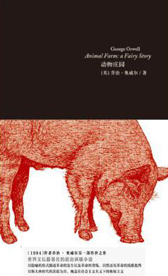

<!-- # ＜摇光＞文字的力量 -->

**而在动物农庄的这一版前言里，将这些小书和原子弹相提并论自是有原因的。如果没有原子弹，可能冷战就会变成无顾忌的杀戮，而苏联的坦克会碾过欧洲的古城。那么，如果没有这些小书，或许西方民众也就不太能体会到铁幕那边美好宣传之下的真相，也就不会怀着对乌托邦的强烈恐惧坚持同那个邪恶帝国抗争到底，甚至会像某个东方的国家一样，知识分子被赤化，然后被奴役。**

# 文字的力量

## 文/ 王大风（北京大学）

现在我的枕边书，是奥威尔的动物农庄。很薄，而前言，简介竟然就占了十几页，想绕过去都不可能。而在这个1954年写的简介中，泰晤士报的书评中写了这么个有趣的事情——1945年7月波茨坦会议时，丘吉尔看到，杜鲁门和斯大林聊天时提到就在将要到来的8月，会有一本小册子出版，这本小册子代表了西方思想界的最高成就，会对世界历史有深远影响云云，等等。丘吉尔注意到，斯大林脸上的表情一脸不屑，或者说仅仅出于礼貌地微笑了一下。不用说，那本将要出版的小册子就是动物农庄，一个关于集权主义的现代寓言。

而斯大林可能更关注的是杜鲁门小心翼翼地说出的另一个信息——美国已经掌握了原子弹。也是在将要到来的8月，这种威力巨大的武器会在日本展露出它的恐怖威力，这种威力如此巨大，以至于有人将1945年作为核子元年来记事的。

之后的故事就是冷战了，或者用丘吉尔的话说，一道铁幕在欧洲降落。数以十万计的士兵们在欧洲对峙，数以百计的核弹在华盛顿和莫斯科之间互相瞄准，更有数不胜数的钱砸向太空和军备竞赛，柏林墙，布拉格之春，等等，直到1990年前后这道铁幕才消除掉。

而奥威尔的这本小书在那样的时代，其影响不可谓不深远。翻检历史，可以看出20世纪前半期的时候，欧洲对于一些类似共产主义的乌托邦幻想是很狂热的，而苏联的对外宣传做的大概不错，以至于许多人对那里是有着许多期许——即使那里有大清洗，大饥荒，西方知识分子大约还是对苏联同情的，直到奥威尔和一批同时代作家的出现。他们经历了西班牙内战，知道在苏联授意下共和军是如何进行了无情的肃反，而奥威尔本人甚至差点丢命。这样沉痛的经历至少让他本人开始丢掉了对乌托邦的幻想，转而开始拷问在这样的乌托邦中个人的命运会如何，于是就有了动物农庄，就有了1984.

而在动物农庄的这一版前言里，将这些小书和原子弹相提并论自是有原因的。如果没有原子弹，可能冷战就会变成无顾忌的杀戮，而苏联的坦克会碾过欧洲的古城。那么，如果没有这些小书，或许西方民众也就不太能体会到铁幕那边美好宣传之下的真相，也就不会怀着对乌托邦的强烈恐惧坚持同那个邪恶帝国抗争到底，甚至会像某个东方的国家一样，知识分子被赤化，然后被奴役。

谁说文字的力量不大的？

奥威尔自己说，他的写作，都是为了抵御集权的危险，他看到了个人的人性人格在那样的集权中变异的后果，却对未来持有很悲观的态度。书评写到，如果这样的悲剧发生了，奥威尔就算是预言家，而万幸这样最坏的惨剧没有发生，那么，作家就算是个无名的立法者（原文是unacknowledged legislator)，守住人性的疆界——其实我更喜欢的说法是孤独的守望者。

所谓文字的力量，不是华美的辞藻，不是漂亮的修辞，这些不重要——重要的是，这些文字，是否具有直刺人心的深度，一定要有那种彻骨的寒冷，之后，或者温暖，或者绝望，才是有意义的。

而在我看来，好的文字是关于每一个个体在这个世界上挣扎生存的故事。每个人都会有许多时候直面人性的矛盾，或者是集权主义，或者是其他，世界上有太多太多的东西是要个人作出妥协的。许多人活了一辈子，其实早早就只剩下了躯壳，他们的梦想早就没有了，往后的日子只是重复每天的生活，支撑他们的，可能是自己的孩子，而非自己的本心。

无论如何，每天每天，有太多的个体被这个强大的世界摧毁。记录下这些或者被摧毁掉，或者还倔强地同这个世界抗争的个体的命运，这大概就是可以直刺人心的文字吧。

因为每个人到后来，可能都会意识到，之前自己经历的许多，都会变成回忆。而这个柔软的回忆，是个体存在过的唯一凭证。哪天如果这份记忆消失了，那么这个个体也就不存在了。因此，用以留住记忆的文字，其力量无论如何都是不会被低估的。

在芒果街的小屋里，有一位快死的婶婶这么告诉特蕾莎姑娘——写下去，一定要写下去，那会使你自由。

大概在这样不算完美的世界中，发现自己的本心还没变多少，就算自由了吧。

其实奥威尔的悲观是来自对于集权主义和技术结合的恐惧，作为二战的亲历者，他应该知道纳粹的集中营每天是怎样像工厂一样的杀人，而戈培尔的电台又是怎样有效地洗脑。

但是集权主义本身就是技术发展的瓶颈，或者说，技术本身对于集权也是巨大的威胁。有了电台，就有了偷听的可能，有了网络，就有了扩散真相的可能，这些可能性在集权的范畴内是无解的，只好死局，崩盘。

我不知道，若干年后，我和许多其他的人在这个年代写下的许多文字会被后人怎样解读。但是，我还是要写，写身为个体的我看到的这个世界，看到的其他人，看到的自己，等等。

雪风对我说过——只要每天有小说读，还有想写点东西的念头，生活就不是绝望的。如此。

（采编：陈锴；责编：陈锴）
