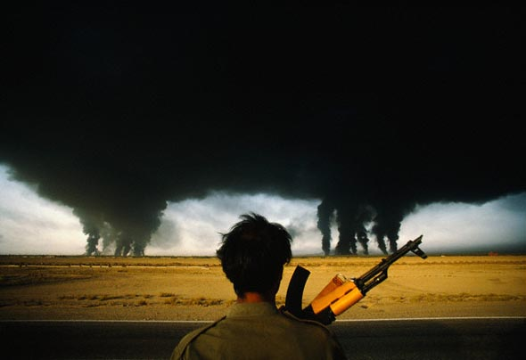

<!-- # ＜开阳＞宗教与战争关系略谈 -->

**我并非掩盖宗教与暴力和战争的相关性，只是客观地认为宗教并非其根本原因。人天生面对诸多不确定性或者未知时便是恐惧的，而宗教恰好在心灵上给予了人们没有经验或难以控制的事物提供了引导，****也就是填充了确定性。接着在身份认同方面，以某种选民的身份既增强了人们的自我认同感，以及群体认同感、使命感，于是统治者借用宗教发起战争便师出有名顺理成章。**

# 宗教和战争关系略谈

##  文/安芯（暨南大学）

最近在围脖里看到一些人简明扼要地写着：**宗教是战争的本源。**然后一群不明真相群众疯狂转发，不要买教会的赎罪劵！不要买佛教的平安符！且不说赎罪券是贪污腐败所致，也不提宗教改革所不屑，就从年代早晚来看，与平安符完全不能类比。

话题扯远了，再扯回来。宗教导致了战争？宗教之间的矛盾大体有两种，一是**宗教与宗教之间**的，二是**教派与教派之间**的。如基督教分为三大支：天主教、东正教、基督新教，以及各支又有众多的支派；伊斯兰教分为逊尼派、什叶派和哈瓦利吉派三大支派，其中又分为许多的分支派或学派。很多宗教都是把自身视为正统，把分裂出来的教派视为异端。

#### 先梳理一下历史上典型的“宗教战争”：

**1.****中世纪十字军东征（十字架与新月）：**

****在欧洲封建神权达到顶峰的11世纪，从1096年到1291年长达200年的时间里，西欧发动了面向东方的武力征讨，即十字军东征。但最终十字军失败，基督教的圣索菲亚大教堂沦为伊斯兰教的清真寺，东南欧也在惨败后皈依伊斯兰。

**冲突的根本原因不仅仅是文明的差异，而是经济利益，政治考量，为了维护王权，转移国内战争。**政治是火柴，宗教是干柴。于是一场干柴烈火就熊熊燃烧起来了。

矛盾分析：

当时的欧洲封建社会社会矛盾尖锐，表现在农民所受剥削日益沉重，地租，人头税，市场税等名目繁杂，社会生产力大大破坏，土地荒芜，粮食歉收：970-1040间约有48年时荒年，于是农民们或是逃亡或是起义；骑士军团多为贵族，本质上是职业军人，对于地中海沿岸商贸的控制欲望极大，土地、财富、农奴都是他们千方百计所希望掌控的；大封建主之间则是对领地、土地之间的相互竞争。**在这样动荡不安的社会环境下，民怨四起，各阶层矛盾激化，如若寻求不到一个矛盾释放点，必然会对政权的稳固造成冲击。就像水缸里不断积蓄水，若是没有破洞去释放，水缸迟早会破裂。**

11世纪，伊斯兰教徒的出现打破了西欧地中海商业霸主的格局，萨拉森人经由非洲、西班牙包围了地中海的南部与西部，并且对巴里阿里群岛、科西嘉、撒丁、西西里诸岛的占领使他们拥有海军基地，从而完成了对地中海的控制。这威胁到了罗马教廷的经济利益与政权稳定。恰好，拜占庭帝国当时的处境与塞尔柱国家内讧造成的地中海东岸的混乱局势，给了罗马教皇发动东侵的契机，也与其控制世俗世界实现天主教一统天下的目标吻合。

**2.****两伊战争：**

978年，霍梅尼发动的“伊斯兰革命”胜利后，什叶派穆斯林占多数的伊拉克成为伊朗输出革命的首要目标。伊拉克一方面担心国内受伊朗“伊斯兰革命"的影响而发生另一场什叶派革命，另一方面为谋求海湾地区的霸权，打击霍梅尼政权，消除两国的边界争端，首先发起了战争。1980年爆发的两伊战争以1988年伊朗政府接受联合国安理会关于和平解决国际争端的598号决议而告终。这是二战以来历时最长，最残忍的战争，双方都付出了惨痛的代价，最终在两败俱伤，没有胜负的情况下结束。

矛盾分析：

**领土**上的剧烈争执：由于海湾三岛在历史上曾受到波斯帝国、阿拉伯帝国和奥斯曼帝国的统治，归属问题十分复杂。1971年11月，伊朗出兵占领三岛，阿拉伯国家立即进行谴责，伊拉克与其断交。

争夺**海湾霸主权**：70年代伊朗石油工业发达，经济实力迅速增强，同时大力扩充军备，企图争霸海湾。

**意识形态**的差异：萨达姆的泛阿拉伯主义与霍梅尼的泛伊斯兰主义对抗。⑴泛阿拉伯主义的核心思想是中东阿拉伯民族打破国家分割，联合起来，建立一个统一的阿拉伯国家，再现古代阿拉伯帝国的辉煌；⑵泛伊斯兰主义即伊斯兰原教旨主义，即以《古兰经》为伊斯兰民族的指南和向导，全世界穆斯林不分民族团结起来，沿着先知穆罕默德的足迹，摈弃教派、宗派、学说的分歧，团结一致，在统一的是伊斯兰教法的基础上建立一个超国家民族地域的统一的伊斯兰政府，作为所有伊斯兰人民的主要领导核心；⑶伊拉克与伊朗都是伊斯兰教国家，但却存在着严重的教派分歧。在伊朗，绝大多数穆斯林属于什叶派，什叶派伊斯兰教为其国教，逊尼派人数很少。在伊拉克，什叶派穆斯林占总人数的60％，逊尼派只占40％，但逊尼派穆斯林多为城市居民，而且在政府、机关、军队中担任要职。因此历史上伊拉克穆斯林两派长期不和，其中什叶派受波斯文化影响深，与伊朗的什叶派认同感接近，而伊拉克的逊尼派则受阿拉伯文化影响较深，教派之间的矛盾使两国关系长期紧张。

**3.****极端宗教武力（宗教恐怖主义）：**

定义：字面上来看，也就是为了宗教目的而故意对平民施行暴力的行为，通常以强加的或自我强加的身体的，心理的，象征性的或精神性的袭击为特征，以实现群体或个人的目的。

宗教恐怖主义分布情况：

基督教：1999年8月10日在一个犹太人日看护中心的枪击案、1996年亚特兰大奥运会的爆炸、1995年对奥克拉荷马市的联邦大楼的轰炸，以及1990年代一系列袭击堕胎诊所的行为。

犹太教：1994年古德斯坦因博士袭击系布伦的宗主墓，1995年以色列总理拉宾被刺杀，2001-2003年间沙龙政权残酷地报复巴勒斯坦恐怖主义。

伊斯兰教：1998年美国在肯尼亚和坦桑尼亚的使馆被炸，1996年美国在沙特阿拉伯达兰市的一个军事基地被炸，1993年，极端伊斯兰教徒在索马里伏击美国部队案，2001年，极端伊斯兰教徒在纽约的“9·11”恐怖袭击案。

锡克教：1984年印度总理甘地被杀，1992年12月，印度教中的极端势力烧毁了印度阿约亚迪镇德巴布里清真寺，导致了穆斯林与印度教徒的大规模冲突。

佛教：诞生于日本佛教的奥姆真理教于1995年3月20日在东京地铁站施放毒气。

其他：美国“雅利安民族党”、“秩序党”等极端宗教组织，打着宗教的旗号大肆从事谋杀、爆炸等排外恐怖活动。

**问题：**

常识性地，作为理性的个体，如果A同B价值观，人生观，信仰不尽相同，A会用武力直接去攻击B，去与实力悬殊的B抗衡或者不计成本地与B同归于尽吗？再加一个前提，**如果此时B侵犯了A的利益（资源，市场，经济，话语权等）**，A挥拳相向于B的可能性是否会更大？

穆斯林等同于恐怖主义？**宗教与暴力到底是什么关系**？“圣战”到底指的是什么？

**如果一件事物原本是好的，但却被利用做了坏事，那你还会接受它么？**一个一辈子做了好人的人不小心杀了人，他是好人还是坏人？一个囚犯舍身去救了一个人，他是好人还是坏人？好和坏的定义又是什么？

#### 我的看法：

无论是宗教与宗教之间的战争如同十字军东征，还是教派与教派之间的好比两伊战争，或是极端的宗教恐怖主义暴力，都不能够抹杀**宗教的本质：社会性价值和本体论价值。即引人向善朝着人类的终极目标发展，劝人弃恶扬善，净化人的心灵，帮助信徒确立良好的道德目标，对信徒心理慰藉，稳定情绪调节心理，同时也是阶级统治的工具，包括利用宗教来维持帝国主义在殖民地的统治和让宗教充当帝国主义对外扩张的先锋。**

历史事件的诞生是多因素的，而不能仅仅归因于某一要素，而作为根本原因，我更倾向于作**为理性个体的利益动机使然**。而宗教此时发挥的本质是其社会性，充当了扩张或者统治的工具，而且能将暴力合法正义化，从统治者或者发动者的角度出发，何乐而不为，**它是手段而非目的**。**宗教之所以导致战争，是因为作为行动者的人对它的诠释和利用。**同样是圣经道德经金刚经易经古兰经，有人读出善，有人读出恶，一样的道理。

不妨就耳熟能详的“圣战”（holy war）为例：

现在以美国为主的西方社会自“911”事件后，对伊斯兰世界中以“圣战”为口号的恐怖活动予以了坚决的打击。加之以强大的媒体宣传力量，让普通的老百姓也对“圣战”（holy war）反感厌恶。但在穆斯林世界，却对西方世界将其【吉哈德 Jihad】翻译为“圣战”（holy war）普遍不满，认为这增强了【吉哈德 Jihad】的战争色彩。**在阿拉伯语里，Jihad的本意是“尽力”、“奋斗”、“努力”。**

“你们应当为真主而真实地奋斗。”【古兰经】

“凡妄杀一人，如杀众人。”

【古兰经 5：32】

对于它的解读，一些宣传手册是如是写道：

①**它不是恐怖主义，不是滥杀无辜，不是恃强凌弱，不是暴殄天物的护盾，不是屈忍迫害，不是漠视不公，不是将你的价值观强加于他人，不是一个人为创造的概念。**行善和反抗暴行都是吉哈德，穆斯林在面对侵略入侵时，允许拿起武器进行反抗，但是武装的吉哈德，只有在自我保护的时候才被允许，反抗武力侵略必须有节有度，武力的吉哈德是暂时的，只要敌人停止侵略就必须停止。武力的吉哈德的目的，是重建和平并且避免更多的战争和侵略，即使是面对不共戴天的敌人，穆斯林也不允许武力侵入。

②**对抗内心私欲、恶念等各种低级堕力的吉哈德，是一个人永久的吉哈德。**贪念，淫欲，仇恨，嫉妒和其他各种各样的我们内心的恶，导致我们生活的苦难。每日五次的礼拜，能够保护我们，不做那些令人羞愧的行为。

显然，【古兰经】里面的吉哈德有着精神层面和军事层面的双重含义，只是随着伊斯兰教发展的不同时期，由于具体的历史背景和复杂的社会环境不同，其内涵和目标也发生着变化。发展至今，更多应该强调的是其精神含义。

**我并非掩盖宗教与暴力和战争的相关性，只是客观地认为宗教并非其根本原因。人天生面对诸多不确定性或者未知时便是恐惧的，而宗教恰好在心灵上给予了人们没有经验或难以控制的事物提供了引导，**也就是填充了确定性。接着在身份认同方面，以某种选民的身份既增强了人们的**自我认同感，以及群体认同感、使命感，**于是统治者借用宗教发起战争便师出有名顺理成章。

但是，不可否认的是，人注定是狭隘的经验论者。在有限的认知范围内，我知道的也就这些了。

（采编：应鹏华；责编：黄理罡）
