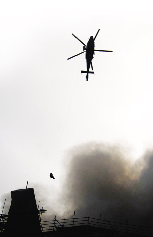
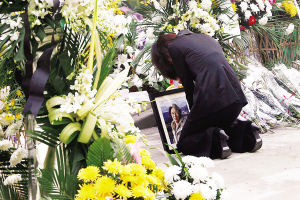

<!-- # ＜天璇＞《上海11·15大火后续报道》采访手记 -->

**当晚有一个媒体的记者去了之后被拉上一辆面包车，开到上海的郊区松江才被放下。这个故事确实吓到我，我问该记者要是我碰到怎么办，她说那就自己打辆车回来呗，语气非常轻松。这对我触动极大，一个记者是要把这种对待视为家常便饭的，闾丘露薇课上也会提到自己被公安扣押、写检讨的经历，她也说做记者心态要好。**

# 《上海11·15大火后续报道》采访手记

## 文/書雁（香港浸会大学）

采访时间：2011年8月14-22日

2010年11月15日，上海大火发生时，我在某报社实习，与两位在职记者一同赶往现场。当时正值广州亚运会之际，所以发稿的压力很大，虽然本报记者一个多月来一直都在现场，从未间断调查和采访，但是正式发稿是在灾难发生的两周之后。

印象最深的就是一直反复折腾的总部说不做了，或者只能做个写真。火灾的第二周，各路散落在浙江江苏的本报记者，还有总部来的摄影记者齐聚上海，打算大干一场，晚上聚餐，顺便是通气会，结果总部那边的编辑又想变卦，大家轮流和编辑打电话，某记者的长途打了差不多有一二百元了。其实那晚大家都很沮丧，觉得要没戏了，上海站的记者都安慰我，大概觉得我一周多来没日没夜地在现场、医院、安置宾馆跑来跑去，又混进灾民大会，又去上海很偏僻的看守所等肇事农民工家属，付出这么多，却竹篮打水一场空，都替我叫屈。不过那时候，我也为我这些师傅们叫屈，我自己第一次跑现场，精力充沛，真没多考虑发不发稿的得失，只是觉得这份灾难调查报道的经验足矣宝贵到终生受益，那种在现场的感觉，那种要寻找真相的使命感非常强烈。

差不多有两周的评报会，上海站都在“批斗”总部的忽悠人，“批斗”本报不敢站出来，批斗自己作为上海站的记者毫无作为，并未强烈争取冲破报禁，像其他同类媒体一样——同类周刊周报都做上海大火专题。

但是最后本报呈现的两篇报道，一篇讲农民工、一篇讲着火大楼的前传角度和拿到的料都很独家，而且相当有深度。后一篇是跟着本报名记做的，获益匪浅。如果大家把当时那篇报道找出来，相信都会发现那个角度的独特和深刻，因为直指上海规划之弊——当然原稿更精彩，刊登的文章删掉了一些重要又敏感的细节。

差不多是一个月之后，我在以前的日志中提到过当时灾民大会想开记者会，我本已打算再去的，结果收到禁令，本报记者立马给我电话让我别去。当晚有一个媒体的记者去了之后被拉上一辆面包车，开到上海的郊区松江才被放下。这个故事确实吓到我，我问该记者要是我碰到怎么办，她说那就自己打辆车回来呗，语气非常轻松。这对我触动极大，一个记者是要把这种对待视为家常便饭的，闾丘露薇课上也会提到自己被公安扣押、写检讨的经历，她也说做记者心态要好。

我第二次跟踪报道这个事情，是因为本报要写内刊，希望能提供这个事情的最新进展。我就联系了灾民，差不多是在2011年1、2月。那是我很完整地了解灾民的逻辑和处境，因为之前的调查稿很少做人物。就算做人物，为了角度特别，关心的也是农民工的公平对待问题。灾民，太多人误读为他们有了“发灾难财”的机会，而且他们还有个若有若无的标签“精明的上海人”。内刊我也写了差不多有1万字，但是版面限制，最后发了5、6千字吧，我这里就不多提了，我在采访中的一个对象是灾民的大学同学姓朱，火灾后朱先生一直陪伴他的朋友处理一切事务，他说的有些原话我想放在这里，因为专业媒体报道应该不带感情倾向的，况且中国的媒体环境，这些话语不太可能在媒体上能出现。知道人家怎么想的，我们才有了沟通的渠道，而中国政府往往做的最差的就是这一点。

“你打我一拳，想用钱来抚平？重要的是这个伤口不是用钱能填平的。现在就是演变为拆迁法来算，成了‘对价’的过程。1：1不就等于什么都不做吗！这就是强拆啊！就是真正意义上的放火啊。”

“如你看到的，很多人是在算钱。在这种最坏的情况除了等赔偿还能等到别的什么吗？就算是‘坏人’，也是被迫的‘坏人’、善良的‘坏人’。”

他还告诉我了另一层逻辑：“他们本身就是生活很优越的人，为什么要他们降低对生活的标准呢。况且，这种苦战最后的结局往往也不会让人称心如意。”

8月份，我接到了另外一家媒体的约稿，第三次采访火灾灾民报道。根据对方要求，因为杂志定位是偏软性，所以想让我重点写写几个人物的故事，这样可读性强，又会比较安全。基调是：乐观。当然我知道这篇文章还是比较悲凉的，但就我目睹的事实，估计比这个文章凄惨好几倍，外加愤恨，那种愤恨是徒增的，而这种徒增是政府的强硬态度造成的。我相信看文章的人多少会明白，还需要明白的是记者背后的克制和对有些敏感处的“只字不提”。

我还想说的是当时的心情，我在微博上记录过采访后的情绪，从实习到另外一个媒体当记者，差不多一年的记者工作经历，这是我唯一一次采访的时候，自己多次被采访对象说哭——我当然知道这很不专业，所以在处理稿子的时候必须冷静。这段采访经历很残忍，因为采访对象都要回忆那段生离死别的、目睹家被烧毁的经历，还有他们在我面前失声痛哭，讲这个年是怎么过的，60岁生日怎么过的，还有往事历历在目……

今天是一周年纪念日了，我来到香港，身边学新闻传媒的内地同学知道上海那场大火并不多，每次要讲的时候，我又觉得这个故事特别长，只说几句又显得太轻描淡写，我深有体会这里面的伤悲太沉重。

记得有一个香港同学问我内地是不是只能说正面歌功颂德的报道。我说没呀，内地也充斥着各种负面新闻，动车不也各大媒体群起攻之。他说，那然后呢？为什么现在都听不到后续报道了？

是啊，然后呢？仅仅是报禁嘛？如果动车是报禁，其他需要媒体跟进的、监督的都被报禁了嘛？我们等新闻是因为我们在猎奇。在推脱有些责任的时候，说一句，报这个有风险吧，或者后续与我们无关，我们置身事外，无关痛痒。

（采编：黄理罡；责编：黄理罡）
