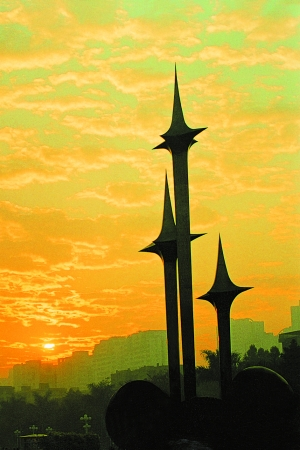
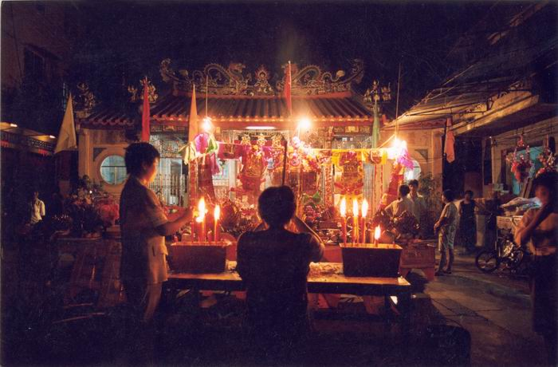

<!-- # ＜天璇＞青年的潮汕，青春的潮汕 -->

**三年前，我也走了。当时有一种解脱的感觉，可以告别这个没有希望的城市，告别这个死气沉沉的地方。可走得越远越久，越发现有些东西是割舍不掉的。在满耳都是洋文的环境里，总会突然感觉到潮汕八音是多么的悠扬；吃腻了牛扒汉堡的时候，心里想的，还是家里的白糜和咸菜。**

# 青年的潮汕，青春的潮汕

## 文/006（National Junior College of Singapore）

漂泊在外、一年回一次家的孩子，对于一座城市、一个地区的衰老有着更为敏锐的感觉。孤零零地伫立在海边的旧海关，被隔离板围住的衰颓的百货大楼，河沙淤积不能通航的西堤渡口，西天巷雨篷底下炒蚝烙的老阿嬷，都在默默地述说着繁华的逝去。那标志着特区精神的“升腾”的雕塑，在风雨的侵蚀下逐渐退去了昨日的光辉；三身人旁的已经没了跳跃的喷泉，而又有谁会记得，这尊雕塑的原名叫做“崛起”？

以前很喜欢去“升腾”旁边的翰苑，喜欢去二楼的图书馆，那是原来特区管委会的图书馆。“管委会”——我们这一代人对于这一个名词或许很陌生。然而，这个名词，以及这个组织属下的图书馆里的书籍，见证了那个充满活力和激情的年代。那些八十年代出版的书上密密麻麻的借阅记录，记载着那个年代的汕头人的勤奋和热情。今天的我们还是可以从一些依稀的痕迹中寻找那个时代的影子。我家住在电大旁，那是个荒芜的地方，九十年代末我搬家的时候还时不时能看到老水牛和狮头鹅。偶尔我会想象一下二十三年前，一批批年轻人在这荒芜的角落里求学的场景。在文凭没有当时值钱的当年，在没有汽车没有摩托车甚至连水泥路都没通的当年，这是一个多么令人感动的情景啊。

“升腾”的旁边是龙湖沟，一条让很多汕头人咬牙切齿的水沟。幼年时我住在珠池一带，就在龙湖沟旁边，夏天时晚上常常被蚊子骚扰得睡不着。初中时有篇课文里面有一句叫“夏蚊成雷”，那便是我幼年的回忆。这条水沟，或许是那个火红的年代最大的副产品吧。后来搬家了，后来龙湖沟被盖住了，再后来引入了韩江水，死水变成了活水。那个年代逝去了，副产品也终于没了。零零后出生的孩子们，恐怕不会知道曾有这样一条臭水沟从他们的前门流过；他们记得的，或许只是在星湖公园烧烤放风筝的愉悦。

龙湖沟流动起来了，旁边翰苑里的图书馆却没有。在那里很难找到零零年以后出版的书。现在的人也很少去翰苑了，更多的是长平路的新的市图书馆。那座霸气外露的建筑，还有旁边的林百欣会展中心，是汕头最辉煌的时期的见证。那是1997年，狂风骤雨之前最辉煌的一年。可辉煌的背后，隐隐约约已经有了衰颓的迹象。97年我去的时候，会展中心外面种的不是草，是麦子。据说当时把钱花光了，没钱种台湾草了，不得已撒了一把麦子先对付过去。而我第一次进新图书馆时，去看的不是书，而是鸵鸟。当时想，很快什么都会有的。可一等就是将近十年。今天在图书馆里享受空调的零零后不会知道，这个馆从建成到投入使用，经历了多少坎坷和曲折。

那么宏伟的图书馆建起来了，可突然却成了没钱装修的烂尾楼；那么宏伟的会展中心建起来了，可突然却发现连种草的钱都没有了。还沉浸在四大特区的荣耀之中的汕头人，一觉醒来发现自己的城市什么都不是了。就像那礐石的游泳跳水馆，鼓起了风帆，却搁浅在杂草从中了。而我们这一代，只能在“升腾”的三个星星中，想象昨日的辉煌。

潮汕人是以适应力强而闻名的。当自己的地区遭遇寒冬时，就像那些坐红头船的前辈一样，很多人选择了出走。渐渐地，家长开始鼓励我们找机会出去。到今天，只要是能够出去的，想留在潮汕、想回到潮汕的人恐怕寥寥无几了。

三年前，我也走了。当时有一种解脱的感觉，可以告别这个没有希望的城市，告别这个死气沉沉的地方。可走得越远越久，越发现有些东西是割舍不掉的。在满耳都是洋文的环境里，总会突然感觉到潮汕八音是多么的悠扬；吃腻了牛扒汉堡的时候，心里想的，还是家里的白糜和咸菜。在外面，有时我称自己是汕头人，有时我称自己是潮州人。随着这种回答越来越多，我开始思考这两个称呼背后的含义。潮州，千年古城，海滨邹鲁，韩文公被贬之所，人杰地灵的地方；汕头，曾经的远东唯一有意义的港口，四大经济特区之一。潮汕人，一个被称为“东方犹太人”的群体，一个在东南亚乃至全球都声名赫赫的群体。渐渐地，我有了一份骄傲感；渐渐地，我明白了，人虽然可以走得很高很远，但根终究是割舍不掉的。潮汕人这个身份，是要陪着我一辈子的；潮汕这个地方，终究是我的牵挂所在。就算是我自己离开了，父母还在；就算把父母接走了，亲戚朋友还在；就算所有认识的人都走光了，祖坟还在，祠堂还在。

根在，则责任在，担当在。无论我们散落在哪里，那片土地的一草一木，那片土地的兴衰起伏都和我们息息相关。而身为青年的我们拥有的活力与热情，正是这个逐渐走向没落的城市、这片渐渐衰颓败落土地最需要的。当潮剧的观众群只剩下白发老妪时，有谁敢肯定五十年后这门戏曲还会存在？当抽纱变成了中老年妇女的专利时，有谁能这门技艺的传承保持信心？当旧的遗产逐渐没落，而新的文化却没有得到发展时，我们凭什么说我们是这片土地出来的？我们凭什么说我们是潮汕人？

也许你会问，我们能做什么。我们无法决定国家的政策，我们无法左右地方政府的决策，但我们可以贡献我们的智慧，我们可以用我们的笔和口唤起对这片土地的关注，我们可以用自己的一举一动去诠释潮汕人的定义。如果连这些都做不到，我们可以默默地关注，静静地鼓励。最关键的，是无论走到哪里，都不要忘记自己是个潮汕人，都敢于骄傲地说自己是一个潮汕人。潮汕的青年都对潮剧和抽纱多点热情，这些遗产就不会灭绝；潮汕的青年不避讳说潮汕话，这门语言就不会消亡；潮汕的青年关心自己的家乡，这片土地便不会被遗忘；潮汕的青年不颓废，这片土地便有生机；潮汕的青年不绝望，这片土地就有希望。潮汕的青年在，则潮汕的青春在，潮汕的明天在。

（由汕头春潮刊社供稿，原文刊于其“潮汕精神”栏目：[http://www.tsuntie.com/archives/27](http://www.tsuntie.com/archives/27)）

（采编自投稿邮箱；责编：麦静）
