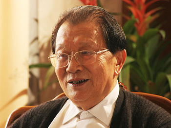

<!-- # ＜开阳＞从华西村谈社会主义，并反思中国国情兼论中国左派 -->

**然而中国的老百姓真的很在乎自由吗？其实不是，证明就是2008年时，我听说华西村的户口很吃香，3万块买一个。对于一个农村户口来说很贵的。当然，就算你买了华西村的户口，没有多年积累的股份，收入就不会太高。而且华西村也不是慈善机构。他们站在农民的立场上坚持他们的公平理念。我们辛辛苦苦，作死作孽积累的财富，不是为了改善周边村民生活条件的，说白了不是为了共同富裕的。**

# 从华西村谈社会主义，并反思中国国情兼论中国左派

## 文/陆遥遥（北斗撰稿人）

拗口的标题暂放一边，大概的情况待我娓娓道来。我是顶着能催眠又不能入睡的化疗药的威力在写此文，请读者不吝赐教真知灼见，苟有利于我国的进步，则是作者微愿。

华西村天下闻名，最近又被南方周刊一篇报道推倒舆论中心。有艹圈友人问我，你不是宜兴人吗，离江阴很近，应该知道华西村吧？何止是知道。我2005年去华西村暑期实践，2007年工作后三年时间里去了8次。和他们的老书记——吴仁宝先生有过几次寒暄程度的交流，采访过新书记吴仁宝的四子，见过吴仁宝的长子。和吴仁宝的长孙谈了比较长。其他各口各界的朋友也很多。

讲老实话，我对华西村印象一直很好，虽然感觉有一些问题，但没有想到会到南方周刊捅出来的那个程度。当然，以一个曾经的媒体工作人员的眼光看，南方系列的确有些思想不够感情来凑的意思。所以有些问题还要存疑。

后来我核实了华西村的确压制了周边村村民维权护地的运动，感到很惊讶，以我对华西村领导班子的了解，如果不是资金压力真的很大，他们实在不应该干这个事情。实际上我最后一次去华西村是2009年11月。当时真是华西村按照一分五统的原则合并周边村，周边村的人也是觉得一夜进入了共产主义，感恩戴德得很。吴仁宝当时带人在周边村转，看到家里特别穷，住房条件特别差的，当场拍板给免费盖新房。这不是一两例，我听了很多。还有就是50岁左右，做农民工已经没人要了，但是也有些力气的一批人，吴仁宝给安排在农业、渔业口做工人，每月发工资，大家也很赞成。——确实没想到会像今天这样。

好吧，先说我知道的华西村。

华西村的富裕，很多人愿意一言以蔽之归纳为公有制胜利。对也不对。华西村的富裕是有渊源的。我听他们说村史，看他们的工作方式。大概总结有三条：①勤劳肯苦，②实事求是，不跟风，不唯上，③集体所有制的规模效应。

华西村1970年代就是模范，吴仁宝领着村民死做，把河里的水排干改造成稻田，增加土地面积，夺取丰收。后来他被树为典型，文革后期做了江阴县委书记。他做县委书记是定了规矩，县委县政府的干部每个月必须下乡20天以上，要在农村和农民三同。结果很不得官心，文革结束就借口他极左，把他赶回华西村了。吴仁宝和村民干活那时候是真拼命。因为大人们都在田里干活，小孩子没人看。一家人的独子跌进水塘淹死了。吴仁宝去他们家看他们哭的很伤心，就说，我有四个儿子，随便你们挑一个，给你们做儿子。被挑走就是吴仁宝的四子，也就是现任书记吴协恩。所以吴协恩既是吴仁宝的儿子，又不是吴仁宝的儿子。

当时之所以选择吴协恩，还是因为他是吴仁宝的儿子，华西村有个公开的秘密，吴仁宝选继任书记要从自己儿子里面选，之所以不选老大选老小，因为拿吴仁宝的话说：老小最年轻，还能干三十年！

吴仁宝本人出身贫苦，年轻时挑着担子从上海徒步回江阴卖雏鸭、鸡崽赚钱，他很踏实勤奋，在他的带领下华西村的领导班子也踏实肯苦。一年365天，只有春节休息3天。吴仁宝讲，我们是农民，农民哪有节假日？所以别的地方人浮于事，贪官围了酒桌转玩了围着女人转的情况，华西村几乎没有。

第二不唯上，其实就是有自己的小九九。毛泽东在世时，讲以粮为纲，禁止农村发展小工业甚至禁止农村发展经济类作物。但当时华西村就顶风搞小工厂，造预制板。吴仁宝亲口对我讲，当时省里、县里有调查组下来调查农村落实农业学大寨，以粮为纲的情况；我们就在他们来时停几天，他们一走，我们就接着造预制板。小工业为华西村积累了第一桶金。

改革开放后，中央下文件推行包产到户。华西村召开村民大会，吴仁宝就反复做大家的工作，说华西村田本来没多少，羊只有几只，鱼塘很小，人很多，怎么分？还有工业刚刚起步，一分不就散掉了？而且他捉住中央文件中，宜统则统，宜分则分的一句话，说我们华西村就是宜统，形成共识，最后就没有分掉。

这在当时也是一种政治冒险，读者们只知道文革前有政治运动，其实文革后改革开放的很多做法也是政治运动式的。比如推行包产到户，理论上应该由所有权主体也就是大队的群众自主决定。但很多地方往往党委拍板，就是一风吹，全部分掉。很多主张坚持集体所有制干部还被整肃，这也是历史现实。

1990年代，朱总理深化改革要对国企抓大放小，很多人也要华西村改制。吴仁宝当时也说，抓大放小，这是国家的政策，但华西村本来就是小打小闹，一放小就什么都没有了，还是不放。实践证明，如果当时放了，也就搞没了。

所以，我不得不批评很多读者其实也有一种专制，就是对公有制的无原则仇恨，一听说公有制就希望它垮掉，甚至为此不尊重当事者的选择权利。这是不对的，以色列国也有按需分配的集体农庄，为什么华西村坚持集体所有制就是错的呢？

华西村民的生活只能说比较殷实。2005年我去的时候，他们的很多人家还舍不得喝桶装水——家里有桶装水，但除非春节时接待客人，平时就是拿那个桶装自来水喝。当然也有特别豪富的人家，那都是村以及集体企业的领导干部家庭。华西村自己说的，我们村有三个主义。向社会集资返还利息、入股的私人派发红利，那是资本主义；职工干部按劳动分报酬奖金，那是社会主义；村民的教育、医疗村集体全额负担，这是共产主义。

吴仁宝这个人七八十岁了但智商非常高，说话总在点上。譬如华西村向周边村民吸收存款，利息高于银行的，搞不好有恶意吸储的嫌疑。我们问他为什么利息比银行的高，他答，为了拉动周边群众共同富裕啊。你看，冠冕堂皇。

我去的几次华西村和周边村的关系还没发现什么不好的苗头。但华西村和外来务工人员的矛盾比较显而易见——倒也不尖锐。华西村的外来工人每年也只能歇3天，吴仁宝说了农民没有节假日，所以农民雇佣的人也没有节假日。其次，华西村发工资每次只发一半，理由是怕外来工都是年轻人随便瞎用掉，帮他们保管起来。到年底一次全部发清。当时如果中途辞职或者被开除的，就全部扣发了。——这其实是曾国藩给湘军发饷的故伎，不知道他们是怎么想出来的。

我个人对这种做法比较不满，一方面开除或者辞职扣发工资不符合法律。再有就算年底全额发放，也应该加算利息。华西村不把工资发足，他们自己的现金压力就小了，资本利益就来了，这不是代工人保存一两句好听的可以糊弄过去的。三者就是我比较反感那种把国家、集体、公权力机构想象成保姆，好像我们已经成年的国民仍然要他们照顾的理念。人家打工在外，都是成年人了，不需要工厂越俎代庖吧？

然而他们那一套效果还很明显，因为很多打工的人年龄确实很小，拿到了钱难免挥霍。这样工厂不发，平时就得省吃俭用，到年底一下子拿到半年的工资，回家也风光。而且华西村从不拖欠工资。还是很得人心的。

笔者一再说自己的一个心得：管理和保护往往是一个硬币的两面。

在华西村，特别是中心村里，村民比起自生自灭的小农经济汪洋大海里的中国农民，生计得到保障的程度，那是高多了。但同时，被管束也很多，不能打麻将、每年工作362天，不能不请假外出，等等，等等。很不自由。

然而中国的老百姓真的很在乎自由吗？其实不是，证明就是2008年时，我听说华西村的户口很吃香，3万块买一个。对于一个农村户口来说很贵的。当然，就算你买了华西村的户口，没有多年积累的股份，收入就不会太高。而且华西村也不是慈善机构。他们站在农民的立场上坚持他们的公平理念。我们辛辛苦苦，作死作孽积累的财富，不是为了改善周边村民生活条件的，说白了不是为了共同富裕的。

所以，虽然左派很推崇华西村，但左派中极左人群的平均主义，斗私批修，华西村人很反感。奉劝他们就不要引华西村为知音了。

2008年我们在华西村采访吴协恩，我们提了个自以为尖锐的问题，我们说在华西村这个据说是公有制共同富裕的村子，我们却格外地感觉到贫富差距的存在，华西村和周边村庄，华西村的领导层和普通村民之间的差距未免太大，请问新书记怎么看？吴协恩说，那是自然的，努力不同，收获也不一样。我们跟着老书记几十年苦做，幸福不是从天而降的。

现在回味他的说法，觉得奥巴马可能比华西村还是要左一点，社会主义一点。

华西村民尤其是其领导层的生活还是很令人羡慕的，他们包飞机送村民去日本观光。吴仁宝的孙媳妇也是该村村委的副书记周丽去台湾一下买了十几万的红珊瑚首饰。

我很想问问读者，你更在意自由呢？还是更在乎这些令人羡慕的生活。我选择了自由，我们当年去实践的清华的几个人都选择了自由——当年吴仁宝亲口对我们说，年轻人胆子再大一点，眼光长远一点，你们愿意落户华西村的话。我们把最好的岗位留给你们。虽然我们最后还是没有留在这个唯一的娱乐就是广播里的锡剧的村庄，但是老书记的坦诚还是让我至今感动不已。

最近听说华西新修的今天里有KTV有小姐了，大概时代真不一样了。

读者们，你们选择自由但不失风险的人生，还是有人给安排好的不用操心的安逸生活？我想大多数中国人会选择后者。这就是国情。

是为第一篇。

（采编：麦静；责编：麦静）
