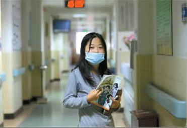
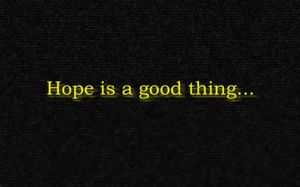

<!-- # ＜摇光＞医病不医命 -->

**“然而我和其他SLE同样面临着矛盾而冷酷的局势：越是奋斗，SLE病情越是加剧，越严重花钱看病就越多，花费越多家里就越穷，越穷又越激发自己奋斗，如此下来，恶性循环。”

所以我今天凌晨发了那样一条状态提到一句话，“医病不医命”。医学到今天，或者到明天，永远都是这样一个规律：人为之病理，尤可作为；天降之病患，退而也已。**

# 医病不医命

## 文/刘步筑（北京大学）

一

得知黄妮超同学病重，我有些唏嘘。

初次见面是在上个学期期末考试结束那天，7月5日。她当时初到帝都，二十个小时的硬座从京广线走来。那天她来北医三院看病，我上午的考试结束后约她在逸夫楼门口见了一面。初见时她的状况还算不错，身上没有浮肿，从那几天她在校内贴出的化验单来看，蛋白尿、肌酐、尿素氮的数值都偏离得不算过分，肾功能不全也只算中度的，并不十分严重。

见面过程只几分钟便分开了，临别前我问她是否需要我帮忙找三院的大夫给排号，被她拒绝了。想来也是很愧疚，我这里稍稍跑跑腿便能达成的事，让她白白等了一天。

后来听卢辰说她留在北京打些工，拿着微薄的工资，住在北大畅春园那边的博士宿舍，我不知道她这几个月拖着疾病的身子是怎样熬下来的。现在回头再看看她那些日志，充斥着辛酸与悲伤。好在当时许多人知道其人其事，很多人有心无意的留言也许是一股让她坚持下来的力量。

大概这一个礼拜，她的病情严重了。谁都知道红斑狼疮以休息为先，前日的奔波或许让病情加剧。但是如此这般也实属无奈。“然而我和其他SLE同样面临着矛盾而冷酷的局势：越是奋斗，SLE病情越是加剧，越严重花钱看病就越多，花费越多家里就越穷，越穷又越激发自己奋斗，如此下来，恶性循环”，她是这样说的。

二

现在这情况，很多人祝福她早日康复，回归正常生活。这是不可能的，祝福她的人，或者她本人，她的家人，都知道这一事实。

透析是好的，因为能延长生命。但是透析多么痛苦啊，关键是，透析治本么？

肾移植也是好的，能够很大程度上解决她的问题，但是等待移植的过程实在漫长，每年器官移植的需求量与供给量之比是150:1，剩下99%以上的人，要么默默地离开医院，等待着闭眼便“适彼乐土”；要么苦苦地等待，遭受病痛的磨难，与侵入性治疗附加的痛苦。然后呢？几个月，或者几年之后，等不到器官的他们还是会放弃。

这都不是问题，问题是，肾移植治本么？

如同很多先天性疾病，红斑狼疮这个病，只有尽量减小损害，治愈是指望不上的。至于肾的移植，明明是继发性肾病，如果只是摘掉衰竭的肾，植入健康的肾，那这个过程无穷尽。

三

我在基因中心这三个多月，老板给了我三个遗传病。前两个是极罕见的皮肤病，光是确认病名便费了几个小时。最近的这个是生长激素受体基因突变的身材矮小综合征。

我在实验室的工作其实就是查文献，筛查突变位点，对着干巴巴的数据和密密麻麻的碱基序列，偶尔发现一个确定的新的突变点便很高兴，因为可以发文章了。而许久之后，我仍偶尔会想起这些血样背后的病人是什么样子的。

我研究的这些病例并没有致死的可能，但跟着学姐做的部分课题里面，血样的背后其实多是数年之内便要成为尸体的人体。我也时常在想，这些人是什么样子的。

正常人有正常人的体格、意志力，可以过着惯常的生活、对世界有寻常的态度。而带着疾病或者致病的基因来到人世的人恐怕没有这样幸运。症状轻微的可以用物化疗法、用生物制剂使他“看起来像个正常人”，症状严重的，则在病痛中挣扎，背负着沉重的经济负担，寄希望于不久的将来能出现让他们“正常化”的医疗技术手段。

当然，大部分人是等不到那一天的。

四

所以我今天凌晨发了那样一条状态提到一句话，“医病不医命”。医学到今天，或者到明天，永远都是这样一个规律：人为之病理，尤可作为；天降之病患，退而也已。

郭政同学发起来一个救助基金的活动，我不好说这是不是很好。这种帮助，勉强能维系其“一个生命指证如正常人”的外在，而病魔的缠绕没人能替她担，生理上的痛苦没人能替她担，于生于死的绝望更没人能替她担。如果这样做，那就要做下去。有半途而废者，废的则不仅是救助金的来源，更是一个孤苦的女孩子求生的希望。

所以，希望你们能如是坚持下去。

（采编：徐海星；责编：黄理罡）
