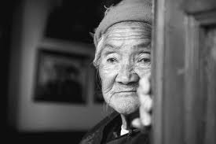
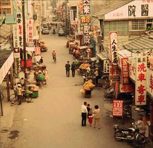
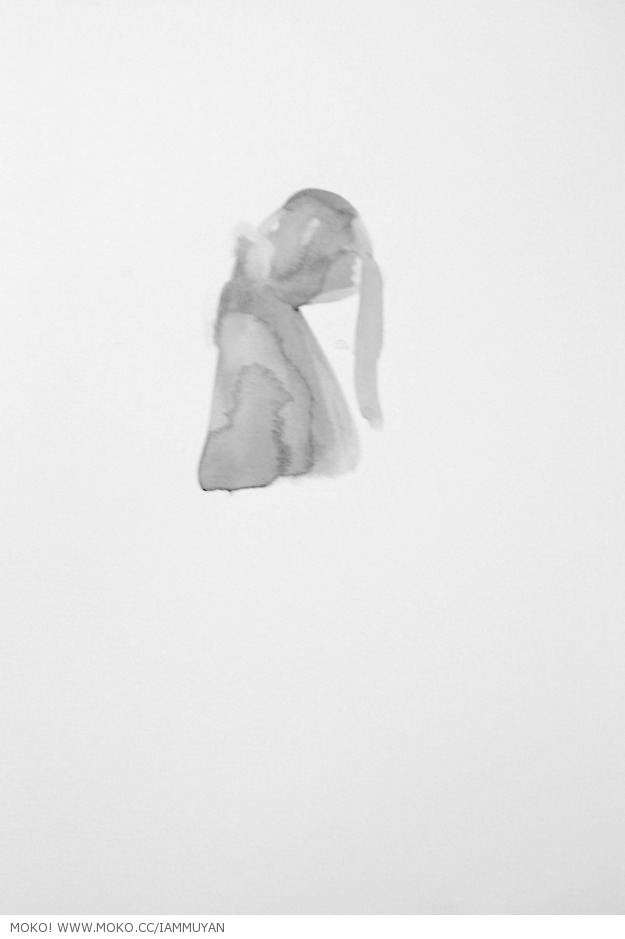

<!-- # ＜天璇＞我也19岁 -->

**一个是扎根小岛千百年却被外来殖民者掠杀、驱赶、奴役、驯良的原住居民，一个是被叛军赶到小岛上守望原乡的国军忠魂。都是家园被攻占的、心怀愤恨的流亡者，然而却又是两种意义完全不同的流亡。而也正是这两种完全不同的流亡，将台湾这枚弹丸的小岛，混合得更加复杂诡谲、令人叹息。**

# 我也19岁

## 文/周雨霏（国立清华大学）

我不知道该问些什么问题，所以我显得很笨拙，他显得很沉默，场面显得很尴尬。不是不知道问什么，想问的明明很多，但每一个问题都要先在我心里面掂量一番、淘洗一道、再打磨三分，筛选几个、剃掉一半，剩下能问的也就不多了。因为我怕问题会唤起他的伤痛。

最后我掌握在手的信息也仅仅是一些最基本的资料，不涉及情感和禁忌。不只是因为我问得少，更是因为我每问一句话，他只回答几个字。而当我好不容易想出一个似乎是会打开他话闸子的问题时，他也只是显出片刻的激动和感慨，依然用几个字了结。比如我问：“当兵好苦哦噶？”

他眼睛一闪，背一挺：“是三，太苦咯。”

我欣喜地期待他会开始描述行军的劳累、炮声的震响或是尸体的血污，可是还没等出一点什么，他就已经又沉默了下去，张大眼睛看着面前来来往往奇奇怪怪的年轻人。

李元彩，四川省成都市双流县人。有兄弟3人，姐妹2人，在家排行老幺。哥姐4人皆种地，只有元彩读书，16岁入国民党时正在念国中，那是民国35年，公元1946年。民国36年，17岁，响应中正总统号召加入国军，服役于陆军。民国38年，19岁，从重庆搭飞机到高雄。民国100年，81岁，住在新竹市荣誉国民之家，11月19日下午遇见小老乡周雨霏。

“你来台湾那年19岁啊！那和我现在一样大的嘛，我今年也19岁！”

他笑笑。

“你回过成都没有喃？”

“回过11次。”

“那么多次啊……成都变化很大哈？”

“就是。”

其实我想问的问题还有：你来台湾结过婚没有？有没有子女？家里谁还健在？刚来的时候想不想家？现在想不想家？台湾是不是你的家？住在这里孤不孤独？有没有想死？......

我还想问：怎么看那场内战？后不后悔入党当兵？后不后悔追随蒋介石来台湾？光复大陆还想没想过？怎么看台独？恨不恨共产党？……

可是我问不出口。

和我一起上某门课的一个陕西女生对着旁边一个爷爷大大咧咧天真纯洁地抛出许多让我心紧的问题，那个爷爷感慨万千，悲伤地抬头回想，说了很多很多话。他们的对话比我们的顺利。她猎奇的收获肯定比我多得多。可我不是来猎奇的，或者说，我本确实是来猎奇的，可当我见到爷爷们一个个僵硬地陷在轮椅里，用猜疑和抑郁的眼神看着我们走向他们时，我感到的不再是新奇，而是被排斥，我被这股混合着棉絮味和霉味的哀怨气息排斥了，我的好奇心和怜悯之心僵持在那里，最后后者压倒性地战胜了前者。所以我情愿一无所获，也不想用问题做刺刀，挑开他们老而未愈的伤口。所以只好傻逼兮兮地对着他笑了半天，一边不停给他捶背揉肩，一边想着我存在于这里对于他到底有什么意义。

从荣民之家回来之后和雅云去吃卤煮，说起各种从前在大陆做志愿者的经历。我讲起大一上学期去聋校，和一个叫周畅的四年级小妹妹玩儿得特别开心，笑啊拥抱啊，特别亲密，她姓周我也姓周，仿佛她是我妹妹。走的时候我在纸上写，下周还来看你。可是下周我没去，再下周我也没去，助残部不知怎么搞的，那次之后都没再组织去过聋校。直到大一下学期的某天，我才又跟着换了届的副部去了那里。站在教学楼的过道里，我们等着老师来招呼我们进教室，这时不知从什么地方突然跳出来一个小女孩，拉着一个志愿者就说：“我找周雨霏姐姐”，用她那非常含混的发音。我一听到自己的名字，就跑过去了，然后姓周的我俩，分别几个月的我俩，紧紧地在过道里抱在一起，我在心里不断说：“对不起，对不起，对不起……”

慈济协会的组织者说要给爷爷们放首歌听，问爷爷们最喜欢哪个歌手。于是在这阴雨濛濛的周六下午，新竹某处的一个封闭空间里就响起小邓的《何日君再来》了。有的大陆同学环顾着相互问这什么歌啊，我却已经听得感慨，跟着唱那每句我熟烂在心的歌词。想到“何日君再来”这原本缠绵的情话，在此时又沾染上几重悲凉和讽刺的意味。被战争耽误一生的老人，听不到声音的小孩，他们对于外面世界的期待，不正是这句“何日君再来”么？也许这就可以解释老人的孤僻以及小女孩的期盼了，小女孩还没有被冷落过太多次，对于伸出援助之手的人依然是存在善意的感怀的，而老人们，在经历过太多群来了就再也没出现过的“伸出援手之人”之后，对于援手也就显得更加意兴阑珊。

而当我们被组织起来在爷爷们面前跳一种手语舞时，我又突然产生了那种类似“灵魂出窍”的感觉，我的身体还在跟着示范者做着代表爱啊、感恩啊之类意思的手语动作，而神志却飞到头顶的天花板，从上往下俯瞰起这可笑的人群，这诡异的场景——年轻人卖力的爱意表达、老人们无奈的呆滞神情。我一边做着动作，一边想我们他妈的是在干什么？

何日君再来，再跳手语舞。再跳手语舞，不盼君再来。

(图：Mooyen)

比《何日君再来》更受欢迎的是《中华民国颂》，据说爷爷们当兵的时候天天唱，而现在每次听也都很亢奋。于是《中华民国颂》就响起来了，有一两个爷爷确实一下子就振作起来，庄重地吟词吐句，一如六十余载光阴流逝不曾有，还似过往少年壮志报国梦。而有的爷爷，比如李元彩爷爷，还是那么隔阂地环顾四周，不明白大家是在干什么。我在这种眼神的触及下，不知道我到底该以什么心情坚持做完今天的活动。

后来李元彩爷爷累了，背疼，我问慈济的人可不可以先把他推回去了，慈济的人说再唱一首歌就完了，于是爷爷坚持到了最后的胜利。我推着他回到他的房间，四人一间，有的爷爷压根儿没有出来现过身，他们静静地坐着，或是佝偻地躺着。到了最后，李元彩爷爷突然变得很多话，连说了好几个“谢谢”，而我只觉得惭愧。出来之后，大家围坐在地板上分享心得，看样子大家收获都满满的，有很多感恩和喜悦想要分享，话筒传到我我脑子一片空白，就赶紧递给下一个人。

出了荣民之家，雨下得更大了。我们本打算完了之后去看《赛德克巴莱下》，这天气也让人没心情。而这时我突然发现，把荣民和《赛》里面的雾社泰雅族放到一块儿来说，一下子又产生了一种奇异的效果。一个是扎根小岛千百年却被外来殖民者掠杀、驱赶、奴役、驯良的原住居民，一个是被叛军赶到小岛上守望原乡的国军忠魂。都是家园被攻占的、心怀愤恨的流亡者，然而却又是两种意义完全不同的流亡。而也正是这两种完全不同的流亡，将台湾这枚弹丸的小岛，混合得更加复杂诡谲、令人叹息。

“青海的草原，一眼看不完，

喜马拉雅山，峰峰相连到天边，

古圣和先贤，在这里建家园，风吹雨打中耸立五千年，中华民国，中华民国，

经得起考验，

只要黄河长江的水不断，

中华民国，中华民国，

千秋万世，直到永远。”

(采编：应鹏华；责编：麦静)
