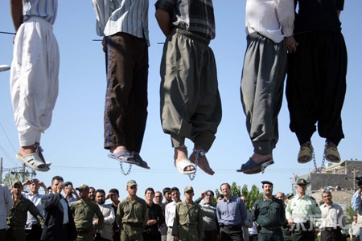

<!-- # ＜摇光＞孤独的刑法感情 -->

**换句话说，当国民基于过分的仇恨，为了超越法律处罚某人，向当局乞灵时****——****如恳请当局杀掉那些本不该杀的不杀不足以平民愤的犯罪人时，也就将自己送到了当局的案板上，自我矮化成了奴隶。今天，你的仇人仅因为民愤而被科处刑罚，明天当局就会煽动民愤来整你，张志新的惨剧就会重演，这简直是一定的。**

# 孤独的刑法感情

## 文/陆遥遥（北斗撰稿人）

说起刑法，人们往往觉得那是防止和打击犯罪的工具。其实这个观点深可怀疑。如张明楷教授所说，改革开放前中国根本没有刑法典，甚至没有刑事法律，而改革开放前有哪些犯罪被放纵了呢？

法谚说，刑法典是自由人的大宪章，也是犯罪人的大宪章。所以我觉得在我国，刑法最现实的作用就是保护国民不被当局肆意定罪，保护犯罪人不因为当局或者国民的仇恨而被过分、残虐地处罚。这两者本是相辅相成的。

换句话说，当国民基于过分的仇恨，为了超越法律处罚某人，向当局乞灵时——如恳请当局杀掉那些本不该杀的不杀不足以平民愤的犯罪人时，也就将自己送到了当局的案板上，自我矮化成了奴隶。今天，你的仇人仅因为民愤而被科处刑罚，明天当局就会煽动民愤来整你，张志新的惨剧就会重演，这简直是一定的。

青力维新转载一篇文章说，阴谋论部分根源于科学家秘藏科学技术的行为，我想至少在刑法领域不存在这个问题。学者们都公开出版自己的著作，公开披露自己的思想，反复向社会阐明，而遗憾的是国民总是听不进去。为了证明我的观点，一下举几个明显背反的例子。

案例一：某人看远处有个人貌似自己的仇人，开枪射击将其击倒，走近一看发现是个稻草人，周边四望也没有人影。法学家认为这样完全没有侵害人生命法益的危险，所以不处罚。但国民总觉得应该处以未遂。

案例二：某人民愤较大，周围邻居都想杀死他。有青年甲趁夜潜入他的家中，往引用水中加入毒药——未到致死量；又有青年乙不知甲的行为也独自潜入某人家中向水中投毒——也没到致死量，可两者合计超过了致死量，某人饮水后死亡。法学家认为甲乙都定故意杀人的未遂。大概国民都觉得应该按既遂处罚。

案例三：某人家里失窃祖传红木椅子一把，该人恰好是侦探爱好者，经过缜密分析，认定偷椅子的就是堂弟。但为了保全堂弟的面子，遂不报警而登门索要。堂弟归还了椅子。后某人酒后说起此事，使得事情被周知。法学家认为，堂弟应定盗窃罪既遂。

案例四：某人的亲戚从国外回来送给他名表一块。但某人生性多疑，其亲戚又生性吝啬。某人遂怀疑该表的真伪，经仔细比对国内专卖店内的同款真表，某人发现若干不一致处，遂断定此表为高仿货。后单位同事恰好称赞此表，某人觉得可以大赚一票，顺势以两万元脱手。法学家认为不构成犯罪。

案例五：某人蓄意于黑暗胡同拦截强奸过路女性，刚好走来一个遂拉到暗处强奸，该女子因为害怕不敢做声。事后回家妻子告知今天被强奸了，时间地点一问，发现真是某人自己。法学家存在构成强奸罪未遂和无罪的意见分歧，但都不认为可以定强奸罪的既遂。

案例六：公安机关从线人处了解到吸毒成瘾的某人最近有以贩养吸的动机，遂安排线人假扮毒贩联系某人委托某人讲一批毒品运送至某车站，某人到站时被早已守候的公安干警当场擒获。法学家认为，毒品全程在公安机关严密监控中，客观上完全没有流向社会侵害法益的可能，某人无罪。

不过有一个重庆的真实案例，从学生时代我就没有想明白，某人常年酗酒，家人很不耐烦。其妻子遂对他儿子（13岁）说，下次你爸再发酒疯，你就把他脚筋挑断。结果某人果然又醉酒回家撒酒疯，其妻子刚好外出，儿子将他脚筋挑断。这个怎么办呢？

总之，总看到一些傻左网站上说，精英的法律只保护犯罪的人，不保护普通老百姓。对这种反智主义调调深恶痛绝。所谓保护也不意味着任何违法犯罪都要杀头吧？然而我国老百姓就觉得犯罪就要杀头。一个有自首情节的故意杀人罪判个无期徒刑都不能接受。为什么我国人心就如此暴戾？

这样下去，最后发展到辱骂毛主席都是现行反革命的时代，吃苦的还是人民。

最近听那些屌丝左派说凡是汉奸都要杀头，云云。不禁使人想起台湾的一个立法例，《中华民国刑法》原第100条（内乱罪）规定：“**意图**破坏国体、窃据国土或以非法之方法变更国宪、颠覆政府，而着手实行者，处七年以上有期徒刑；首谋者，处无期徒刑。（第1项）前项之预备犯，处六月以上五年以下有期徒刑。（第2项）”

该法条处罚的是思想犯，即只要有想要内乱的都可以处罚，据此法条中华民国政府讲很多学者列入黑名单，阻止他们回到台湾。后经法学界即市民团体的不懈努力，该法条被改为：“意图破坏国体，窃据国土，或以非法之方法变更国宪，颠覆政府，而**以强暴或胁迫**着手实行者，处七年以上有期徒刑；首谋者，处无期徒刑。预备犯前项之罪者，处六月以上五年以下有期徒刑。”

在此影响下，2008年6月20日，司法院大法官会议释字第644号解释宣告《人民团体法》第2条、第53条有关人民团体组织与活动不得主张共产主义或主张分裂国土等相关规定，使主管机关于许可设立人民团体以前，得就人民“主张共产主义，或主张分裂国土”之政治上言论之内容而为审查，并作为不予许可设立人民团体之理由，显已逾越必要之程度，与宪法保障人民结和谐社自和谐由与言论自和谐由之意旨不符，于此范围内，自解释公布之日起失其效力。

我们凭什么统一他们？

（采编：应鹏华；责编：麦静）
