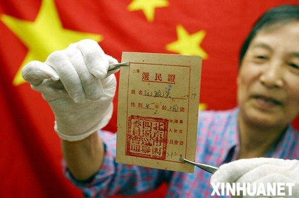
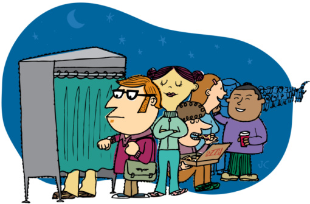
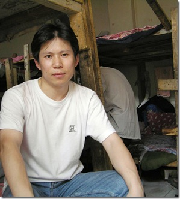

<!-- # ＜七星人物＞独立参选人特辑（第一期）：许志永的中国梦 -->

**“七星人物”，是瓢虫君出品的新栏目，瓢虫君的人物周刊，让你与更多优秀的人面对面。瓢虫君，是由北斗网打造的公共意见平台。本期人物是知名的公共知识分子许志永先生。**

**“我希望的是越来越多的人参选，因为这本身意味着社会的进步，本身就是公民的权力，所以参与的人越多说明越来越多的人开始实践这个权力。而一个合格的人大代表，按照法律来说，起码要认识到人大代表的职责是什么；其次你要力所能及地去履行职责，包括约束公权力、慎重地对待预算、慎重地对待投票选举，也要对你的选民负责，服务选民。”**

# 许志永的中国梦

********

关于许志永的经历，不需要说得太多。

他曾经喜欢足球，不过那也仅限于他的大学时代。放下了足球之后，他的生活开始变得“无趣”，乐趣几乎只剩下了自娱自乐。他喜欢盯着桌子，想象桌子上的微观世界；看到天空，他会想象在宇宙之上，有一个更高形式的生命存在，他还会想象，那个生命会以何种视角观察我们。

“自娱自乐”之余，他还将丰富的想象力和细腻的感情寄托在宗教上。从他对宗教的理解，也可以窥见他的性格和坚持。他相信万事万物都有一个共同的主宰，相信自己的使命感来自命运，相信世界“在朝着更美好的方向演进”，最大的兴趣是“思考这个世界的本源”。

选举观察，教育平等，法律援助，这是之前许志永一直在努力的方向。他的下一步计划将会是推动反腐败。当然，他还有一个很重要的工作——为来年的活动筹款。家人对他从事公共服务的态度，从最初的反对到之后的默许，经历了相当长的一个过程。当记者的妻子对他说，“嫁给你，我首先得做好自己养自己的准备，还得做好养孩子的准备”。许志永对这个问题并不担心，他在学校里有一份老师的工作，还可以通过捐助，给自己发一份和本

职工作标准差不多的工资，剩下的时间，“基本上是在全力以赴做理想的事”。

在他的理想之外，他的教师工作给了他更多的影响别人的机会。在许志永的学生中间，有更多比例的人在从事公益活动，他喜欢看着这些年轻人，就像看当年的自己。他将更多的理想寄托在这些学生身上，会给他们讲如何做一个对这个社会更有意义的人。学校的领导认为他“把学生带坏了”，从09年开始，没有再让他给学生上课。而他在学校的工资，“现在还有，不过随时就可能没有了”。

说起他的坚持，这个并不喜欢说太多话的男人开始变得健谈，眼里有了光彩。他相信将来的某一天，我们的中国会变得“民主自由法制幸福”。这是他的中国梦，也是这次人大换届选举当中所有独立参选人的“中国梦”，我们有理由相信，这个梦想会有照进现实的一天。

带着对中国梦的坚持，许志永接受了七星人物的采访。

**瓢虫君：**你以独立候选人的身份参加了第十三届到十五届海淀区人大代表的选举，然后这三次竞选所受到的支持和阻力是不一样的吧？那么你对这第一次，第二次还有这次竞选的目的和心态有什么异同么？****

**许志永：**第一次竞选，我在竞选宣言里说到，我想告诉大家，我们的竞选是公平的，我们的选举权是真实的，你只要努力就可以当选。****

第二次我还是把重点放在当选上。因为有人说了，你独立候选人肯定没办法连任。我说那我就试试。我知道如何在这个体制内谋取一些利益。当然这个还算不上利益。我只是想告诉大家，我可以做得到，其实你稍微谨慎一点，低调一点，放弃一些东西，然后你就可以没有那么大的阻力，就可以当选了。

但第三次不一样。第三次当选的背景，一方面是我和这个体制之间的距离越来越远实了。原来我从来都是把自己定位在民间的立场。这个体制也许（那时候）和民间的社会离得不是那么远，我离这个体制也并不太远。但是呢，这几年过去了，其实我跟他们越来越远了。就像上次我跟我们书记说，不是我的立场有多大的变化，而是这个社会官民之间的裂痕越来越大。所以体制内的官员看我就越来越敌对了。不是我发生变化，是他们看这个社会越来越敌对了。

在这样的前提之下，我清楚的知道，我如果还要继续当选，或者想得到更高的体制内的职位，我可能就要不得不放弃一些立场，然后寻求与官方的妥协。但是我没有选择那么做。我觉得这个社会必须有人坚持底线，坚持立场，才能引领这个社会朝着更好的方向发展。所以我宁愿选择与他们的距离越来越远。

如果我目标以当选为第一的话，那我肯定从一年前就开始准备，我会更加低调，不做那么多事情。乖乖的听话，就没有大的障碍。我会去讨好一些人——我也有知道怎么讨好学生——还有可能当选。

但是这个没有意义。我本来不想选的，因为我已经当过两届了。对我来说，我当过两届就够了。但由于强力的打压，我必须站出来表明我的态度；表明态度的时候，我必须坚持我的底线。我宁愿不当选。我宁愿失败。

所以，我告诉大家，不要问我们能为北邮做什么，要问能为这个国家做什么。我的使命，是为这个国家，为这个民族的未来承担责任。所以，请大家不要问我能为北邮做多少事情。食堂啊这些事情，我会尽力做，但那不是我主要的事情。我不想刻意改变自己去全力迎合大家的私人的需要，来做出这种妥协。

但是在当下胜利者仍然是方滨兴他们。成功者是他们，因为他们在今天这个时代是主流，他们可以什么都可以做。但是我们必须有底线。他们可以攻击我，可以造谣——当然不一定是他本人——但是确实有人造谣。我知道他有很多的问题。我们肯定不说话。我觉得政治不一定是那么肮脏，政治应该是理想的公共服务。

**瓢虫君：**我们之前也访问过一个上海的独立参选的女生，她全程都遵循了法律法规，譬如选举日当天就不能再有宣传活动，应该截止到前一天的12点。她说当时她也没再发日志或是联系同学什么的。但是他们选举当天，老师就一直在讲台上跟底下同学讲一些不合适的话。她就觉得，我们都遵守规则了，但是你们这些人都不遵守规则。您对这个怎么看呢？

**许志永：**在目前，主导这个社会的依然是丛林法则。他们不讲法律，不讲规则。包括拆迁，那种抢劫式的拆迁，包括那些遭受不公平的人，他们有这些遭遇就是因为这个社会当中那些本来应该坚守底线的权力机关不守底线。****

就像之前选举，你可以动用你的力量和资源来竞争，没关系；宣传，没关系。但是，你却已经动员了行政资源，这是不对的。你可以动员你的党派资源，来和我竞争，没关系；但是你没有权力把我给带走。你不让我竞争，你凭什么啊，法律没有给你这个权力。选举办公室，学校都没有这个权力来限制我的人身自由，你通过这种方式来打压，同时来推销自己，这样太不公平了。这样的选举怎能是真实的选举？（瓢虫君：但是还是要坚守，就是我们自己还是要坚守）嗯，我们必须坚守规则，因为我们觉得这个国家必须更好，觉得这个社会应该更好。****

**瓢虫君：**那您刚才有说到，“当过两届已经够了”。这个是什么意思？****

**许志永：**我对这个职位本身没有兴趣。如果这个社会很正常，竞争都是公平的，有基本的规则，我没兴趣去竞选。我之所以竞选就是因为这个社会还很不正常，需要有人引领他们朝正常的方向发展。****

我觉得我当了两届了，如果我还是要再当的话，我会认为，是不是我自己好像是为了一点好处或者什么，体制内的一点好处。其实我也曾经犹豫过，我是不是有这个嫌疑呢？我仔细想一想，好像还不算。因为我这次当选了，假如第三次不去竞选，就好像自己当了两届就满意了（一样）。其实那不是（满意），那是逃避。一开始人家跟你说你第三次去选就肯定选不上，那我还不如去竞争一下。就是无论怎么样，我在考虑这个事情，她对这个社会是有价值的，是有意义的，那我就去做。

**瓢虫君：**也就是说您的参选都是为了把这个声音发出来，告诉您狭义或者广义上的学生，这个世界还可以变得更好，我们需要知道一些真实。（**许**：对）****

你在发布的选举观察报告中称，选举过程中有很多暗箱操作，您可以谈一下您和您的选举团队遇到的类似情况的事情么？

**许志永：**其实最主要的问题——至少在北邮选区最主要的问题是——就是没有一个公平的竞争机会。你是正式候选人，你可以竞争，你可以发你的宣传单，都没有问题。但是你不应该动用行政资源来发。你是党派之间的候选人，你应该是和行政资源分开的。党和国不应该是一体的。另外呢，你没有理由，没有任何理由、任何的法规，来打压我们，来阻止我来竞选。你撕掉我的海报，你把我强行带走，这是违法的，是非法的限制。这是巨大的问题。****

**瓢虫君：**你是法学方面的专家，如果从你的专业角度来看，现在有没有一些好的或者合适的办法来规避这些不公平和干扰因素？

****

**许志永：**我觉得就目前来说，几乎没有办法。你很难说能够规避得开。当他不讲道理的时候，他用野蛮的手段来对付你的时候，那你几乎就没有什么好的办法。****

其实中国社会，也就是这个国家的根基的意识形态，就是丛林法则，他所谓的“打江山，坐江山”嘛。这个东西是非常糟糕的。这个意识形态跟民主完全是对立的。

民主的含义是，这个土地上，这个国家属于这些人民，大家来投票，委托人作为执政者，然后给他纳税，他来提供公共服务，安全利益等等这些。这才是国家的逻辑。如果你服务的不好，那么，OK，换一拨人。你是竞争者之一，我们选你不选你和聘保姆一样，如果你不合适，你这一届干得不好，那么下一届我们就换一拨人。这才是民主，这样的国家才是一个民主的国家。

在中国虽然也谈民主，但是根基上的一个意识形态还是“打江山，坐江山”。以前动不动就唱嘛，我这块地是我这帮人占着的，我是占领者，人民和牲畜一样都是江山的附属物，所以你们当然要听我的，我给你选举权都是假的，都是做样子的。根本上来说还是枪杆子里出的政权，政权是打下来的，打江山的人是占领者是抢劫者，我们抢到了这块地方那你就得听我的。这种逻辑就是丛林法则。他们是不排斥欺诈，不排斥谎言的。在这样的一个国家级的意识形态的指导下，一个法院，你想想，你能找到底线吗？这个社会，最糟糕的就在这里。

**瓢虫君：**那是不是更糟糕的情况就是，年轻一代人逐渐接受这种意识形态，现在的很多年轻人，他会有一种感觉就是，向这种体制妥协，向这种游戏规则妥协.****

**许志永：**其实，其实这个社会整体上是在朝着一个好的方向发展。我知道现在有些年轻人愤世嫉俗，对时事漠不关心，这些现象都有。但其实在任何一个时代，关注公共事务的人群的比例呢，大体上都是那么多，它在某个时代突然关心的人特别多，那是因为这个环境变了，更多的人会去关心。这个环境没变之前，总是有一部分人在执着的关心这个社会，有些人不关心也是正常的。整体上来说年轻的一代是越来越远离这个体制的。这个是一个现实。****

在30年前的中国，这个国家的每一个人都生活在这个体制里面，都要依靠这个体制才能生存。现在的话，越来越多的人不依靠这个体制也能生存，这就改变了很多，所以思想也独立了很多。虽然今天我不理你们，但是呢，也许某一个时刻，当这个变革的时代到来的时候，突然就会有很多人站出来，说不。那么这个社会就会改变。

整体上来说，这个体制原来是一个高楼大厦，它很坚固，它的意识形态就像钢筋水泥一样。现在它的意识形态已经粉末化了，已经不存在了，它是利益纠结的一个共同体，越来越多的人不跟它纠结这个问题，越来越多的社会公民会自由的生活，实际上它已经越来越脆弱了。

**瓢虫君：**但是现在就是很多的年轻人实际上是对一些不公平的游戏规则选择一种适应一种习惯的态度，你对这个现状怎么看？****

**许志永：**任何一个社会，大部分人在这个体制变革之前，都会去努力的适应它。因为如果不适应它你没办法过上一种正常的生活。但是只要是内心里并不认同它，就是没有一种意识形态的狂热作为支撑，那么这个利益纠合的共同体就是脆弱的，在某一个时刻也许就会突然发生变化。****

**瓢虫君：**你今年的选举就是因为种种复杂原因落选，然后你在文章中说，“人生的结果往往是自己的‘选择’，从广阔的意义上说，我选择了这次落选”，那是什么原因让你做出这样的选择？****

**许志永：**我其实把人生的很多事情都归于天命，就像走上这条路，它冥冥之中是注定的。具体到选举上的话，我觉得是我选择了公民的立场，我拒绝没有底线的合作，拒绝没有底线的利益追求。我选择了一个公民的立场，选择了一个理想的未来，那我就选择了跟他们在某种意义上的对立，所以也就选择了这样的落选，我知道，我很清楚，这样走下去，会是这样的一个结果，但是我依然这样走下去了。****

**瓢虫君：**回到我们的主题上，“独立参选人”这个词汇其实是由国外一些民主社会引进来的，但是到中国之后，就开始发展得格外“独立”，很多参选人连自己专门的助选团队都没有，就单枪匹马的上去参加选举了，然后单枪匹马地落选，也有很多的参选人他甚至是刚表达完自己的参选意愿就退选，这个情况您怎么看？****

**许志永：**其实这个也很正常，有的人觉得最重要的就是去参与，去号召大家参与，你像李承鹏呀，像五岳散人呀，像很多人，他们起的作用主要是影响这个社会，去告诉大家，你有这样一个权利，你可以去参与；虽然很多人没有走到最后，但是他们也完成了他们的使命。****

还有一些人，他可能没那么高调，他悄悄的在自己的选区里面做工作，就当选了。不一定说那些站出来呐喊的人，就一定要当选；其实当选的很多呐喊者的基础工作做的并没有那么好，但是这并不是责备他们的意思，而是说他们有他们的使命。****

**瓢虫君：**之前广州的18位独立参选人中很多参选人表示参选的意义在于启蒙，您在广州众人参选失败后提问“独立参选是否走得通，是否有必要再继续下去”，并表示“如果广州只是个案，不足以代表全部真相，那么即将启动的北京选举将是对这个问题的更好回答，”那现在您觉得之前关于独立参选人之路的问题的那个“更好答案”是什么。****

**许志永：**其实也没有更好的答案。它最重要的功用，最重要的意义在于社会启蒙，有那么多人高调地参与，有那么多人遭遇这种失败。****

**瓢虫君：**就像刚才说的，他高调地参与，发出声音告诉其他人：你可以这样做，你有什么样的权力。其实就完成他的使命了。

**许志永：**对。****

瓢虫君：广州独立参选人的全军覆没让您怀疑是否此路不通，而北邮这件事情的发生是否让您产生了有变换这条轨道的想法？

**许志永：**其实我们从来没有放弃改良的愿望，也从来没有放弃对于任何组织和个人的善意，所以每当有改良的机会的时候，我们都会去努力做。但是，那并不是我们唯一的希望之路，还有更多的、更值得我们做的事情，那就是如何去壮大公民社会的团队。****

作为这个体制，我们有善意的改良的愿望，但是他们能不能改，是决定于他们，他们的命运掌握在他们手上。我们也不可能左右他们，我们也只是善意地表达了参议的意愿。然后我们更多的时间可能还是要努力去准备公民社会的成熟，去努力推动公民社会的成长，这个可能是更重要的事。

**瓢虫君：**那么下一届您还会再参加人大代表的竞选吗？

**许志永：**区级的人大代表选举我应该不会再参加了，我觉得已经努力了好几次了，够了。****

**瓢虫君：**今年的人大代表选举被很多人称之为“一个观察中国政治走向的试验田”。对于今年这一系列的选举——特别是广州和北京的选举，

您认为这块“试验田”产出了什么？****

**许志永：**它最终的影响是需要时间才能证明的，当然这种影响也许没有那么大，因为决定中国历史方向的事件谁也不知道，它还没有出来。那在这之前它可能有许多的事情，比如选举期间的事情、动车事故的事情，都在影响着这个社会，影响着人们的心理，影响着人们心里对这个体制的判断，对中国未来的判断，到底是愤怒，还是支持，影响的因素很复杂。2011年选举只是我们认为的重大的事件之一，但它还不是决定性的。****

**瓢虫君：**在独立参选人参选的过程中，可能大多数媒体和关注者的中心都集中于独立参选人身上，而真正掌握决定权的选民、公民反而被公众冷落了，您如何看待选民和公民的权利意识和民主素养在实现真正的民主与法治中的地位？****

**许志永：**其实这个社会关注独立候选人是很正常的，因为在一个民主健全的社会里，选民的热情主要是靠候选人带动的，这一点是非常重要的。候选人其实是推动整个选举公开透明的一个非常重要的角色，他角色重要所以被大家关注多点也是理所当然的。****

在选举的时候，普通的公民，不需要整天那么热情地关注公共事务，这个社会是有分工的。政治这种职业也是有一部分人在从事的，他们可能更适合或者天生就适合做这个职业，所以整天忙于这种事情。更多的普通的公民可能忙于自己的平时的工作和生活，只有当候选人来到他的身边告诉他：我是谁，我主张什么样的观点，你选我，另外一个人也来到他的身边告诉他我是谁……这样猜会调动他的热情，让他积极地参与，所以在整个的过程中、包括在民主的社会中，候选人都是最重要的角色。

这个社会是在进步的，经济在发展，社会在多元化，公民参与意识也在提升，但是这种体制与社会的进步不相适应。你参选了，有一些人当选了，就给改良留下了余地和空间，但是你发现这个体制不允许，它过分地压抑这个社会，然后它还确保这个特权的集团继续存在，这样压抑久了，社会会变得很危险。

**瓢虫君：**对于人大选举，固然涌现了一批大学生独立参选人，但大多数还是持冷漠和观望态度，更有甚者甚至以调侃的态度来对待选举。您认为是什么原因造成了这种现象？****

**许志永：**可能是因为这个社会压抑得太久了，人们从根本上来说是不相信真实的民主、真实的法治的。所以当这样一个选举的时刻到来之时，大部分人的冷漠其实因为不相信，觉得那个东西好像跟自己没有什么关系，努力了也没有什么用，或者努力了也改变不了什么。****

**瓢虫君：**您觉得具备什么条件才是一个合格的人大代表的参选人呢？****

**许志永：**其实谁都可以参选，具备法律上设置的条件就可以了。****

而一个合格的人大代表，按照法律来说，起码要认识到人大代表的职责是什么；其次你要力所能及地去履行职责，包括约束公权力、慎重地对待预算、慎重地对待投票选举，也要对你的选民负责，服务选民。

但是现在的中国，很多的人大代表，首先没有意识到人大代表的概念是什么，很多人认为人大代表就是个荣誉头衔，去参选了就是象征意义地投个票；其次,即使有部分人认识到了人大代表的职责，但是也不敢去那样做，只是默默地去投票去顺从。那这样社会上代表的职责就镂空了，人大制度就变得很虚伪。

**瓢虫君：**那您对那些现在仍在坚持参加独立参选的学生，有什么建议吗？****

**许志永：**我希望的是越来越多的人参选，因为这本身意味着社会的进步，本身就是公民的权力，所以参与的人越多说明越来越多的人开始实践这个权力。至于建议，这个就很难说了，因为人的定位是不一样的。有的人擅长于网络的传播，能够告诉更多的人，有人在参选有人在行动，这本身就是有意义的；有的人可能真心地要鼓舞选区的选民，那么他想成为一个合格的代表的话，就要踏踏实实做很多服务的工作，让大家能认识能选举能投票。所以这要针对不同的定位来提建议。****

**瓢虫君：**您在您的文章中谈到，“1980年校园兴起竞选人大代表，30年过去了，通往现代文明的道路依然漫长”，在今年的选举中我们同样看到了很多学生身份的参选人，包括您的助选团队和支持者中也有很多人是学生，您如何看待大学生独立竞选的现象？****

**许志永：**大学生独立竞选更重要的意义在于实践民主权力的意识。其实大学生当选的可能性本来就不大，但是这种参与本身是很有意义的。而且尤其是在这种压抑的、不正常的社会下，有人敢于站出来，是非常可贵的。****

**瓢虫君：**在今年您参加选举的过程中，北邮的学生以及许多其他学校的学生通过各种方式间接支持您的竞选、甚至直接参与到助选团队中，您在竞选之后曾说：“如果说当代大学校园还有理想主义的星火，那就是你们”，您可否从一个教育者的角度谈一谈大学生以及年轻一代应该如何在现实环境下看待这样的理想主义？****

**许志永：**其实理想主义也分很多层次，比如我一般不愿意告诉我的学生们做和我一样的事业，以这样理想主义的心态做公共服务的事业。我会告诉他们理想主义的一面，就像如何去做一个好人，无论在什么样的体制下，那么你尽可能地去坚持一些底线，并且要学会去看到别人的长处，和别人友好地相处，去负责任地完成一些工作，去与人合作。从这种意义上来说，相对那种不择手段的去拉关系，也是一种理想主义，但是它对于多数的同学来说，是一种“务实的理想主义”。就是你坚守了自己的底线，你做了一个好人，同时你在事业上也有所成功，这是一种我认为的对于多数人来说的“务实的理想主义”。****

但是这中间也会有少数的人——永远都是少数的人——执意地从事、不闻不问的少数的理想主义，我当然也希望他们能够站出来，但是这只是对少数人说的。

**瓢虫君：**我们这一代人的父母都是从文革那个时代生活过来的，很多时候父母有意地跟我们说过：你不要碰政治，不安全。对于我们的父母来说，很多时候他们对于政治是比较悲观消极的。****

**许志永：**确实如此，很多中国人一提到政治，首先想到的是不择手段、阴谋诡计，甚至是血腥以及一切可怕的阴谋的东西，这种历史的阴霾到现在还在，没有完全消散，尽管已经过去了那么多年，但是还在反反复复地折腾，还没有完全消散。****

所以中国人一想到政治，就是一个坏的词。但我觉得政治本来应该是美好的，应该是为公众谋福利的事业，它怎么就那么得阴谋诡计不择手段了呢，那是人类极度的自私和贪婪的彰显，因为人们没有制约这种贪婪。

人类可以通过制度设计，通过文化引领，来让这个社会变得更好。说政治可以公平竞争，让大家来选，谁服务得好选谁，谁服务得不好你就换一拨人，这才是正常的。可是想改变这一点确实是非常的困难，因为你面临的这个庞大的体制，大部分人都不是这样想的。这个体制对付你的时候没有底线，它跟你的法则是不一样的。但是如果你顺从了它，那这个社会永远没有这个希望。所以就得有人去坚守，要有智慧地去坚守，如何能够既坚守了原则，同时还能够顽强地存在下去。然后一直让很多人能够跟着走，最终能够改变这个社会。

**瓢虫君：**民主政治的宏大叙事和家长里短的琐碎之间还是存在着很大鸿沟的，您觉得应该怎样去弥合这种鸿沟？****

**许志永：**其实民主政治和人们的生活没有什么鸿沟，只是中国这个社会它不是一个民主体制，权力跟大众之间好像鸿沟很大。在一个民主的体制下，有很多的事务，有了不公平就去找议员找你的代表去，他就会很热心地来帮你解决。就比如说拆迁，在国外是不会出现像中国这样野蛮的拆迁的，随便就把你家暴力强拆了，把你家人深夜拖出去，政府（指民主体制下）是不敢这么干的。****

还有很多很多的事情都是跟民主有关的，比如你的工资，你的低保。因为你生活在这个社会中，经常要跟权力发生关系，就必然要跟民主、不民主有关系。在民主的社会中，你会发现所有的公权的机构对你都很好，而不民主的体制因为它的权力是抢来的，打江山打下来的，不是你选的，它就对你很冷漠很高傲，因为它是统治者。这个是在生活中很多方面都能体现出来的。还有很多人，会去讨论很多问题和理论，但当涉及行动的时候，却并不是每个人都会去做，造成这个局面是有很多因素的。首先方案是否可行；其次有没有一个有效的团队，并且能够有人能够有组织地运行这个团队；还有就是有没有一些必要的资源，比方说资金啊等等。很多的条件，从一个理念一个概念到行动需要很多的概念来支撑。

**瓢虫君：**您曾说，孙志刚事件给了你很大的信心，是不是这些信心支持您怀着这样一种理想主义走到了现在。****

**许志永：**根本的信心还是来自我对于自己在这个世上的使命的认知。****

**瓢虫君：**那您后来遇到让您的信心受挫的事情，这种时候您是如何处理的？****

**许志永：**其实人遇到挫折的时候都会有一种心里面不舒服的感觉，我自己状态就是，我会想一想我自己有没有做错，然后其次，继续努力工作，可能过个一天两天就出来了。其实最近这段时间，我几乎是不停地在遇到挫折，因为我们不停地遇到各种压力，各方面挫折。包括我们的教育公平的意见被取消，包括我们救助也会遇到压力。很多很多的压力，但是它可能会给我带来几个小时的心理的阴影，我可以反思，然后接下来该怎么做，可能第二天就好了。****

**瓢虫君：**那您觉得怎样才能更有效地感召更多的人参与到公共事业中来？****

**许志永：**首先需要我们一批人不停地付出，不停地去担当。可能过了一段时间，人们会逐渐意识到，确实有这么一群人，这么多年从来没有放弃过，这本身就会引起人们的关注。****

另外就是某些公共事件发生的时候，我们也会利用这样的契机来发出声音，或者利用这个公共事件来引领这个社会。

**瓢虫君：**北斗有一个荐书栏目，那个栏目会推荐给大学生一些比较好的书籍。许老师最近在看一些什么书？有什么好书可以推荐给我们？****

**许志永：**我其实正打算花两个月的时间完全抛开这些事务性的东西来全部地来读书和感悟，主要是写感悟。其实这两年我读的比较多的书，一类是老子、庄子，就是中国古代的经典，《老子》《庄子》《尚书》等等，另外一类也是古代的经典，是古希腊以来的一直到中世纪的这些哲学和宗教的书籍。再就是我会上网查一些就是最新的一些宗教思考。也就是说基本上我读的书都是围绕着哲学和宗教来读的。

至于推荐，一类是有关做人智慧的，比如说一些著名的传记，一些成功的人士的传记，就是他们的成长经历，他们在成长的过程中学到了什么，这是一类。对于传记，不同的人有不同的兴趣，对于将来想要从商的学生朋友们，一些企业家的传记可能就会比较合适，比如说像松下幸之助这样的。对我影响比较大的则是像林肯的传记啊这些。****

还有一类，就是关于宪政方面的，我能想的到的是像刘瑜写的《民主的细节》，像林达写的《总统是靠不住的》、近距离看美国系列。他们的文笔很好，比较好理解。其他的一些想不起来。

**瓢虫君：**您在大学做了多年的教师，您对我们当代大学生有没有什么想说的？如果现在这儿是您的课堂，整个的学生群体都是您的学生，在这个课堂上您会和他们说什么呢？****

**许志永：**要说一个比较普世的话呢，主要还是希望每一个人要学会做一个好人，要遵守一些底线，要努力去帮助别人。不要特别在乎眼前的回报，力所能及地去帮助别人。另外要善于学习，学习别人各方面的能力，要不断地去提高自己。****

首先想到的是一个做人的问题，其次是学习知识和能力，然后尽量能够让自己无论在任何一个岗位上都能够成为一个优秀的人，能够更好地去服务这个社会。然后在这个过程中也更好地去实现自己的价值。

**（访谈人：安镜轩

李东瑶

采编：应小野

楼杭丹

张苏樊

特别鸣谢：黄译禾；责编：孙微阳）**
