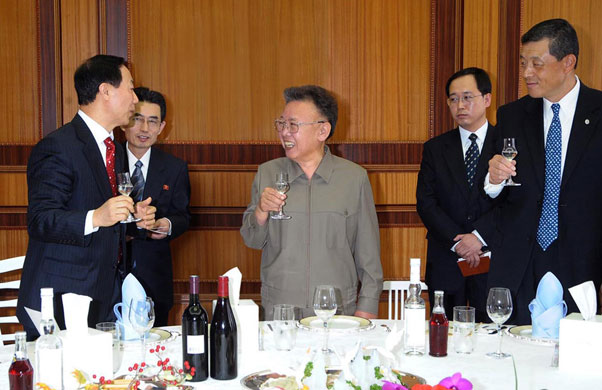
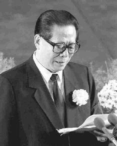
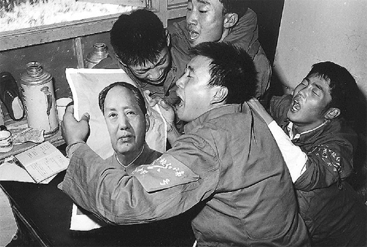

<!-- # ＜天玑＞神马姜主意（三）领导人之死 -->

**领导人有两类。一类是在世时，影响力巨大，死后却没有什么声音。另一类正好与之相反。后者的所作所为成为了后来者效仿的对象。他们的精神，他们的思想，会被永远铭记。前者，享受到了在位时带来的巨大快感，但是，如果他们各自的国家，一旦解禁，迎接他们的将会是臭鸡蛋与唾沫。用高压的管控手段来强力塑造的领袖形象，就好像躺在水晶棺材里的遗体，抽去了福尔马林，不消多时，就是一具谁也辨认不出来的尸体。**

# 领导人之死

## 文/姜骏怡（同济大学）

金正日还是死了，纵然他是朝鲜人民的慈父，纵然他怀有“十八般的武艺”。

其实他的死并不突然，甚至与他的父亲金日成在1994年的暴毙相比，有着太多的蛛丝马迹可循。

早些时日，他访问中国的时候，他的健康就是第一号的机密。据说，他的粪便也被装进了集装箱中，运回了朝鲜国内。他是否中风过？他的身体是否抱恙？等等这些，成为了中外各国猜测的对象。因为只要金正日的步伐一个不稳，双手一个颤抖，似乎都可以被外界所解读，博弈金正日，成为了一场盛大的狂欢。

U2乐队的主唱Bono说过：“摇滚改变世界”。Jobs每天挂在嘴边的一句话也是：“活着就是为了改变世界”。在西方人的观念里，改变世界好像是一件很容易的事情，每个人都可以做到。记得《辛德勒的名单》最后，那些犹太人送给了辛德勒先生一个戒指，上面有这样一句铭文：拯救一个就等于拯救了全世界。在西方人的观念里，世界第一次被定义的如此狭隘，因为一个人就可以称其为世界。你可以说它是一种玄虚的精神，你也可以认为，这只不过是一场游戏，但是，的确有可以称之为改变世界的人，而这些人就是政治家。

不论你多么的讨厌政治，多么的厌恶政治家的嘴脸，你不得不承认，政治是与自己的生活最紧密相关的东西。你要交的税，喝酒开个车，上学读个书，哪一样不是政治？朱镕基总理在担任上海市的市长期间，说过这样一句话：质量是上海的生命。没有一家报刊敢原文刊载这句话，原因是为什么呢？如果质量是上海的生命，那么政治是上海的什么？后来，朱市长自己出来解释：政治是一切经济活动的底线与保障，在这一个前提之下，质量才是上海的生命。一个偌大的上海市市长所说的话，都可以被断章取义，生活中的言论不和谐，由此可以昭彰了。

而处于政治山巅之上的，就是各色的政治人物。而山巅之中的山巅，就是各国的第一把手。他们的死亡，往往被赋予了各种各样的含义，而含义之下，是时代的色标。

我第一次听到伟大人物的去世，是在1997年，那时的我，还在念着幼儿园。不得不说，那个时代，家里有电脑的人，还是寥寥无几的，资讯不发达，甚至说是一个匮乏的年代。二月份的某日，突然得知了邓小平去世的消息。当时的我，只有七岁，我不知道邓小平是谁，也不知道为什么他的死亡，能够让电视台停放我每晚必须要看的动画片。那时的我，把邓小平与停放动画片联系在了一起，对于这个矮小的巨人，童年时的我，真的不能够再想起什么了。那个时候，幼儿园的每个班级，用收音机在播放着这条新闻，播音员用悲怆的语气念着，而我们被老师要求一定要带点哭腔。可是，当时的我，怎么哭也哭不到今天朝鲜人的水平，只好不断地在打着哈欠，这样，眼角可以有泪水划过。是邓小平的死亡，让我第一次知道了原来红旗可以下降一半；是邓小平的死亡，让我第一次听闻了“永垂不朽”这四个大字。如今，这四个字，被中共中央用在了凭吊金正日的唁电之中；也是邓小平的死亡，让七岁的我第一次知道，政治是可以的如此有力量，可以停放动画片，甚至可以改变电视节目的色彩。从此以后，邓小平的忌日成为了一个特殊的日子。在这个日子，很多报刊会发表回忆性的文章，歌颂邓老的丰功伟绩。有周年祭，有十周年祭，马上就是十五周年祭了，直到那时，我才知道，邓小平的死亡对于中国来说意味着什么。若干年后，我突然间产生了一个疑问，如果没有邓小平，是其他人取代了他的位置，中国是会变得更好还是会变得更坏？我不敢想这个问题，一点都不敢想。如果没有邓小平，改革开放会有吗？今天的中国还是不是今天的中国？答案不是否定的，也绝不是肯定的，这些假设，只不过是一场华丽的意淫。

这就引出了一个问题，政治人物是不是不可取代的？影片《再见列宁》中有这样一个镜头，起重机用绳子拴着列宁的头像，从德国的街头开过，相信任何人看过这个镜头都会会心一笑，或者是发出意味深长的叹息，东德没有了，社会主义也没有了，列宁自然也不需要了。那么列宁的存在还有没有什么价值？如果有的话，也仅限于他自己掌权的时代。赫鲁晓夫掘过斯大林的坟墓，这样的行为是否意味着斯大林做的都是错的？不论是斯大林之死，赫鲁晓夫之死，勃列日涅夫之死，甚至是普京之死，会不会给后人留下点什么？还是就成为了一堆灰，在风中飘散。政治影响着人们的生活，政治家死后的影响力，究竟会延续多久？

遥远的1976年的时候，毛泽东死了。人们认为红太阳倒了，中国完了，谁能来做中国这艘巨船新的舵手？但是，后来的事实证明，不能说现在的中国有多好，起码大规模的饥荒事件没有了，取而代之的是，大规模的群体性事件。邓小平逝世之后，中国也没有乱，1997年的时候，该收复的香港还是收了回来，亚洲金融危机也没有带给中国新的挫败。你可以看到，一切都是那么有条不紊地进行着，人民没有大悲，更没有大喜。上班的上班，上学的上学，失恋的终究还是会失恋。作家阎连科有一本被禁的小说，名字叫做《为人民服务》。里面的故事，把生活与政治高度结合，那不是人，那是机器人。毛时代只存在于记忆里，邓时代只存在于回忆中，不论是不是“永垂不朽”，终究还是会朽的，若干年后，这些政治人物会被人所淡忘，但是，他们即使跨进了棺材，也终究会有审判的一天，是好是坏，是良是莠，到时候一目了然。生的不会伟大，只有坐在王座之上，才会感到伟大。死也不会光荣，人民的意志才会使人光荣。

在金正日去世前的一天，捷克前总统哈维尔也去世了。他的死亡，只有豆腐干大小的报道，与金正日相比，简直不可同日而语。出生可以有着巨大的区别，没想到，死亡亦如是。一来，捷克也好，斯洛伐克也罢，与朝鲜的国际影响力相比，显得相形见绌。二来，对于哈维尔的了解，知道的人实在是太少了。布拉格之春运动，七七宪章，这些词，在若干年前的若干国家，是不被允许提及的。但是，我相信，哈维尔去世后的影响力肯定比金正日要大的多，因为，他的民主思想，他的宪政逻辑，这些是世界翻涌的潮流，不可逆转。

领导人有两类。一类是在世时，影响力巨大，死后却没有什么声音。另一类正好与之相反。后者的所作所为成为了后来者效仿的对象。他们的精神，他们的思想，会被永远铭记。前者，享受到了在位时带来的巨大快感，但是，如果他们各自的国家，一旦解禁，迎接他们的将会是臭鸡蛋与唾沫。用高压的管控手段来强力塑造的领袖形象，就好像躺在水晶棺材里的遗体，抽去了福尔马林，不消多时，就是一具谁也辨认不出来的尸体。

1971年的“9.13”事件之后，有一位大妈说过这样一句话：“林彪要篡党夺权也就算了，可是他为什么要加害毛主席呢？”与其说是朴实情感的流露，不如说是没有感情的人的情感流露。再去看文革时，天安门广场上红卫兵对于毛主席的呐喊与万岁，脸上就写着一个字“假”。无论动作是多么的真实，群体是多么的整齐划一，假的就是假的。就如同，七岁时的我，痛哭邓小平一样。什么都不知道，什么都不会让我们知道。

水晶棺材里躺着的不一定是伟大的人物。金正日喜欢穿人民装，但是穿人民装的，不一定懂得人民。没有人能够抗拒死亡，留给来者的，不是普世暴力，而是普世的思想。

（采编：麦静；责编：麦静）
