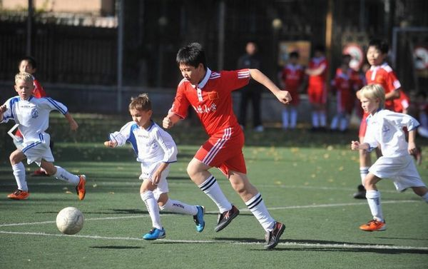
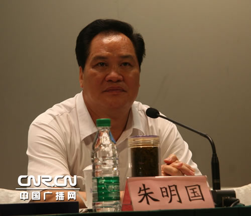
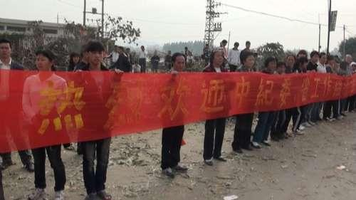
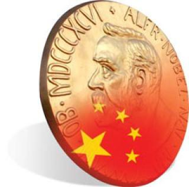
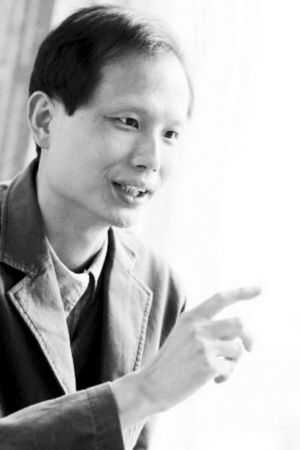

<!-- # ＜摇光＞为了那一点点的成功概率 -->

**与其在自己营建的道德象牙塔里凹造型，摆POSE，不如多读点书籍，或者动手参与一下政治生活，多发表一些看法。真正挽起袖子去做的话，你可能会在某个时候显得很狼狈，失态，说错话，发表了不成熟的看法，被迫出来跟公众道歉，可能没法像以前一样在道德象牙塔里凹出一个完美的造型。但才有可能有那么一点点的概率成功。**

# 为了那一点点的成功概率

## 文 / 刘三山（四川大学）

#### 1. “这都是体制的问题”

高中的时候，有次在校门口望着几个老师用不堪入耳的话大骂几个学生，突然联想起了十年动乱时期学生斗老师，儿子斗父母，觉得还是同样一批人，几年前还在一起和睦相处，不到几个月，在领袖的大手指挥下，制度的碾压下，就开始互相揭发、告密，为求自保而无所不用其极，这断然不能用“素质低下”或“民族劣根性”来解释。只能说，体制如果要塑造或扭曲一批人的人性，是非常容易的事。于是觉得，许多事情，追根到底，怕都是制度设计不当所导致。

制度设计不当，人民互相为敌，厮杀到底，却无法解决任何问题。

几年后，在大学选了一门《激光武器》的选修课。那课比较冷门，听课的学生数量为个位数。授课的老孙头上来一看人数，明显提不起劲，于是课也上得敷衍了事。

老孙头先是给大家看他年轻时在西部旷野参与中国第一颗激光制导炸弹实验时拍的若干照片，随后便开始跑题。扯他现在的科研状况，扯着扯着便开始感叹，终于语重心长地说出那句我们听了无数次的终极问题：“同学们啊，你们知道现在中国最根本的问题，是什么问题么？”

我顿时有种类似于孩子听到父母说“你知道学生最重要的任务是什么吗？”的感觉。我转头看包谷，包谷满脸都写着“Oh man! Come on! Not again!”的表情。

但是老孙头只是停顿了一下，然后又继续说了下去。

果然不出所料。

“中国最根本的问题，就是体制的问题。”老孙头郑重地说道。

包谷双眼一斜，嘴角一撇，换了一副“格老子我们是来听你讲激光制导炸弹实现的技术细节的像这种牢骚老子随便找个论坛听网友摆龙门阵都够了”的表情。

事实的确是这样，不到几年的时间，我们身边的许多人的心态和对事情的看法就从“这都是体制的问题”变化到了“咱们能不能不要啥事都怪体制了？我们绕开体制整点东西可以不？”

很多时候我们厌倦了关于“体制问题”的争论，或是因为我们对这个泛泛的命题感到不满，打算细致地探讨是体制的哪一部分出了问题，或者根本就是体制之外的一些东西出了问题。

但更多的原因是，我们已经不再对能短期解决这个“体制问题”的核心部分抱有希望，转而希望先从周边下手，希望在不触及这个制度的核心部分的前提下，改善我们的生活，做好一些事情。

譬如足球，好吧，我们都觉得，这应该不是“体制问题”了，这必须是“体质问题”。你总不能说是一党专政，缺乏法制导致足球落后的吧？那么我们从其他周边入手吧，提高球员技、战术水平，发展商业联赛，培养群众基础，选拔青少年苗子……

但是继续走下去又出现困局，譬如，青少年培养断链，为了出成绩虚报年龄就是一大问题。

于是又要解决虚报年龄的问题，但这涉及到许多地方体育官员的利益，为了出成绩，虚报年龄是最有效的捷径。

那么再下去就是举国体育制度和缩小体育部门管理范畴的问题了。好吧……那个，我们先不动这一块，尝试从其他方面入手，解决我们国家的足球水平落后的问题如何？

于是一块一块分析下去，最后，能采用的只有请外教临时恶补，以及哀求球迷要对国家队有信心这几个方案了。

听起来像开玩笑，但这就是在我们国家目前为了解决问题的基本分析方法：方法一最有效，会不会影响体制？——会。——那么就方案二吧，比较有效，会不会影响体制？——也会。好吧，只剩方案九十九了，基本不能解决什么问题，会不会影响体制？——不会。——那就这个方案了！敲定！

你不信？那你见过哪个国家反腐败的方法不是司法独立，也不是官员财产实名制，却是成天让官员看电影学习红头文件精神唱红歌的？

最后说一下，必须要向那些无法改变所以想办法绕开体制的人致敬一下。他们都是伟大的实践者。

譬如互联网创业者们发明了VIE模式，让中国的互联网业有了蓬勃发展的动力；譬如南方科技大学的尝试，等等。

如果你是某一行业的从业人士，你必须要有一种“体制不是挡箭牌，一枝红杏出墙来”的精神，在不违背自己良心和向这个体制屈服的前提下绞尽脑汁另辟蹊径成功。

但无疑，体制所产生和带来的问题在很多时候依旧无法回避。无论你是否厌倦了这个话题。

#### 2. 伟大的刁民

乌坎的事情，看了诸多报道，官方的，民间的，境外的，国内的。各种观点综合，感叹诸多。

有一种声音，认为这些村民们之所以如此拼命，才不是为了追求神马民主自由，就是因为“村里的地被卖了要抢回来”，“还不是为了钱”。

个人认为，如果那些钱本该属于他们的，那他们这样努力去争取，也就是在争取个人的权利和利益，无可厚非。而保障个人的合法权益，本身就是现代公民社会的一个重要部分。

当然，即便乌坎成功了，也不指望能一夜开花结果。因为毕竟最多也就是成立个默许的自治委员会，实现基层自治。一块小地方而已。你能想象几千个基本没有受过高等教育的村民，在土地和村民自治要求得到满足后还能有觉悟喊出一嗓子“我们要三权分立”？

路很长。但不是没有路。

同时在整个活动中也有一些细节可商榷。譬如村民在抗议活动中拉上了小孩，让小孩站在队伍最前排（这似乎是目前中国基层民间群体抗议的一个惯用套路了——让小孩和老人打头阵）；譬如突然有谣言说有小孩被警察打死（这也是基层群体事件中的普遍现象，谣言多）；譬如封村和自治联防队防止警察抓人，队员有的在身上配一把锋利短刀，万一被包围，鱼死网破。

民风彪悍，这是正面说法。

刁民，这是负面说法。

“刁民”这个词还蛮难找到对应的英文专属单词，适合这个词的语境只有在中国古时候的公堂上，官老爷理屈词穷后才会出现：一拍惊堂木，“大胆刁民，还敢狡辩，拉下去重打40大板先！”

所有的刁民都有其产生的环境。“穷山恶水出刁民”，潜台词就是如果一个地方“刁民”多，这地方的自然环境或社会环境必然……

上网搜陆丰的介绍：“陆丰水文条件优越……具有四季温暖，雨量充沛，日照充分，无霜期长，海洋性季风明显等特点……资源丰富，土地资源类型多……‘粤东旅游黄金海岸’……”。

既然陆丰自然环境如此无懈可击，那剩下的只有社会环境了。

按照我国传统的“刁民”标准来看，古今中外，追求权利、民主和自由的进程中从来不乏各种刁民的身影。譬如波士顿茶党，譬如美国20世纪早期的“扒粪者”，譬如台湾的阿扁。如果你板起面孔去审视他们所做的许多事情，都可以认为是刁民：波士顿茶党是蓄意破坏私人财产；早期的“扒粪者”在报道事件的时候经常见风是雨夸大事实；阿扁么……从政之路就一路打悲情牌，当总统后肚子上还中了不明不白的一枪。

这些人的诞生都有其社会环境背景，他们的身上带有这个环境带给他们的不可磨灭的痕迹，无论好坏。

社会环境是如何逼出刁民的？

我们举最近沸沸扬扬的“罗永浩砸冰箱”事件为例，有人质疑，“为什么罗先生不通过法律途径和正当渠道解决问题，而是要通过这种过激的夸张行为来维权？”

老罗给大家展示了一个流程图，上面是他尝试去寻找了所有相关负责人和单位，结果见识了皮球史上最精彩的几十次中场倒脚传球的经历。于是，愤而砸冰箱。

穷山恶水出刁民。嗯。

但是刁民中也有普通刁民和伟大的刁民，伟大的刁民耍刁不光是为个人讨得一两分银子，还顺手改变穷山恶水的环境。

看《阳光实务》里面的乌坎老中青三代人的群体像，90后年轻人注册了QQ群，围脖账号，24小时上网发帖，呼吁，组建联防队日夜巡逻；中老年人坐镇调停，谈判，交涉，组织抗议。各种复杂的感情，难以言会。

你很难对乌坎人的所有行为表示赞同，譬如示威让小孩和老人打头阵，我个人就十分不赞同这种做法。譬如年轻人在围脖上也可能散播一些谣言，譬如联防队的暴力抗法。

但话说回来，没有这些dirty tricks的抗议行动，下场又会怎样？

如果联防队队长张建兴贴身不带一把小刀，昼夜值班，鸣锣报警，如果没有封路，如果示威都是男子壮年打头阵，如果不邀请“别有用心的外国反动媒体”进村报道，如果没有注册无数个马甲在围脖上各种发帖宣传和一个引爆点的新闻引起早已高度麻木的民众和媒体的关注（这次乌坎能成功，很大程度上和薛锦波代表的死有很大关系）。那么，你可能都没有机会指责这些村民不光明磊落，因为可能代表早被抓完了，若干人被打伤住院或收监。军警入驻，天下太平。

然后这件事可能就在围脖上出现了5分钟，就消失了。和你每天在网络上看到的其他无数条一闪而过的负面新闻一样。

所以人民不得不一把尖刀随身带，挂标语，告御状，造谣，耍赖皮，玩些江湖智慧。

然后政府把脸一沉：“不走法律程序，成天游行闹事，你们这些刁民！”

《阳光时务》里一段采访的视频，一个乌坎村民对着镜头，用带有潮汕口音的普通话说：“你开始跟他讲法律哩，他跟你耍流氓，啊，你跟他耍流氓了哩，他就开始跟你讲法律了！”

我家对门邻居，若干年前卷入一场民告官的官司。邻居的老伯也算有文化的人，家族里几个大学生，有北大的，有清华的。于是一口气咽不下，发誓要官司打到底。那么多年下来，心脏病住院了，被告的单位领导人换了几届，状纸都写了几千页。他儿子，一个年薪20多万的白领，在北京数次被神秘面包车当街拦住拉走关小黑屋……才换来最高人民法院批示重审，终于打赢了官司。

但是。被告单位耍赖，拒绝执行。至今上百万的赔偿无着落。

这是我所见到的，中国大地上为数不多的，没有耍任何“肮脏小手段”坚持通过“正当渠道”来申诉的一个公民的比较好的下场。

你到京城某个神奇的角落去看一下，这样的人民还有很多，他们为了避免被某些人落以“刁民”的口实，不接受外媒采访，不搞暴力，坚持走法律途径解决问题，不去公共场合拉横幅，不造谣，最后，也是最重要的一点，他们诉求的口号必须只是为了解决自己的问题，不许提到任何反党，反专制，涉及中央政治局现任常委或前任常委的大口号。

最后一点尤其重要。

“这不是体制问题”，“我们不是想颠覆政府”，“问题主要出现在基层干部身上，中央还是为人民的”，这些人民在镜头前诚恳地陈述。是的，必须这么说，不然你早没了，连上访的机会都不给。

他们都得到了正义了吗？

消费者不挺而砸冰箱就不能维护权益，人民不把事情搞大玩点小花样就无法得到公平和正义。现状如此，接受它，然后尝试把它变得更好。或许下次我们就不用砸几十台冰箱，只需要砸一台冰箱就可以让大企业道歉。或许下次村民不需要造谣和把老人和小孩排到示威第一排，不需要有人付出生命的代价，只需要上围脖发帖，组织联防队防止军警半夜抓人就可以保住自己的土地。

但在这种险恶的环境和制度改变之前，不妨做一个适度的刁民。

#### 3. 反对媚俗——高尚而古怪的情感。

看了米兰·昆德拉的《生命中不能承受之轻》。

里面关于男女感情的描写固然微妙，但很多地方不知道是韩少功的译本不好还是什么原因，无法领会个中意味。

但政治生活的部分是完全看懂了。

书里有段情节：故事主人公之一，托马斯，在苏军占领布拉格后写了一篇暗讽苏联统治和那些支持苏联统治的人的文章，于是被傀儡政权请去喝茶，要求签字表示服从苏联和傀儡政府的统治。托马斯断然拒绝，于是丢掉医生饭碗，被发配到一个小城市当水管工。

但是他作为一个知识分子和反抗者的名声传播开来了，于是他的儿子和捷克反抗者组织找到了他，要求他在一个“两千字宣言”上签字，以表示支持那些被关押和迫害的不同政见者。

但或许是这些反抗者请他签字时营造了一种“是捷克人就要在两千字宣言上签字”的气氛，反倒激起了托马斯的逆反心理，于是托马斯觉得，这些反抗者软磨硬泡要他签字的态度，和那些傀儡政权软磨硬泡要他签字的态度，并无不同。于是又回到了这本书的主旨之一，“我不是反对XX，我是反对媚俗！”托马斯同样拒绝了在支持反抗者的宣言上签字。

作为一个中国人，一个和托马斯一样生活在类似政权下的人，读到这一段，不由得心有戚戚焉。

没有其他什么作家能够如此贴切描述生活在这种政权下的有独立见解的人，在遇到这种要求他表明立场时内心的奇怪的，甚至是轻微扭曲的心理。或许昆德拉本人其实并没有要刻意批判什么，或许昆德拉本人就是主张“不媚俗”的，但无疑，昆德拉高度忠实地记载了这种心路历程，让若干年后的中国人能够找到对应的标本。

这种标本就是，作为一个知识分子，或者说是有文化有独立见解的人，他可能并不惧怕强权（托马斯冒着丢饭碗的风险拒绝在支持傀儡政权和苏军统治的声明上签字就证实了这一点），但却害怕做出任何，任何能够为他知识分子的独立心智和清醒认识的名声带来损害的行为和选择。

这无疑是高贵的，但有时候，这种近乎于洁癖的想法所带来的刻意维护这种荣耀的行为却会显得过于可笑。

甚至，书中的托马斯，在被反抗者的代表热切地要求其在宣言上签名的时候，一度产生了“这个代表是不是想靠这种反抗占领者的行为来博取巨大荣耀名留青史啊”的想法。

和几年前国内某种“在那个‘零八县长’上签字，不就是想图个政治资本被外国媒体报道么”的论调何其相似乃尔。

但是拒绝签字后不久，托马斯听闻了那个代表被捕入狱的消息后，又略感悔恨，觉得自己或许真的应该签字支持一下他们。

真是个矫情的货，丫就不能在签名的时候加个“PS：我签这个名不是为了博取任何名声或刻意为了维护我作为一个当前政权反对者的声誉，我只是出于人道主义呼吁不要对这些异见者进行任何迫害，我不反对党和国家，我反对媚俗，我不同意境外媒体引用并曲解我所说的任何话……”之类的限制条件么？哦不能，加了这个PS更显得矫情。唉。这事真难办。

相比之下，另一个捷克的知识分子哈维尔就爽快得多，他直接就是著名77宪章的发起者。

而书中的另一个女主角萨宾娜，到了美国后遇见美国的参议员，参议员指着绿草地上嬉戏的儿童对她说，看啊，这才是幸福。

然后萨宾娜和托马斯一样，顿时将这个政客的行为和专制国家的统治者进行对比，她的心理活动大概就是：“这民主国家的政客其实和专制国家的政客不都一样喜欢搞个漂亮的画面对人民做宣传么这个美国的政客和苏联的统治者有什么区别呢还有你妹啊你当我们捷克没有绿草地和在绿草地玩耍的小孩么你指着这些画面向我炫耀什么呢你以为我会买你的帐么这他妈就是媚俗啊我作为一个艺术家我的敌人是媚俗不是XX主义……”

而其实那个参议员大叔当时很可能不过是和其他滥情的美国人一样，午后晒个太阳喝杯咖啡就要感叹句“ah…what a life!”而已。

专制制度下的知识分子往往在一些地方比自由国家的知识分子要敏感得多，因为他们天生不相信政府提供的任何信息，而其来自于一个专制国家的身份又容易造成内心的自卑，所处的复杂的政治环境又导致了他的所言所行都容易被人所误解或利用，所以，基本上，这些人的心态，很难伺候。

《生》这本书中的男女主人翁要是换成中国的，估计要比托马斯和萨宾娜还纠结十倍。

首先，他们基本不相信革命，因为这个国家的现状就是一场革命导致的，所以下一个通过革命上台的很可能就是Chairman Mao V2.0；

他们也很少相信改良，因为他们都看透了政府，认为改良无非是与虎谋皮；

他们对一切反对派也透露着挑剔的目光，认为这些人在道德上有着缺陷，或者素质不高，或者干脆就是“民主后杀全家”的货色；

他们警惕任何“西方的”人看待自己国家可悲一面时流露出的眼光，并会从这些眼光中读到各种“别有用心”的信息，甚至不允许别国人民眼中流露出怜悯之情，因为这都是媚俗的，令人反感的——一个国家的苦难成了发达国家人民的催泪弹；

他们会对许多异见人士和抗议行为进行动机推测，认为这些反对者不过是在“出风头”，“博取关注”，“炒作”。即便这些异见者为此受到牢狱之灾，他们也觉得这些人“赢得了政治资本”；他们的世界观里可以找出“西方的”政治和自己国家的政治其实都是“媚俗”的证据，并鄙视所有媚俗的东西，但既然所有国家的政治都是媚俗的，其实他们就是在鄙视一切政治；

于是他们已经鄙视一切政治的东西了，但是可悲的是他们的生活却摆脱不了政治，他们的生活里充满了政治。

哼，这真尴尬啊。

与其在自己营建的道德象牙塔里凹造型，摆POSE，不如多读点书籍，或者动手参与一下政治生活，多发表一些看法。

真正挽起袖子去做的话，你可能会在某个时候显得很狼狈，失态，说错话，发表了不成熟的看法，被迫出来跟公众道歉，可能没法像以前一样在道德象牙塔里凹出一个完美的造型。

但才有可能有那么一点点的概率成功。

### 【编者注】

本文标题乃编辑所拟，原标题为《年末》。

（采编：宋晓慧；责编：黄理罡）
