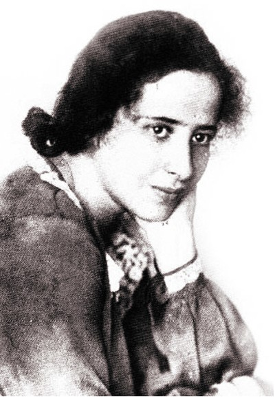

<!-- # ＜天玑＞哲学十二钗（四）：美女、才女、痴情女汉娜·阿伦特 -->

**我曾经迷惑过，为嘛儿特立独行思想理性又深邃的哲学家汉娜·阿伦特面对爱情如此感性如此飞蛾扑火？海德格尔无论思想多集大成，可做的事实在太损rp，他和雅斯贝尔斯因为纳粹问题决裂；他甚至欺负自己的老师胡塞尔；他为了前程抛弃汉娜；为了荣华又转眼投靠纳粹，可痴情女汉娜却一直在原地始终对他不离不弃。**

# 美女、才女、痴情女汉娜·阿伦特

## 文/张明明（清华大学）

在写完三个哲学界大老爷们后，我决定写一位美女哲学家：汉娜·阿伦特。其实，以她在哲学史上的地位，无论如何跻身不了我的“哲学十二钗”之正册，勉强能进个副册。如果要写，也应先写她的师爷现象学大师胡塞尔，又或是她的师父海德格尔和雅斯贝尔斯。可是，我还是让她第四位出场，没办法，我体内的雌性激素女性荷尔蒙此刻统统作祟着。鉴于题目太有噱头，为防止被攻击为标题党，也为了严格恪守“NO PP，NO TRUTH！”的科学研究精神，我就闲话少说，直接给大家奉上她的侧面清晰无码照一枚。

倘若要给阿伦特的一生打出个关键字，那将会是：政治哲学、《极权主义的起源》、《论革命》、极端的恶、平庸的恶、雅斯贝尔斯的学生、海德格尔的情人。隔壁大学毕业的周国平老师曾云：“女人研究哲学，糟蹋哲学，更糟蹋女人。”汉娜·阿伦特显然是个例外。

汉娜·阿伦特，犹太人，出生在柯底斯堡，老宅男康德的老乡。14岁时开始阅读康德的《纯粹理性批判》，17岁醉心于克尔凯郭尔的著作和神学研究。就在此时她接触到了海德格尔的思想，并大为所动，于是奔赴海堡大学，拜海德格尔为师。

这一决定，深深影响了她的一生。

汉娜·阿伦特在海堡大学学习时，因为面容姣好，打扮时尚，思想独特，加之她总喜欢穿一条绿色裙子，于是被同学们亲切地称为“绿衣人”。

《诗经·邶风·绿衣》：“绿兮衣兮，绿衣黄里。心之忧矣，曷维其已？

绿兮衣兮，绿衣黄裳。心之忧矣，曷维其亡？

”

这首《绿衣》一语成谶，汉娜·阿伦特这位绿衣佳人，一辈子心中之忧，愁肠百转却无法排解。遇见海德格尔时，她韶华正好，年方十八，曼妙娉婷；怪蜀黍海德格尔此时三十五岁，已是2个孩子的父亲，有个无比热爱纳粹的老婆。对于正在经历中年危机的海德格尔来说，汉娜的到来恰如一夜芙蕖，开过尚盈盈。而对于少女汉娜，海德格尔满足她对男人所有的幻想：偶像、爱人、父亲、欲偶，可谓一见海哥误终生。此时，她罗敷没夫，他使君有妇，此后的剧情，大家用脚趾都能猜到：又是一出八点档爱情家庭伦理剧。实践证明，哲学家偷情找小三和常人没什么区别，只不过手续更冗繁点：写情书要用专门设置的代码，约会有密码门要敲三下灯要关两下，开窗表示安全闭窗表示危险。于汉娜而言，海德格尔吸引她的已不是魅力，是——魔力！在这场关系中她使出浑身解术配合他，随叫随到，毫无计较。

哲学女汉娜由此彻底沦为有胸无脑的汉娜。

在这里友情建议各位姐姐妹妹大婶阿姨，如果你只想作世间一低颦浅笑眉梢弯弯的平凡女子，那么请千万绕过男哲学家。对于没事干就仰望星空关注内心道德律的男哲学家而言，他们是不会关心你饿了乎饭了否胖了瘦。但如果你实在太仰慕他们的才华，那就嫁他们中的普通哲学家吧。比如黑格尔，费希特同学，讲完课拿完稿费就立马回家陪老婆；再不济你就嫁他们中的二逼哲学家如马克思同学，虽然不会赚钱有一个花俩个，但他不会嫌你比他大四岁，且会为你款款演唱吴克群的歌曲《为你写诗》。总之，千万要绕过文艺哲学家，他们大多高帅富，有钱有调调又有feel，爱你时尽管你侬我侬但他们也要控制全局；不爱时，立刻弃如敝屣。当事业地位野心与爱情冲突时，他们会毫不犹豫地选择前者，古今中外，概莫例外。所以当后来他俩的关系遭到保守势力诘难时，为了似锦前程，海德格尔打发了汉娜：“哦，汉娜，我给你在好友雅斯贝尔斯那里求得了一个offer，你转学吧。”无可奈何下，汉娜·阿伦特遂转投海德堡雅斯贝尔斯门下。

1928年6月海德格尔《存在与时间》出版，这本以汉娜的激情为催化剂的著作大获成功，而海德格尔此时却以一封信打发了汉娜。关系终结时，汉娜给海德格尔写信诉衷肠：“如果我失去了对你的爱，就是去了活着的权利……上帝保佑，我死后更加爱你。”失恋的汉娜犹感万蚁噬心痛苦难捱，好在她的闺蜜向她推荐了本《心灵鸡汤》：《拉赫尔·瓦伦哈根书信集》。拉赫尔是19世纪德国历史上赫赫有名的一位犹太女人，她既是哲学家又是文学家，也曾失恋数次，后投身于社会运动，成为柏林知识界的中心。汉娜从拉赫尔处汲取力量并克服失恋阴霾，开始作自我反思精神梳理：作为德国国家公民，怎样才能不背叛犹太教义？作为犹太女人，怎样才能不丧失自我又不丧失亲友？怎样才能从德国浪漫主义哲学中挣脱出来？汉娜的世界关了一扇窗，却开了一个门！

1933年，甘道夫·希特勒被任命为德国总理。

同年，告诉大家“人，诗意地栖居”的海德格尔极不光彩地投靠纳粹，当选弗莱堡大学校长并加入德国国家社会主义工人党。

同年，犹太人汉娜·阿伦特开始逃亡到法国。

从此，萧郎是路人。

1952年，汉娜·阿伦特发表《极权主义的起源》，名声大噪。《极权主义的起源》有三部分：反犹主义，帝国主义，极权主义。主要回答三个问题：一为什么不是高丽棒子或是爱斯基摩人偏偏是犹太人被列为纳粹大屠杀的对象；二极权主义的起源是什么；三极权主义发展的逻辑。在基督教意义上的反犹主义我在此不多讲，在民族国家意义上讲，犹太人漂泊无根没有政治共同体，当精明的他们以金融掮客的身份发挥影响力时，却从未培养起来政治意识和参与意识，他们要么成为新贵要么成为贱民（反叛者，不是自觉地认同一个团体而是自觉地实践自由者如：罗莎·卢森堡）。拥有财富而无政治行为能力成为他们在资本主义危机下被仇恨的主要原因。极权主义之所以能产生在于资本扩张造成两个多余力量——多余资本和由破产贵族、农民失业工人组成的多余劳动力（暴民），这二者在国家的保护下，开始向海外殖民扩张。

所谓“极权主义”，不是大家理解的历史上不绝如缕的暴政或专制形式。汉娜从孟德斯鸠对政体定义的基本特征出发，概括了极权主义的基本特征——意识形态和恐怖。通过此二者的高度结合，极权主义实现了对人的自由的彻底根除和对人的全面统治。暴政专制通过暴力手段消除人的政治自由，而极权主义则通过不断的运动：大规模的群众动员，运动过程本身。

离开了胡兰成的张爱玲迅速地萎缩凋谢了，可离开海德格尔的阿伦特却迸发出研究热情，在政治哲学舞台上衣袂飘飘起来。 1961年纳粹头号战犯欠下三百万条人命的艾希曼被以色列特工抓获，并被送至耶路撒冷受审。汉娜·阿伦特以《纽约客》记者身份发表了《艾希曼在耶路撒冷——关于平庸的恶的报道》。在阿伦特看来，艾希曼是个“不肮脏具有良心的男子”。不错，在现实生活中，艾希曼可能是一个好老公，好父亲，好上司，他只是在执行由“国家理性”被正当化了的自己国家法律对他的要求，他的错误只是在于他不知道纳粹的法律是错误的。相对于奥斯维辛集中营的“极端的恶”，艾希曼是“平庸的恶”，一种完全没有思想，缺乏起码的思考力和判断力的恶。在《极权主义的起源》里汉娜就提出了“极端的恶”（the radical evil）,这个词其实来源于老宅男康德的“根本恶”，它不是指具体的多变态多极端的恶，而是一切恶之可能的根源和依据。康德讲究绝对道德，在他看来，如果要杀你朋友的杀手站在你家大门口敲门，而你朋友此刻正藏在你家衣柜，你要是向杀手撒谎你朋友不在你家，你都是在作恶。“极端的恶”的恶有三个特征：无法惩罚、无法宽恕和无法预测。

如果艾希曼的例子你较为陌生，那我可以拿奥斯卡获奖影片《生死朗读》做案例分析，Kate Winslet扮演的汉娜曾是纳粹统治下的一名集中营女看守，在转移犯人去奥斯维辛集中营受死时，关押犯人的教堂发生火灾，她没有打开狱门致使几乎全部的犹太人被烧死。战后，她坐上纳粹战犯审判法庭的被告席。她曾经美丽丰腴充满母性，她曾帮助生病的15岁少年并发展为秘密情人关系。可是，她有罪么？如果有，那用什么罪名来惩罚她？汉娜·阿伦特告诉了我们，她的罪名就是“平庸的恶”：一种对自己思想消除，对下达命令的无条件服从，对个人判断权利放弃的恶。

战后，当海德格尔因为和纳粹的关系四处遭受谴责鄙视痛斥时，汉娜·阿伦特于1950年回德国看望他，17年后第二次握手，汉娜再次为他着魔。她从此为修复他的形象而四处奔走：亲自去耶鲁讲授海德格尔的哲学思想；积极推动他的著作在美国出版；替他的行为辩护；帮助已然潦倒的他拍卖《存在与时间》的手稿；为了照顾海德格尔的情绪，她甚至放弃为雅斯贝尔斯致辞；她的《人的条件》出版时，她甚至小心翼翼地不想让海德格尔知道。她怕他受不了，受不了那个永远听他话的18岁绿衣姑娘有一天也会成为名人并超越他。从1967年后，汉娜每年都要去看望海德格尔。

我曾经迷惑过，为嘛儿特立独行思想理性又深邃的哲学家汉娜·阿伦特面对爱情如此感性如此飞蛾扑火？海德格尔无论思想多集大成，可做的事实在太损rp，他和雅斯贝尔斯因为纳粹问题决裂；他甚至欺负自己的老师胡塞尔；他为了前程抛弃汉娜；为了荣华又转眼投靠纳粹，可痴情女汉娜却一直在原地始终对他不离不弃。倘若有一天，像我这样德智体美劳全面发展“八荣八耻”时刻铭记在心的社会主义优秀女接班人也会迷一猥琐男到五迷三道七荤八素上蹿下跳鸡飞狗跳，你莫要惊讶！爱情，这玩意儿，说白了是非理性，纯粹理性之外的东东。我们没法用理论分析个所以然，一切都在chaos状态下发生发展着。

也许有人也会问，他俩这是爱情么？我会告诉你：是的。不是perhaps，maybe，是abso~fucking~lutely的爱情。可人类呀，为什么你们的爱情要如此复杂？要掺杂着嫉妒与猜疑；要你退我进，你前仰我匍匐；要像探戈一样只有在错步中才能交织出舞动与美感？当岁月与时光将一切野心，地位，名声，情欲荡涤干净，曾经的绿衣佳人曾经的风流才子早已鸡皮鹤发，浑浊不堪的眼睛却依然传递清澈见底的眼神，那就是：我！懂！你！

我懂你，懂你满腹的才华与傲人的哲学功底；

我懂你，懂你为了前程也曾将我轻抛弃；

我懂你，懂你也是凡夫俗子也会不光明磊落地向纳粹卑躬屈膝；

1975年12月4日，汉娜阿伦特，卒；

五个月后，海德格尔，卒。

“绿兮丝兮，汝所治兮。我思古人，俾无訧兮

。絺兮绤兮，凄其以风。我思故人，实获我心。”

好一个实获我心！

谨以此文纪念哲学家汉娜·阿伦特逝世三十六周年。

作者预告：下期《一半天才，一半疯子：尼采》。

（采编：徐海星，责编：黄理罡）
