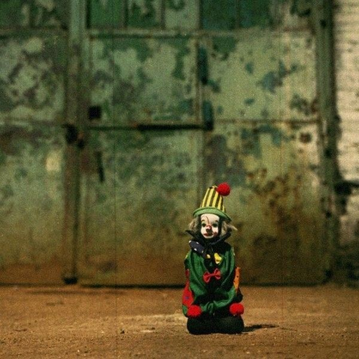

<!-- # ＜摇光＞不再让你孤单 -->

**因为他们面临着认同哪一个群体，而我们却面临着在身体政治中，身体到底认不认同某个群体，或者，怎样安全地表达我们的不认同。而这一路上，竟也如”梳洗罢，独倚望江楼“的愁妇一般频频落泪，在风里穿梭着我们没有底气的勇气，没有依靠的信仰，与没有前途的前途。**

# 不再让你孤单

## 文/董芳君（国立清华大学）

下午去上姚人多的社会学课，讲政党认同。他对教室里一百多个刚刚进入大学懵懵懂懂、风风火火的大一学生说：“你们这辈算是理智的，你们还能根据一个人的政见来选择你们的政党认同，选择你们要投谁的票，可是你们走出去，走到整个台湾的大社会里去看看，你们就会觉得自己好孤单……”

一听到“孤单”这个词，仿佛新竹那冷峻的风又毫无预告地吹了过来，瞬间打了一个寒噤，拉了拉大衣，好孤单。背后是澎湃的大海的时候，一朵激进的浪必定觉得好孤单。想起前天在他们的耶诞舞会上，没找到雨霏的我，在一片夜店的迷茫与妩媚里到处晃荡，黑丝露背高跟鞋在我身边如鬼魅般一丝一丝飘过，顺便还带着些浓浓的香味，很好闻。重低音的音响搅拌所有的味道与声音、灯光，所有的一切在我的脑海里只留下一个词，而且还是马克思的词——幻景。在消费主义的社会里，绵密的恋物商品表现出种种欺骗情景，这大概就是”幻景“。我想这或许已经超脱了社会意义上的”狂欢“，那种直逼的虚无感使我瞬间明白了消费主义下的购物狂到底为什么产生。幻景中的人在一度的空虚中，不断地释放荷尔蒙刺激身体和大脑来抵御来势汹汹的空虚，引诱，摇摆。而幻景外的我，显然没有孕育出足够的抗体，那一阵阵的空虚感如头痛般阵阵袭来，”好孤单“，连等待卢广仲的耐心都没有了，转身离开。

而我好害怕用孤单这个词，仿佛它已经是一个因为用得过于频繁而失去了其本身的美的意味的词语。学姐的男朋友吃饭没有叫上她，她也告诉我说她好孤单；朋友的爸妈因为工作繁忙没有来接机，他说他一个人走回去好孤单；在一片秋天的肃杀里，一个诗人也会情不自禁地叹道：好孤单；在北方苍茫的大地上，来自南国的浪子，望不见家乡的山，他也会用衣角揩干眼泪，在心里默默重复着”孤单“这个词……因而孤单已然不仅是一种生存状态，转而，它也会变成一种深度的自我对话的情绪。文学里的孤单，往往融合着愁绪，交织着思念与回归的意味。乡愁其实也不是船票，而是那停在彼岸开不出的孤舟而已，中间那重重的海洋也不是简单的心相印纸巾就能够吸干的。因此我还是不惮用孤单来编织时时刻刻侵袭的愁绪。

漂泊者总是更懂得孤单的意味。身体的漂泊者，比如古时离乡读书的书生，在离家的一瞬间，任凭背上的书籍已经千斤重，可还是不会忘记带上家乡古井旁的一抔故土，时时勤拂拭，闻着故土的颜色与质地，仿佛那孤单的乡愁就可以少了许多。他们是幸运的，至少思念的对象可以融化在绵绵故土里，拥入怀中的时候，还可以和故乡的二老和山里的那位姑娘说说话。而信念的漂泊者，与孤单遭逢之时，却只能默默沉寂。比如老师讲到的政党认同的人。如果你今天真正认同一个群体，信仰其所信仰，拥抱其所拥抱，用理性与感性热爱着它的存在，可是当你回望身后的茫茫大海，却发现和你同路者甚微，一个人走在风里雨里，无辜与无奈的刺痛瞬间也只能变成无言。可是你还是比较幸运的，因为你可以努力去改变你身边的世界。不知道坐在台下的他们有没有意识到，如果，他们发现自己的理性与公正突然在这个几近洪荒的世界里好孤单，那他们还可以做一件事情，那就是去改变，从一个人开始。这一路显然如”筚路蓝缕，以启山林“般充斥着痛苦与血泪，可是为了抵抗信仰的孤单，他们必须去承受身体的孤单。

噢，不是他们，更应该是我们。因为他们面临着认同哪一个群体，而我们却面临着在身体政治中，身体到底认不认同某个群体，或者，怎样安全地表达我们的不认同。而这一路上，竟也如”梳洗罢，独倚望江楼“的愁妇一般频频落泪，在风里穿梭着我们没有底气的勇气，没有依靠的信仰，与没有前途的前途。

冬至的夜里，三个人坐在路边的饮料店里从八卦聊到灵媒，聊到未来，当”领导“把一个他解读的渐渐清晰的未来中国展现在我的眼前的时候，心里突然涌上莫名的难受，甚至希望自己不知道这些事实。仿佛一个小孩偷听到一个天大的秘密却不能说出去，那憋在心里的委屈与孤独不断地告诉自己“要逃离”，躲起来，做个简单的人。在回来的路上，听说“领导”经常还不得不吃药的时候，瞬间发现自己好像真的面对不了这种无法自控的孤独，只能在空气中叹息一声。我也想对他大声地喊道，你为什么不去做个简单的人? 可是我说不出口，因为也许天命至此，人何以堪。

而面对即将到来的孤独，一个人也许只能回归到一种宗教的宽容中去才能释怀。

正如很多人所嘲笑的讃哥，每节课，他都用他那双悬在空中的手，描画着他心中的温暖的自由世界故乡。他口里重复着所有的“流离失所”，所有的”拉扯撕裂“，所有的”陪伴与支撑“，在面对台下麻木而淡然的表情，他只能像个小孩子一样，踏着脚赌气说到”可我就是喜欢“！

而也许，还有另外一种灵魂的漂泊者，他们的孤单源于自我的模糊，绚烂的现世只是变成简单的构造投射在他们的头脑里，意识的外衣已经脱离于凝固的肉体，赤裸裸面对严寒的冬季。那句”面朝大海“帮助诗人又脱下了一件意识的外衣，一首一首的诗，一件一件的外衣不得不脱下。但他已经赤裸全身的时候，他只能脱下自己的肉体了。于是，诗人选择了卧轨。

孤单到了极致，自我就脱落了。

而这种孤单，我似乎达不到，因为现在的我还在纠结着几天后怎样跨年，因为我真的不想太孤单。而这个我即将要回去谈谈的世界，你可否不再让我孤单？

（采编：何凌昊；责编：尹桑）
